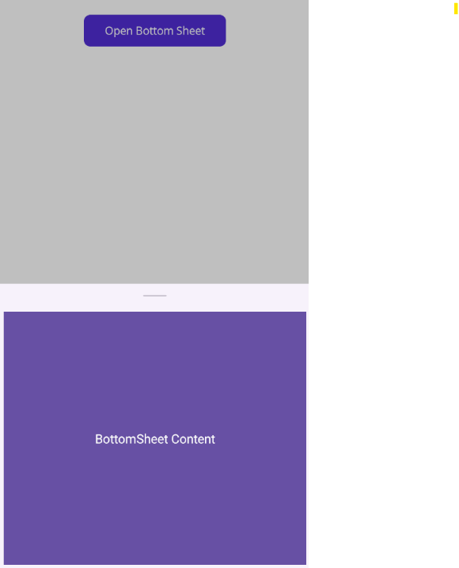

# Set Bottom Sheet Content in .NET MAUI Bottom Sheet

The sheet content is only viewable when the sheet is in the FullExpanded, HalfExpanded, Collapsed state. Its content can be set as : `BottomSheetContent`

## BottomSheet Content

It can be set using the `BottomSheetContent` property.




<Grid>
     <VerticalStackLayout Padding="20">
         <Button Text="Open Bottom Sheet" WidthRequest="180" HeightRequest="40" Clicked="OpenBottomSheet"/>
     </VerticalStackLayout>
     <bottomSheet:SfBottomSheet ShowGrabber="True" x:Name="bottomSheet">
         <bottomSheet:SfBottomSheet.BottomSheetContent>
             <Grid BackgroundColor="#6750A4">
                 <Label Text="BottomSheet Content"  TextColor="White" VerticalOptions="Center" HorizontalOptions="Center"/>
             </Grid>
         </bottomSheet:SfBottomSheet.BottomSheetContent>
     </bottomSheet:SfBottomSheet>
</Grid>
	



var button = new Button
{
    WidthRequest = 180,
    HeightRequest = 40,
    Text= "Open Bottom Sheet"
};

button.Clicked += OpenBottomSheet;
var verticalStackLayout = new VerticalStackLayout
{
    Padding = new Thickness(20),
    Children = { button }
};

bottomSheet = new SfBottomSheet
{
    ShowGrabber = true,
};

var bottomSheetContent = new Grid
{
    BackgroundColor = Color.FromArgb("#6750A4")
};

var label = new Label
{
    Text = "BottomSheet Content",
    TextColor = Colors.White,
    VerticalOptions = LayoutOptions.Center,
    HorizontalOptions = LayoutOptions.Center
};

bottomSheetContent.Children.Add(label);
bottomSheet.BottomSheetContent = bottomSheetContent;
Grid grid = new Grid();
grid.Children.Add(verticalStackLayout);
grid.Children.Add(bottomSheet);
Content = grid;
  






private void OpenBottomSheet(object sender, EventArgs e)
{
    bottomSheet.Show();
}




