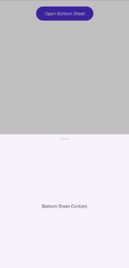

# Set Bottom Sheet Content in .NET MAUI Bottom Sheet

The sheet content is only viewable when the sheet is in the FullExpanded, HalfExpanded, Collapsed state. Its content can be set as : `BottomSheetContent`

## BottomSheet Content

It can be set using the `BottomSheetContent` property.




 <Grid>
    <VerticalStackLayout Padding="20">
        <Button Text="Open Bottom Sheet" Clicked="OpenBottomSheet" WidthRequest="180" CornerRadius="30" VerticalOptions="Center"/>
    </VerticalStackLayout>
    <bottomSheet:SfBottomSheet x:Name="bottomSheet">
        <bottomSheet:SfBottomSheet.BottomSheetContent>
            <Label Text="Bottom Sheet Content" VerticalOptions="Center" HorizontalOptions="Center" FontSize="14" />
        </bottomSheet:SfBottomSheet.BottomSheetContent>
    </bottomSheet:SfBottomSheet>
    </Grid>
	



Grid grid=new Grid();
var verticalStackLayout = new VerticalStackLayout
{
    Padding = new Thickness(20)
};

var button = new Button
{
    Text = "Open Bottom Sheet",
    WidthRequest = 180,
    CornerRadius = 30,
    VerticalOptions = LayoutOptions.Center
};

button.Clicked += OpenBottomSheet;
verticalStackLayout.Children.Add(button);
SfBottomSheet bottomSheet = new SfBottomSheet();
var bottomSheetContent = new Label
{
    Text = "Bottom Sheet Content",
    VerticalOptions = LayoutOptions.Center,
    HorizontalOptions = LayoutOptions.Center,
    FontSize = 14
};

bottomSheet.BottomSheetContent = bottomSheetContent;
grid.Children.Add(verticalStackLayout);
grid.Children.Add(bottomSheet);
this.Content = grid;
  






private void OpenBottomSheet(object sender, EventArgs e)
{
    bottomSheet.Show();
}




