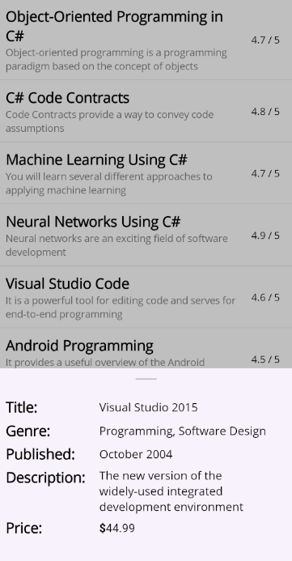
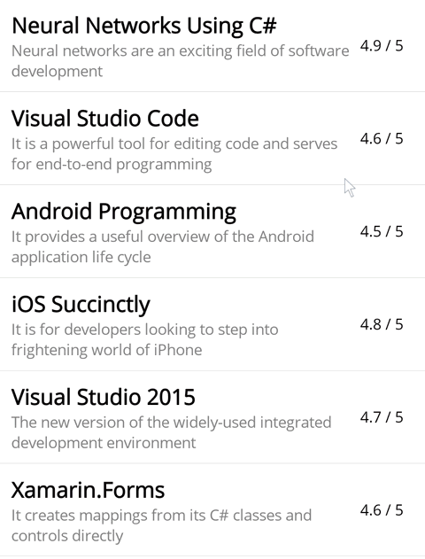
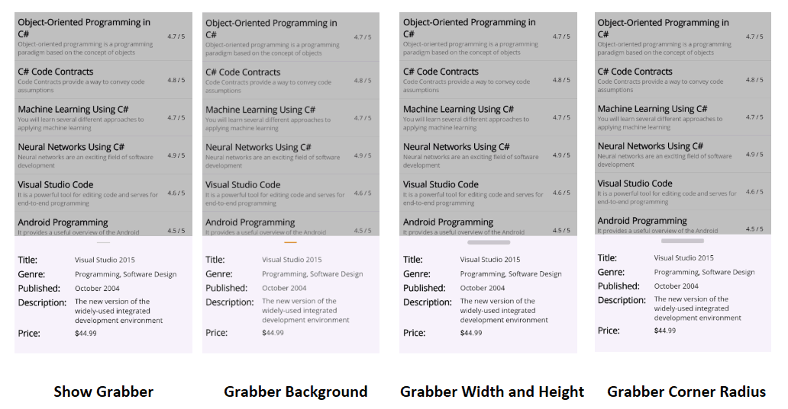

# Customization in .NET MAUI Bottom Sheet (SfBottomSheet)

A [Bottom Sheet](https://help.syncfusion.com/cr/maui-toolkit/Syncfusion.Maui.Toolkit.BottomSheet.SfBottomSheet.html) consists of several elements that can be customized to enhance its appearance and functionality.

## Popup mode

The [IsModal](https://help.syncfusion.com/cr/maui-toolkit/Syncfusion.Maui.Toolkit.BottomSheet.SfBottomSheet.html#Syncfusion_Maui_Toolkit_BottomSheet_SfBottomSheet_IsModal) property controls whether background interaction is disabled when a Bottom Sheet is open. When set to `True`, a gray overlay blocks interaction with the background, and tapping it closes the sheet. When set to `False`, the overlay is invisible, allowing users to interact with the content behind the sheet.




<bottomSheet:SfBottomSheet x:Name="bottomSheet" IsModal="True">
    <bottomSheet:SfBottomSheet.BottomSheetContent>
        <!--Add your content here-->
    </bottomSheet:SfBottomSheet.BottomSheetContent>
</bottomSheet:SfBottomSheet>




SfBottomSheet bottomSheet = new SfBottomSheet
{
    IsModal = true
};




## State

The state of the [Bottom Sheet](https://help.syncfusion.com/cr/maui-toolkit/Syncfusion.Maui.Toolkit.BottomSheet.SfBottomSheet.html) can be controlled using the [State](https://help.syncfusion.com/cr/maui-toolkit/Syncfusion.Maui.Toolkit.BottomSheet.SfBottomSheet.html#Syncfusion_Maui_Toolkit_BottomSheet_SfBottomSheet_State) property. The default value is `Hidden`. This property accepts the following values:

* **FullExpanded** - The sheet will expand to cover the full screen.
* **HalfExpanded** - The sheet will expand to cover half of the screen.
* **Collapsed** - The sheet will remain collapsed at the bottom of the screen.
* **Hidden** - The sheet will remain hidden.

The [State](https://help.syncfusion.com/cr/maui-toolkit/Syncfusion.Maui.Toolkit.BottomSheet.SfBottomSheet.html#Syncfusion_Maui_Toolkit_BottomSheet_SfBottomSheet_State) property works together with the [AllowedState](https://help.syncfusion.com/cr/maui-toolkit/Syncfusion.Maui.Toolkit.BottomSheet.SfBottomSheet.html#Syncfusion_Maui_Toolkit_BottomSheet_SfBottomSheet_AllowedState) property to control the allowed states of the Bottom Sheet.

	


<bottomSheet:SfBottomSheet x:Name="bottomSheet" State="FullExpanded">
    <bottomSheet:SfBottomSheet.BottomSheetContent>
        <!--Add your content here-->    
    </bottomSheet:SfBottomSheet.BottomSheetContent>
</bottomSheet:SfBottomSheet>
	



SfBottomSheet bottomSheet = new SfBottomSheet();
bottomSheet.State = BottomSheetState.FullExpanded;




## AllowedState

The [Bottom Sheet](https://help.syncfusion.com/cr/maui-toolkit/Syncfusion.Maui.Toolkit.BottomSheet.SfBottomSheet.html) allows controlling the transition between states using the [AllowedState](https://help.syncfusion.com/cr/maui-toolkit/Syncfusion.Maui.Toolkit.BottomSheet.SfBottomSheet.html#Syncfusion_Maui_Toolkit_BottomSheet_SfBottomSheet_AllowedState) property. The default value is `All`, which allows transitions between all available states. This property accepts the following values:

* **FullExpanded** - Allows transitions only between FullExpanded and Collapsed states.
* **HalfExpanded** - Allows transitions only between HalfExpanded and Collapsed states.
* **All** - Allows transitions between all available states (FullExpanded, HalfExpanded, Collapsed, and Hidden).

	


<bottomSheet:SfBottonSheet x:Name="bottomSheet" AllowedState="HalfExpanded" >
    <bottomSheet:SfBottonSheet.BottomSheetContent>
        <!--Add your content here-->
    </bottomSheet:SfBottonSheet.BottomSheetContent>
</bottomSheet:SfBottonSheet>
	



SfBottomSheet bottomSheet = new SfBottomSheet();
bottomSheet.AllowedState = BottomSheetAllowedState.HalfExpanded;




## Overlay tap to collapse

The [CollapseOnOverlayTap](https://help.syncfusion.com/cr/maui-toolkit/Syncfusion.Maui.Toolkit.BottomSheet.SfBottomSheet.html#Syncfusion_Maui_Toolkit_BottomSheet_SfBottomSheet_CollapseOnOverlayTap) property enables the Bottom Sheet to collapse when the user taps on the overlay (outside the sheet). This enhances user interaction by allowing easy dismissal of the sheet without fully closing it.

	


<bottomSheet:SfBottomSheet x:Name="bottomSheet" CollapseOnOverlayTap="True">
    <bottomSheet:SfBottomSheet.BottomSheetContent>
        <!--Add your content here-->    
    </bottomSheet:SfBottomSheet.BottomSheetContent>
</bottomSheet:SfBottomSheet>
	



SfBottomSheet bottomSheet = new SfBottomSheet();
bottomSheet.CollapseOnOverlayTap = true;




## ContentPadding

The [ContentPadding](https://help.syncfusion.com/cr/maui-toolkit/Syncfusion.Maui.Toolkit.BottomSheet.SfBottomSheet.html#Syncfusion_Maui_Toolkit_BottomSheet_SfBottomSheet_ContentPadding) property of the [Bottom Sheet](https://help.syncfusion.com/cr/maui-toolkit/Syncfusion.Maui.Toolkit.BottomSheet.SfBottomSheet.html) adds space around the content, creating a gap between the Bottom Sheet content and the edges.

	


<bottomSheet:SfBottomSheet x:Name="bottomSheet" ContentPadding="15">
    <bottomSheet:SfBottomSheet.BottomSheetContent>
        <!--Add your content here-->
    </bottomSheet:SfBottomSheet.BottomSheetContent>
</bottomSheet:SfBottomSheet>
	



SfBottomSheet bottomSheet = new SfBottomSheet();
bottomSheet.ContentPadding = new Thickness(15);




## Background

The [Background](https://help.syncfusion.com/cr/maui-toolkit/Syncfusion.Maui.Toolkit.BottomSheet.SfBottomSheet.html#Syncfusion_Maui_Toolkit_BottomSheet_SfBottomSheet_Background) property allows you to customize the background color of the Bottom Sheet.

	


<bottomSheet:SfBottomSheet x:Name="bottomSheet" Background="Beige">
    <bottomSheet:SfBottomSheet.BottomSheetContent>
        <!--Add your content here-->
    </bottomSheet:SfBottomSheet.BottomSheetContent>
</bottomSheet:SfBottomSheet>
	



SfBottomSheet bottomSheet = new SfBottomSheet
{
    Background = Colors.Beige
};




## CornerRadius

The [CornerRadius](https://help.syncfusion.com/cr/maui-toolkit/Syncfusion.Maui.Toolkit.BottomSheet.SfBottomSheet.html#Syncfusion_Maui_Toolkit_BottomSheet_SfBottomSheet_CornerRadius) property allows you to add a corner radius to the Bottom Sheet.

	


<bottomSheet:SfBottomSheet x:Name="bottomSheet" CornerRadius="15, 15, 0, 0">
    <bottomSheet:SfBottomSheet.BottomSheetContent>
        <!--Add your content here-->
    </bottomSheet:SfBottomSheet.BottomSheetContent>
</bottomSheet:SfBottomSheet>
	



SfBottomSheet bottomSheet = new SfBottomSheet
{
    CornerRadius = new CornerRadius(15, 15, 0, 0)
};




## Adjust the height

### FullExpanded height

The [FullExpandedRatio](https://help.syncfusion.com/cr/maui-toolkit/Syncfusion.Maui.Toolkit.BottomSheet.SfBottomSheet.html#Syncfusion_Maui_Toolkit_BottomSheet_SfBottomSheet_FullExpandedRatio) property adjusts the height of the [Bottom Sheet](https://help.syncfusion.com/cr/maui-toolkit/Syncfusion.Maui.Toolkit.BottomSheet.SfBottomSheet.html) when it is in the `FullExpanded` state. The default value is `1`. You can set a value between 0.1 and 1 to adjust the height.

	


<bottomSheet:SfBottomSheet x:Name="bottomSheet" FullExpandedRatio="0.8" State="FullExpanded">
 <bottomSheet:SfBottomSheet.BottomSheetContent>
     <!--Add your content here-->
 </bottomSheet:SfBottomSheet.BottomSheetContent>
</bottomSheet:SfBottomSheet>
	



SfBottomSheet bottomSheet = new SfBottomSheet();
bottomSheet.FullExpandedRatio = 0.8;
bottomSheet.State = BottomSheetState.FullExpanded;




### HalfExpanded height

The [HalfExpandedRatio](https://help.syncfusion.com/cr/maui-toolkit/Syncfusion.Maui.Toolkit.BottomSheet.SfBottomSheet.html#Syncfusion_Maui_Toolkit_BottomSheet_SfBottomSheet_HalfExpandedRatio) property adjusts the height of the [Bottom Sheet](https://help.syncfusion.com/cr/maui-toolkit/Syncfusion.Maui.Toolkit.BottomSheet.SfBottomSheet.html) when it is in the `HalfExpanded` state. The default value is `0.5`. You can set a value between 0.1 and 0.9 to adjust the height.

	


<bottomSheet:SfBottomSheet x:Name="bottomSheet" HalfExpandedRatio="0.7" State="HalfExpanded">
    <bottomSheet:SfBottomSheet.BottomSheetContent>
        <!--Add your content here-->
    </bottomSheet:SfBottomSheet.BottomSheetContent>
</bottomSheet:SfBottomSheet>
	



SfBottomSheet bottomSheet = new SfBottomSheet();
bottomSheet.HalfExpandedRatio = 0.7;
bottomSheet.State = BottomSheetState.HalfExpanded;




### CollapsedHeight

The [CollapsedHeight](https://help.syncfusion.com/cr/maui-toolkit/Syncfusion.Maui.Toolkit.BottomSheet.SfBottomSheet.html#Syncfusion_Maui_Toolkit_BottomSheet_SfBottomSheet_CollapsedHeight) property allows you to specify the height of the [Bottom Sheet](https://help.syncfusion.com/cr/maui-toolkit/Syncfusion.Maui.Toolkit.BottomSheet.SfBottomSheet.html) when it is in the `Collapsed` state. The default value is `100`.

	


<bottomSheet:SfBottomSheet x:Name="bottomSheet" CollapsedHeight="150">
    <bottomSheet:SfBottomSheet.BottomSheetContent>
        <!--Add your content here-->
    </bottomSheet:SfBottomSheet.BottomSheetContent>
</bottomSheet:SfBottomSheet>
	



SfBottomSheet bottomSheet = new SfBottomSheet();
bottomSheet.CollapsedHeight = 150;




## Adjust the width

The [ContentWidthMode](https://help.syncfusion.com/cr/maui-toolkit/Syncfusion.Maui.Toolkit.BottomSheet.SfBottomSheet.html#Syncfusion_Maui_Toolkit_BottomSheet_SfBottomSheet_ContentWidthMode) property allows you to adjust the width of the [Bottom Sheet](https://help.syncfusion.com/cr/maui-toolkit/Syncfusion.Maui.Toolkit.BottomSheet.SfBottomSheet.html). The default value is `Full`.

* **Full** - The sheet will occupy the entire screen width.
* **Custom** - The sheet will adjust its width based on the value set in the [BottomSheetContentWidth](https://help.syncfusion.com/cr/maui-toolkit/Syncfusion.Maui.Toolkit.BottomSheet.SfBottomSheet.html#Syncfusion_Maui_Toolkit_BottomSheet_SfBottomSheet_BottomSheetContentWidth) property.

The [BottomSheetContentWidth](https://help.syncfusion.com/cr/maui-toolkit/Syncfusion.Maui.Toolkit.BottomSheet.SfBottomSheet.html#Syncfusion_Maui_Toolkit_BottomSheet_SfBottomSheet_BottomSheetContentWidth) property allows you to adjust the width of the `Bottom Sheet` when it is in `Custom` content width mode. The default value is `300`.

	


<bottomSheet:SfBottomSheet x:Name="bottomSheet" ContentWidthMode="Custom" BottomSheetContentWidth="500">
    <bottomSheet:SfBottomSheet.BottomSheetContent>
        <!--Add your content here-->
    </bottomSheet:SfBottomSheet.BottomSheetContent>
</bottomSheet:SfBottomSheet>
	



SfBottomSheet bottomSheet = new SfBottomSheet
{
    ContentWidthMode = BottomSheetContentWidthMode.Custom,
    BottomSheetContentWidth = 500
};




## Grabber customization

### ShowGrabber
The [ShowGrabber](https://help.syncfusion.com/cr/maui-toolkit/Syncfusion.Maui.Toolkit.BottomSheet.SfBottomSheet.html#Syncfusion_Maui_Toolkit_BottomSheet_SfBottomSheet_ShowGrabber) property enables users to interact with the [Bottom Sheet](https://help.syncfusion.com/cr/maui-toolkit/Syncfusion.Maui.Toolkit.BottomSheet.SfBottomSheet.html) by dragging it up and down. By default, the ShowGrabber property is set to `true`.

	


<bottomSheet:SfBottomSheet x:Name="bottomSheet" ShowGrabber="True">
    <bottomSheet:SfBottomSheet.BottomSheetContent>
        <!--Add your content here-->
    </bottomSheet:SfBottomSheet.BottomSheetContent>
</bottomSheet:SfBottomSheet>
	



SfBottomSheet bottomSheet = new SfBottomSheet
{
    ShowGrabber = true
};




### GrabberWidth and GrabberHeight

The [GrabberWidth](https://help.syncfusion.com/cr/maui-toolkit/Syncfusion.Maui.Toolkit.BottomSheet.SfBottomSheet.html#Syncfusion_Maui_Toolkit_BottomSheet_SfBottomSheet_GrabberWidth) and [GrabberHeight](https://help.syncfusion.com/cr/maui-toolkit/Syncfusion.Maui.Toolkit.BottomSheet.SfBottomSheet.html#Syncfusion_Maui_Toolkit_BottomSheet_SfBottomSheet_GrabberHeight) properties of the [Bottom Sheet](https://help.syncfusion.com/cr/maui-toolkit/Syncfusion.Maui.Toolkit.BottomSheet.SfBottomSheet.html) specify the width and height of the grabber element. By default, the GrabberWidth property is set to `32`, and the GrabberHeight property is set to `4`.

	


<bottomSheet:SfBottomSheet x:Name="bottomSheet" GrabberHeight="12" GrabberWidth="100">
    <bottomSheet:SfBottomSheet.BottomSheetContent>
        <!--Add your content here-->
    </bottomSheet:SfBottomSheet.BottomSheetContent>
</bottomSheet:SfBottomSheet>
	



SfBottomSheet bottomSheet = new SfBottomSheet
{
    GrabberHeight = 12,
    GrabberWidth = 100
};




### GrabberCornerRadius

The [GrabberCornerRadius](https://help.syncfusion.com/cr/maui-toolkit/Syncfusion.Maui.Toolkit.BottomSheet.SfBottomSheet.html#Syncfusion_Maui_Toolkit_BottomSheet_SfBottomSheet_GrabberCornerRadius) property allows you to customize the corner radius of the grabber element in the [Bottom Sheet](https://help.syncfusion.com/cr/maui-toolkit/Syncfusion.Maui.Toolkit.BottomSheet.SfBottomSheet.html). By adjusting this property, you can create rounded corners for the grabber.

	


<bottomSheet:SfBottomSheet x:Name="bottomSheet" GrabberCornerRadius="3">
    <bottomSheet:SfBottomSheet.BottomSheetContent>
        <!--Add your content here-->
    </bottomSheet:SfBottomSheet.BottomSheetContent>
</bottomSheet:SfBottomSheet>




SfBottomSheet bottomSheet = new SfBottomSheet
{
    GrabberCornerRadius = new CornerRadius(3)
};




### GrabberBackground

The [GrabberBackground](https://help.syncfusion.com/cr/maui-toolkit/Syncfusion.Maui.Toolkit.BottomSheet.SfBottomSheet.html#Syncfusion_Maui_Toolkit_BottomSheet_SfBottomSheet_GrabberBackground) property allows you to customize the background color of the grabber in the [Bottom Sheet](https://help.syncfusion.com/cr/maui-toolkit/Syncfusion.Maui.Toolkit.BottomSheet.SfBottomSheet.html).

	


<bottomSheet:SfBottomSheet x:Name="bottomSheet" GrabberBackground="Red">
    <bottomSheet:SfBottomSheet.BottomSheetContent>
        <!--Add your content here-->
    </bottomSheet:SfBottomSheet.BottomSheetContent>
</bottomSheet:SfBottomSheet>
	



SfBottomSheet bottomSheet = new SfBottomSheet
{
    GrabberBackground = Colors.Red
};




### GrabberAreaHeight

The [GrabberAreaHeight](https://help.syncfusion.com/cr/maui-toolkit/Syncfusion.Maui.Toolkit.BottomSheet.SfBottomSheet.html#Syncfusion_Maui_Toolkit_BottomSheet_SfBottomSheet_GrabberAreaHeight) feature in the [Bottom Sheet](https://help.syncfusion.com/cr/maui-toolkit/Syncfusion.Maui.Toolkit.BottomSheet.SfBottomSheet.html) control allows developers to adjust the height of the drag area, thus enhancing both usability and appearance.

	


<bottomSheet:SfBottomSheet x:Name="bottomSheet" GrabberAreaHeight="100">
    <bottomSheet:SfBottomSheet.BottomSheetContent>
        <!--Add your content here-->    
    </bottomSheet:SfBottomSheet.BottomSheetContent>
</bottomSheet:SfBottomSheet>
	



SfBottomSheet bottomSheet = new SfBottomSheet
{
    GrabberAreaHeight = 100
};



