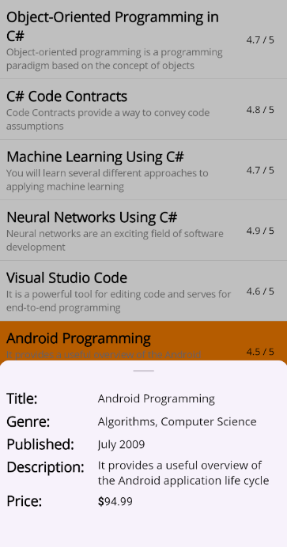

# Customization in .NET MAUI Bottom Sheet (SfBottomSheet)

A [BottomSheet](https://help.syncfusion.com/cr/maui-toolkit/Syncfusion.Maui.Toolkit.BottomSheet.SfBottomSheet.html) consists of several elements that can be customized to enhance its appearance and functionality.

## Popup Mode
The [IsModal](https://help.syncfusion.com/cr/maui-toolkit/Syncfusion.Maui.Toolkit.BottomSheet.SfBottomSheet.html#Syncfusion_Maui_Toolkit_BottomSheet_SfBottomSheet_IsModal) property controls whether background interaction is disabled when a bottom sheet is open. When set to `True`, a gray overlay blocks interaction with the background, and tapping it closes the sheet. When set to `False`, the overlay is invisible, allowing users to interact with the content behind the sheet.




<bottomSheet:SfBottomSheet x:Name="bottomSheet" IsModal="True" HalfExpandedRatio="0.35" ContentPadding="10">
    <bottomSheet:SfBottomSheet.BottomSheetContent>
        <VerticalStackLayout Spacing="5" x:Name="bottomSheetContent">
            <Grid ColumnDefinitions="120, *" ColumnSpacing="10">
                <Label Text="Title:" FontSize="20" FontAttributes="Bold"/>
                <Label Text="{Binding Title}" FontSize="16" VerticalTextAlignment="Center" Grid.Column="1"/>
            </Grid>
            <Grid ColumnDefinitions="120, *" ColumnSpacing="10">
                <Label Text="Genre:" FontSize="20" FontAttributes="Bold"/>
                <Label Text="{Binding Genre}" FontSize="16" VerticalTextAlignment="Center" Grid.Column="1"/>
            </Grid>
            <Grid ColumnDefinitions="120, *" ColumnSpacing="10">
                <Label Text="Published:" FontSize="20" FontAttributes="Bold"/>
                <Label Text="{Binding Published}" FontSize="16" VerticalTextAlignment="Center" Grid.Column="1"/>
            </Grid>
            <Grid ColumnDefinitions="120, *" ColumnSpacing="10">
                <Label Text="Description:" FontSize="20" FontAttributes="Bold"/>
                <Label Text="{Binding Description}" FontSize="16" VerticalTextAlignment="Center" Grid.Column="1"/>
            </Grid>
            <Grid ColumnDefinitions="120, *" ColumnSpacing="10">
                <Label Text="Price:" FontSize="20" FontAttributes="Bold"/>
                <Label FontSize="16" VerticalTextAlignment="Center" Grid.Column="1">
                    <Label.FormattedText>
                        <FormattedString>
                            
                            
                        </FormattedString>
                    </Label.FormattedText>
                </Label>
            </Grid>
        </VerticalStackLayout>
    </bottomSheet:SfBottomSheet.BottomSheetContent>
</bottomSheet:SfBottomSheet>




SfBottomSheet bottomSheet = new SfBottomSheet();
bottomSheet.IsModal = true;
Grid grid = new Grid();
bottomSheet.BottomSheetContent = grid;
Content = bottomSheet;




## State
The state of the [BottomSheet](https://help.syncfusion.com/cr/maui-toolkit/Syncfusion.Maui.Toolkit.BottomSheet.SfBottomSheet.html) can be controlled using the [State](https://help.syncfusion.com/cr/maui-toolkit/Syncfusion.Maui.Toolkit.BottomSheet.SfBottomSheet.html#Syncfusion_Maui_Toolkit_BottomSheet_SfBottomSheet_State) property. The default value is `Hidden`. This property accepts the following values:

* **FullExpanded** - The sheet will expand to cover the full screen.
* **HalfExpanded** - The sheet will expand to cover half of the screen.
* **Collapsed** - The sheet will remain collapsed at the bottom of the screen.
* **Hidden** - The sheet will remain hidden.

The [State](https://help.syncfusion.com/cr/maui-toolkit/Syncfusion.Maui.Toolkit.BottomSheet.SfBottomSheet.html#Syncfusion_Maui_Toolkit_BottomSheet_SfBottomSheet_State) property works together with the [AllowedState](https://help.syncfusion.com/cr/maui-toolkit/Syncfusion.Maui.Toolkit.BottomSheet.SfBottomSheet.html#Syncfusion_Maui_Toolkit_BottomSheet_SfBottomSheet_AllowedState) property to control the allowed states of the BottomSheet.

	


<bottomSheet:SfBottomSheet x:Name="bottomSheet" State="FullExpanded">
    <bottomSheet:SfBottomSheet.BottomSheetContent>
        <Grid/>    
    </bottomSheet:SfBottomSheet.BottomSheetContent>
</bottomSheet:SfBottomSheet>
	



SfBottomSheet bottomSheet = new SfBottomSheet();
bottomSheet.State = BottomSheetState.FullExpanded;
Grid grid = new Grid();
bottomSheet.BottomSheetContent = grid;
Content = bottomSheet;




## Allowed State
The [BottomSheet](https://help.syncfusion.com/cr/maui-toolkit/Syncfusion.Maui.Toolkit.BottomSheet.SfBottomSheet.html) allows to control the transition between the states using the [AllowedState](https://help.syncfusion.com/cr/maui-toolkit/Syncfusion.Maui.Toolkit.BottomSheet.SfBottomSheet.html#Syncfusion_Maui_Toolkit_BottomSheet_SfBottomSheet_AllowedState) property. The default value is `All`, which allows transitions between all available states. This property accepts the following values:

* **FullExpanded** - It will allow transitions only between the FullExpanded and Collapsed states.
* **HalfExpanded** - It will allow transitions only between the HalfExpanded and Collapsed states.
* **All** - Allows transitions between all available states (FullExpanded, HalfExpanded, Collapsed, and Hidden).

	


<bottomSheet:SfBottonSheet x:Name="bottomSheet" AllowedState="HalfExpanded" >
    <bottomSheet:SfBottonSheet.BottomSheetContent>
        <Grid/>
    </bottomSheet:SfBottonSheet.BottomSheetContent>
</bottomSheet:SfBottonSheet>
	



SfBottomSheet bottomSheet = new SfBottomSheet();
bottomSheet.AllowedState = BottomSheetAllowedState.HalfExpanded;
Grid grid = new Grid();
bottomSheet.BottomSheetContent = grid;
Content = bottomSheet;




## Content Padding
The [ContentPadding](https://help.syncfusion.com/cr/maui-toolkit/Syncfusion.Maui.Toolkit.BottomSheet.SfBottomSheet.html#Syncfusion_Maui_Toolkit_BottomSheet_SfBottomSheet_ContentPadding) property of the [BottomSheet](https://help.syncfusion.com/cr/maui-toolkit/Syncfusion.Maui.Toolkit.BottomSheet.SfBottomSheet.html) adds space around the content creating a gap between the bottom sheet content and the edges.

	


<bottomSheet:SfBottomSheet x:Name="bottomSheet" ContentPadding="15">
    <bottomSheet:SfBottomSheet.BottomSheetContent>
        <Grid/>
    </bottomSheet:SfBottomSheet.BottomSheetContent>
</bottomSheet:SfBottomSheet>
	



SfBottomSheet bottomSheet = new SfBottomSheet();
bottomSheet.ContentPadding = new Thickness(15);
Grid grid = new Grid();
bottomSheet.BottomSheetContent = grid;
Content = bottomSheet;




## Background
The [Background](https://help.syncfusion.com/cr/maui-toolkit/Syncfusion.Maui.Toolkit.BottomSheet.SfBottomSheet.html#Syncfusion_Maui_Toolkit_BottomSheet_SfBottomSheet_Background) property allows you to customize the background color of the BottomSheet.

	


<bottomSheet:SfBottomSheet x:Name="bottomSheet" Background="Beige" HalfExpandedRatio="0.35" ContentPadding="10">
    <bottomSheet:SfBottomSheet.BottomSheetContent>
        <VerticalStackLayout Spacing="5" x:Name="bottomSheetContent">
            <Grid ColumnDefinitions="120, *" ColumnSpacing="10">
                <Label Text="Title:" FontSize="20" FontAttributes="Bold"/>
                <Label Text="{Binding Title}" FontSize="16" VerticalTextAlignment="Center" Grid.Column="1"/>
            </Grid>
            <Grid ColumnDefinitions="120, *" ColumnSpacing="10">
                <Label Text="Genre:" FontSize="20" FontAttributes="Bold"/>
                <Label Text="{Binding Genre}" FontSize="16" VerticalTextAlignment="Center" Grid.Column="1"/>
            </Grid>
            <Grid ColumnDefinitions="120, *" ColumnSpacing="10">
                <Label Text="Published:" FontSize="20" FontAttributes="Bold"/>
                <Label Text="{Binding Published}" FontSize="16" VerticalTextAlignment="Center" Grid.Column="1"/>
            </Grid>
            <Grid ColumnDefinitions="120, *" ColumnSpacing="10">
                <Label Text="Description:" FontSize="20" FontAttributes="Bold"/>
                <Label Text="{Binding Description}" FontSize="16" VerticalTextAlignment="Center" Grid.Column="1"/>
            </Grid>
            <Grid ColumnDefinitions="120, *" ColumnSpacing="10">
                <Label Text="Price:" FontSize="20" FontAttributes="Bold"/>
                <Label FontSize="16" VerticalTextAlignment="Center" Grid.Column="1">
                    <Label.FormattedText>
                        <FormattedString>
                            
                            
                        </FormattedString>
                    </Label.FormattedText>
                </Label>
            </Grid>
        </VerticalStackLayout>
    </bottomSheet:SfBottomSheet.BottomSheetContent>
</bottomSheet:SfBottomSheet>
	



SfBottomSheet bottomSheet = new SfBottomSheet();
bottomSheet.Background = new SolidColorBrush(Colors.MediumPurple);
Grid grid = new Grid();
bottomSheet.BottomSheetContent = grid;
Content = bottomSheet;




## CornerRadius
The [CornerRadius](https://help.syncfusion.com/cr/maui-toolkit/Syncfusion.Maui.Toolkit.BottomSheet.SfBottomSheet.html#Syncfusion_Maui_Toolkit_BottomSheet_SfBottomSheet_CornerRadius) property allows you to add corner radius to the Bottom sheet.

	


<bottomSheet:SfBottomSheet x:Name="bottomSheet" CornerRadius="15, 15, 0, 0" HalfExpandedRatio="0.35" ContentPadding="10">
    <bottomSheet:SfBottomSheet.BottomSheetContent>
        <VerticalStackLayout Spacing="5" x:Name="bottomSheetContent">
            <Grid ColumnDefinitions="120, *" ColumnSpacing="10">
                <Label Text="Title:" FontSize="20" FontAttributes="Bold"/>
                <Label Text="{Binding Title}" FontSize="16" VerticalTextAlignment="Center" Grid.Column="1"/>
            </Grid>
            <Grid ColumnDefinitions="120, *" ColumnSpacing="10">
                <Label Text="Genre:" FontSize="20" FontAttributes="Bold"/>
                <Label Text="{Binding Genre}" FontSize="16" VerticalTextAlignment="Center" Grid.Column="1"/>
            </Grid>
            <Grid ColumnDefinitions="120, *" ColumnSpacing="10">
                <Label Text="Published:" FontSize="20" FontAttributes="Bold"/>
                <Label Text="{Binding Published}" FontSize="16" VerticalTextAlignment="Center" Grid.Column="1"/>
            </Grid>
            <Grid ColumnDefinitions="120, *" ColumnSpacing="10">
                <Label Text="Description:" FontSize="20" FontAttributes="Bold"/>
                <Label Text="{Binding Description}" FontSize="16" VerticalTextAlignment="Center" Grid.Column="1"/>
            </Grid>
            <Grid ColumnDefinitions="120, *" ColumnSpacing="10">
                <Label Text="Price:" FontSize="20" FontAttributes="Bold"/>
                <Label FontSize="16" VerticalTextAlignment="Center" Grid.Column="1">
                    <Label.FormattedText>
                        <FormattedString>
                            
                            
                        </FormattedString>
                    </Label.FormattedText>
                </Label>
            </Grid>
        </VerticalStackLayout>
    </bottomSheet:SfBottomSheet.BottomSheetContent>
</bottomSheet:SfBottomSheet>
	



SfBottomSheet bottomSheet = new SfBottomSheet();
bottomSheet.CornerRadius = new CornerRadius(15, 15, 0, 0);
Grid grid = new Grid();
bottomSheet.BottomSheetContent = grid;
Content = bottomSheet;




## Adjust the Height
### Full Expanded Height

The [FullExpandedRatio](https://help.syncfusion.com/cr/maui-toolkit/Syncfusion.Maui.Toolkit.BottomSheet.SfBottomSheet.html#Syncfusion_Maui_Toolkit_BottomSheet_SfBottomSheet_FullExpandedRatio) property adjusts the height of the [BottomSheet](https://help.syncfusion.com/cr/maui-toolkit/Syncfusion.Maui.Toolkit.BottomSheet.SfBottomSheet.html) when it is in the `FullExpanded` state. The default value is `1`. You can set a value between 0.1 and 1 to adjust the height.

	


<bottomSheet:SfBottomSheet x:Name="bottomSheet" FullExpandedRatio="0.8" State="FullExpanded">
 <bottomSheet:SfBottomSheet.BottomSheetContent>
     <Grid/>
 </bottomSheet:SfBottomSheet.BottomSheetContent>
</bottomSheet:SfBottomSheet>
	



SfBottomSheet bottomSheet = new SfBottomSheet();
bottomSheet.FullExpandedRatio = 0.8;
bottomSheet.State = BottomSheetState.FullExpanded;
Grid grid = new Grid();
bottomSheet.BottomSheetContent = grid;
Content = bottomSheet;




### Half Expanded Height

The [HalfExpandedRatio](https://help.syncfusion.com/cr/maui-toolkit/Syncfusion.Maui.Toolkit.BottomSheet.SfBottomSheet.html#Syncfusion_Maui_Toolkit_BottomSheet_SfBottomSheet_HalfExpandedRatio) property adjusts the height of the [BottomSheet](https://help.syncfusion.com/cr/maui-toolkit/Syncfusion.Maui.Toolkit.BottomSheet.SfBottomSheet.html) when it is in the `HalfExpanded` state. The default value is `0.5`. You can set a value between 0.1 and 0.9 to adjust the height.

	


<bottomSheet:SfBottomSheet x:Name="bottomSheet" HalfExpandedRatio="0.7" State="HalfExpanded">
    <bottomSheet:SfBottomSheet.BottomSheetContent>
        <Grid/>
    </bottomSheet:SfBottomSheet.BottomSheetContent>
</bottomSheet:SfBottomSheet>
	



SfBottomSheet bottomSheet = new SfBottomSheet();
bottomSheet.HalfExpandedRatio = 0.7;
bottomSheet.State = BottomSheetState.HalfExpanded;
Grid grid = new Grid();
bottomSheet.BottomSheetContent = grid;
Content = bottomSheet;




### Collapsed Height
The [CollapsedHeight](https://help.syncfusion.com/cr/maui-toolkit/Syncfusion.Maui.Toolkit.BottomSheet.SfBottomSheet.html#Syncfusion_Maui_Toolkit_BottomSheet_SfBottomSheet_CollapsedHeight) property allows you to specify the height of the [BottomSheet](https://help.syncfusion.com/cr/maui-toolkit/Syncfusion.Maui.Toolkit.BottomSheet.SfBottomSheet.html), when it is in the `Collapsed` state. The default value is `100`.

	


<bottomSheet:SfBottomSheet x:Name="bottomSheet" CollapsedHeight="150">
    <bottomSheet:SfBottomSheet.BottomSheetContent>
        <Grid/>
    </bottomSheet:SfBottomSheet.BottomSheetContent>
</bottomSheet:SfBottomSheet>
	



SfBottomSheet bottomSheet = new SfBottomSheet();
bottomSheet.CollapsedHeight = 150;
Grid grid = new Grid();
bottomSheet.BottomSheetContent = grid;
Content = bottomSheet;




## Adjust the Width
The [ContentWidthMode](https://help.syncfusion.com/cr/maui-toolkit/Syncfusion.Maui.Toolkit.BottomSheet.SfBottomSheet.html#Syncfusion_Maui_Toolkit_BottomSheet_SfBottomSheet_ContentWidthMode) property allows you to adjust the width of the [BottomSheet](https://help.syncfusion.com/cr/maui-toolkit/Syncfusion.Maui.Toolkit.BottomSheet.SfBottomSheet.html). The default value is `Full`.

* **Full** - The sheet will occupy the entire screen width.
* **Custom** - The sheet will adjust its width based on the value set in the [BottomSheetContentWidth](https://help.syncfusion.com/cr/maui-toolkit/Syncfusion.Maui.Toolkit.BottomSheet.SfBottomSheet.html#Syncfusion_Maui_Toolkit_BottomSheet_SfBottomSheet_BottomSheetContentWidth) property.

The [BottomSheetContentWidth](https://help.syncfusion.com/cr/maui-toolkit/Syncfusion.Maui.Toolkit.BottomSheet.SfBottomSheet.html#Syncfusion_Maui_Toolkit_BottomSheet_SfBottomSheet_BottomSheetContentWidth) property allows you to adjust the width of the `BottomSheet`, when it is in `Custom` content width mode. The default value is `300`.

	


<bottomSheet:SfBottomSheet x:Name="bottomSheet" ContentWidthMode="Custom" BottomSheetContentWidth="500" HalfExpandedRatio="0.35" ContentPadding="10">
    <bottomSheet:SfBottomSheet.BottomSheetContent>
        <VerticalStackLayout Spacing="5" x:Name="bottomSheetContent">
            <Grid ColumnDefinitions="120, *" ColumnSpacing="10">
                <Label Text="Title:" FontSize="20" FontAttributes="Bold"/>
                <Label Text="{Binding Title}" FontSize="16" VerticalTextAlignment="Center" Grid.Column="1"/>
            </Grid>
            <Grid ColumnDefinitions="120, *" ColumnSpacing="10">
                <Label Text="Genre:" FontSize="20" FontAttributes="Bold"/>
                <Label Text="{Binding Genre}" FontSize="16" VerticalTextAlignment="Center" Grid.Column="1"/>
            </Grid>
            <Grid ColumnDefinitions="120, *" ColumnSpacing="10">
                <Label Text="Published:" FontSize="20" FontAttributes="Bold"/>
                <Label Text="{Binding Published}" FontSize="16" VerticalTextAlignment="Center" Grid.Column="1"/>
            </Grid>
            <Grid ColumnDefinitions="120, *" ColumnSpacing="10">
                <Label Text="Description:" FontSize="20" FontAttributes="Bold"/>
                <Label Text="{Binding Description}" FontSize="16" VerticalTextAlignment="Center" Grid.Column="1"/>
            </Grid>
            <Grid ColumnDefinitions="120, *" ColumnSpacing="10">
                <Label Text="Price:" FontSize="20" FontAttributes="Bold"/>
                <Label FontSize="16" VerticalTextAlignment="Center" Grid.Column="1">
                    <Label.FormattedText>
                        <FormattedString>
                            
                            
                        </FormattedString>
                    </Label.FormattedText>
                </Label>
            </Grid>
        </VerticalStackLayout>
    </bottomSheet:SfBottomSheet.BottomSheetContent>
</bottomSheet:SfBottomSheet>
	



SfBottomSheet bottomSheet = new SfBottomSheet();
bottomSheet.ContentWidthMode = BottomSheetContentWidthMode.Custom;
bottomSheet.BottomSheetContentWidth = 500;
Grid grid = new Grid();
bottomSheet.BottomSheetContent = grid;
Content = bottomSheet;




## Grabber Customization
### Show Grabber
The [ShowGrabber](https://help.syncfusion.com/cr/maui-toolkit/Syncfusion.Maui.Toolkit.BottomSheet.SfBottomSheet.html#Syncfusion_Maui_Toolkit_BottomSheet_SfBottomSheet_ShowGrabber) property enables users to interact with the [BottomSheet](https://help.syncfusion.com/cr/maui-toolkit/Syncfusion.Maui.Toolkit.BottomSheet.SfBottomSheet.html) by dragging it up and down. By default, the ShowGrabber property is set to `true`.

	


<bottomSheet:SfBottomSheet x:Name="bottomSheet" ShowGrabber="True" HalfExpandedRatio="0.35" ContentPadding="10">
    <bottomSheet:SfBottomSheet.BottomSheetContent>
        <VerticalStackLayout Spacing="5" x:Name="bottomSheetContent">
            <Grid ColumnDefinitions="120, *" ColumnSpacing="10">
                <Label Text="Title:" FontSize="20" FontAttributes="Bold"/>
                <Label Text="{Binding Title}" FontSize="16" VerticalTextAlignment="Center" Grid.Column="1"/>
            </Grid>
            <Grid ColumnDefinitions="120, *" ColumnSpacing="10">
                <Label Text="Genre:" FontSize="20" FontAttributes="Bold"/>
                <Label Text="{Binding Genre}" FontSize="16" VerticalTextAlignment="Center" Grid.Column="1"/>
            </Grid>
            <Grid ColumnDefinitions="120, *" ColumnSpacing="10">
                <Label Text="Published:" FontSize="20" FontAttributes="Bold"/>
                <Label Text="{Binding Published}" FontSize="16" VerticalTextAlignment="Center" Grid.Column="1"/>
            </Grid>
            <Grid ColumnDefinitions="120, *" ColumnSpacing="10">
                <Label Text="Description:" FontSize="20" FontAttributes="Bold"/>
                <Label Text="{Binding Description}" FontSize="16" VerticalTextAlignment="Center" Grid.Column="1"/>
            </Grid>
            <Grid ColumnDefinitions="120, *" ColumnSpacing="10">
                <Label Text="Price:" FontSize="20" FontAttributes="Bold"/>
                <Label FontSize="16" VerticalTextAlignment="Center" Grid.Column="1">
                    <Label.FormattedText>
                        <FormattedString>
                            
                            
                        </FormattedString>
                    </Label.FormattedText>
                </Label>
            </Grid>
        </VerticalStackLayout>
    </bottomSheet:SfBottomSheet.BottomSheetContent>
</bottomSheet:SfBottomSheet>
	



SfBottomSheet bottomSheet = new SfBottomSheet();
bottomSheet.ShowGrabber = true;
Grid grid = new Grid();
bottomSheet.BottomSheetContent = grid;
Content = bottomSheet;




### Grabber Width and Grabber Height
The [GrabberWidth](https://help.syncfusion.com/cr/maui-toolkit/Syncfusion.Maui.Toolkit.BottomSheet.SfBottomSheet.html#Syncfusion_Maui_Toolkit_BottomSheet_SfBottomSheet_GrabberWidth) and [GrabberHeight](https://help.syncfusion.com/cr/maui-toolkit/Syncfusion.Maui.Toolkit.BottomSheet.SfBottomSheet.html#Syncfusion_Maui_Toolkit_BottomSheet_SfBottomSheet_GrabberHeight) properties of the [BottomSheet](https://help.syncfusion.com/cr/maui-toolkit/Syncfusion.Maui.Toolkit.BottomSheet.SfBottomSheet.html) specify the width and height of the grabber element. By default, the GrabberWidth property is set to `32`, and the GrabberHeight property is set to `4`.

	


<bottomSheet:SfBottomSheet x:Name="bottomSheet" GrabberHeight="12" GrabberWidth="100" HalfExpandedRatio="0.35" ContentPadding="10">
    <bottomSheet:SfBottomSheet.BottomSheetContent>
        <VerticalStackLayout Spacing="5" x:Name="bottomSheetContent">
            <Grid ColumnDefinitions="120, *" ColumnSpacing="10">
                <Label Text="Title:" FontSize="20" FontAttributes="Bold"/>
                <Label Text="{Binding Title}" FontSize="16" VerticalTextAlignment="Center" Grid.Column="1"/>
            </Grid>
            <Grid ColumnDefinitions="120, *" ColumnSpacing="10">
                <Label Text="Genre:" FontSize="20" FontAttributes="Bold"/>
                <Label Text="{Binding Genre}" FontSize="16" VerticalTextAlignment="Center" Grid.Column="1"/>
            </Grid>
            <Grid ColumnDefinitions="120, *" ColumnSpacing="10">
                <Label Text="Published:" FontSize="20" FontAttributes="Bold"/>
                <Label Text="{Binding Published}" FontSize="16" VerticalTextAlignment="Center" Grid.Column="1"/>
            </Grid>
            <Grid ColumnDefinitions="120, *" ColumnSpacing="10">
                <Label Text="Description:" FontSize="20" FontAttributes="Bold"/>
                <Label Text="{Binding Description}" FontSize="16" VerticalTextAlignment="Center" Grid.Column="1"/>
            </Grid>
            <Grid ColumnDefinitions="120, *" ColumnSpacing="10">
                <Label Text="Price:" FontSize="20" FontAttributes="Bold"/>
                <Label FontSize="16" VerticalTextAlignment="Center" Grid.Column="1">
                    <Label.FormattedText>
                        <FormattedString>
                            
                            
                        </FormattedString>
                    </Label.FormattedText>
                </Label>
            </Grid>
        </VerticalStackLayout>
    </bottomSheet:SfBottomSheet.BottomSheetContent>
</bottomSheet:SfBottomSheet>
	



SfBottomSheet bottomSheet = new SfBottomSheet();
bottomSheet.GrabberWidth = 48;
bottomSheet.GrabberHeight = 6;
Grid grid = new Grid();
bottomSheet.BottomSheetContent = grid;
Content = bottomSheet;




### Grabber CornerRadius
The [GrabberCornerRadius](https://help.syncfusion.com/cr/maui-toolkit/Syncfusion.Maui.Toolkit.BottomSheet.SfBottomSheet.html#Syncfusion_Maui_Toolkit_BottomSheet_SfBottomSheet_GrabberCornerRadius) property allows you to customize the corner radius of the grabber element in the [BottomSheet](https://help.syncfusion.com/cr/maui-toolkit/Syncfusion.Maui.Toolkit.BottomSheet.SfBottomSheet.html). By adjusting this property, you can create rounded corners for the grabber.

	


<bottomSheet:SfBottomSheet x:Name="bottomSheet" GrabberHeight="12" GrabberWidth="100" GrabberCornerRadius="3" HalfExpandedRatio="0.35" ContentPadding="10">
    <bottomSheet:SfBottomSheet.BottomSheetContent>
        <VerticalStackLayout Spacing="5" x:Name="bottomSheetContent">
            <Grid ColumnDefinitions="120, *" ColumnSpacing="10">
                <Label Text="Title:" FontSize="20" FontAttributes="Bold"/>
                <Label Text="{Binding Title}" FontSize="16" VerticalTextAlignment="Center" Grid.Column="1"/>
            </Grid>
            <Grid ColumnDefinitions="120, *" ColumnSpacing="10">
                <Label Text="Genre:" FontSize="20" FontAttributes="Bold"/>
                <Label Text="{Binding Genre}" FontSize="16" VerticalTextAlignment="Center" Grid.Column="1"/>
            </Grid>
            <Grid ColumnDefinitions="120, *" ColumnSpacing="10">
                <Label Text="Published:" FontSize="20" FontAttributes="Bold"/>
                <Label Text="{Binding Published}" FontSize="16" VerticalTextAlignment="Center" Grid.Column="1"/>
            </Grid>
            <Grid ColumnDefinitions="120, *" ColumnSpacing="10">
                <Label Text="Description:" FontSize="20" FontAttributes="Bold"/>
                <Label Text="{Binding Description}" FontSize="16" VerticalTextAlignment="Center" Grid.Column="1"/>
            </Grid>
            <Grid ColumnDefinitions="120, *" ColumnSpacing="10">
                <Label Text="Price:" FontSize="20" FontAttributes="Bold"/>
                <Label FontSize="16" VerticalTextAlignment="Center" Grid.Column="1">
                    <Label.FormattedText>
                        <FormattedString>
                            
                            
                        </FormattedString>
                    </Label.FormattedText>
                </Label>
            </Grid>
        </VerticalStackLayout>
    </bottomSheet:SfBottomSheet.BottomSheetContent>
</bottomSheet:SfBottomSheet>




SfBottomSheet bottomSheet = new SfBottomSheet();
bottomSheet.GrabberCornerRadius = new CornerRadius(24);
Grid grid = new Grid();
bottomSheet.BottomSheetContent = grid;
Content = bottomSheet;




### Grabber Background
The [GrabberBackground](https://help.syncfusion.com/cr/maui-toolkit/Syncfusion.Maui.Toolkit.BottomSheet.SfBottomSheet.html#Syncfusion_Maui_Toolkit_BottomSheet_SfBottomSheet_GrabberBackground) property allows you to customize the background color of the grabber in the [BottomSheet](https://help.syncfusion.com/cr/maui-toolkit/Syncfusion.Maui.Toolkit.BottomSheet.SfBottomSheet.html).
	


<bottomSheet:SfBottomSheet x:Name="bottomSheet" GrabberBackground="Red" HalfExpandedRatio="0.35" ContentPadding="10">
    <bottomSheet:SfBottomSheet.BottomSheetContent>
        <VerticalStackLayout Spacing="5" x:Name="bottomSheetContent">
            <Grid ColumnDefinitions="120, *" ColumnSpacing="10">
                <Label Text="Title:" FontSize="20" FontAttributes="Bold"/>
                <Label Text="{Binding Title}" FontSize="16" VerticalTextAlignment="Center" Grid.Column="1"/>
            </Grid>
            <Grid ColumnDefinitions="120, *" ColumnSpacing="10">
                <Label Text="Genre:" FontSize="20" FontAttributes="Bold"/>
                <Label Text="{Binding Genre}" FontSize="16" VerticalTextAlignment="Center" Grid.Column="1"/>
            </Grid>
            <Grid ColumnDefinitions="120, *" ColumnSpacing="10">
                <Label Text="Published:" FontSize="20" FontAttributes="Bold"/>
                <Label Text="{Binding Published}" FontSize="16" VerticalTextAlignment="Center" Grid.Column="1"/>
            </Grid>
            <Grid ColumnDefinitions="120, *" ColumnSpacing="10">
                <Label Text="Description:" FontSize="20" FontAttributes="Bold"/>
                <Label Text="{Binding Description}" FontSize="16" VerticalTextAlignment="Center" Grid.Column="1"/>
            </Grid>
            <Grid ColumnDefinitions="120, *" ColumnSpacing="10">
                <Label Text="Price:" FontSize="20" FontAttributes="Bold"/>
                <Label FontSize="16" VerticalTextAlignment="Center" Grid.Column="1">
                    <Label.FormattedText>
                        <FormattedString>
                            
                            
                        </FormattedString>
                    </Label.FormattedText>
                </Label>
            </Grid>
        </VerticalStackLayout>
    </bottomSheet:SfBottomSheet.BottomSheetContent>
</bottomSheet:SfBottomSheet>
	



SfBottomSheet bottomSheet = new SfBottomSheet();
bottomSheet.GrabberBackground = new SolidColorBrush(Colors.Red);
Grid grid = new Grid();
bottomSheet.BottomSheetContent = grid;
Content = bottomSheet;



