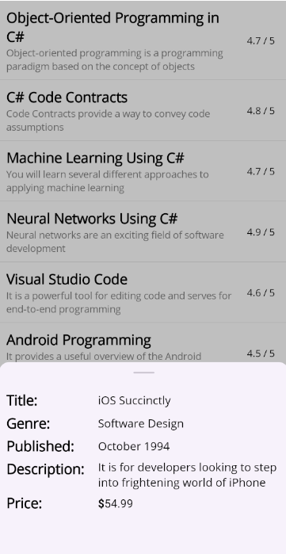

# Getting Started with .NET MAUI Bottom Sheet

This section provides a quick overview of how to get started with the [BottomSheet](https://help.syncfusion.com/cr/maui-toolkit/Syncfusion.Maui.Toolkit.BottomSheet.SfBottomSheet.html) for .NET MAUI and a walk-through to configure the .NET MAUI Bottom Sheet in a real-time scenario. Follow the steps below to add .NET MAUI Bottom Sheet to your project.

To quickly get started with the .NET MAUI Bottom Sheet, watch this video.





## Prerequisites

Before proceeding, ensure the following are set up:

1. Install [.NET 8 SDK](https://dotnet.microsoft.com/en-us/download/dotnet/8.0) or later is installed.
2. Set up a .NET MAUI environment with Visual Studio 2022 (v17.8 or later).

## Step 1: Create a new .NET MAUI project

1. Go to **File > New > Project** and choose the **.NET MAUI App** template.
2. Name the project and choose a location. Then, click **Next.**
3. Select the .NET framework version and click **Create.**

## Step 2: Install the Syncfusion® MAUI Toolkit Package

1. In **Solution Explorer,** right-click the project and choose **Manage NuGet Packages.**
2. Search for [Syncfusion.Maui.Toolkit](https://www.nuget.org/packages/Syncfusion.Maui.Toolkit/) and install the latest version.
3. Ensure the necessary dependencies are installed correctly, and the project is restored.

## Step 3: Register the handler

In the MauiProgram.cs file, register the handler for Syncfusion® Toolkit.



using Syncfusion.Maui.Toolkit.Hosting;

public static class MauiProgram
{
    public static MauiApp CreateMauiApp()
    {
        var builder = MauiApp.CreateBuilder();
        builder
            .ConfigureSyncfusionToolkit()
            .UseMauiApp<App>()
            .ConfigureFonts(fonts =>
            {
                fonts.AddFont("OpenSans-Regular.ttf", "OpenSansRegular");
                fonts.AddFont("OpenSans-Semibold.ttf", "OpenSansSemibold");
            });

        return builder.Build();
    }
}




## Step 4: Add a Basic BottomSheet

1. To initialize the control, import the `Syncfusion.Maui.Toolkit.BottomSheet` namespace into your code.

2. Initialize [SfBottomSheet](https://help.syncfusion.com/cr/maui-toolkit/Syncfusion.Maui.Toolkit.BottomSheet.SfBottomSheet.html).




<bottomSheet:SfBottomSheet x:Name="bottomSheet">
    <bottomSheet:SfBottomSheet.BottomSheetContent>
        <!--Add your content here-->
    </bottomSheet:SfBottomSheet.BottomSheetContent>
</bottomSheet:SfBottomSheet>




SfBottomSheet bottomSheet = new SfBottomSheet();







## Prerequisites

Before proceeding, ensure the following are set up:

1. Install [.NET 8 SDK](https://dotnet.microsoft.com/en-us/download/dotnet/8.0) or later is installed.
2. Set up a .NET MAUI environment with Visual Studio Code.
3. Ensure that the .NET MAUI extension is installed and configured as described [here.](https://learn.microsoft.com/en-us/dotnet/maui/get-started/installation?view=net-maui-8.0&tabs=visual-studio-code)

## Step 1: Create a new .NET MAUI project

1. Open the command palette by pressing `Ctrl+Shift+P` and type **.NET:New Project** and enter.
2. Choose the **.NET MAUI App** template.
3. Select the project location, type the project name and press **Enter.**
4. Then choose **Create project.**

## Step 2: Install the Syncfusion® MAUI Toolkit Package

1. Press <kbd>Ctrl</kbd> + <kbd>`</kbd> (backtick) to open the integrated terminal in Visual Studio Code.
2. Ensure you're in the project root directory where your .csproj file is located.
3. Run the command `dotnet add package Syncfusion.Maui.Toolkit` to install the Syncfusion® .NET MAUI Toolkit NuGet package.
4. To ensure all dependencies are installed, run `dotnet restore`.

## Step 3: Register the handler

In the MauiProgram.cs file, register the handler for Syncfusion® Toolkit.



using Syncfusion.Maui.Toolkit.Hosting;

public static class MauiProgram
{
    public static MauiApp CreateMauiApp()
    {
        var builder = MauiApp.CreateBuilder();
        builder
            .ConfigureSyncfusionToolkit()
            .UseMauiApp<App>()
            .ConfigureFonts(fonts =>
            {
                fonts.AddFont("OpenSans-Regular.ttf", "OpenSansRegular");
                fonts.AddFont("OpenSans-Semibold.ttf", "OpenSansSemibold");
            });

        return builder.Build();
    }
}


 

## Step 4: Add a Basic BottomSheet

1. To initialize the control, import the `Syncfusion.Maui.Toolkit.BottomSheet` namespace into your code.

2. Initialize [SfBottomSheet](https://help.syncfusion.com/cr/maui-toolkit/Syncfusion.Maui.Toolkit.BottomSheet.SfBottomSheet.html).




<bottomSheet:SfBottomSheet x:Name="bottomSheet">
    <bottomSheet:SfBottomSheet.BottomSheetContent>
        <!--Add your content here-->
    </bottomSheet:SfBottomSheet.BottomSheetContent>
</bottomSheet:SfBottomSheet>




SfBottomSheet bottomSheet = new SfBottomSheet();







## Add a BottomSheet with Detailed Content
The following code demonstrates how to add a bottom sheet that displays detailed book information. It uses a ViewModel for effective data binding to ensure seamless updates and interaction.

### Model
Create a simple data model as shown in the following code example, and save it as Book.cs file.




public class Book
{
    public string Title { get; set; } = string.Empty;
    public string Genre { get; set; } = string.Empty;
    public string Published { get; set; } = string.Empty;
    public string Description { get; set; } = string.Empty;
    public double Rating { get; set; }
    public decimal Price { get; set; }
}




### View Model
Next, create a model repository class with Books collection property initialized with required number of data objects in a new class file as shown in the following code example, and save it as BookViewModel.cs file:




public class BookViewModel
{
    private ObservableCollection<Book>? _books;

    public ObservableCollection<Book>? Books
    {
        get => _books;
        set
        {
            _books = value;
        }
    }

    public BookViewModel()
    {
        Books = new ObservableCollection<Book>
        {
            new Book
            {
                Title = "Object-Oriented Programming in C#",
                Genre = "Programming, Software Development",
                Published = "July 2023",
                Description = "Object-oriented programming is a programming paradigm based on the concept of objects",
                Rating = 4.7,
                Price = 49.99
            },
            new Book
            {
                Title = "C# Code Contracts",
                Genre = "Programming",
                Published = "March 2019",
                Description = "Code Contracts provide a way to convey code assumptions",
                Rating = 4.8,
                Price = 39.99
            },
            new Book
            {
                Title = "Machine Learning Using C#",
                Genre = "Programming, Software Engineering",
                Published = "August 2008",
                Description = "You will learn several different approaches to applying machine learning",
                Rating = 4.7,
                Price = 34.99
            },
            new Book
            {
                Title = "Neural Networks Using C#",
                Genre = "Programming",
                Published = "October 1999",
                Description = "Neural networks are an exciting field of software development",
                Rating = 4.9,
                Price = 49.99
            },
            new Book
            {
                Title = "Visual Studio Code",
                Genre = "Software Development",
                Published = "November 2018",
                Description = "It is a powerful tool for editing code and serves for end-to-end programming",
                Rating = 4.6,
                Price = 45.99
            },
            new Book
            {
                Title = "Android Programming",
                Genre = "Algorithms, Computer Science",
                Published = "July 2009",
                Description = "It provides a useful overview of the Android application life cycle",
                Rating = 4.5,
                Price = 94.99
            },
            new Book
            {
                Title = "iOS Succinctly",
                Genre = "Software Design",
                Published = "October 1994",
                Description = "It is for developers looking to step into frightening world of iPhone",
                Rating = 4.8,
                Price = 54.99
            },
            new Book
            {
                Title = "Visual Studio 2015",
                Genre = "Programming, Software Design",
                Published = "October 2004",
                Description = "The new version of the widely-used integrated development environment",
                Rating = 4.7,
                Price = 44.99
            },
            new Book
            {
                Title = "Xamarin.Forms",
                Genre = "Software Design, Software Engineering",
                Published = "August 2003",
                Description = "It creates mappings from its C# classes and controls directly",
                Rating = 4.6,
                Price = 49.99
            },
            new Book
            {
                Title = "Windows Store Apps",
                Genre = "Programming, Web Development",
                Published = "March 2023",
                Description = "Windows Store apps present a radical shift in Windows development",
                Rating = 4.9,
                Price = 59.99
            }
        };
    }
}







<ContentPage
    xmlns:local="clr-namespace:BottomSheetGettingStarted.ViewModel"
    xmlns:bottomSheet="clr-namespace:Syncfusion.Maui.Toolkit.BottomSheet;assembly=Syncfusion.Maui.Toolkit">
   <Grid>
        <Grid.BindingContext>
            <local:BookViewModel />
        </Grid.BindingContext>
        <ListView ItemsSource="{Binding Books}" ItemTapped="ListView_ItemTapped" HasUnevenRows="True">
            <ListView.ItemTemplate>
                <DataTemplate>
                    <ViewCell>
                        <Grid ColumnDefinitions="*, 60" Padding="10">
                            <VerticalStackLayout>
                                <Label Text="{Binding Title}" FontSize="20" FontAttributes="Bold"/>
                                <Label Text="{Binding Description}" FontSize="14" TextColor="Gray"/>
                            </VerticalStackLayout>
                            <Label Text="{Binding Rating, StringFormat='{}{0} / 5'}" Grid.Column="1" HorizontalOptions="Center" VerticalOptions="Center"/>
                        </Grid>
                    </ViewCell>
                </DataTemplate>
            </ListView.ItemTemplate>
        </ListView>
        <bottomSheet:SfBottomSheet x:Name="bottomSheet" CornerRadius="15, 15, 0, 0" HalfExpandedRatio="0.35" ContentPadding="10">
            <bottomSheet:SfBottomSheet.BottomSheetContent>
                <VerticalStackLayout Spacing="5" x:Name="bottomSheetContent">
                    <Grid ColumnDefinitions="120, *" ColumnSpacing="10">
                        <Label Text="Title:" FontSize="20" FontAttributes="Bold"/>
                        <Label Text="{Binding Title}" FontSize="16" VerticalTextAlignment="Center" Grid.Column="1"/>
                    </Grid>
                    <Grid ColumnDefinitions="120, *" ColumnSpacing="10">
                        <Label Text="Genre:" FontSize="20" FontAttributes="Bold"/>
                        <Label Text="{Binding Genre}" FontSize="16" VerticalTextAlignment="Center" Grid.Column="1"/>
                    </Grid>
                    <Grid ColumnDefinitions="120, *" ColumnSpacing="10">
                        <Label Text="Published:" FontSize="20" FontAttributes="Bold"/>
                        <Label Text="{Binding Published}" FontSize="16" VerticalTextAlignment="Center" Grid.Column="1"/>
                    </Grid>
                    <Grid ColumnDefinitions="120, *" ColumnSpacing="10">
                        <Label Text="Description:" FontSize="20" FontAttributes="Bold"/>
                        <Label Text="{Binding Description}" FontSize="16" VerticalTextAlignment="Center" Grid.Column="1"/>
                    </Grid>
                    <Grid ColumnDefinitions="120, *" ColumnSpacing="10">
                        <Label Text="Price:" FontSize="20" FontAttributes="Bold"/>
                        <Label FontSize="16" VerticalTextAlignment="Center" Grid.Column="1">
                            <Label.FormattedText>
                                <FormattedString>
                                    
                                    
                                </FormattedString>
                            </Label.FormattedText>
                        </Label>
                    </Grid>
                </VerticalStackLayout>
            </bottomSheet:SfBottomSheet.BottomSheetContent>
        </bottomSheet:SfBottomSheet>
    </Grid>
</ContentPage>
    



private void OnListViewItemTapped(object? sender, ItemTappedEventArgs e)
{
    bottomSheet.BottomSheetContent.BindingContext = e.Item;
    bottomSheet.Show();
}




N> Using [Content](https://help.syncfusion.com/cr/maui-toolkit/Syncfusion.Maui.Toolkit.BottomSheet.SfBottomSheet.html#Syncfusion_Maui_Toolkit_BottomSheet_SfBottomSheet_Content), Place the main content inside the bottom sheet's `Content` property. Without using `Content`, Place the main content outside the [BottomSheet](https://help.syncfusion.com/cr/maui-toolkit/Syncfusion.Maui.Toolkit.BottomSheet.SfBottomSheet.html), making sure the bottom sheet is the last element in the Grid layout.

