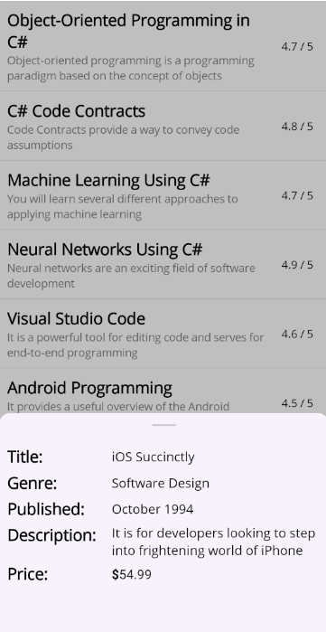

# Getting Started with .NET MAUI Bottom Sheet

This section provides a comprehensive overview of how to get started with the [Bottom Sheet](https://help.syncfusion.com/cr/maui-toolkit/Syncfusion.Maui.Toolkit.BottomSheet.SfBottomSheet.html) for .NET MAUI and illustrates how to configure the .NET MAUI Bottom Sheet in a real-time scenario. Follow the steps below to add the .NET MAUI Bottom Sheet to your project.

To quickly get started with the .NET MAUI Bottom Sheet, watch this video.





## Prerequisites

Before proceeding, ensure the following are set up:

1. Install [.NET 9 SDK](https://dotnet.microsoft.com/en-us/download/dotnet/9.0) or later.
2. Set up a .NET MAUI environment with Visual Studio 2022 v17.12 or later.

## Step 1: Create a new .NET MAUI project

1. Go to **File > New > Project** and choose the **.NET MAUI App** template.
2. Name the project and choose a location. Then click **Next**.
3. Select the .NET framework version and click **Create**.

## Step 2: Install the Syncfusion&reg; .NET MAUI Toolkit NuGet package

1. In **Solution Explorer,** right-click the project and choose **Manage NuGet Packages.**
2. Search for [Syncfusion.Maui.Toolkit](https://www.nuget.org/packages/Syncfusion.Maui.Toolkit/) and install the latest version.
3. Ensure the necessary dependencies are installed correctly, and the project is restored.




## Prerequisites

Before proceeding, ensure the following are set up:

1. Install [.NET 9 SDK](https://dotnet.microsoft.com/en-us/download/dotnet/9.0) or later.
2. Set up a .NET MAUI environment with Visual Studio Code.
3. Ensure that the .NET MAUI workloads are installed and configured as described [here](https://learn.microsoft.com/en-us/dotnet/maui/get-started/installation?view=net-maui-9.0&tabs=visual-studio-code).

## Step 1: Create a new .NET MAUI project

1. Open the command palette by pressing `Ctrl+Shift+P` and type **.NET:New Project** and enter.
2. Choose the **.NET MAUI App** template.
3. Select the project location, type the project name and press **Enter**.
4. Then choose **Create project.**

## Step 2: Install the Syncfusion&reg; .NET MAUI Toolkit NuGet package

1. Press <kbd>Ctrl</kbd> + <kbd>`</kbd> (backtick) to open the integrated terminal in Visual Studio Code.
2. Ensure you're in the project root directory where your .csproj file is located.
3. Run the command `dotnet add package Syncfusion.Maui.Toolkit` to install the Syncfusion® .NET MAUI Toolkit NuGet package.
4. To ensure all dependencies are installed, run `dotnet restore`.




## Prerequisites

Before proceeding, ensure the following are set up:

1. Install [.NET 9 SDK](https://dotnet.microsoft.com/en-us/download/dotnet/9.0) or later.
2. Set up a .NET MAUI environment with JetBrains Rider 2024.3 or later.
3. Make sure the MAUI workloads are installed and configured as described [here.](https://www.jetbrains.com/help/rider/MAUI.html#before-you-start)

## Step 1: Create a new .NET MAUI project

1. Go to **File > New Solution,** Select .NET (C#) and choose the .NET MAUI App template.
2. Enter the Project Name, Solution Name, and Location.
3. Select the .NET framework version and click Create.

## Step 2: Install the Syncfusion® MAUI Toolkit NuGet package

1. In **Solution Explorer,** right-click the project and choose **Manage NuGet Packages.**
2. Search for [Syncfusion.Maui.Toolkit](https://www.nuget.org/packages/Syncfusion.Maui.Toolkit/) and install the latest version.
3. Ensure the necessary dependencies are installed correctly, and the project is restored. If not, Open the Terminal in Rider and manually run: `dotnet restore`




## Step 3: Register Syncfusion handler
 
Make sure to add the namespace.
 


using Syncfusion.Maui.Toolkit.Hosting;


 
Register the Syncfusion toolkit handler in your `CreateMauiApp` method of `MauiProgram.cs` file to use Syncfusion controls.
 


builder.ConfigureSyncfusionToolkit();



## Step 4: Create Model

The following code demonstrates how to add a Bottom Sheet that displays detailed book information. It uses a ViewModel for effective data binding to ensure seamless updates and interaction.

Create a simple data model and save it as `Book.cs` file.




public class Book
{
    public string Title { get; set; } = string.Empty;
    public string Genre { get; set; } = string.Empty;
    public string Published { get; set; } = string.Empty;
    public string Description { get; set; } = string.Empty;
    public double Rating { get; set; }
    public decimal Price { get; set; }
}




## Step 5: Initialize View Model
Create a model repository class with a `Books` collection property initialized with a set of data objects, and save it as `BookViewModel.cs` file:




public class BookViewModel
{
    private ObservableCollection<Book>? _books;

    public ObservableCollection<Book>? Books
    {
        get => _books;
        set
        {
            _books = value;
        }
    }

    public BookViewModel()
    {
        Books = new ObservableCollection<Book>
        {
            new Book
            {
                Title = "Object-Oriented Programming in C#",
                Genre = "Programming, Software Development",
                Published = "July 2023",
                Description = "Object-oriented programming is a programming paradigm based on the concept of objects",
                Rating = 4.7,
                Price = 49.99
            },
            new Book
            {
                Title = "C# Code Contracts",
                Genre = "Programming",
                Published = "March 2019",
                Description = "Code Contracts provide a way to convey code assumptions",
                Rating = 4.8,
                Price = 39.99
            },
            new Book
            {
                Title = "Machine Learning Using C#",
                Genre = "Programming, Software Engineering",
                Published = "August 2008",
                Description = "You will learn several different approaches to applying machine learning",
                Rating = 4.7,
                Price = 34.99
            },
            // Add more items
        };
    }
}




## Step 6: Import BottomSheet namespace

Add the following namespace in your XAML or C#.



xmlns:bottomSheet="clr-namespace:Syncfusion.Maui.Toolkit.BottomSheet;assembly=Syncfusion.Maui.Toolkit"




using Syncfusion.Maui.Toolkit.BottomSheet;




## Step 7: Add the Bottom Sheet component

Initialize the `Bottom Sheet` component with properties and events.




<Grid>
    <Grid.BindingContext>
        <local:BookViewModel />
    </Grid.BindingContext>
    <ListView ItemsSource="{Binding Books}" ItemTapped="ListView_ItemTapped" HasUnevenRows="True">
        <ListView.ItemTemplate>
            <DataTemplate>
                <ViewCell>
                    <Grid ColumnDefinitions="*, 60" Padding="10">
                        <VerticalStackLayout>
                            <Label Text="{Binding Title}" FontSize="20" FontAttributes="Bold"/>
                            <Label Text="{Binding Description}" FontSize="14" TextColor="Gray"/>
                        </VerticalStackLayout>
                        <Label Text="{Binding Rating, StringFormat='{}{0} / 5'}" Grid.Column="1" />
                    </Grid>
                </ViewCell>
            </DataTemplate>
        </ListView.ItemTemplate>
    </ListView>
    <bottomSheet:SfBottomSheet x:Name="bottomSheet" CornerRadius="15, 15, 0, 0" HalfExpandedRatio="0.35" ContentPadding="10">
        <bottomSheet:SfBottomSheet.BottomSheetContent>
            <VerticalStackLayout Spacing="5" x:Name="bottomSheetContent">
                <Grid ColumnDefinitions="120, *" ColumnSpacing="10">
                    <Label Text="Title:" FontSize="20" FontAttributes="Bold"/>
                    <Label Text="{Binding Title}" FontSize="16" VerticalTextAlignment="Center" Grid.Column="1"/>
                </Grid>
                <Grid ColumnDefinitions="120, *" ColumnSpacing="10">
                    <Label Text="Genre:" FontSize="20" FontAttributes="Bold"/>
                    <Label Text="{Binding Genre}" FontSize="16" VerticalTextAlignment="Center" Grid.Column="1"/>
                </Grid>
                <!--Add more items -->
            </VerticalStackLayout>
        </bottomSheet:SfBottomSheet.BottomSheetContent>
    </bottomSheet:SfBottomSheet>
</Grid>
    



private void OnListViewItemTapped(object? sender, ItemTappedEventArgs e)
{
    bottomSheet.BottomSheetContent.BindingContext = e.Item;
    bottomSheet.Show();
}




N> Using [Content](https://help.syncfusion.com/cr/maui-toolkit/Syncfusion.Maui.Toolkit.BottomSheet.SfBottomSheet.html#Syncfusion_Maui_Toolkit_BottomSheet_SfBottomSheet_Content), place the main content inside the Bottom Sheet's `Content` property. Without using `Content`, place the main content outside the [BottomSheet](https://help.syncfusion.com/cr/maui-toolkit/Syncfusion.Maui.Toolkit.BottomSheet.SfBottomSheet.html), ensuring that the Bottom Sheet is the last element in the Grid layout.

You can download the Bottom Sheet Getting Started sample from [here](https://github.com/SyncfusionExamples/Getting-Started-with-MAUI-Bottom-Sheet).