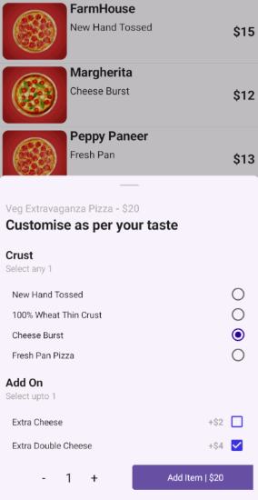

# .NET MAUI Bottom Sheet (SfBottomSheet) Overview

A `BottomSheet` control is a user interface component used in mobile and desktop applications that slides up from the bottom of the screen to display supplementary content or actions, allowing users to interact with additional information without navigating away from the main screen.

## Key Features

* `State` – Supports different states: FullExpanded, HalfExpanded, Collapsed, and Hidden.

* `AllowedState` – Supports allowed states: FullExpanded, HalfExpanded, and All.

* `PopupMode` – The Bottom Sheet acts as a dialog page when setting `IsModal` to `true`, blocking interaction with the rest of the app’s UI.