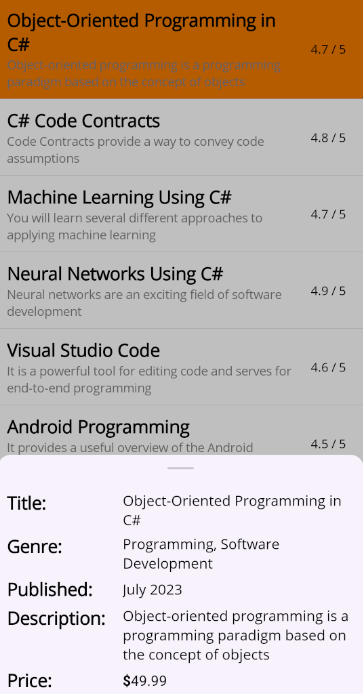

# .NET MAUI Bottom Sheet (SfBottomSheet) Overview

The BottomSheet for .NET MAUI is a simple component to display a sliding sheet in the application. It consists of a content area that slides up from the bottom of the screen to show additional options or information. The Sheet can be opened by programmatically.

## Key Features

* BottomSheet states – Supports different states: FullExpanded, HalfExpanded, Collapsed, and Hidden.

* BottomSheet allowStates – Supports allowed states: FullExpanded, HalfExpanded, and All.