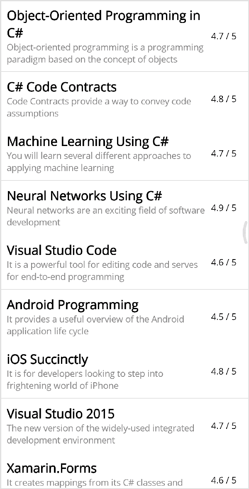

# Toggle methods in .NET MAUI Bottom Sheet (SfBottomSheet)

Bottom sheet can be toggled using

* IsOpen property
* Show method
* Close method

## Opening and Closing Sheet Programmatically using property

The `IsOpen` property enables programatically opening or closing the bottom sheet. By default, the IsOpen property is set to `false`.





<Grid>
    <bottomSheet:SfBottomSheet IsOpen="True">
        <bottomSheet:SfBottomSheet.BottomSheetContent>
            <Label Text="Bottom Sheet Content" VerticalOptions="Center" HorizontalOptions="Center" FontSize="14" />
        </bottomSheet:SfBottomSheet.BottomSheetContent>
    </bottomSheet:SfBottomSheet>
</Grid>




Grid grid = new Grid();
SfBottomSheet bottomSheet = new SfBottomSheet();
bottomSheet.IsOpen = true;
Label label = new Label()
{
    Text = "Bottom Sheet Content",
    FontSize = 14,
    VerticalOptions = LayoutOptions.Center,
    HorizontalOptions = LayoutOptions.Center,
};
bottomSheet.BottomSheetContent = label;
grid.Children.Add(bottomSheet);
Content = grid;




## Opening and Closing Sheet Programmatically using method
The `Show` method enables programmatically opening the bottom sheet, and the `Close` method enables programmatically closing the bottom sheet.





<Grid>
    <VerticalStackLayout Padding="20">
       <Button Text="Open Bottom Sheet" Clicked="OpenBottomSheet" WidthRequest="180" CornerRadius="30"/>
    </VerticalStackLayout>
    <bottomSheet:SfBottomSheet x:Name="bottomSheet">
        <bottomSheet:SfBottomSheet.BottomSheetContent>
            <Button Text="Close Bottom Sheet" Clicked="CloseBottomSheet" HeightRequest="50" WidthRequest="180" CornerRadius="30"/>
        </bottomSheet:SfBottomSheet.BottomSheetContent>
    </bottomSheet:SfBottomSheet>
</Grid>




Grid grid = new Grid();
VerticalStackLayout verticalStack = new VerticalStackLayout
{
    Padding = new Thickness(20)
};

Button openButton = new Button
{
    Text = "Open Bottom Sheet",
    WidthRequest = 180,
    CornerRadius = 30,
};

openButton.Clicked += OpenBottomSheet;
verticalStack.Children.Add(openButton);
grid.Children.Add(verticalStack);
SfBottomSheet bottomSheet = new SfBottomSheet();
Button closeButton = new Button
{
    Text = "Close Bottom Sheet",
    HeightRequest = 50,
    WidthRequest = 180,
    CornerRadius = 30,
};

closeButton.Clicked += CloseBottomSheet;
bottomSheet.BottomSheetContent = closeButton;
grid.Children.Add(bottomSheet);
Content = grid;




Using `Show` and `Close` methods,



private void OpenBottomSheet(object sender, EventArgs e)
{
    bottomSheet.Show();
}

private void CloseBottomSheet(object sender, EventArgs e)
{
    bottomSheet.Close();
}



