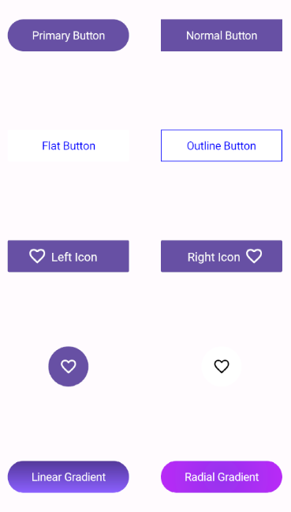

# .NET MAUI Button (SfButton) Overview

The .NET MAUI Button is a custom button control with UI customization. Set icons, background images, and corner edge radii and customize the appearance for different visual states using the visual state manager.

## Key features

 * Button Customization: Easily customize a button as outline, flat, circular, or icon types.
 * Visual States: Utilize states like normal, pressed, checked and disabled.
 * Background Image: Set an image as the button's background.
 * Custom Content: Display personalized content within the button control.
 * Toggle Button: Implement toggle button functionality.

