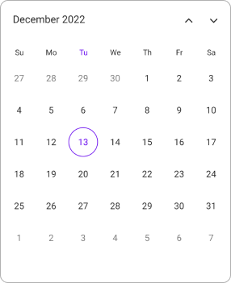
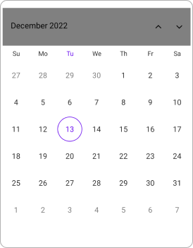
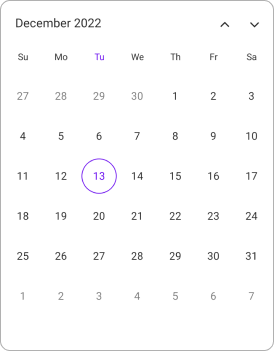
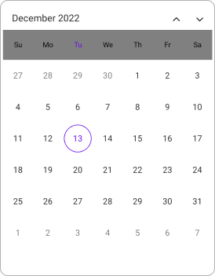
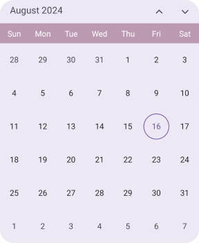

# Headers in .NET MAUI Calendar (SfCalendar)
You can customize all the properties of the Header view using [HeaderView](https://help.syncfusion.com/cr/maui-toolkit/Syncfusion.Maui.Toolkit.Calendar.SfCalendar.html#Syncfusion_Maui_Calendar_SfCalendar_HeaderView). By using this property, you can customize the Background, Height, TextFormat, TextStyle, and ShowNavigationArrows of the Calendar.

## Customize the header height
You can customize the header height `Calendar` by using the `Height` property.




<calendar:SfCalendar  x:Name="calendar"
                      View="Month">
            <Calendar:SfCalendar.HeaderView>
                <Calendar:CalendarHeaderView Height="70" />
            </Calendar:SfCalendar.HeaderView>
</calendar:SfCalendar>




this.calendar.HeaderView.Height = 70;




## Header appearance
You can customize the header style of the `Calendar` by using the [Background](https://help.syncfusion.com/cr/maui-toolkit/Syncfusion.Maui.Toolkit.Calendar.CalendarHeaderView.html#Syncfusion_Maui_Calendar_CalendarHeaderView_Background), [TextStyle](https://help.syncfusion.com/cr/maui-toolkit/Syncfusion.Maui.Toolkit.Calendar.CalendarHeaderView.html#Syncfusion_Maui_Calendar_CalendarHeaderView_TextStyle), and [TextFormat](https://help.syncfusion.com/cr/maui-toolkit/Syncfusion.Maui.Toolkit.Calendar.CalendarHeaderView.html#Syncfusion_Maui_Calendar_CalendarHeaderView_TextFormat) properties of [ShowNavigationArrows](https://help.syncfusion.com/cr/maui-toolkit/Syncfusion.Maui.Toolkit.Calendar.CalendarHeaderView.html#Syncfusion_Maui_Calendar_CalendarHeaderView_ShowNavigationArrows).




<calendar:SfCalendar  x:Name="calendar"
                      View="Month">
            <Calendar:SfCalendar.HeaderView>
                <Calendar:CalendarHeaderView Background="Grey" TextFormat="MMM yy" ShowNavigationArrows="True">
                    <Calendar:CalendarHeaderView.TextStyle>
                        <Calendar:CalendarTextStyle TextColor="Black" FontSize="14" />
                    </Calendar:CalendarHeaderView.TextStyle>
                </Calendar:CalendarHeaderView>
            </Calendar:SfCalendar.HeaderView>
</calendar:SfCalendar>




CalendarTextStyle textStyle = new CalendarTextStyle()
{
    TextColor = Colors.Black,
    FontSize = 14,
};

this.calendar.HeaderView = new CalendarHeaderView()
{
    Background = Colors.Grey,
    TextFormat = "MMM yy",
    ShowNavigationArrows = true,
    TextStyle = textStyle,
};




## Header appearance using DataTemplate

You can customize the header appearance by using the [HeaderTemplate](https://help.syncfusion.com/cr/maui-toolkit/Syncfusion.Maui.Toolkit.Calendar.SfCalendar.html#Syncfusion_Maui_Calendar_SfCalendar_HeaderTemplate) in the [SfCalendar](https://help.syncfusion.com/cr/maui-toolkit/Syncfusion.Maui.Toolkit.Calendar.SfCalendar.html). 




  <Calendar:SfCalendar x:Name="calendar" 
                         View="Month">
        <Calendar:SfCalendar.HeaderTemplate>
            <DataTemplate>
                <Grid Background = "#987D9A">
                    <Label x:Name="label" TextColor="White" HorizontalOptions="Center" VerticalOptions="Start">
                        <Label.Text>
                            <MultiBinding StringFormat = "{}{0:MMM dd, yyyy} - {1:MMM dd, yyyy}">
                                <Binding Path="StartDateRange" />
                                <Binding Path = "EndDateRange" />
                            </MultiBinding>
                        </Label.Text>
                    </Label>
                    <Label  HorizontalOptions="Center" VerticalOptions="End" Text="{Binding Text}" TextColor="White" />
                </Grid>
            </DataTemplate>
        </Calendar:SfCalendar.HeaderTemplate>
 </Calendar:SfCalendar>




## Header appearance using DataTemplateSelector

You can customize the header appearance by using the [HeaderTemplate](https://help.syncfusion.com/cr/maui-toolkit/Syncfusion.Maui.Toolkit.Calendar.SfCalendar.html#Syncfusion_Maui_Calendar_SfCalendar_HeaderTemplate) in the [SfCalendar](https://help.syncfusion.com/cr/maui-toolkit/Syncfusion.Maui.Toolkit.Calendar.SfCalendar.html). The `DataTemplateSelector` allows you to choose a `DataTemplate` at runtime based on the value bound to the calendar header. This lets you select a different data template for each header and customize the appearance of a specific header based on certain conditions.




 <Grid>
    <Grid.Resources>
        <DataTemplate x:Key="todayDatesTemplate">
            <Grid Background = "LightBlue" >
                <Label x:Name="label" HorizontalOptions="Center" VerticalOptions="Center">
                    <Label.Text>
                        <MultiBinding StringFormat = "{}{0:MMM dd, yyyy} - {1:MMM dd, yyyy}" >
                            <Binding Path="StartDateRange" />
                            <Binding Path = "EndDateRange" />
                        </MultiBinding>
                    </Label.Text>
                </Label>
                <Label HorizontalOptions="Center" VerticalOptions="End" Text="{Binding Text}" TextColor="Red" />
            </Grid>
        </DataTemplate>
        <DataTemplate x:Key="normaldatesTemplate">
            <Grid Background = "LightGreen" >
                <Label x:Name="label" HorizontalOptions="Center" VerticalOptions="Center">
                    <Label.Text>
                        <MultiBinding StringFormat = "{}{0:MMM dd, yyyy} - {1:MMM dd, yyyy}" >
                            <Binding Path="StartDateRange" />
                            <Binding Path = "EndDateRange" />
                        </MultiBinding>
                    </Label.Text>
                </Label>
                <Label HorizontalOptions="Center" VerticalOptions="End" Text="{Binding Text}" TextColor="Orange" />
            </Grid>
        </DataTemplate>
        <local:HeaderTemplateSelector x:Key="headerTemplateSelector" TodayDatesTemplate="{StaticResource todayDatesTemplate}"  NormaldatesTemplate="{StaticResource normaldatesTemplate}" />
    </Grid.Resources>
    <Calendar:SfCalendar x:Name="calendar"
                           View="Month"
                           HeaderTemplate ="{StaticResource headerTemplateSelector}">
    </Calendar:SfCalendar>
 </Grid>




public class HeaderTemplateSelector : DataTemplateSelector
{
    public HeaderTemplateSelector()
    {
    }
    public DataTemplate TodayDatesTemplate { get; set; }
    public DataTemplate NormaldatesTemplate { get; set; }
    protected override DataTemplate OnSelectTemplate(object item, BindableObject container)
    {
        var headerDetails = item as CalendarHeaderDetails;
        if (headerDetails != null)
        {
            if (headerDetails.StartDateRange.Date <= DateTime.Now.Date && headerDetails.EndDateRange >= DateTime.Now.Date)
                return TodayDatesTemplate;
        }
        return NormaldatesTemplate;
    }
}

  


N>
* When using data template selector, performance issues occur as the conversion template views take time within the framework.

## View header
You can customize all the properties of the View Header using [HeaderView](https://help.syncfusion.com/cr/maui-toolkit/Syncfusion.Maui.Toolkit.Calendar.CalendarMonthView.html#Syncfusion_Maui_Calendar_CalendarMonthView_HeaderView). By using this property, you can customize the Background, Height, TextFormat, and TextStyle of the Calendar.

### Customize view header height
You can customize the view Header height `Calendar` by using the `Height` property.




<calendar:SfCalendar  x:Name="calendar"
                      View="Month">
            <Calendar:SfCalendar.MonthView>
                <Calendar:CalendarMonthView>
                    <Calendar:CalendarMonthView.HeaderView>
                        <Calendar:CalendarMonthHeaderView Height="50" />
                    </Calendar:CalendarMonthView.HeaderView>
                </Calendar:CalendarMonthView>
            </Calendar:SfCalendar.MonthView>
</calendar:SfCalendar>




this.calendar.MonthView.HeaderView.Height = 50;




### View header appearance
You can customize the view header style of the `Calendar` by using the [Background](https://help.syncfusion.com/cr/maui-toolkit/Syncfusion.Maui.Toolkit.Calendar.CalendarMonthHeaderView.html#Syncfusion_Maui_Calendar_CalendarMonthHeaderView_Background), [TextStyle](https://help.syncfusion.com/cr/maui-toolkit/Syncfusion.Maui.Toolkit.Calendar.CalendarMonthHeaderView.html#Syncfusion_Maui_Calendar_CalendarMonthHeaderView_TextStyle), and [TextFormat](https://help.syncfusion.com/cr/maui-toolkit/Syncfusion.Maui.Toolkit.Calendar.CalendarMonthHeaderView.html#Syncfusion_Maui_Calendar_CalendarMonthHeaderView_TextFormat) properties.




<calendar:SfCalendar  x:Name="calendar"
                      View="Month">
            <Calendar:SfCalendar.MonthView>
                <Calendar:CalendarMonthView>
                    <Calendar:CalendarMonthView.HeaderView>
                        <Calendar:CalendarMonthHeaderView Background="Grey" TextFormat="ddd">
                            <Calendar:CalendarMonthHeaderView.TextStyle>
                                <Calendar:CalendarTextStyle TextColor="Black" FontSize="14" />
                            </Calendar:CalendarMonthHeaderView.TextStyle>
                        </Calendar:CalendarMonthHeaderView>
                    </Calendar:CalendarMonthView.HeaderView>
                </Calendar:CalendarMonthView>
            </Calendar:SfCalendar.MonthView>
</calendar:SfCalendar>




CalendarTextStyle textStyle = new CalendarTextStyle()
{
    TextColor = Colors.Black,
    FontSize = 14,
};

this.calendar.MonthView.HeaderView = new CalendarMonthHeaderView
{
    Background = Colors.Grey,
    TextFormat = "ddd",
    TextStyle = textStyle,
};




### View header appearance using DataTemplate

You can customize the view header appearance by using the [MonthViewHeaderTemplate](https://help.syncfusion.com/cr/maui-toolkit/Syncfusion.Maui.Toolkit.Calendar.SfCalendar.html#Syncfusion_Maui_Calendar_SfCalendar_MonthViewHeaderTemplate) in the [SfCalendar](https://help.syncfusion.com/cr/maui-toolkit/Syncfusion.Maui.Toolkit.Calendar.SfCalendar.html).

  


 <Calendar:SfCalendar x:Name="calendar"
                        View="Month">
        <Calendar:SfCalendar.MonthViewHeaderTemplate>
            <DataTemplate>
                <Grid Background ="#BB9AB1" >
                    <Label x:Name="label" HorizontalOptions="Center" VerticalOptions="Center" Text="{Binding StringFormat='{0:ddd}'}" TextColor="White" FontSize="14" FontFamily="Bold" />
                </Grid>
            </DataTemplate>
        </Calendar:SfCalendar.MonthViewHeaderTemplate>
 </Calendar:SfCalendar>




### View header appearance using DataTemplateSelector

You can customize the view header appearance by using the [MonthViewHeaderTemplate](https://help.syncfusion.com/cr/maui-toolkit/Syncfusion.Maui.Toolkit.Calendar.SfCalendar.html#Syncfusion_Maui_Calendar_SfCalendar_MonthViewHeaderTemplate) in the [SfCalendar](https://help.syncfusion.com/cr/maui-toolkit/Syncfusion.Maui.Toolkit.Calendar.SfCalendar.html). The `DataTemplateSelector` allows you to choose a `DataTemplate` at runtime based on the value bound to the calendar view header. This lets you select a different data template for each view header and customize the appearance of a specific view header based on certain conditions.




 <Grid>
    <Grid.Resources>
        <DataTemplate x:Key="normaldatesTemplate">
            <Grid Background = "lightBlue">
                <Label x:Name="label" HorizontalOptions="Center" VerticalOptions="Center" Text="{Binding StringFormat='{0:ddd}'}"  TextColor="Red" />
            </Grid>
        </DataTemplate>
        <DataTemplate x:Key="todayDatesTemplate">
            <Grid Background = "LightGreen" >
                <Label x:Name="label" HorizontalOptions="Center" VerticalOptions="Center" Text="{Binding StringFormat='{0:ddd}'}"  TextColor="Orange" />
            </Grid>
        </DataTemplate>
        <local:MonthViewHeaderTemplateSelector x:Key="monthViewHeaderTemplateSelector"  TodayDatesTemplate="{StaticResource todayDatesTemplate}"  NormaldatesTemplate="{StaticResource normaldatesTemplate}" />
    </Grid.Resources>
    <Calendar:SfCalendar x:Name="calendar"
                           View="Month"
                           MonthViewHeaderTemplate ="{StaticResource monthViewHeaderTemplateSelector}">
    </Calendar:SfCalendar>
 </Grid>




public class MonthViewHeaderTemplateSelector : DataTemplateSelector
{
    public MonthViewHeaderTemplateSelector()
    {
    }
    public DataTemplate TodayDatesTemplate { get; set; }
    public DataTemplate NormaldatesTemplate { get; set; }
    protected override DataTemplate OnSelectTemplate(object item, BindableObject container)
    {
        var viewHeaderDetails = (DateTime)item;
        if (viewHeaderDetails.Date.Month == DateTime.Today)
            return TodayDatesTemplate;
        return NormaldatesTemplate;
    }
}

  


N>
* When using data template selector, performance issues occur as the conversion template views take time within the framework.