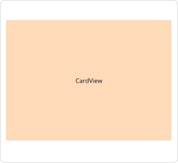
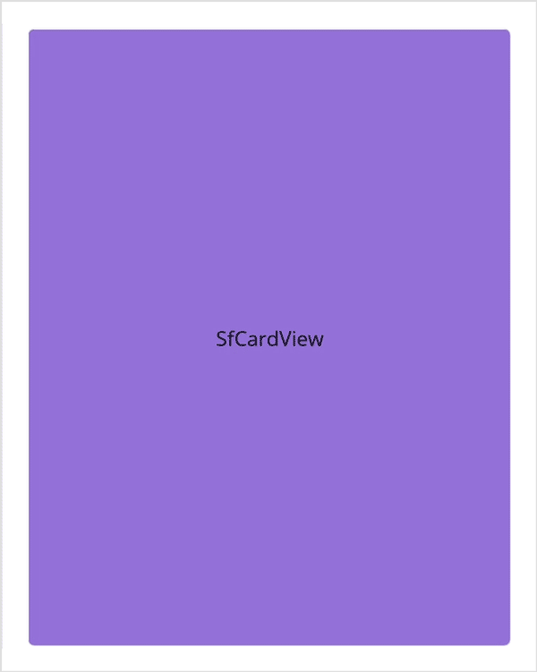
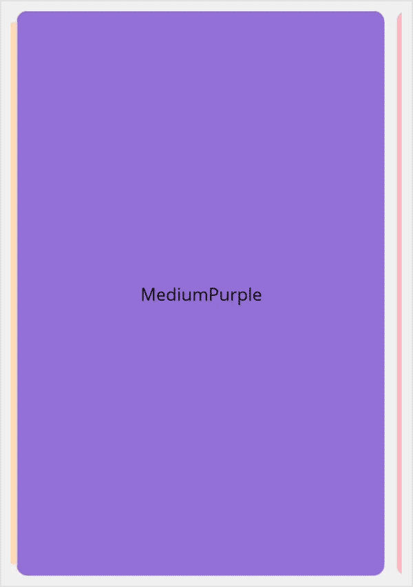

# Getting started with .NET MAUI Card
This section details the process of integrating the [Cards](https://www.syncfusion.com/maui-controls/maui-cards) control and focuses solely on the fundamental features required for initiating your exploration of Syncfusion&reg; Card. Follow the steps below to add a basic Cards to your project.




## Prerequisites

Before proceeding, ensure the following are set up:
1. Install [.NET 8 SDK](https://dotnet.microsoft.com/en-us/download/dotnet/8.0) or later is installed.
2. Set up a .NET MAUI environment with Visual Studio 2022 (v17.8 or later).

## Step 1: Create a New .NET MAUI Project

1. Go to **File > New > Project** and choose the **.NET MAUI App** template.
2. Name the project and choose a location. Then click **Next**.
3. Select the .NET framework version and click **Create**.

## Step 2: Install the Syncfusion&reg; MAUI Toolkit Package

1. In **Solution Explorer,** right-click the project and choose **Manage NuGet Packages.**
2. Search for [Syncfusion.Maui.Toolkit](https://www.nuget.org/packages/Syncfusion.Maui.Toolkit/) and install the latest version.
3. Ensure the necessary dependencies are installed correctly, and the project is restored.

## Step 3: Register the handler

In the **MauiProgram.cs** file, register the handler for Syncfusion&reg; toolkit.




using Syncfusion.Maui.Toolkit.Hosting;
namespace GettingStarted
{
    public static class MauiProgram
    {
        public static MauiApp CreateMauiApp()
        {
            var builder = MauiApp.CreateBuilder();

            builder.ConfigureSyncfusionToolkit();
            builder
            .UseMauiApp<App>()
            .ConfigureFonts(fonts =>
            {
                fonts.AddFont("OpenSans-Regular.ttf", "OpenSansRegular");
            });

            return builder.Build();
        }
    }
}




## Step 4: Add a basic Cards control

1. To initialize the control, import the `Syncfusion.Maui.Toolkit.Cards` namespace into your code.
2. Initialize [SfCards](https://help.syncfusion.com/cr/maui-toolkit/Syncfusion.Maui.Toolkit.Cards.html).




<ContentPage   
    . . .
    xmlns:cards="clr-namespace:Syncfusion.Maui.Toolkit.Cards;assembly=Syncfusion.Maui.Toolkit">

<cards:SfCardView>
    <Label Text="CardView" Background="PeachPuff" HorizontalTextAlignment="Center" VerticalTextAlignment="Center"/>
</cards:SfCardView>

</ContentPage>




using Syncfusion.Maui.Toolkit.Cards;
. . .

public partial class MainPage : ContentPage
{
    public MainPage()
    {
        InitializeComponent();
        SfCardView cardView = new SfCardView();

        cardView.Content = new Label()
        {
            Text = "CardView",
            HorizontalTextAlignment = TextAlignment.Center,
            VerticalTextAlignment = TextAlignment.Center,
            BackgroundColor = Colors.PeachPuff
        };
        this.Content = cardView;
    }
}







## Prerequisites

Before proceeding, ensure the following are set up:
1. Install [.NET 8 SDK](https://dotnet.microsoft.com/en-us/download/dotnet/8.0) or later is installed.
2. Set up a .NET MAUI environment with Visual Studio 2022 (v17.8 or later).
3. Ensure that the .NET MAUI extension is installed and configured as described [here.](https://learn.microsoft.com/en-us/dotnet/maui/get-started/installation?view=net-maui-8.0&tabs=visual-studio-code)

## Step 1: Create a New .NET MAUI Project

1. Open the command palette by pressing `Ctrl+Shift+P` and type **.NET:New Project** and enter.
2. Choose the **.NET MAUI App** template.
3. Select the project location, type the project name and press **Enter**.
4. Then choose **Create project.**

## Step 2: Install the Syncfusion&reg; MAUI Toolkit Package

1. Press <kbd>Ctrl</kbd> + <kbd>`</kbd> (backtick) to open the integrated terminal in Visual Studio Code.
2. Ensure you're in the project root directory where your .csproj file is located.
3. Run the command `dotnet add package Syncfusion.Maui.Cards` to install the Syncfusion® .NET MAUI Cards NuGet package.
4. To ensure all dependencies are installed, run `dotnet restore`.

## Step 3: Register the handler

In the **MauiProgram.cs** file, register the handler for Syncfusion&reg; toolkit.




using Syncfusion.Maui.Toolkit.Hosting;
namespace GettingStarted
{
    public static class MauiProgram
    {
        public static MauiApp CreateMauiApp()
        {
            var builder = MauiApp.CreateBuilder();

            builder.ConfigureSyncfusionToolkit();
            builder
            .UseMauiApp<App>()
            .ConfigureFonts(fonts =>
            {
                fonts.AddFont("OpenSans-Regular.ttf", "OpenSansRegular");
            });

            return builder.Build();
        }
    }
}




## Step 4: Add a basic Cards control

1. To initialize the control, import the `Syncfusion.Maui.Toolkit.Cards` namespace into your code.
2. Initialize [SfCards](https://help.syncfusion.com/cr/maui-toolkit/Syncfusion.Maui.Toolkit.Cards.html).




<ContentPage   
    . . .
    xmlns:cards="clr-namespace:Syncfusion.Maui.Toolkit.Cards;assembly=Syncfusion.Maui.Toolkit">

<cards:SfCardView>
    <Label Text="CardView" Background="PeachPuff" HorizontalTextAlignment="Center" VerticalTextAlignment="Center"/>
</cards:SfCardView>

</ContentPage>




using Syncfusion.Maui.Toolkit.Cards;
. . .

public partial class MainPage : ContentPage
{
    public MainPage()
    {
        InitializeComponent();
        SfCardView cardView = new SfCardView();

        cardView.Content = new Label()
        {
            Text = "CardView",
            HorizontalTextAlignment = TextAlignment.Center,
            VerticalTextAlignment = TextAlignment.Center,
            BackgroundColor = Colors.PeachPuff
        };
        this.Content = cardView;
    }
}







## SwipeToDismiss

The [SwipeToDismiss](https://help.syncfusion.com/cr/maui-toolkit/Syncfusion.Maui.Toolkit.Cards.SfCardView.html#Syncfusion_Maui_Toolkit_Cards_SfCardView_SwipeToDismiss) property enables or disables the swiping feature in SfCardView.




<cards:SfCardView SwipeToDismiss="true">
    <Label Text="SfCardView" Background="MediumPurple" HorizontalTextAlignment="Center" VerticalTextAlignment="Center"/>
</cards:SfCardView>




using Syncfusion.Maui.Toolkit.Cards;
. . .

public partial class MainPage : ContentPage
{
    public MainPage()
    {
        InitializeComponent();
        SfCardView cardView = new SfCardView();
        cardView.SwipeToDismiss = true;

        cardView.Content = new Label()
        {
            Text="SfCardView",
            HorizontalTextAlignment = TextAlignment.Center,
            VerticalTextAlignment = TextAlignment.Center,
            BackgroundColor = Colors.MediumPurple
        };
        this.Content = cardView;
    }
}


	

N> This property will not work when adding the SfCardView as a child of SfCardLayout.

## Dismiss the card programmatically

The [IsDismissed](https://help.syncfusion.com/cr/maui-toolkit/Syncfusion.Maui.Toolkit.Cards.SfCardView.html#Syncfusion_Maui_Toolkit_Cards_SfCardView_IsDismissed) property enables you to retrieve the view state of the card, and also provides the capability for the user to programmatically modify the card's view state.




<card:SfCardView IsDismissed="true">
     <Label Text="SfCardView"/>
</card:SfCardView>




using Syncfusion.Maui.Toolkit.Cards;
. . .

public partial class MainPage : ContentPage
{
    public MainPage()
    {
        InitializeComponent();
        SfCardView cardView = new SfCardView();
        cardView.IsDismissed = true;
        cardView.Content = new Label(){ Text="SfCardView" };
        this.Content = cardView;
    }
}


	

### SfCardLayout

Initialize a card layout with a card view using the provided code sample below.




<cards:SfCardLayout HeightRequest="500" BackgroundColor="#F0F0F0">

    <cards:SfCardView CornerRadius="10">
        <Label  Text="Peach" BackgroundColor="PeachPuff" VerticalTextAlignment="Center" HorizontalTextAlignment="Center"/>
    </cards:SfCardView>

    <cards:SfCardView CornerRadius="10">
        <Label  Text="MediumPurple" BackgroundColor="MediumPurple" VerticalTextAlignment="Center" HorizontalTextAlignment="Center"/>
    </cards:SfCardView>

    <cards:SfCardView CornerRadius="10" >
        <Label  Text="LightPink" BackgroundColor="LightPink" VerticalTextAlignment="Center" HorizontalTextAlignment="Center"/>
    </cards:SfCardView>

</cards:SfCardLayout>




using Syncfusion.Maui.Toolkit.Cards;
. . .

public partial class MainPage : ContentPage
{
	public MainPage()
	{
		InitializeComponent();
		SfCardLayout cardLayout = new SfCardLayout();

		//Add children for card layout 
		cardLayout.Children.Add(new SfCardView() { Content = new Label() { Text = "Peach", BackgroundColor = Colors.PeachPuff, HorizontalTextAlignment = TextAlignment.Center, VerticalTextAlignment = TextAlignment.Center }, CornerRadius = 15 });

		cardLayout.Children.Add(new SfCardView() { Content = new Label() { Text = "MediumPurple", BackgroundColor = Colors.MediumPurple, HorizontalTextAlignment = TextAlignment.Center, VerticalTextAlignment = TextAlignment.Center },CornerRadius = 15 });

		cardLayout.Children.Add(new SfCardView() { Content = new Label() { Text = "LightPink", BackgroundColor = Colors.LightPink, HorizontalTextAlignment = TextAlignment.Center, VerticalTextAlignment = TextAlignment.Center },CornerRadius = 15 });

		this.Content = cardLayout;
	}
}


	

