# Types of Axis in .NET MAUI Cartesian Chart

Cartesian chart supports the following types of chart axis:

* NumericalAxis
* CategoryAxis
* DateTimeAxis
* DateTimeCategoryAxis
* LogarithmicAxis

## Numerical Axis

[NumericalAxis](https://help.syncfusion.com/cr/maui-toolkit/Syncfusion.Maui.Toolkit.Charts.NumericalAxis.html) is used to plot numerical values to the chart. [NumericalAxis](https://help.syncfusion.com/cr/maui-toolkit/Syncfusion.Maui.Toolkit.Charts.NumericalAxis.html) can be defined for both [XAxes](https://help.syncfusion.com/cr/maui-toolkit/Syncfusion.Maui.Toolkit.Charts.SfCartesianChart.html#Syncfusion_Maui_Toolkit_Charts_SfCartesianChart_XAxes) and [YAxes](https://help.syncfusion.com/cr/maui-toolkit/Syncfusion.Maui.Toolkit.Charts.SfCartesianChart.html#Syncfusion_Maui_Toolkit_Charts_SfCartesianChart_YAxes).





<chart:SfCartesianChart>
    . . .
    <chart:SfCartesianChart.XAxes>
        <chart:NumericalAxis/>
    </chart:SfCartesianChart.XAxes>
    <chart:SfCartesianChart.YAxes>
        <chart:NumericalAxis/>
    </chart:SfCartesianChart.YAxes>
</chart:SfCartesianChart>





SfCartesianChart chart = new SfCartesianChart();
. . .
// Create a numerical axis for the X-axis
NumericalAxis primaryAxis = new NumericalAxis();
// Add the primary axis to the chart's XAxes collection
chart.XAxes.Add(primaryAxis);

// Create a numerical axis for the Y-axis
NumericalAxis secondaryAxis = new NumericalAxis();
// Add the secondary axis to the chart's YAxes collection
chart.YAxes.Add(secondaryAxis);

this.Content = chart;




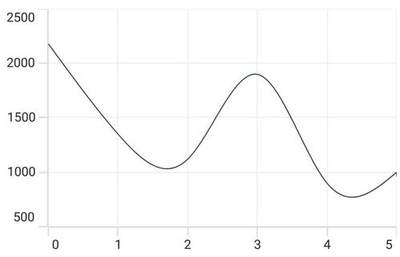

### Interval

Axis interval can be customized by using the [Interval](https://help.syncfusion.com/cr/maui-toolkit/Syncfusion.Maui.Toolkit.Charts.NumericalAxis.html#Syncfusion_Maui_Charts_NumericalAxis_Interval) property. By default, interval will be calculated based on the minimum and maximum value of the provided data.





<chart:SfCartesianChart>
    . . .
    <chart:SfCartesianChart.XAxes>
        <chart:NumericalAxis Interval="10"/>
    </chart:SfCartesianChart.XAxes>
    <chart:SfCartesianChart.YAxes>
        <chart:NumericalAxis/>
    </chart:SfCartesianChart.YAxes>
</chart:SfCartesianChart>





SfCartesianChart chart = new SfCartesianChart();
. . .
// Configure the primary axis for the X-axis with an interval of 10 units.
NumericalAxis primaryAxis = new NumericalAxis()
{
    Interval = 10, 
};
chart.XAxes.Add(primaryAxis);

NumericalAxis secondaryAxis = new NumericalAxis();
chart.YAxes.Add(secondaryAxis);

this.Content = chart;




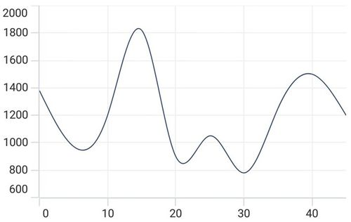

### Customizing the Range

[Maximum](https://help.syncfusion.com/cr/maui-toolkit/Syncfusion.Maui.Toolkit.Charts.NumericalAxis.html#Syncfusion_Maui_Toolkit_Charts_NumericalAxis_Maximum) and [Minimum](https://help.syncfusion.com/cr/maui-toolkit/Syncfusion.Maui.Toolkit.Charts.NumericalAxis.html#Syncfusion_Maui_Toolkit_Charts_NumericalAxis_Minimum) properties of axis are used for setting the maximum and minimum value of the axis range respectively.

N> If minimum or maximum value is set, the other value is calculated by default internally.





<chart:SfCartesianChart>
    . . .
    <chart:SfCartesianChart.YAxes>
      <chart:NumericalAxis Maximum="2750" Minimum="250" Interval="250"/>
    </chart:SfCartesianChart.YAxes>
    . . .
</chart:SfCartesianChart>




SfCartesianChart chart = new SfCartesianChart();

NumericalAxis secondaryAxis = new NumericalAxis()
{
    Maximum = 2750, // Set the maximum value for the axis
    Minimum = 250,  // Set the minimum value for the axis
    Interval = 250  // Set the interval between major tick marks on the axis
};
chart.YAxes.Add(secondaryAxis);

this.Content = chart;




## Category Axis

The [CategoryAxis](https://help.syncfusion.com/cr/maui-toolkit/Syncfusion.Maui.Toolkit.Charts.CategoryAxis.html) is an indexed based axis that plots values based on the index of the data point collection. The points are equally spaced here.





<chart:SfCartesianChart>
    . . .
    <chart:SfCartesianChart.XAxes>
        <chart:CategoryAxis/>
    </chart:SfCartesianChart.XAxes>
    . . .
</chart:SfCartesianChart>





SfCartesianChart chart = new SfCartesianChart();
. . .
// Create a new instance of CategoryAxis, which will be used as the X-axis for the chart
CategoryAxis primaryAxis = new CategoryAxis();
// Add the primaryAxis to the chart's XAxes collection
chart.XAxes.Add(primaryAxis);

this.Content = chart;




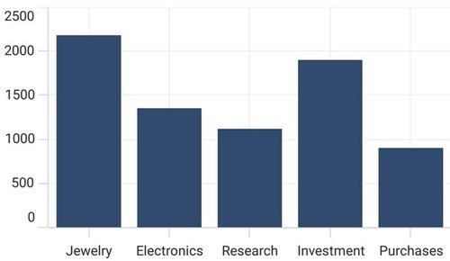

### Label placement

The [LabelPlacement](https://help.syncfusion.com/cr/maui-toolkit/Syncfusion.Maui.Toolkit.Charts.CategoryAxis.html#Syncfusion_Maui_Toolkit_Charts_CategoryAxis_LabelPlacement) property in [CategoryAxis](https://help.syncfusion.com/cr/maui-toolkit/Syncfusion.Maui.Toolkit.Charts.CategoryAxis.html) is used to place the axis labels based on ticks and between ticks. The default value of [LabelPlacement](https://help.syncfusion.com/cr/maui-toolkit/Syncfusion.Maui.Toolkit.Charts.CategoryAxis.html#Syncfusion_Maui_Toolkit_Charts_CategoryAxis_LabelPlacement) is [OnTicks](https://help.syncfusion.com/cr/maui-toolkit/Syncfusion.Maui.Toolkit.Charts.LabelPlacement.html#Syncfusion_Maui_Toolkit_Charts_LabelPlacement_OnTicks).





<chart:SfCartesianChart>
    . . .
    <chart:SfCartesianChart.XAxes>
        <chart:CategoryAxis LabelPlacement="BetweenTicks"/>
    </chart:SfCartesianChart.XAxes>
    . . .
</chart:SfCartesianChart>





SfCartesianChart chart = new SfCartesianChart();
. . .
CategoryAxis primaryAxis = new CategoryAxis()
{
     // Set the label placement to `BetweenTicks` to improve readability.
    LabelPlacement = LabelPlacement.BetweenTicks
};
chart.XAxes.Add(primaryAxis);

this.Content = chart;




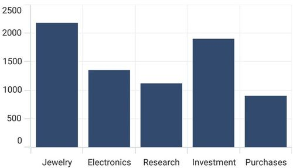

### Interval

By default, the [CategoryAxis](https://help.syncfusion.com/cr/maui-toolkit/Syncfusion.Maui.Toolkit.Charts.CategoryAxis.html) axis labels are displayed with fixed interval 1. It can be customized by using the [Interval](https://help.syncfusion.com/cr/maui-toolkit/Syncfusion.Maui.Toolkit.Charts.CategoryAxis.html#Syncfusion_Maui_Toolkit_Charts_CategoryAxis_Interval) property of axis.





<chart:SfCartesianChart>
    . . .
    <chart:SfCartesianChart.XAxes>
        <chart:CategoryAxis Interval="2"/>
    </chart:SfCartesianChart.XAxes>
    . . .
</chart:SfCartesianChart>





SfCartesianChart chart = new SfCartesianChart();
. . .
CategoryAxis primaryAxis = new CategoryAxis()
{
    // Set the Interval property to 2, meaning that labels on the axis are displayed for every 2 categories.
    Interval = 2, 
};
chart.XAxes.Add(primaryAxis);

this.Content = chart;




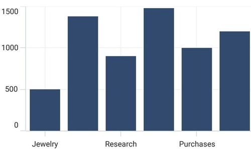

### Indexed category axis

In Cartesian Charts, the [ArrangeByIndex](https://help.syncfusion.com/cr/maui-toolkit/Syncfusion.Maui.Toolkit.Charts.CategoryAxis.html#Syncfusion_Maui_Toolkit_Charts_CategoryAxis_ArrangeByIndex) property is used to determine how the items in a category axis are arranged. 

If [ArrangeByIndex](https://help.syncfusion.com/cr/maui-toolkit/Syncfusion.Maui.Toolkit.Charts.CategoryAxis.html#Syncfusion_Maui_Toolkit_Charts_CategoryAxis_ArrangeByIndex) is set to true, then the items in the category axis will be arranged according to their index values.

If [ArrangeByIndex](https://help.syncfusion.com/cr/maui-toolkit/Syncfusion.Maui.Toolkit.Charts.CategoryAxis.html#Syncfusion_Maui_Toolkit_Charts_CategoryAxis_ArrangeByIndex) is set to false, then the items in the category axis will be arranged according to their values. By default, [ArrangeByIndex](https://help.syncfusion.com/cr/maui-toolkit/Syncfusion.Maui.Toolkit.Charts.CategoryAxis.html#Syncfusion_Maui_Toolkit_Charts_CategoryAxis_ArrangeByIndex) is true.

The following code illustrates how to define the property [ArrangeByIndex](https://help.syncfusion.com/cr/maui-toolkit/Syncfusion.Maui.Toolkit.Charts.CategoryAxis.html#Syncfusion_Maui_Toolkit_Charts_CategoryAxis_ArrangeByIndex) in chart.





<chart:SfCartesianChart>
    . . .
    <chart:SfCartesianChart.XAxes>
        <chart:CategoryAxis ArrangeByIndex="False"/>
    </chart:SfCartesianChart.XAxes>
    
    <chart:SfCartesianChart.YAxes>
        <chart:NumericalAxis/>
    </chart:SfCartesianChart.YAxes>

    <chart:ColumnSeries ItemsSource="{Binding Data1}"
                        XBindingPath="Year"
                        YBindingPath="Value"/>

    <chart:ColumnSeries ItemsSource="{Binding Data2}"
                        XBindingPath="Year"
                        YBindingPath="Value"/>
</chart:SfCartesianChart>





SfCartesianChart chart = new SfCartesianChart();
. . .
// Configure the primary X-axis as a CategoryAxis
CategoryAxis primaryAxis = new CategoryAxis()
{
    ArrangeByIndex = false, // Indicates that categories will be ordered based on their occurrence in the data
};
chart.XAxes.Add(primaryAxis); // Add the primary X-axis to the chart

NumericalAxis secondaryAxis = new NumericalAxis();
chart.YAxes.Add(secondaryAxis);  

ColumnSeries series1 = new ColumnSeries();
series1.ItemsSource = (new ViewModel()).Data1,
series1.XBindingPath = "Year";
series1.YBindingPath = "Value";

ColumnSeries series2 = new ColumnSeries();
series2.ItemsSource = (new ViewModel()).Data2,
series2.XBindingPath = "Year";
series2.YBindingPath = "Value";

chart.Series.Add(series1);
chart.Series.Add(series2);  

this.Content = chart;



    

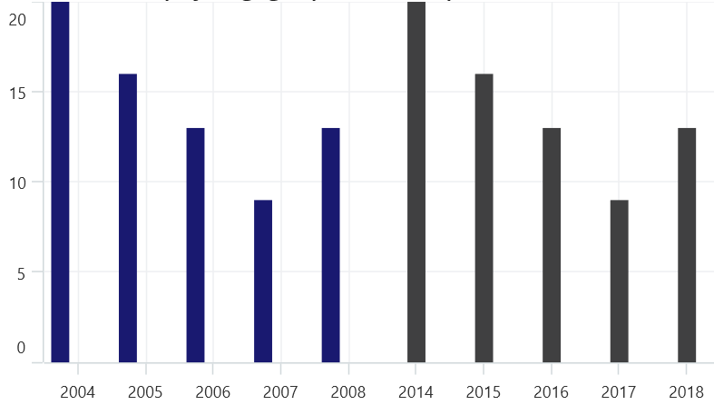

## DateTime Axis

[DateTimeAxis](https://help.syncfusion.com/cr/maui-toolkit/Syncfusion.Maui.Toolkit.Charts.DateTimeAxis.html) is used to plot `DateTime` values. The [DateTimeAxis](https://help.syncfusion.com/cr/maui-toolkit/Syncfusion.Maui.Toolkit.Charts.DateTimeAxis.html) is widely used to make financial charts in places like the Stock Market, where index plotting is done every day.





<chart:SfCartesianChart>
    . . .
    <chart:SfCartesianChart.XAxes>
        <chart:DateTimeAxis/>
    </chart:SfCartesianChart.XAxes>
    . . .
</chart:SfCartesianChart>





SfCartesianChart chart = new SfCartesianChart();
. . .
// Create an instance of the DateTimeAxis, typically used for displaying date and time values on the X-axis
DateTimeAxis primaryAxis = new DateTimeAxis();
// Add the DateTimeAxis instance to the chart's XAxes collection
chart.XAxes.Add(primaryAxis); 

this.Content = chart;




### Interval

In [DateTimeAxis](https://help.syncfusion.com/cr/maui-toolkit/Syncfusion.Maui.Toolkit.Charts.DateTimeAxis.html), intervals can be customized by using the [Interval](https://help.syncfusion.com/cr/maui-toolkit/Syncfusion.Maui.Toolkit.Charts.DateTimeAxis.html#Syncfusion_Maui_Toolkit_Charts_DateTimeAxis_Interval) and [IntervalType](https://help.syncfusion.com/cr/maui-toolkit/Syncfusion.Maui.Toolkit.Charts.DateTimeAxis.html#Syncfusion_Maui_Toolkit_Charts_DateTimeAxis_IntervalType) properties. For example, setting [Interval](https://help.syncfusion.com/cr/maui-toolkit/Syncfusion.Maui.Toolkit.Charts.DateTimeAxis.html#Syncfusion_Maui_Toolkit_Charts_DateTimeAxis_Interval) as 6 and [IntervalType](https://help.syncfusion.com/cr/maui-toolkit/Syncfusion.Maui.Toolkit.Charts.DateTimeAxis.html#Syncfusion_Maui_Toolkit_Charts_DateTimeAxis_IntervalType) as [Months](https://help.syncfusion.com/cr/maui-toolkit/Syncfusion.Maui.Toolkit.Charts.DateTimeIntervalType.html#Syncfusion_Maui_Toolkit_Charts_DateTimeIntervalType_Months) will consider 6 months as interval.





<chart:SfCartesianChart>
    . . .
    <chart:SfCartesianChart.XAxes>
        <chart:DateTimeAxis Interval="6" IntervalType="Months"/>
    </chart:SfCartesianChart.XAxes>
    . . .
</chart:SfCartesianChart>





SfCartesianChart chart = new SfCartesianChart();
. . .
DateTimeAxis primaryAxis = new DateTimeAxis()
{
    // Set the interval to 6 units, and each unit is represented as a 'Month'.
    Interval = 6, 
    IntervalType = DateTimeIntervalType.Months
};
chart.XAxes.Add(primaryAxis);

this.Content = chart;




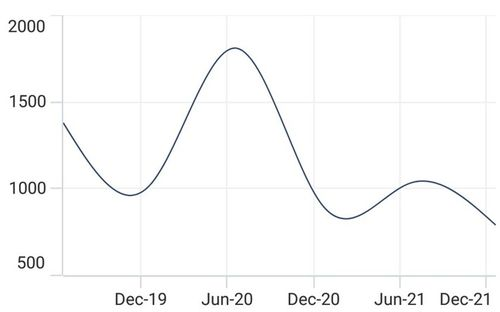

### Customizing the Range

[Minimum](https://help.syncfusion.com/cr/maui-toolkit/Syncfusion.Maui.Toolkit.Charts.DateTimeAxis.html#Syncfusion_Maui_Toolkit_Charts_DateTimeAxis_Minimum) and [Maximum](https://help.syncfusion.com/cr/maui-toolkit/Syncfusion.Maui.Toolkit.Charts.DateTimeAxis.html#Syncfusion_Maui_Toolkit_Charts_DateTimeAxis_Maximum) properties behavior is same as in [NumericalAxis](https://help.syncfusion.com/cr/maui-toolkit/Syncfusion.Maui.Toolkit.Charts.NumericalAxis.html) instead of setting numerical value, have to set date time values.





<chart:SfCartesianChart>
    . . .
    <chart:SfCartesianChart.XAxes>
        <chart:DateTimeAxis Minimum="2021/05/10" Maximum="2021/11/01"/>
    </chart:SfCartesianChart.XAxes>
    . . .
</chart:SfCartesianChart>





SfCartesianChart chart = new SfCartesianChart();
. . .
DateTimeAxis primaryAxis = new DateTimeAxis()
{
    // Set the minimum date value for the axis
    Minimum = new DateTime(2021,05,10),
    // Set the maximum date value for the axis
    Maximum = new DateTime(2021,11,01),
};
chart.XAxes.Add(primaryAxis);

this.Content = chart;




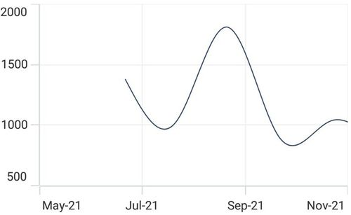

## DateTimeCategoryAxis

The `DateTimeCategoryAxis` is a specialized type of axis primarily used with financial series. Similar to the [CategoryAxis](https://help.syncfusion.com/cr/maui-toolkit/Syncfusion.Maui.Toolkit.Charts.CategoryAxis.html), all data points are plotted with equal spacing, eliminating gaps for missing dates. The intervals and ranges for this axis are calculated similarly to the [DateTimeAxis](https://help.syncfusion.com/cr/maui-toolkit/Syncfusion.Maui.Toolkit.Charts.DateTimeAxis.html). There are no visual gaps between points, even if the difference between two points exceeds a year.





<chart:SfCartesianChart>
    . . .
    <chart:SfCartesianChart.XAxes>
        <chart:DateTimeCategoryAxis/>
    </chart:SfCartesianChart.XAxes>
    . . .
</chart:SfCartesianChart>





SfCartesianChart chart = new SfCartesianChart(); 
. . . 
// Create an instance of the DateTimeCategoryAxis, used for displaying DateTime values as categories 
DateTimeCategoryAxis primaryAxis = new DateTimeCategoryAxis(); 
// Add the DateTimeCategoryAxis instance to the chart's XAxes collection 
chart.XAxes.Add(primaryAxis);

this.Content = chart; 





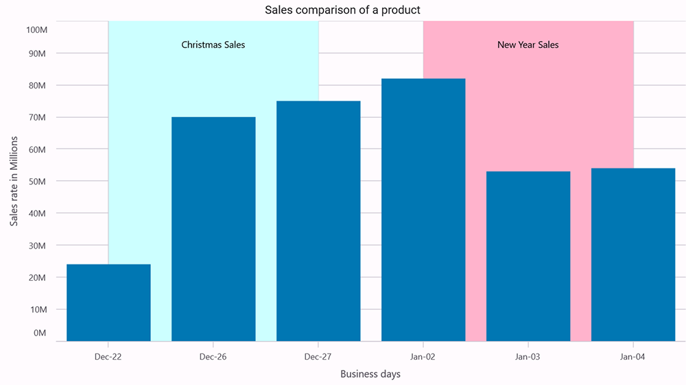

### Interval

In `DateTimeCategoryAxis`, intervals can be customized by using the Interval and IntervalType properties, similar to [DateTimeAxis](https://help.syncfusion.com/cr/maui-toolkit/Syncfusion.Maui.Toolkit.Charts.DateTimeAxis.html). For example, setting `Interval` as 5 and `IntervalType` as `Days` will consider 5 days as an interval.




<chart:SfCartesianChart> 
    . . .
        <chart:SfCartesianChart.XAxes>
            <chart:DateTimeCategoryAxis Interval="5" 
                                        IntervalType="Days"/> 
        </chart:SfCartesianChart.XAxes> 
    . . .
</chart:SfCartesianChart>





SfCartesianChart chart = new SfCartesianChart(); 
. . .
DateTimeCategoryAxis primaryAxis = new DateTimeCategoryAxis() 
{ 
    Interval = 5, 
    IntervalType = DateTimeIntervalType.Days 
}; 
chart.XAxes.Add(primaryAxis);
. . .
this.Content = chart; 





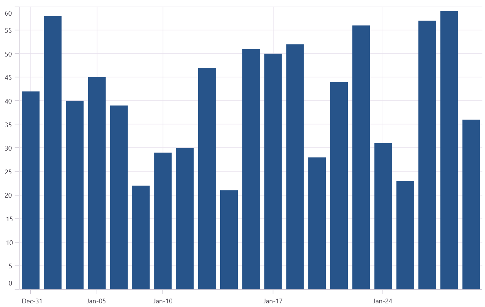

## Logarithmic Axis

The [LogarithmicAxis](https://help.syncfusion.com/cr/maui-toolkit/Syncfusion.Maui.Toolkit.Charts.LogarithmicAxis.html) uses a logarithmic scale, and it is very useful in visualizing data when the given data range has a big difference. It can be used either on the x-axis or the chart's y-axis.





<chart:SfCartesianChart>
    . . .
    <chart:SfCartesianChart.YAxes>
        <chart:LogarithmicAxis/>
    </chart:SfCartesianChart.YAxes>
    . . .
</chart:SfCartesianChart>





SfCartesianChart chart = new SfCartesianChart();
. . .
// Create a logarithmic axis for the Y-axis
LogarithmicAxis secondaryAxis = new LogarithmicAxis();
// Add the logarithmic axis to the chart's Y-axes collection
chart.YAxes.Add(secondaryAxis);

this.Content = chart;




### Interval

Axis interval can be customized using the [Interval](https://help.syncfusion.com/cr/maui-toolkit/Syncfusion.Maui.Toolkit.Charts.LogarithmicAxis.html#Syncfusion_Maui_Toolkit_Charts_LogarithmicAxis_Interval) property of the axis. By default, interval will be calculated based on the minimum and maximum value of the provided data. And the default value of the interval is 1. 





<chart:SfCartesianChart>
    . . .
    <chart:SfCartesianChart.YAxes>
        <chart:LogarithmicAxis Interval="2"/>
    </chart:SfCartesianChart.YAxes>
    . . .
</chart:SfCartesianChart>





SfCartesianChart chart = new SfCartesianChart();
. . .
LogarithmicAxis secondaryAxis = new LogarithmicAxis()
{
    Interval = 2 // Sets the interval for the axis, determining the spacing between major ticks
};
chart.YAxes.Add(secondaryAxis);

this.Content = chart;





### Range customization

To customize the range of the log axis, you can use the [Minimum](https://help.syncfusion.com/cr/maui-toolkit/Syncfusion.Maui.Toolkit.Charts.LogarithmicAxis.html#Syncfusion_Maui_Toolkit_Charts_LogarithmicAxis_Minimum), [Maximum](https://help.syncfusion.com/cr/maui-toolkit/Syncfusion.Maui.Toolkit.Charts.LogarithmicAxis.html#Syncfusion_Maui_Toolkit_Charts_LogarithmicAxis_Maximum) properties of the [LogarithmicAxis](https://help.syncfusion.com/cr/maui-toolkit/Syncfusion.Maui.Toolkit.Charts.LogarithmicAxis.html). By default, an excellent range will be calculated automatically based on the provided data. 





<chart:SfCartesianChart>
    . . .
    <chart:SfCartesianChart.YAxes>
        <chart:LogarithmicAxis Minimum="100" Maximum="10000"/>
    </chart:SfCartesianChart.YAxes>
    . . .
</chart:SfCartesianChart>





SfCartesianChart chart = new SfCartesianChart();
. . .
// Instantiate a logarithmic axis for the Y-axis with defined minimum and maximum values.
LogarithmicAxis secondaryAxis = new LogarithmicAxis()
{
    Minimum = 100, // Set the minimum value of the axis to 100.
    Maximum = 10000 // Set the maximum value of the axis to 10000.
};
chart.YAxes.Add(secondaryAxis); // Add the configured logarithmic axis to the YAxes collection of the chart.

this.Content = chart;





### Base customization

The logarithmic axis base can be customized using the [LogarithmicBase](https://help.syncfusion.com/cr/maui-toolkit/Syncfusion.Maui.Toolkit.Charts.LogarithmicAxis.html#Syncfusion_Maui_Toolkit_Charts_LogarithmicAxis_LogarithmicBase) property of the axis. By default, the base value is 10.





<chart:SfCartesianChart>
    . . .
    <chart:SfCartesianChart.YAxes>
        <chart:LogarithmicAxis LogarithmicBase="5"/>
    </chart:SfCartesianChart.YAxes>
    . . .
</chart:SfCartesianChart>





SfCartesianChart chart = new SfCartesianChart();
. . .
LogarithmicAxis secondaryAxis = new LogarithmicAxis()
{
     // Set the base of the logarithm to 5 for the logarithmic scale
    LogarithmicBase = 5 
};
chart.YAxes.Add(secondaryAxis);

this.Content = chart;





## Inversed

Axis can be inverted by using the [IsInversed](https://help.syncfusion.com/cr/maui-toolkit/Syncfusion.Maui.Toolkit.Charts.ChartAxis.html#Syncfusion_Maui_Toolkit_Charts_ChartAxis_IsInversed) property. The default value of this property is `False`.





<chart:SfCartesianChart>
    . . .
    <chart:SfCartesianChart.YAxes>
        <chart:NumericalAxis IsInversed="True"/>
    </chart:SfCartesianChart.YAxes>
    . . .
</chart:SfCartesianChart>





SfCartesianChart chart = new SfCartesianChart();
. . .
NumericalAxis secondaryAxis = new NumericalAxis();
secondaryAxis.IsInversed = true; // Set the IsInversed property to true, making the axis values inverted.
chart.YAxes.Add(secondaryAxis);

this.Content = chart;




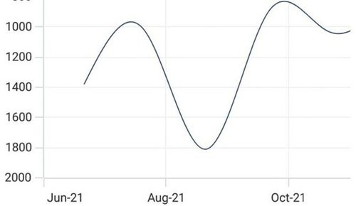

## Axis Visibility
Axis visibility can be controlled using the [IsVisible](https://help.syncfusion.com/cr/maui-toolkit/Syncfusion.Maui.Toolkit.Charts.ChartAxis.html#Syncfusion_Maui_Toolkit_Charts_ChartAxis_IsVisible) property of axis. Default value of [IsVisible](https://help.syncfusion.com/cr/maui-toolkit/Syncfusion.Maui.Toolkit.Charts.ChartAxis.html#Syncfusion_Maui_Toolkit_Charts_ChartAxis_IsVisible) property is `True`.



<chart:SfCartesianChart>
    . . .
    <chart:SfCartesianChart.YAxes>
        <chart:NumericalAxis IsVisible="False"/>
    </chart:SfCartesianChart.YAxes>
    . . .
</chart:SfCartesianChart>


SfCartesianChart chart = new SfCartesianChart();
. . .
NumericalAxis secondaryAxis = new NumericalAxis() 
{
    IsVisible = false // Set the IsVisible property to false, making this axis hidden/not visible in the chart
};
chart.YAxes.Add(secondaryAxis);
this.Content = chart;



## Multiple Axes
Cartesian charts provides support to arrange multiple series inside the same chart area with specified x-axis and y-axis. There are two properties [XAxisName](https://help.syncfusion.com/cr/maui-toolkit/Syncfusion.Maui.Toolkit.Charts.CartesianSeries.html#Syncfusion_Maui_Toolkit_Charts_CartesianSeries_XAxisName) and [YAxisName](https://help.syncfusion.com/cr/maui-toolkit/Syncfusion.Maui.Toolkit.Charts.CartesianSeries.html#Syncfusion_Maui_Toolkit_Charts_CartesianSeries_YAxisName) in all the Cartesian series types, which are used to provide multiple axes support. These axes can be arranged in a stacking order or in a side-by-side pattern.

By default, the 0th index value of XAxes and YAxes is used to plot all of the series.



<chart:SfCartesianChart>
    . . .
    <chart:SfCartesianChart.XAxes>
        <chart:DateTimeAxis ShowMajorGridLines="False"/>
    </chart:SfCartesianChart.XAxes>
    <chart:SfCartesianChart.YAxes>
        <chart:NumericalAxis ShowMajorGridLines="False"/>
        <chart:NumericalAxis Name="series_YAxis" CrossesAt="{Static x:Double.MaxValue}" ShowMajorGridLines="False"/>
    </chart:SfCartesianChart.YAxes>
    <chart:ColumnSeries ItemsSource="{Binding Data1}" 
                    XBindingPath="Date"
                    YBindingPath="Value" 
                    YAxisName="series_YAxis"/>
    <chart:SplineSeries ItemsSource="{Binding Data2}" 
                    XBindingPath="Date"
                    YBindingPath="Value"/>
</chart:SfCartesianChart>


SfCartesianChart chart = new SfCartesianChart();
DateTimeAxis primaryAxis = new DateTimeAxis()
{
    ShowMajorGridLines = false
};
chart.XAxes.Add(primaryAxis);

NumericalAxis secondaryAxis1 = new NumericalAxis()
{
    ShowMajorGridLines = false
};
chart.YAxes.Add(secondaryAxis1);

NumericalAxis secondaryAxis2 = new NumericalAxis()
{
    CrossesAt = double.MaxValue,
    ShowMajorGridLines = false
};
secondaryAxis2.Name = "series_YAxis"; // Name the second Y-axis to associate with a specific series
chart.YAxes.Add(secondaryAxis2);

// Bind this series to the second Y-axis using its name
ColumnSeries series1 = new ColumnSeries()
{
    ItemsSource = new ViewModel().Data1,
    XBindingPath = "Date",
    YBindingPath = "Value",
    YAxisName = "series_YAxis"
};

SplineSeries series2 = new SplineSeries()
{
    ItemsSource = new ViewModel().Data2,
    XBindingPath = "Date",
    YBindingPath = "Value",
};

chart.Series.Add(series1);
chart.Series.Add(series2);
this.Content = chart;



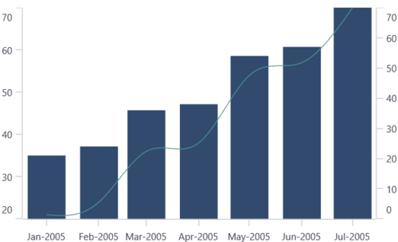

In the above image, the [ColumnSeries](https://help.syncfusion.com/cr/maui-toolkit/Syncfusion.Maui.Toolkit.Charts.ColumnSeries.html) is plotted based on additional axes of [YAxes](https://help.syncfusion.com/cr/maui-toolkit/Syncfusion.Maui.Toolkit.Charts.SfCartesianChart.html#Syncfusion_Maui_Toolkit_Charts_SfCartesianChart_YAxes) collection, and [SplineSeries](https://help.syncfusion.com/cr/maui-toolkit/Syncfusion.Maui.Toolkit.Charts.SplineSeries.html) is plotted based on axis of the collection's 0th index.

To learn how to add and customize the multiple axes in .NET MAUI Cartesian Charts quickly, you can check the below video.



## Axis Crossing
The chart allows you to customize the origin. By default, the axis will be rendered with (0,0) as the origin in x and y-axes. An axis can be positioned anywhere in the chart area by using the [CrossesAt](https://help.syncfusion.com/cr/maui-toolkit/Syncfusion.Maui.Toolkit.Charts.ChartAxis.html#Syncfusion_Maui_Toolkit_Charts_ChartAxis_CrossesAt) property. This property specifies where the horizontal axis intersects or crosses the vertical axis, and vice versa. The default value of the CrossesAt property is `double.NaN`.



<chart:SfCartesianChart>
    <chart:SfCartesianChart.XAxes>
        <chart:NumericalAxis CrossesAt="0"
                            Minimum="-8"
                            Maximum="8"
                            ShowMajorGridLines="False"/>
    </chart:SfCartesianChart.XAxes>
    <chart:SfCartesianChart.YAxes>
        <chart:NumericalAxis CrossesAt="0"
                            Minimum="-8"
                            Maximum="8"
                            ShowMajorGridLines="False"/>
    </chart:SfCartesianChart.YAxes>
</chart:SfCartesianChart>


SfCartesianChart chart = new SfCartesianChart();
NumericalAxis primaryAxis = new NumericalAxis();
primaryAxis.CrossesAt = 0; // Sets the point where the axis crosses the other axis at 0
primaryAxis.Minimum = -8; // Sets the minimum value of the axis to -8
primaryAxis.Maximum = 8; // Sets the maximum value of the axis to 8
primaryAxis.ShowMajorGridLines = false;
chart.XAxes.Add(primaryAxis);

NumericalAxis secondaryAxis = new NumericalAxis();
secondaryAxis.CrossesAt = 0; // Sets the point where this axis crosses the other axis at 0
secondaryAxis.Minimum = -8; // Sets the minimum value of the axis to -8
secondaryAxis.Maximum = 8; // Sets the maximum value of the axis to 8
secondaryAxis.ShowMajorGridLines = false;
chart.YAxes.Add(secondaryAxis);
this.Content = chart;



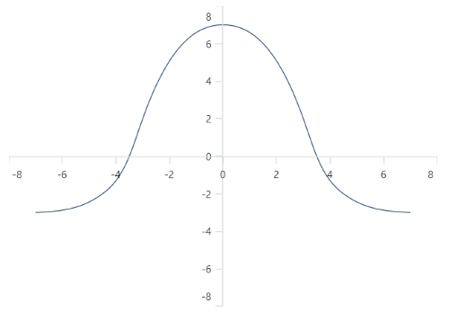

### Positioning the axis elements while crossing
The [RenderNextToCrossingValue](https://help.syncfusion.com/cr/maui-toolkit/Syncfusion.Maui.Toolkit.Charts.ChartAxis.html#Syncfusion_Maui_Toolkit_Charts_ChartAxis_RenderNextToCrossingValue) property is used to determine whether the crossing axis should be placed at crossing position or not. The default value of [RenderNextToCrossingValue](https://help.syncfusion.com/cr/maui-toolkit/Syncfusion.Maui.Toolkit.Charts.ChartAxis.html#Syncfusion_Maui_Toolkit_Charts_ChartAxis_RenderNextToCrossingValue) property is true.



<chart:SfCartesianChart>
    <chart:SfCartesianChart.XAxes>
        <chart:NumericalAxis CrossesAt="0" RenderNextToCrossingValue="False"/>
    </chart:SfCartesianChart.XAxes>
    <chart:SfCartesianChart.YAxes>
        <chart:NumericalAxis CrossesAt="0"/>
    </chart:SfCartesianChart.YAxes>
</chart:SfCartesianChart>


SfCartesianChart chart = new SfCartesianChart();
NumericalAxis primaryAxis = new NumericalAxis();
primaryAxis.CrossesAt = 0;
primaryAxis.RenderNextToCrossingValue = false; // Ensure the X-axis is not rendered next to its crossing value
chart.XAxes.Add(primaryAxis);

NumericalAxis secondaryAxis = new NumericalAxis();
secondaryAxis.CrossesAt = 0;
chart.YAxes.Add(secondaryAxis);
this.Content = chart;



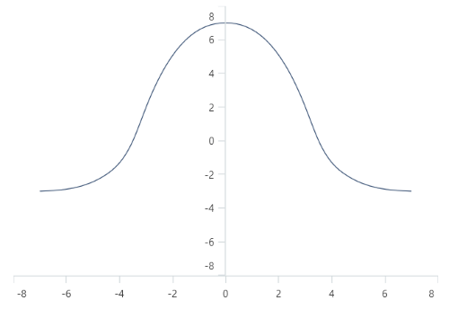

### Crossing the date-time axis
For the crossing in date time horizontal axis, date object should be provided as value for `CrossesAt` property of vertical axis.



<chart:SfCartesianChart>
    <chart:SfCartesianChart.XAxes>
        <chart:DateTimeAxis CrossesAt="2021/01/01"/>
    </chart:SfCartesianChart.XAxes>
    <chart:SfCartesianChart.YAxes>
        <chart:NumericalAxis/>
    </chart:SfCartesianChart.YAxes>
</chart:SfCartesianChart>


SfCartesianChart chart = new SfCartesianChart();
DateTimeAxis primaryAxis = new DateTimeAxis();
primaryAxis.CrossesAt = new DateTime(2021, 01, 01); // Set the primary X-axis to start with a specific date
chart.XAxes.Add(primaryAxis);

NumericalAxis secondaryAxis = new NumericalAxis();
chart.YAxes.Add(secondaryAxis);
this.Content = chart;



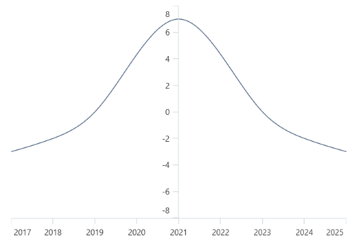

### Opposite Side Axis with CrossesAt
The chart allows you to position the axis to opposed position by setting the value as `double.MaxValue` to the [CrossesAt](https://help.syncfusion.com/cr/maui-toolkit/Syncfusion.Maui.Toolkit.Charts.ChartAxis.html#Syncfusion_Maui_Toolkit_Charts_ChartAxis_CrossesAt) property.



<chart:SfCartesianChart>
    <chart:SfCartesianChart.XAxes>
        <chart:NumericalAxis/>
    </chart:SfCartesianChart.XAxes>
    <chart:SfCartesianChart.YAxes>
        <chart:NumericalAxis CrossesAt="{Static x:Double.MaxValue}"/>
    </chart:SfCartesianChart.YAxes>
</chart:SfCartesianChart>


SfCartesianChart chart = new SfCartesianChart();
NumericalAxis primaryAxis = new NumericalAxis();
chart.XAxes.Add(primaryAxis);

NumericalAxis secondaryAxis = new NumericalAxis();
secondaryAxis.CrossesAt = double.MaxValue;
chart.YAxes.Add(secondaryAxis);
this.Content = chart;



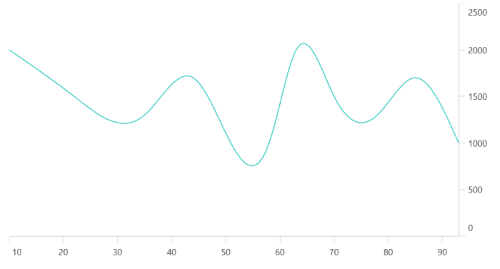

## Events
### ActualRangeChanged
The [ActualRangeChanged](https://help.syncfusion.com/cr/maui-toolkit/Syncfusion.Maui.Toolkit.Charts.ChartAxis.html#Syncfusion_Maui_Toolkit_Charts_ChartAxis_ActualRangeChanged) event is triggered when the actual range of the axis is changed. The argument contains the following information:
* [ActualMinimum](https://help.syncfusion.com/cr/maui-toolkit/Syncfusion.Maui.Toolkit.Charts.ActualRangeChangedEventArgs.html#Syncfusion_Maui_Toolkit_Charts_ActualRangeChangedEventArgs_ActualMinimum) - used to get the actual minimum value of the axis.
* [ActualMaximum](https://help.syncfusion.com/cr/maui-toolkit/Syncfusion.Maui.Toolkit.Charts.ActualRangeChangedEventArgs.html#Syncfusion_Maui_Toolkit_Charts_ActualRangeChangedEventArgs_ActualMaximum) - used to get the actual maximum value of the axis.

N> The actual range is changed by specifying the [ZoomPosition](https://help.syncfusion.com/cr/maui-toolkit/Syncfusion.Maui.Toolkit.Charts.ChartAxis.html#Syncfusion_Maui_Toolkit_Charts_ChartAxis_ZoomPosition) and [ZoomFactor](https://help.syncfusion.com/cr/maui-toolkit/Syncfusion.Maui.Toolkit.Charts.ChartAxis.html#Syncfusion_Maui_Toolkit_Charts_ChartAxis_ZoomFactor) properties or zooming the chart interactively.

### LabelCreated
The [LabelCreated](https://help.syncfusion.com/cr/maui-toolkit/Syncfusion.Maui.Toolkit.Charts.ChartAxis.html#Syncfusion_Maui_Toolkit_Charts_ChartAxis_LabelCreated) event is triggered when the axis label is created. The argument contains the following information:
* [Label](https://help.syncfusion.com/cr/maui-toolkit/Syncfusion.Maui.Toolkit.Charts.ChartAxisLabelEventArgs.html#Syncfusion_Maui_Toolkit_Charts_ChartAxisLabelEventArgs_Label) - Used to get or set the text of axis label.
* [Position](https://help.syncfusion.com/cr/maui-toolkit/Syncfusion.Maui.Toolkit.Charts.ChartAxisLabelEventArgs.html#Syncfusion_Maui_Toolkit_Charts_ChartAxisLabelEventArgs_Position) - Used to get the position of label.
* [LabelStyle](https://help.syncfusion.com/cr/maui-toolkit/Syncfusion.Maui.Toolkit.Charts.ChartAxisLabelEventArgs.html#Syncfusion_Maui_Toolkit_Charts_ChartAxisLabelEventArgs_LabelStyle) - Used to customize the appearance of axis labels.