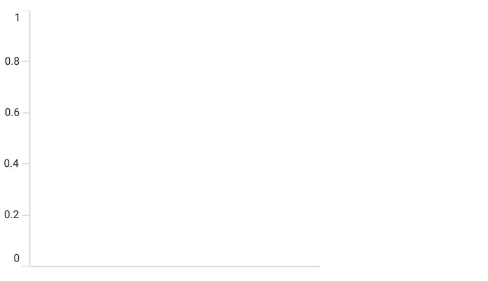
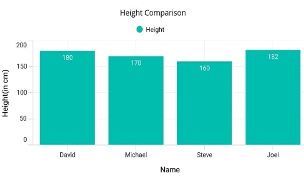

# Getting Started with .NET MAUI Cartesian Chart

This section explains how to populate the Cartesian chart with data, a title, data labels, a legend, and tooltips, as well as the essential aspects for getting started with the SfCartesianChart.

## Prerequisites

Before proceeding, ensure that the following are set up:
1. [.NET 8 SDK](https://dotnet.microsoft.com/en-us/download/dotnet/8.0) or later is installed.
2. A .NET MAUI development environment is configured using either:
    - Visual Studio 2022 (version 17.8 or later), or
    - Visual Studio Code, with the .NET MAUI workload installed and configured. For more information on setting up Visual Studio Code with .NET MAUI, see the official [documentation.](https://learn.microsoft.com/en-us/dotnet/maui/get-started/installation?view=net-maui-8.0&tabs=visual-studio-code)

## Step 1: Create a New .NET MAUI Project




1. Go to **File > New > Project** and choose the **.NET MAUI App** template.
2. Name the project and choose a location. Click **Next**.
3. Select the .NET framework version and click **Create**.




1. Open the command palette by pressing `Ctrl+Shift+P` and type **.NET: New Project** and press **Enter**.
2. Choose the **.NET MAUI App** template.
3. Select the project location, type the project name, and press **Enter**.
4. Choose **Create project**.




## Step 2: Install the Syncfusion® .NET MAUI Toolkit Package



1. In **Solution Explorer**, right-click the project and choose **Manage NuGet Packages**.
2. Search for [Syncfusion.Maui.Toolkit](https://www.nuget.org/packages/Syncfusion.Maui.Toolkit/) and install the latest version.
3. Ensure the necessary dependencies are installed correctly, and the project is restored.




1. Press <kbd>Ctrl</kbd> + <kbd>`</kbd> (backtick) to open the integrated terminal in Visual Studio Code.
2. Ensure you're in the project root directory where your .csproj file is located.
3. Run the command `dotnet add package Syncfusion.Maui.Toolkit` to install the Syncfusion® .NET MAUI Toolkit NuGet package.
4. To ensure all dependencies are installed, run `dotnet restore`.




## Step 3: Register the handler

In the **MauiProgram.cs** file, register the handler for Syncfusion® Toolkit.





    using Syncfusion.Maui.Toolkit.Hosting;

    public static class MauiProgram
    {
	    public static MauiApp CreateMauiApp()
	    {
	        var builder = MauiApp.CreateBuilder();
		    builder
			    .ConfigureSyncfusionToolkit()
			    .UseMauiApp<App>()
			    .ConfigureFonts(fonts =>
			    {
				    fonts.AddFont("OpenSans-Regular.ttf", "OpenSansRegular");
				    fonts.AddFont("OpenSans-Semibold.ttf", "OpenSansSemibold");
			    });

		    return builder.Build();
	    }
    }





## Step 4: Add .NET MAUI Cartesian Chart

1. Import the `Syncfusion.Maui.Toolkit.Charts` namespace into your code.
2. Initialize an instance of the `SfCartesianChart` control.





<ContentPage xmlns="http://schemas.microsoft.com/dotnet/2021/maui"
             xmlns:x="http://schemas.microsoft.com/winfx/2009/xaml"
             xmlns:chart="clr-namespace:Syncfusion.Maui.Toolkit.Charts;assembly=Syncfusion.Maui.Toolkit"
             x:Class="GettingStarted.MainPage">

        <chart:SfCartesianChart/>

</ContentPage>





using Syncfusion.Maui.Toolkit.Charts;

. . .

public partial class MainPage : ContentPage
{
    public MainPage()
    {
        InitializeComponent();
        // Create a new instance of SfCartesianChart which is a type of chart control.
        SfCartesianChart chart = new SfCartesianChart();
        // Set the newly created chart as the content of the current view.
        this.Content = chart;
    }
}





### Initialize view model

Define a simple data model to represent a data point in the chart:

  



public class PersonModel   
{   
    public string Name { get; set; }
    public double Height { get; set; }
}

 

 

Next, create a `PersonViewModel` class and initialize a list of `PersonModel` objects:

  



public class PersonViewModel  
{
    public List<PersonModel> Data { get; set; }      

    public PersonViewModel()       
    {
        Data = new List<PersonModel>()
        {
            new PersonModel { Name = "David", Height = 170 },
            new PersonModel { Name = "Michael", Height = 96 },
            new PersonModel { Name = "Steve", Height = 65 },
            new PersonModel { Name = "Joel", Height = 182 },
            new PersonModel { Name = "Bob", Height = 134 }
        }; 
    }
 }

 

 

Set the `PersonViewModel` instance as the `BindingContext` of your view to bind the `PersonViewModel` properties to the chart:
 
N> If you prefer to set the `BindingContext` in XAML, make sure to add the appropriate namespace for the `PersonViewModel` class in your XAML page.

 



<ContentPage xmlns="http://schemas.microsoft.com/dotnet/2021/maui"
             xmlns:x="http://schemas.microsoft.com/winfx/2009/xaml"
             xmlns:chart="clr-namespace:Syncfusion.Maui.Toolkit.Charts;assembly=Syncfusion.Maui.Toolkit"
             xmlns:model="clr-namespace:GettingStarted"
             x:Class="GettingStarted.MainPage">

    <ContentPage.BindingContext>
        <model:PersonViewModel/>
    </ContentPage.BindingContext>
    
</ContentPage>





using Syncfusion.Maui.Toolkit.Charts;

. . .

public partial class MainPage : ContentPage
{
    public MainPage()
    {
        InitializeComponent();
        // Set the data binding context for the UI, linking it to a PersonViewModel instance
        this.BindingContext = new PersonViewModel();
    }
}



 

### Initialize Chart axis

[ChartAxis](https://help.syncfusion.com/cr/maui-toolkit/Syncfusion.Maui.Toolkit.Charts.ChartAxis.html) is used to locate the data points inside the chart area. The [XAxes](https://help.syncfusion.com/cr/maui-toolkit/Syncfusion.Maui.Toolkit.Charts.SfCartesianChart.html#Syncfusion_Maui_Toolkit_Charts_SfCartesianChart_XAxes) and [YAxes](https://help.syncfusion.com/cr/maui-toolkit/Syncfusion.Maui.Toolkit.Charts.SfCartesianChart.html#Syncfusion_Maui_Toolkit_Charts_SfCartesianChart_YAxes) collection of the chart is used to initialize the axis for the chart.

 



<chart:SfCartesianChart>      

    <chart:SfCartesianChart.XAxes>
        <chart:CategoryAxis/>
    </chart:SfCartesianChart.XAxes>

    <chart:SfCartesianChart.YAxes>
        <chart:NumericalAxis/>
    </chart:SfCartesianChart.YAxes>

</chart:SfCartesianChart>





SfCartesianChart chart = new SfCartesianChart();

// Initialize the primary axis as a CategoryAxis for the X-Axis
CategoryAxis primaryAxis = new CategoryAxis();
// Add the primary axis to the chart's XAxes collection
chart.XAxes.Add(primaryAxis);

// Initialize the secondary axis as a NumericalAxis for the Y-Axis
NumericalAxis secondaryAxis = new NumericalAxis();
// Add the secondary axis to the chart's YAxes collection
chart.YAxes.Add(secondaryAxis);

 this.Content = chart;



 

Run the project and check if you get following output to make sure you have configured your project properly to add a chart.

### Populate Chart with data

As we are going to visualize the comparison of heights in the data model, add [ColumnSeries](https://help.syncfusion.com/cr/maui-toolkit/Syncfusion.Maui.Toolkit.Charts.ColumnSeries.html) property of chart, and then bind the `Data` property of the above `PersonViewModel` to the `ColumnSeries.ItemsSource` as follows.

N> The Cartesian chart has [Series](https://help.syncfusion.com/cr/maui-toolkit/Syncfusion.Maui.Toolkit.Charts.SfCartesianChart.html#Syncfusion_Maui_Toolkit_Charts_SfCartesianChart_Series) as its default content.

N> You need to set [XBindingPath](https://help.syncfusion.com/cr/maui-toolkit/Syncfusion.Maui.Toolkit.Charts.ChartSeries.html#Syncfusion_Maui_Toolkit_Charts_ChartSeries_XBindingPath) and [YBindingPath](https://help.syncfusion.com/cr/maui-toolkit/Syncfusion.Maui.Toolkit.Charts.XYDataSeries.html#Syncfusion_Maui_Toolkit_Charts_XYDataSeries_YBindingPath) properties so that chart will fetch values from the respective properties in the data model to plot the series. 

   



<chart:SfCartesianChart>
    <chart:SfCartesianChart.XAxes>
        <chart:CategoryAxis>
            <chart:CategoryAxis.Title>
                <chart:ChartAxisTitle Text="Name"/>
            </chart:CategoryAxis.Title>
        </chart:CategoryAxis>
    </chart:SfCartesianChart.XAxes>
    <chart:SfCartesianChart.YAxes>
        <chart:NumericalAxis>
            <chart:NumericalAxis.Title>
                <chart:ChartAxisTitle Text="Height(in cm)"/>
            </chart:NumericalAxis.Title>
        </chart:NumericalAxis>
    </chart:SfCartesianChart.YAxes>

    <chart:ColumnSeries ItemsSource="{Binding Data}" 
                        XBindingPath="Name" 
                        YBindingPath="Height"/>
</chart:SfCartesianChart>





SfCartesianChart chart = new SfCartesianChart();

// Initializing primary axis
CategoryAxis primaryAxis = new CategoryAxis();
primaryAxis.Title = new ChartAxisTitle()
{
    Text = "Name",
};
chart.XAxes.Add(primaryAxis);

//Initializing secondary Axis
NumericalAxis secondaryAxis = new NumericalAxis();
secondaryAxis.Title = new ChartAxisTitle()
{
    Text= "Height(in cm)",
};
chart.YAxes.Add(secondaryAxis);

//Initialize the two series for SfChart
ColumnSeries series = new ColumnSeries();
series.Label = "Height";
series.ShowDataLabels = true;
series.ItemsSource = (new PersonViewModel()).Data;
series.XBindingPath = "Name";
series.YBindingPath = "Height";

//Adding Series to the Chart Series Collection
chart.Series.Add(series);
this.Content = chart;



 

### Add a title

The title of the chart provide quick information to the user about the data being plotted in the chart. The [Title](https://help.syncfusion.com/cr/maui-toolkit/Syncfusion.Maui.Toolkit.Charts.ChartBase.html#Syncfusion_Maui_Toolkit_Charts_ChartBase_Title) property is used to set title for the chart as follows.

 



<chart:SfCartesianChart>
  <chart:SfCartesianChart.Title>
       <Label Text="Height Comparison"/>
   </chart:SfCartesianChart.Title> 
</chart:SfCartesianChart>





SfCartesianChart chart = new SfCartesianChart();
// Set the title of the chart using a Label component.
chart.Title = new Label()
{
    Text = "Height Comparison"
};

this.Content = chart;



  

### Enable the data labels

The [ShowDataLabels](https://help.syncfusion.com/cr/maui-toolkit/Syncfusion.Maui.Toolkit.Charts.ChartSeries.html#Syncfusion_Maui_Toolkit_Charts_ChartSeries_ShowDataLabels) property of series can be used to enable the data labels to improve the readability of the chart. The label visibility is set to `False` by default.

 



<chart:SfCartesianChart>
    . . . 
    <chart:ColumnSeries ShowDataLabels="True"/>
</chart:SfCartesianChart>





SfCartesianChart chart = new SfCartesianChart()
. . .
ColumnSeries series = new ColumnSeries();
series.ShowDataLabels = true; // Enable data labels to be displayed on the data points in the column series.
chart.Series.Add(series);
this.Content = chart;


  

### Enable a legend

The legend provides information about the data point displayed in the chart. The [Legend](https://help.syncfusion.com/cr/maui-toolkit/Syncfusion.Maui.Toolkit.Charts.ChartBase.html#Syncfusion_Maui_Toolkit_Charts_ChartBase_Legend) property of the chart was used to enable it.

 



<chart:SfCartesianChart >
    . . .
    <chart:SfCartesianChart.Legend>
        <chart:ChartLegend/>
    </chart:SfCartesianChart.Legend>
    . . .
</chart:SfCartesianChart>





SfCartesianChart chart = new SfCartesianChart();
chart.Legend = new ChartLegend (); 
this.Content = chart;


  

N> Additionally, set label for each series using the `Label` property of chart series, which will be displayed in corresponding legend.

 



<chart:SfCartesianChart>
    . . .
    <chart:ColumnSeries Label="Height"
                        ItemsSource="{Binding Data}"
                        XBindingPath="Name" 
                        YBindingPath="Height"/>
</chart:SfCartesianChart>





ColumnSeries series = new ColumnSeries (); 
series.ItemsSource = (new PersonViewModel()).Data;
series.XBindingPath = "Name"; 
series.YBindingPath = "Height"; 
series.Label = "Height";



  

### Enable tooltip

Tooltips are used to show information about the segment, when a user hovers over a segment. Enable tooltip by setting series [EnableTooltip](https://help.syncfusion.com/cr/maui-toolkit/Syncfusion.Maui.Toolkit.Charts.ChartSeries.html#Syncfusion_Maui_Toolkit_Charts_ChartSeries_EnableTooltip) property to true.

 



<chart:SfCartesianChart>
    ...
    <chart:ColumnSeries EnableTooltip="True"/>
    ...
</chart:SfCartesianChart> 





ColumnSeries series = new ColumnSeries();
series.EnableTooltip = true; // Enable tooltips for the column series to display additional information on hover





The following code example gives you the complete code of above configurations.

 



<ContentPage xmlns="http://schemas.microsoft.com/dotnet/2021/maui"
             xmlns:x="http://schemas.microsoft.com/winfx/2009/xaml"
             xmlns:chart="clr-namespace:Syncfusion.Maui.Toolkit.Charts;assembly=Syncfusion.Maui.Toolkit"
             xmlns:model="clr-namespace:GettingStarted"
             x:Class="GettingStarted.MainPage">

    <ContentPage.BindingContext>
        <model:PersonViewModel/>
    </ContentPage.BindingContext>

<chart:SfCartesianChart>

    <chart:SfCartesianChart.Title>
        <Label Text="Height Comparison"/>
    </chart:SfCartesianChart.Title>

    <chart:SfCartesianChart.Legend>
        <chart:ChartLegend/>
    </chart:SfCartesianChart.Legend>

    <chart:SfCartesianChart.XAxes>
        <chart:CategoryAxis>
            <chart:CategoryAxis.Title>
                <chart:ChartAxisTitle Text="Name"/>
            </chart:CategoryAxis.Title>
        </chart:CategoryAxis>
    </chart:SfCartesianChart.XAxes>

    <chart:SfCartesianChart.YAxes>
        <chart:NumericalAxis>
            <chart:NumericalAxis.Title>
                <chart:ChartAxisTitle Text="Height(in cm)"/>
            </chart:NumericalAxis.Title>
        </chart:NumericalAxis>
    </chart:SfCartesianChart.YAxes>

    <!--Initialize the series for chart-->
    <chart:ColumnSeries Label="Height" 
                        EnableTooltip="True"
                        ShowDataLabels="True"
                        ItemsSource="{Binding Data}"
                        XBindingPath="Name" 
                        YBindingPath="Height">
        <chart:ColumnSeries.DataLabelSettings>
            <chart:CartesianDataLabelSettings LabelPlacement="Inner"/>
        </chart:ColumnSeries.DataLabelSettings>
    </chart:ColumnSeries>

</chart:SfCartesianChart>

</ContentPage>
 




using Syncfusion.Maui.Toolkit.Charts;
namespace ChartGettingStarted
{
    public partial class MainPage : ContentPage
    {
        public MainPage()
        {
            InitializeComponent();  
            this.BindingContext = new PersonViewModel();          
            SfCartesianChart chart = new SfCartesianChart();

            chart.Title = new Label()
            {
                Text = "Height Comparison"
            };

            // Initializing primary axis
            CategoryAxis primaryAxis = new CategoryAxis();
            primaryAxis.Title = new ChartAxisTitle()
            {
                Text = "Name",
            };
            chart.XAxes.Add(primaryAxis);

            //Initializing secondary Axis
            NumericalAxis secondaryAxis = new NumericalAxis();
            secondaryAxis.Title = new ChartAxisTitle()
            {
                Text= "Height(in cm)",
            };
            chart.YAxes.Add(secondaryAxis);

            //Initialize the two series for SfChart
            ColumnSeries series = new ColumnSeries()
            {
                Label = "Height",
                ShowDataLabels = true,
                ItemsSource = (new PersonViewModel()).Data,
                XBindingPath = "Name",
                YBindingPath = "Height",
                DataLabelSettings = new CartesianDataLabelSettings()
                {
                    LabelPlacement = DataLabelPlacement.Inner
                };              
            };  

            //Adding Series to the Chart Series Collection
            chart.Series.Add(series);
            this.Content = chart;
        }
    }   
}





The following chart is created as a result of the previous codes.

You can find the complete getting started sample from this [link](https://github.com/SyncfusionExamples/maui-toolkit-samples/tree/master/CartesianChart/GettingStarted).