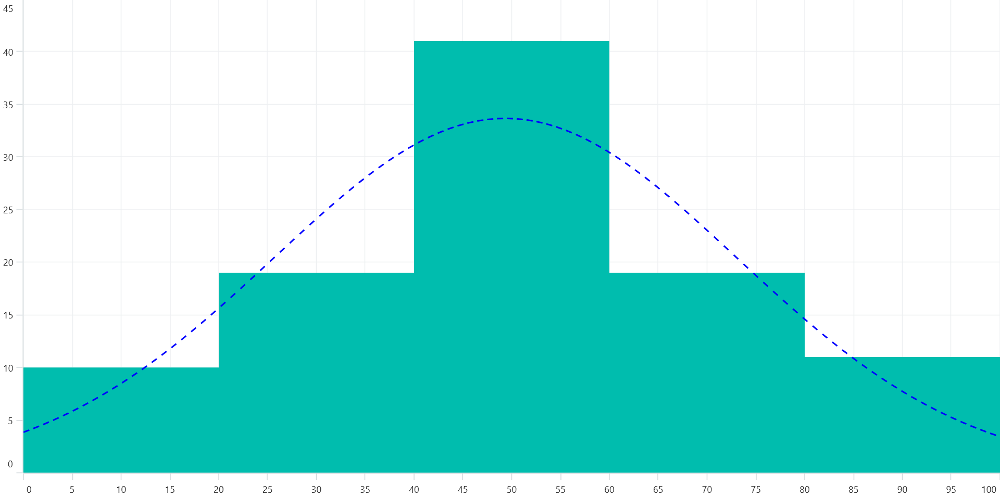

# Histogram Chart in .NET MAUI Chart

[Histogram chart](https://help.syncfusion.com/cr/maui-toolkit/Syncfusion.Maui.Toolkit.Charts.HistogramSeries.html) is a graphical representation that organizes a group of data points into user-specified ranges. It is similar in appearance to a column chart.

You can customize histogram intervals using the [HistogramInterval](https://help.syncfusion.com/cr/maui-toolkit/Syncfusion.Maui.Toolkit.Charts.HistogramSeries.html#Syncfusion_Maui_Toolkit_Charts_HistogramSeries_HistogramInterval) property, and the normal distribution curve can be toggled using the [ShowNormalDistributionCurve](https://help.syncfusion.com/cr/maui-toolkit/Syncfusion.Maui.Toolkit.Charts.HistogramSeries.html#Syncfusion_Maui_Toolkit_Charts_HistogramSeries_ShowNormalDistributionCurve) property. 





<chart:SfCartesianChart>

    <chart:SfCartesianChart.XAxes>
        <chart:NumericalAxis/>
    </chart:SfCartesianChart.XAxes>

    <chart:SfCartesianChart.YAxes>
        <chart:NumericalAxis/>
    </chart:SfCartesianChart.YAxes>

    <chart:HistogramSeries ItemsSource="{Binding HistogramData}"
                           XBindingPath="Value" 
                           YBindingPath="Size"
                           HistogramInterval="20" 
                           ShowNormalDistributionCurve="True"/>
   
</chart:SfCartesianChart>





SfCartesianChart chart = new SfCartesianChart();

NumericalAxis xAxis = new NumericalAxis();
chart.XAxes.Add(xAxis);

NumericalAxis yAxis = new NumericalAxis();
chart.YAxes.Add(yAxis);

// Create a histogram series to visualize distribution in the chart
HistogramSeries histogramSeries = new HistogramSeries
{
    ItemsSource = new ViewModel().HistogramData, 
    XBindingPath = "Value",
    YBindingPath = "Size",
    HistogramInterval = 20,
    ShowNormalDistributionCurve = true
};

// Add the configured histogram series to the chart's series collection
chart.Series.Add(histogramSeries);
this.Content = chart;





## Customization of Distribution Curve

You can customize the normal distribution curve by using the [CurveStyle](https://help.syncfusion.com/cr/maui-toolkit/Syncfusion.Maui.Toolkit.Charts.HistogramSeries.html#Syncfusion_Maui_Toolkit_Charts_HistogramSeries_CurveStyle) property.





<chart:SfCartesianChart>
    ....
    <chart:HistogramSeries ItemsSource="{Binding HistogramData}" 
                           XBindingPath="Value" 
                           YBindingPath="Size"
                           HistogramInterval="20"
                           ShowNormalDistributionCurve="True">
        <chart:HistogramSeries.CurveStyle>
            <chart:ChartLineStyle Stroke="Blue"
                                  StrokeWidth="2">
            </chart:ChartLineStyle>
        </chart:HistogramSeries.CurveStyle>
    </chart:HistogramSeries>
</chart:SfCartesianChart>





SfCartesianChart chart = new SfCartesianChart();
....
HistogramSeries histogramSeries = new HistogramSeries
{
    ItemsSource = new ViewModel().HistogramData, 
    XBindingPath = "Value",
    YBindingPath = "Size",
    HistogramInterval = 20,
    ShowNormalDistributionCurve = true,
    // Customize the appearance of the distribution curve
    CurveStyle = new ChartLineStyle()
    {
        Stroke = Color.Blue,
        StrokeWidth = 2
    }
};

chart.Series.Add(histogramSeries);
this.Content = chart;





