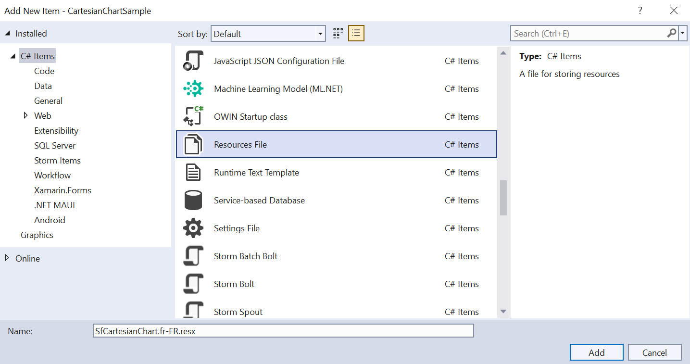
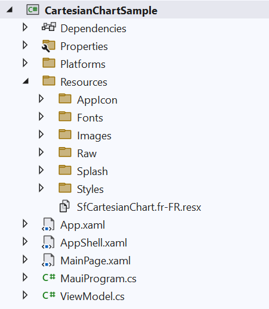
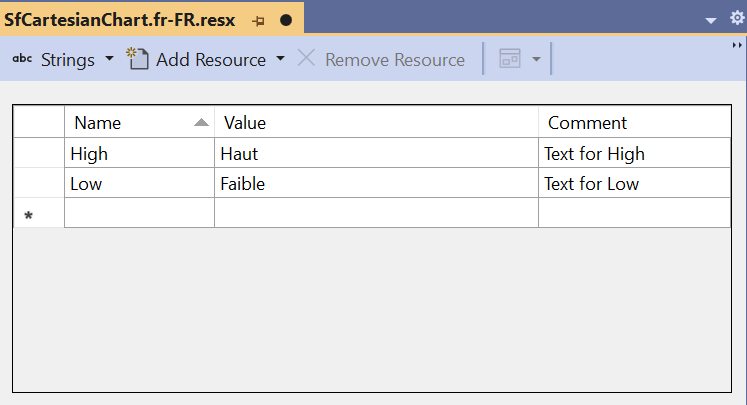
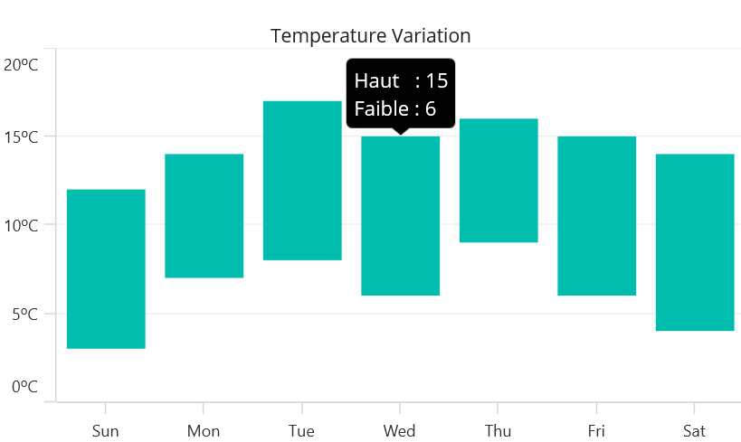

# Localization in .NET MAUI Chart (SfCartesianChart)

Localization is the process of translating the application resources into different languages for specific cultures. The `SfCartesianChart` can be localized by adding a `resource` file. 

## Setting CurrentUICulture to the application

Application culture can be changed by setting `CurrentUICulture` in the `App.xaml.cs` file.




using Syncfusion.Maui.Toolkit.Charts;
using System.Resources;
using System.Globalization;

public partial class App : Application
{
	public App()
	{
		InitializeComponent();
		CultureInfo.CurrentUICulture = new CultureInfo("fr-FR");
		// ResXPath => Full path of the resx file; For example : 
		//SfCartesianChartResources.ResourceManager = new ResourceManager
		// ("CartesianChartSample.Resources.SfCartesianChart", Application.Current.GetType().Assembly);
        
		var ResXPath = "CartesianChartSample.Resources.SfCartesianChart";
		SfCartesianChartResources.ResourceManager = new ResourceManager(ResXPath, Application.Current.GetType().Assembly);
		MainPage = new MainPage();
	}
}




N> The required `resx` files with `Build Action` as `EmbeddedResource` (File name should contain culture code) should be added into the `Resources` folder.

## Localize application level

To localize the `Chart` based on `CurrentUICulture` using `resource` files, follow these steps:

1. Right-click on the `Resources` folder, select `Add` and then `New Item`.

2. In Add New Item, select the Resource File option and name the filename as `SfCartesianChart.<culture name>.resx`. For example, give the name as `SfCartesianChart.fr-FR.resx` for French culture.

3. The culture name indicates the name of the language and country.

   

4. Now, select `Add` option to add the resource file in **Resources** folder.

   

5. Add the Name/Value pair in Resource Designer of `SfCartesianChart.fr-FR.resx` file and change its corresponding value to the appropriate culture.

   

Here, you can see how localization was performed for the tooltip.
   