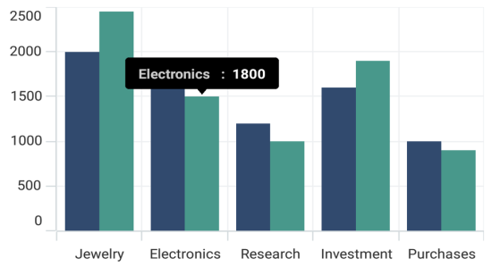

# Tooltip in .NET MAUI Chart

Tooltip is used to display any information or metadata of the tapped segment. The Cartesian chart provides tooltip support for all series. 

To learn how to customize the tooltips in .NET MAUI Cartesian Charts quickly, you can check the below video.



## Define Tooltip

To define the tooltip in the series, set the [EnableTooltip](https://help.syncfusion.com/cr/maui-toolkit/Syncfusion.Maui.Toolkit.Charts.ChartSeries.html#Syncfusion_Maui_Toolkit_Charts_ChartSeries_EnableTooltip) property to true. The default value of [EnableTooltip](https://help.syncfusion.com/cr/maui-toolkit/Syncfusion.Maui.Toolkit.Charts.ChartSeries.html#Syncfusion_Maui_Toolkit_Charts_ChartSeries_EnableTooltip) property is `false`.





<chart:SfCartesianChart>
    . . .
    <chart:ColumnSeries ItemsSource="{Binding Data}" 
                        XBindingPath="Demand"
                        YBindingPath="Year2010" 
                        EnableTooltip="True"/>

    <chart:ColumnSeries ItemsSource="{Binding Data}" 
                        XBindingPath="Demand"
                        YBindingPath="Year2011"
                        EnableTooltip="True"/>
</chart:SfCartesianChart>





SfCartesianChart chart = new SfCartesianChart();
. . .
ColumnSeries series1 = new ColumnSeries()
{
    ItemsSource = new ViewModel().Data,
    XBindingPath = "Demand",
    YBindingPath = "Year2010",
    EnableTooltip = true // Enable tooltips for this series
};

ColumnSeries series2 = new ColumnSeries()
{
    ItemsSource = new ViewModel().Data,
    XBindingPath = "Demand",
    YBindingPath = "Year2011",
    EnableTooltip = true // Enable tooltips for this series
};

chart.Series.Add(series1);
chart.Series.Add(series2);
this.Content = chart;





The [ChartTooltipBehavior](https://help.syncfusion.com/cr/maui-toolkit/Syncfusion.Maui.Toolkit.Charts.ChartTooltipBehavior.html) is used to customize the tooltip. For customizing the tooltip, create an instance [ChartTooltipBehavior](https://help.syncfusion.com/cr/maui-toolkit/Syncfusion.Maui.Toolkit.Charts.ChartTooltipBehavior.html) and set it to the [TooltipBehavior](https://help.syncfusion.com/cr/maui-toolkit/Syncfusion.Maui.Toolkit.Charts.ChartBase.html#Syncfusion_Maui_Toolkit_Charts_ChartBase_TooltipBehavior) property of [SfCartesianChart](https://help.syncfusion.com/cr/maui-toolkit/Syncfusion.Maui.Toolkit.Charts.SfCartesianChart.html). The following properties are used to customize the tooltip:

* [Background](https://help.syncfusion.com/cr/maui-toolkit/Syncfusion.Maui.Toolkit.Charts.ChartTooltipBehavior.html#Syncfusion_Maui_Toolkit_Charts_ChartTooltipBehavior_Background) - Gets or sets the background color to the tooltip label.
* [FontAttributes](https://help.syncfusion.com/cr/maui-toolkit/Syncfusion.Maui.Toolkit.Charts.ChartTooltipBehavior.html#Syncfusion_Maui_Toolkit_Charts_ChartTooltipBehavior_FontAttributes) - Gets or sets the font style for the label.
* [FontFamily](https://help.syncfusion.com/cr/maui-toolkit/Syncfusion.Maui.Toolkit.Charts.ChartTooltipBehavior.html#Syncfusion_Maui_Toolkit_Charts_ChartTooltipBehavior_FontFamily) - Gets or sets the font family name for the label.
* [FontSize](https://help.syncfusion.com/cr/maui-toolkit/Syncfusion.Maui.Toolkit.Charts.ChartTooltipBehavior.html#Syncfusion_Maui_Toolkit_Charts_ChartTooltipBehavior_FontSize) - Gets or sets the font size for the label.
* [Duration](https://help.syncfusion.com/cr/maui-toolkit/Syncfusion.Maui.Toolkit.Charts.ChartTooltipBehavior.html#Syncfusion_Maui_Toolkit_Charts_ChartTooltipBehavior_Duration) - Gets or sets the duration of the tooltip text in seconds.
* [Margin](https://help.syncfusion.com/cr/maui-toolkit/Syncfusion.Maui.Toolkit.Charts.ChartTooltipBehavior.html#Syncfusion_Maui_Toolkit_Charts_ChartTooltipBehavior_Margin) - Gets or sets the margin of the label to customize the appearance of label.
* [TextColor](https://help.syncfusion.com/cr/maui-toolkit/Syncfusion.Maui.Toolkit.Charts.ChartTooltipBehavior.html#Syncfusion_Maui_Toolkit_Charts_ChartTooltipBehavior_TextColor) - Used to set the color for the text of the label.




<chart:SfCartesianChart>
    <chart:SfCartesianChart.TooltipBehavior>
        <chart:ChartTooltipBehavior/>
    </chart:SfCartesianChart.TooltipBehavior>
    . . .
</chart:SfCartesianChart>




SfCartesianChart chart = new SfCartesianChart();
chart.TooltipBehavior = new ChartTooltipBehavior();
. . .
this.Content = chart;




## Duration

The [Duration](https://help.syncfusion.com/cr/maui-toolkit/Syncfusion.Maui.Toolkit.Charts.ChartTooltipBehavior.html#Syncfusion_Maui_Toolkit_Charts_ChartTooltipBehavior_Duration) property is used to specify the duration time in milliseconds for which tooltip will be displayed.





<chart:SfCartesianChart>
    . . .
    <chart:SfCartesianChart.TooltipBehavior>
        <chart:ChartTooltipBehavior Duration="5000"/>
    </chart:SfCartesianChart.TooltipBehavior>

    <chart:ColumnSeries ItemsSource="{Binding Data}" 
                        XBindingPath="Demand"
                        YBindingPath="Year2010" 
                        EnableTooltip="True"/>
                
    <chart:ColumnSeries ItemsSource="{Binding Data}" 
                        XBindingPath="Demand"
                        YBindingPath="Year2011"
                        EnableTooltip="True"/>
</chart:SfCartesianChart>





SfCartesianChart chart = new SfCartesianChart();
. . .
// Set the tooltip behavior for the chart with a specified duration
chart.TooltipBehavior = new ChartTooltipBehavior()
{
    Duration = 5000
};

ColumnSeries series1 = new ColumnSeries()
{
    ItemsSource = new ViewModel().Data,
    XBindingPath = "Demand",
    YBindingPath = "Year2010",
    EnableTooltip = true
};

ColumnSeries series2 = new ColumnSeries()
{
    ItemsSource = new ViewModel().Data,
    XBindingPath = "Demand",
    YBindingPath = "Year2011",
    EnableTooltip = true
};

chart.Series.Add(series1);
chart.Series.Add(series2);
this.Content = chart;





## Template

The [SfCartesianChart](https://help.syncfusion.com/cr/maui-toolkit/Syncfusion.Maui.Toolkit.Charts.SfCartesianChart.html) provides support to customize the appearance of the tooltip by using the [TooltipTemplate](https://help.syncfusion.com/cr/maui-toolkit/Syncfusion.Maui.Toolkit.Charts.ChartSeries.html#Syncfusion_Maui_Toolkit_Charts_ChartSeries_TooltipTemplate) property.





<chart:SfCartesianChart >
    <chart:SfCartesianChart.Resources>
        <DataTemplate x:Key="tooltipTemplate">
            <StackLayout Orientation="Horizontal">
                <Label Text="{Binding Item.Category}"
					   TextColor="Black"
					   FontAttributes="Bold"
					   FontSize="12"
					   HorizontalOptions="Center"
					   VerticalOptions="Center"/>
                <Label Text=" : "
                      TextColor="Black"
	                  FontAttributes="Bold"
	                  FontSize="12"
	                  HorizontalOptions="Center"
	                  VerticalOptions="Center"/> 
                <Label Text="{Binding Item.Value}"
                       TextColor="Black"
                       FontAttributes="Bold"
                       FontSize="12"
                       HorizontalOptions="Center"
                       VerticalOptions="Center"/>
            </StackLayout>
        </DataTemplate>
        . . .          
    </chart:SfCartesianChart.Resources>
    . . .
    <chart:SfCartesianChart.TooltipBehavior>
        <chart:ChartTooltipBehavior/>
    </chart:SfCartesianChart.TooltipBehavior>

    <chart:ColumnSeries ItemsSource="{Binding Data}" TooltipTemplate="{StaticResource tooltipTemplate}"
                        XBindingPath="Demand"
                        YBindingPath="Year2010" 
                        EnableTooltip="True"/>
    <chart:ColumnSeries ItemsSource="{Binding Data}" TooltipTemplate="{StaticResource tooltipTemplate}"
                        XBindingPath="Demand"
                        YBindingPath="Year2011" 
                        EnableTooltip="True"/>
</chart:SfCartesianChart>





SfCartesianChart chart = new SfCartesianChart();
. . .
ColumnSeries series1 = new ColumnSeries()
{
    ItemsSource = new ViewModel().Data,
    XBindingPath = "Demand",
    YBindingPath = "Year2010",
    EnableTooltip = true,
    TooltipTemplate = chart.Resources["tooltipTemplate"] as DataTemplate  // Set a custom tooltip template from the chart's resources
};

ColumnSeries series2 = new ColumnSeries()
{
    ItemsSource = new ViewModel().Data,
    XBindingPath = "Demand",
    YBindingPath = "Year2010",
    EnableTooltip = true,
    TooltipTemplate = chart.Resources["tooltipTemplate"] as DataTemplate  // Set a custom tooltip template from the chart's resources
};

chart.Series.Add(series1);
chart.Series.Add(series2);
this.Content = chart;
        




## Methods

You can show or hide the chart tooltip programmatically by using the show or hide method.

### Show method

The [Show](https://help.syncfusion.com/cr/maui-toolkit/Syncfusion.Maui.Toolkit.Charts.ChartTooltipBehavior.html#Syncfusion_Maui_Toolkit_Charts_ChartTooltipBehavior_Show_System_Single_System_Single_System_Boolean_) method is used to activate the tooltip at the specified location.





<chart:SfCartesianChart>
    .....
    <chart:SfCartesianChart.TooltipBehavior>
        <chart:ChartTooltipBehavior x:Name="tooltip"/>
    </chart:SfCartesianChart.TooltipBehavior>
    .....
</chart:SfCartesianChart>

<Button Text="Show tooltip" Clicked="Button_Clicked"/>









private void Button_Clicked(object sender, EventArgs e)
{
    //pointX - determines the x position of the tooltip, pointY - determines the y position of the tooltip and the bool value determines whether the tooltip should be animated while displaying.
            
    tooltip.Show(pointX, pointY, true);
}
   




N> The tooltip will be activated at the specified location only if there is any data point under the specified location.

### Hide method

The [Hide](https://help.syncfusion.com/cr/maui-toolkit/Syncfusion.Maui.Toolkit.Charts.ChartTooltipBehavior.html#Syncfusion_Maui_Toolkit_Charts_ChartTooltipBehavior_Hide) method is used to hide the tooltip programmatically.





//The argument determines whether the tooltip should be animated while hiding.

tooltip.Hide();



