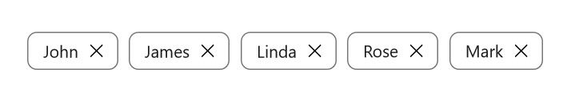
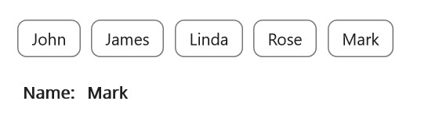

# Getting Started with .NET MAUI Chips

This section provides instructions for setting up and configuring Chips control [Chips](https://help.syncfusion.com/cr/maui-toolkit/Syncfusion.Maui.Toolkit.Chips.html) in your .NET MAUI application. Follow the steps below to integrate a basic Chips component into your project.

## Prerequisites

Before proceeding, ensure the following are setup:

1. Install [.NET 8 SDK](https://dotnet.microsoft.com/en-us/download/dotnet/8.0) or later.
2. Set up a .NET MAUI environment with Visual Studio 2022 (v17.8 or later) or Visual Studio Code. For Visual Studio Code users, ensure that the .NET MAUI workload is installed and configured as described [here](https://learn.microsoft.com/en-us/dotnet/maui/get-started/installation?view=net-maui-8.0&tabs=visual-studio-code).

## Step 1: Create a New .NET MAUI Project

### Visual Studio

1. Go to **File > New > Project** and choose the **.NET MAUI App** template.
2. Name the project and choose a location. Then, click **Next**.
3. Select the .NET framework version and click **Create**.

### Visual Studio Code

1. Open the Command Palette by pressing **Ctrl+Shift+P** and type **.NET:New Project** and press Enter.
2. Choose the **.NET MAUI App** template.
3. Select the project location, type the project name and press **Enter**.
4. Then choose **Create project**

## Step 2: Install the Syncfusion .NET MAUI Toolkit Package

### Visual Studio
1. In **Solution Explorer**, right-click the project and choose **Manage NuGet Packages**.
2. Search for [Syncfusion.Maui.Toolkit](https://help.syncfusion.com/cr/maui-toolkit/Syncfusion.Maui.Toolkit.html) and install the latest version.
3. Ensure the necessary dependencies are installed correctly, and the project is restored.

### Visual Studio Code
1. Press <kbd>Ctrl</kbd> + <kbd>`</kbd> (backtick) to open the integrated terminal in Visual Studio Code.
2. Ensure you're in the project root directory where your .csproj file is located.
3. Run the command `dotnet add package Syncfusion.Maui.Toolkit` to install the Syncfusion .NET MAUI Toolkit NuGet package.
4. To ensure all dependencies are installed, run `dotnet restore`.

## Step 3: Register the Handler 

In the **MauiProgram.cs file**, register the handler for Syncfusion Toolkit.



using Syncfusion.Maui.Toolkit.Hosting;
public static class MauiProgram
{
	public static MauiApp CreateMauiApp()
	{
		var builder = MauiApp.CreateBuilder();
		builder
		.UseMauiApp<App>()
		.ConfigureSyncfusionToolkit()
		.ConfigureFonts(fonts =>
		{
			fonts.AddFont("OpenSans-Regular.ttf", "OpenSansRegular");
		});

		return builder.Build();
	}      
}
   
 

## Step 4: Add a .NET MAUI Chips control

Step 1. To initialize the control, import the `Syncfusion.Maui.Toolkit.Chips` namespace into your code.

Step 2. Initialize `SfChip` class.




	
	xmlns:ChipControl="clr-namespace:Syncfusion.Maui.Toolkit.Chips;assembly=Syncfusion.Maui.Toolkit"
       




    using Syncfusion.Maui.Toolkit.Chips;





Step 3: Set the control to content in `ContentPage.`

## For SfChip





<ContentPage.Content>    
    <ChipControl:SfChip x:Name="chips" />
</ContentPage.Content>




          
SfChip chips = new SfChip(); 
Content = chips;  





## For SfChipGroup

Initialize an empty `SfChipGroup` as shown in the following code snippet





<ContentPage.Content>
	<Grid>
		<ChipControl:SfChipGroup/>
	</Grid>
</ContentPage.Content>





using Syncfusion.Maui.Toolkit.Chips;
Grid grid = new Grid();
SfChipGroup chipGroup = new SfChipGroup();
grid.Children.Add(chipGroup);
this.Content = grid;
		




## Set layout for the control

The chips control creates chip for each object and arranges chips in a `StackLayout` with horizontal orientation. Any layout can be used to arrange the chips in the chips control. In the following example, the `FlexLayout` has been used. 





<ContentPage.Content>
	<Grid>
		<ChipControl:SfChipGroup DisplayMemberPath="Name">
			<ChipControl:SfChipGroup.ChipLayout>
				<FlexLayout 
					HorizontalOptions="Start" 
					VerticalOptions="Center"/> 
			</ChipControl:SfChipGroup.ChipLayout>
		</ChipControl:SfChipGroup> 
	</Grid>
</ContentPage.Content>





using Syncfusion.Maui.Toolkit.Chips;
Grid grid = new Grid();
SfChipGroup chipGroup = new SfChipGroup();
chipGroup.DispalyMemberPath="Name";
grid.Children.Add(chipGroup);
FlexLayout layout = new FlexLayout()
{
	HorizontalOptions = LayoutOptions.Start,
	VerticalOptions = LayoutOptions.Center,
};
chipGroup.ChipLayout = layout;
this.Content = grid;
		




## Populating business objects

Now, define a simple data model of Employee with the name and image properties. Create a view model class and initialize a collection of Employee as shown in the following code sample.



namespace Chips
{
	//Model class for chips
	public class Employee
	{
		public string Name
		{
			get;
			set;
		}
	}
}





using System.Collections.ObjectModel;
using System.ComponentModel;
namespace Chips
{
	//View model class for chips
	public class ViewModel : INotifyPropertyChanged
	{
		private ObservableCollection<Employee> employees;
		public ObservableCollection<Employee> Employees
		{
			get { return employees; }
			set { Employees = value; OnPropertyChanged("Employees"); }
		}

		public ViewModel()
		{
			employees = new ObservableCollection<Employee>();
			employees.Add(new Employee() { Name = "John" });
			employees.Add(new Employee() { Name = "James" });
			employees.Add(new Employee() { Name = "Linda" });
			employees.Add(new Employee() { Name = "Rose" });
			employees.Add(new Employee() { Name = "Mark" });
		}

		public event PropertyChangedEventHandler PropertyChanged;

		public void OnPropertyChanged(string property)
		{
			if (PropertyChanged != null)
			{
				PropertyChanged(this, new PropertyChangedEventArgs(property));
			}
		}
	}
}



Create an instance of ViewModel class,and then set it as the `BindingContext`. Bind the `ItemsSource` property with a collection, and then set the `DisplayMemberPath` property:





<ContentPage.BindingContext>
	<local:ViewModel x:Name="viewModel"/>
</ContentPage.BindingContext>
<ContentPage.Content>
	<Grid>
		<ChipControl:SfChipGroup 
			ItemsSource="{Binding Employees}" 
			ChipPadding="8,8,0,0" 
			DisplayMemberPath="Name"
			ChipBackground="white"
			ChipTextColor="Black"
			HorizontalOptions="Start" 
			VerticalOptions="Center">
		</ChipControl:SfChipGroup>  
	</Grid>
</ContentPage.Content>





using Syncfusion.Maui.Toolkit.Chips;
using System.Collections.ObjectModel;
using System.ComponentModel;

Grid grid = new Grid();
SfChipGroup chipGroup = new SfChipGroup();
grid.Children.Add(chipGroup);
this.BindingContext = new ViewModel();
chipGroup.SetBinding(SfChipGroup.ItemsSourceProperty, "Employees");
chipGroup.DisplayMemberPath = "Name";
chipGroup.HorizontalOptions = LayoutOptions.Start;
chipGroup.VerticalOptions = LayoutOptions.Center;
chipGroup.ChipTextColor = Colors.Black;
chipGroup.ChipBackground = Colors.White;
chipGroup.ChipPadding = new Thickness(8, 8, 0, 0);
this.Content = grid;
		




## Set types of chip group

The functionality of chips control differ based on its [ChipType](https://help.syncfusion.com/cr/maui-toolkit/Syncfusion.Maui.Toolkit.Chips.SfChipGroup.html#Syncfusion_Maui_Toolkit_Chips_SfChipGroup_ChipType) property.
By default type of chips control have Input type. Input chip types have close button, using it chip can be can removed dynamically from children and the layout.

The following code example uses the [Action](https://help.syncfusion.com/cr/maui-toolkit/Syncfusion.Maui.Toolkit.Chips.SfChipsType.html#Syncfusion_Maui_Toolkit_Chips_SfChipsType_Action) type. In Action type, [Command](https://help.syncfusion.com/cr/maui-toolkit/Syncfusion.Maui.Toolkit.Chips.SfChipGroup.html#Syncfusion_Maui_Toolkit_Chips_SfChipGroup_Command) property of [SfChipGroup](https://help.syncfusion.com/cr/maui-toolkit/Syncfusion.Maui.Toolkit.Chips.SfChipGroup.html) is executed when any chip in the group is tapped. Here the Employee name of corresponding chip is set as label text when the Command is executed.





<ContentPage.BindingContext>
	<local:ViewModel/>
</ContentPage.BindingContext>
<ContentPage.Content>
	<StackLayout>
		<ChipControl:SfChipGroup
			Command="{Binding ActionCommand}" 
			ItemsSource="{Binding Employees}"
			DisplayMemberPath="Name"
			ChipType="Action">
		</ChipControl:SfChipGroup>
		<StackLayout Orientation="Horizontal">
		<Label 
			Text="Name:" 
			FontAttributes="Bold" 
			FontSize="14" />
		<Label 
			Text="{Binding Result}"
			FontAttributes="Bold" 
			FontSize="14" />
		</StackLayout>
	</StackLayout>  
</ContentPage.Content>



using System;
using System.Collections.Generic;
using System.Collections.ObjectModel;
using System.ComponentModel;
using System.Windows.Input;

namespace Chips
{
	public class ViewModel :INotifyPropertyChanged
	{
		private ICommand actionCommand;
		private ObservableCollection<Employee> employees;
		private string result;
		public ICommand ActionCommand
    	{
			get { return actionCommand; }
			set { actionCommand = value; }
    	}
    
    	public ObservableCollection<Employee> Employees
    	{
        	get { return employees; }
        	set { Employees = value; OnPropertyChanged("Employees"); }
    	}

		public string Result
		{
			get { return result; }
			set { result = value; OnPropertyChanged("Result"); }
		}

		public ViewModel()
		{
			ActionCommand = new Command(HandleAction);
			employees = new ObservableCollection<Employee>();
			employees.Add(new Employee() { Name = "John" });
			employees.Add(new Employee() { Name = "James" });
			employees.Add(new Employee() { Name = "Linda" });
			employees.Add(new Employee() { Name = "Rose" });
			employees.Add(new Employee() { Name = "Mark" });
		}

		public event PropertyChangedEventHandler PropertyChanged;

		public void OnPropertyChanged(string property)
		{
			if (PropertyChanged != null)
			{
				PropertyChanged(this, new PropertyChangedEventArgs(property));
			}
		}

		private void HandleAction(object obj)
		{
			Result = (obj as Employee).Name.ToString();
		}
	}
}





