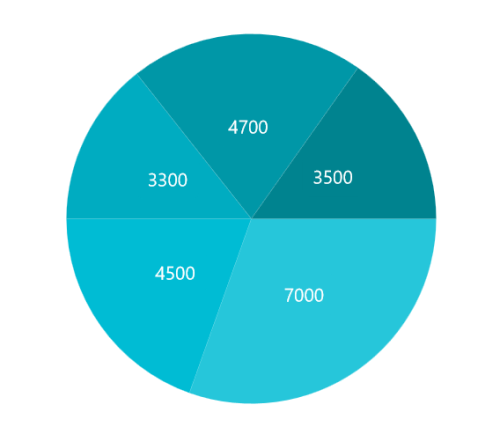
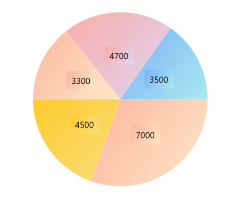
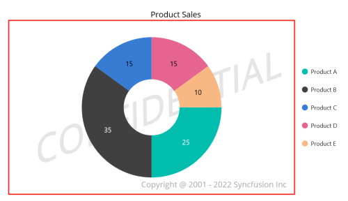

# Appearance in .NET MAUI Circular Chart

The appearance of the [SfCircularChart](https://help.syncfusion.com/cr/maui-toolkit/Syncfusion.Maui.Toolkit.Charts.SfCircularChart.html) can be customized by using predefined palettes, custom palettes, and gradients, which allows enriching your application.

## Custom PaletteBrushes

The [SfCircularChart](https://help.syncfusion.com/cr/maui-toolkit/Syncfusion.Maui.Toolkit.Charts.SfCircularChart.html) provides support to define your own brushes for series with preferred order by using the [PaletteBrushes](https://help.syncfusion.com/cr/maui-toolkit/Syncfusion.Maui.Toolkit.Charts.ChartSeries.html#Syncfusion_Maui_Toolkit_Charts_ChartSeries_PaletteBrushes) property as shown in the following code example.




<chart:SfCircularChart>
    <!-- Other chart configurations -->
    <chart:PieSeries 
        ItemsSource="{Binding Data}"
        XBindingPath="XValue"
        YBindingPath="YValue"
        PaletteBrushes="{Binding CustomBrushes}"/>
</chart:SfCircularChart>



public class ViewModel
{
    // Collection to hold the data for the chart
    public ObservableCollection<Model> Data { get; set; }

    // List to store custom brush colors for the chart
    public List<Brush> CustomBrushes { get; set; }

    public ViewModel()
    {
        // Initialize the CustomBrushes list
        CustomBrushes = new List<Brush>();

        // Add custom color brushes to the list
        CustomBrushes.Add(new SolidColorBrush(Color.FromRgb(38, 198, 218)));  // Light cyan
        CustomBrushes.Add(new SolidColorBrush(Color.FromRgb(0, 188, 212)));   // Cyan
        CustomBrushes.Add(new SolidColorBrush(Color.FromRgb(0, 172, 193)));   // Dark cyan
        CustomBrushes.Add(new SolidColorBrush(Color.FromRgb(0, 151, 167)));   // Darker cyan
        CustomBrushes.Add(new SolidColorBrush(Color.FromRgb(0, 131, 143)));   // Darkest cyan
    }

    // ... Other methods and properties ...
}




## Applying Gradient

The gradient for the circular chart can be set by using the [PaletteBrushes](https://help.syncfusion.com/cr/maui-toolkit/Syncfusion.Maui.Toolkit.Charts.ChartSeries.html#Syncfusion_Maui_Toolkit_Charts_ChartSeries_PaletteBrushes) property of the series with the help of the `LinearGradientBrush` or `RadialGradientBrush`.




<chart:SfCircularChart>
    <!-- Other chart configurations -->
    <chart:PieSeries
        ItemsSource="{Binding Data}"
			 XBindingPath="XValue" 
			 YBindingPath="YValue"
			 PaletteBrushes="{Binding CustomBrushes}"/>
</chart:SfCircularChart>



public class ViewModel
{
    // Collection to hold data models
    public ObservableCollection<Model> Data { get; set; }

    // List to store custom brushes
    public List<Brush> CustomBrushes { get; set; }

    public ViewModel()
    {
        CustomBrushes = new List<Brush>();

        // Create and configure gradient brush 1
        LinearGradientBrush gradientColor1 = new LinearGradientBrush();
        gradientColor1.GradientStops = new GradientStopCollection()
        {
            new GradientStop() { Offset = 1, Color = Color.FromRgb(255, 231, 199) },
            new GradientStop() { Offset = 0, Color = Color.FromRgb(252, 182, 159) }
        };
        // Create and configure gradient brush 2
        LinearGradientBrush gradientColor2 = new LinearGradientBrush();
        gradientColor2.GradientStops = new GradientStopCollection()
        {
            new GradientStop() { Offset = 1, Color = Color.FromRgb(180, 225, 151) },
            new GradientStop() { Offset = 0, Color = Color.FromRgb(111, 183, 214) }
        };

        // Create and configure gradient brush 3
        LinearGradientBrush gradientColor3 = new LinearGradientBrush();
        gradientColor3.GradientStops = new GradientStopCollection()
        {
            new GradientStop() { Offset = 1, Color = Color.FromRgb(255, 231, 199) },
            new GradientStop() { Offset = 0, Color = Color.FromRgb(252, 182, 159) }
        };

        // Create and configure gradient brush 4
        LinearGradientBrush gradientColor4 = new LinearGradientBrush();
        gradientColor4.GradientStops = new GradientStopCollection()
        {
            new GradientStop() { Offset = 1, Color = Color.FromRgb(221, 214, 243) },
            new GradientStop() { Offset = 0, Color = Color.FromRgb(250, 172, 168) }
        };

        // Create and configure gradient brush 5
        LinearGradientBrush gradientColor5 = new LinearGradientBrush();
        gradientColor5.GradientStops = new GradientStopCollection()
{
            new GradientStop() { Offset = 1, Color = Color.FromRgb(168, 234, 238) },
            new GradientStop() { Offset = 0, Color = Color.FromRgb(123, 176, 249) }
};

        // Add all gradient brushes to the CustomBrushes list
        CustomBrushes.Add(gradientColor1);
        CustomBrushes.Add(gradientColor2);
        CustomBrushes.Add(gradientColor3);
        CustomBrushes.Add(gradientColor4);
        CustomBrushes.Add(gradientColor5);
    }
    // ... (other methods or properties)
}




## Plotting Area Customization

[SfCircularChart](https://help.syncfusion.com/cr/maui-toolkit/Syncfusion.Maui.Toolkit.Charts.SfCircularChart.html) allows you to add any view to the chart plot area, which is useful for adding relevant data, watermarks, or color gradients to the background of the chart.




<chart:SfCircularChart>
    <!-- Other chart configurations -->
    <chart:SfCircularChart.PlotAreaBackgroundView>
        <AbsoluteLayout>
            <Border Stroke="red"
                    StrokeThickness="2"
                    AbsoluteLayout.LayoutBounds="0,0,1,1"
                    AbsoluteLayout.LayoutFlags="All"/>
            <Label Text="Copyright @ 2001 - 2022 Syncfusion Inc"
                  FontSize="18"
                  AbsoluteLayout.LayoutBounds="1,1,-1,-1"
                  AbsoluteLayout.LayoutFlags="PositionProportional"
                  Opacity="0.4"/>
            <Label Text="CONFIDENTIAL"
                  Rotation="340"
                  FontSize="80"
                  FontAttributes="Bold,Italic"
                  TextColor="Gray"
                  Margin="10,0,0,0"
                  AbsoluteLayout.LayoutBounds="0.5,0.5,-1,-1"
                  AbsoluteLayout.LayoutFlags="PositionProportional"
                  Opacity="0.3"/>
        </AbsoluteLayout>
    </chart:SfCircularChart.PlotAreaBackgroundView>
</chart:SfCircularChart>



// Create a new SfCircularChart
SfCircularChart chart = new SfCircularChart();

// Create an AbsoluteLayout to hold custom elements
AbsoluteLayout absoluteLayout = new AbsoluteLayout();

// Create a border for the chart plot area
var border = new Border()
{
    Stroke = new SolidColorBrush(Colors.Red),
    StrokeThickness = 2
};
AbsoluteLayout.SetLayoutBounds(border, new Rect(0, 0, 1, 1));
AbsoluteLayout.SetLayoutFlags(border, Microsoft.Maui.Layouts.AbsoluteLayoutFlags.All);
absoluteLayout.Children.Add(border);

// Create a copyright label
var copyRight = new Label()
{
    Text = "Copyright @ 2001 - 2022 Syncfusion Inc",
    FontSize = 18,
    Opacity = 0.4
};

// Position the copyright label at the bottom-right corner
AbsoluteLayout.SetLayoutBounds(copyRight, new Rect(1, 1, -1, -1));
AbsoluteLayout.SetLayoutFlags(copyRight, Microsoft.Maui.Layouts.AbsoluteLayoutFlags.PositionProportional);
absoluteLayout.Children.Add(copyRight);

// Create a watermark label
var watermark = new Label()
{
    Text = "CONFIDENTIAL",
    Rotation = 340,
    FontSize = 80,
    FontAttributes = FontAttributes.Bold | FontAttributes.Italic,
    TextColor = Colors.Gray,
    Margin = new Thickness(10, 0, 0, 0),
    Opacity = 0.3
};

// Position the watermark in the center
AbsoluteLayout.SetLayoutBounds(watermark, new Rect(0.5, 0.5, -1, -1));
AbsoluteLayout.SetLayoutFlags(watermark, Microsoft.Maui.Layouts.AbsoluteLayoutFlags.PositionProportional);
absoluteLayout.Children.Add(watermark);

// Set the AbsoluteLayout as the PlotAreaBackgroundView
chart.PlotAreaBackgroundView = absoluteLayout;

// Set the chart as the content of the current page/view
this.Content = chart;




