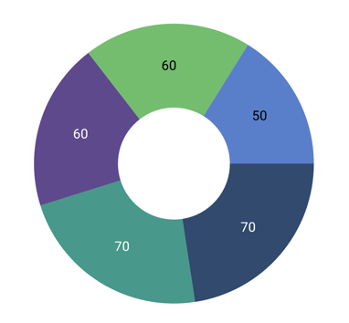
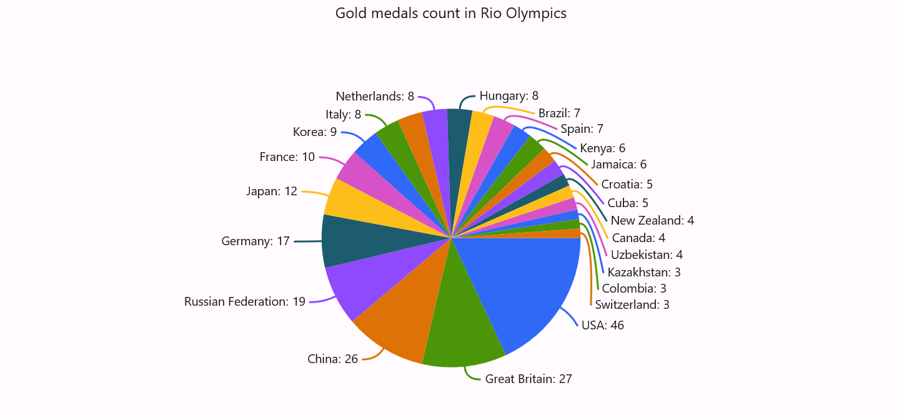
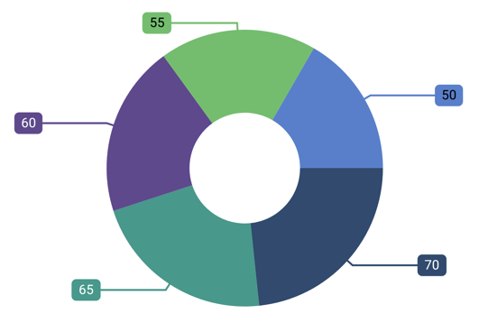
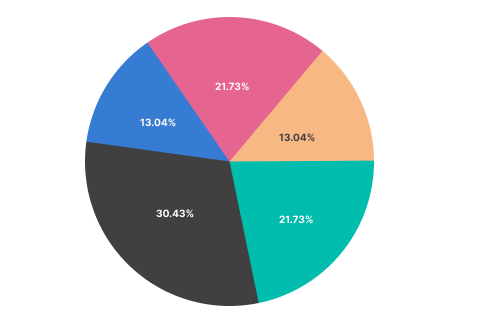
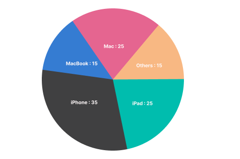
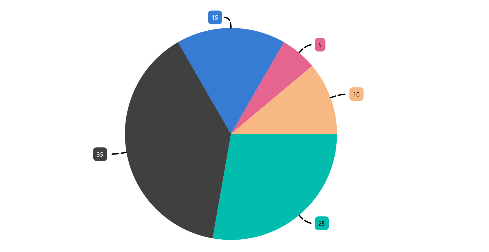

# Data Labels in .NET MAUI Circular Chart

Data labels are used to display values related to a chart segment. Values from data points (x, y) or other custom properties from a data source can be displayed.

Each data label consists of the following components:
* Label - displays the segment label content at the (X, Y) point.
* Connector line - connects the (X, Y) point and the label element.

## Enable Data Labels 

The [ShowDataLabels](https://help.syncfusion.com/cr/maui-toolkit/Syncfusion.Maui.Toolkit.Charts.ChartSeries.html#Syncfusion_Maui_Toolkit_Charts_ChartSeries_ShowDataLabels) property of series is used to enable the data labels.





<chart:SfCircularChart>
    <!-- Other chart configurations -->
    <chart:PieSeries ItemsSource="{Binding Data}"  
                     XBindingPath="Product" 
                     YBindingPath="SalesRate"
                     ShowDataLabels="True"/>
</chart:SfCircularChart>





SfCircularChart chart = new SfCircularChart();
// Other chart configurations
PieSeries series = new PieSeries();
// Enable data labels for this series
series.ShowDataLabels = true;
// Other series configurations
chart.Series.Add(series);

this.Content = chart;



 

Data labels can be customized using the [DataLabelSettings](https://help.syncfusion.com/cr/maui-toolkit/Syncfusion.Maui.Toolkit.Charts.CircularSeries.html#Syncfusion_Maui_Toolkit_Charts_CircularSeries_DataLabelSettings) property of chart series. For customization, create an instance of [CircularDataLabelSettings](https://help.syncfusion.com/cr/maui-toolkit/Syncfusion.Maui.Toolkit.Charts.CircularDataLabelSettings.html) and set it to the [DataLabelSettings](https://help.syncfusion.com/cr/maui-toolkit/Syncfusion.Maui.Toolkit.Charts.CircularSeries.html#Syncfusion_Maui_Toolkit_Charts_CircularSeries_DataLabelSettings) property. The following properties are available in [CircularDataLabelSettings](https://help.syncfusion.com/cr/maui-toolkit/Syncfusion.Maui.Toolkit.Charts.CircularDataLabelSettings.html) for customization:

* [LabelPosition](https://help.syncfusion.com/cr/maui-toolkit/Syncfusion.Maui.Toolkit.Charts.CircularDataLabelSettings.html#Syncfusion_Maui_Toolkit_Charts_CircularDataLabelSettings_LabelPosition) - Gets or sets the data label position, either inside or outside of the chart segment.
* [SmartLabelAlignment](https://help.syncfusion.com/cr/maui-toolkit/Syncfusion.Maui.Toolkit.Charts.CircularDataLabelSettings.html#Syncfusion_Maui_Toolkit_Charts_CircularDataLabelSettings_SmartLabelAlignment) - Gets or sets the option to smartly arrange the data labels to avoid intersection when labels overlap.
* [UseSeriesPalette](https://help.syncfusion.com/cr/maui-toolkit/Syncfusion.Maui.Toolkit.Charts.ChartDataLabelSettings.html#Syncfusion_Maui_Toolkit_Charts_ChartDataLabelSettings_UseSeriesPalette) - Gets or sets a value indicating whether the data label should reflect the series interior.
* [ConnectorLineSettings](https://help.syncfusion.com/cr/maui-toolkit/Syncfusion.Maui.Toolkit.Charts.CircularDataLabelSettings.html#Syncfusion_Maui_Toolkit_Charts_CircularDataLabelSettings_ConnectorLineSettings) - Gets or sets the options for customizing the appearance of the data label connector line.
* [LabelStyle](https://help.syncfusion.com/cr/maui-toolkit/Syncfusion.Maui.Toolkit.Charts.ChartDataLabelSettings.html#Syncfusion_Maui_Toolkit_Charts_ChartDataLabelSettings_LabelStyle) - Gets or sets the options for customizing the data labels. 

N> Data label support is applicable only for [PieSeries](https://help.syncfusion.com/cr/maui-toolkit/Syncfusion.Maui.Toolkit.Charts.PieSeries.html) and [DoughnutSeries](https://help.syncfusion.com/cr/maui-toolkit/Syncfusion.Maui.Toolkit.Charts.DoughnutSeries.html) chart types.

## Data Label Position

The [LabelPosition](https://help.syncfusion.com/cr/maui-toolkit/Syncfusion.Maui.Toolkit.Charts.CircularDataLabelSettings.html#Syncfusion_Maui_Toolkit_Charts_CircularDataLabelSettings_LabelPosition) property is used to place the data labels either [Inside](https://help.syncfusion.com/cr/maui-toolkit/Syncfusion.Maui.Toolkit.Charts.ChartDataLabelPosition.html#Syncfusion_Maui_Toolkit_Charts_ChartDataLabelPosition_Inside) or [Outside](https://help.syncfusion.com/cr/maui-toolkit/Syncfusion.Maui.Toolkit.Charts.ChartDataLabelPosition.html#Syncfusion_Maui_Toolkit_Charts_ChartDataLabelPosition_Outside) of the chart segment. By default, the data labels are placed inside the series.





<chart:SfCircularChart>
    <chart:PieSeries ItemsSource="{Binding Data}" 
                     ShowDataLabels="True"
                     XBindingPath="Product" 
                     YBindingPath="SalesRate">
        <chart:PieSeries.DataLabelSettings>
            <chart:CircularDataLabelSettings LabelPosition="Outside">
            </chart:CircularDataLabelSettings>
        </chart:PieSeries.DataLabelSettings>
    </chart:PieSeries>
</chart:SfCircularChart>





SfCircularChart chart = new SfCircularChart();
// Other configurations
PieSeries series = new PieSeries();
series.ItemsSource = new SalesViewModel().Data;
series.XBindingPath = "Product";
series.YBindingPath = "SalesRate";
series.ShowDataLabels = true;

// Configure the data label settings
series.DataLabelSettings = new CircularDataLabelSettings()
{
    LabelPosition = ChartDataLabelPosition.Outside, // Position the data labels outside the pie slices
};

chart.Series.Add(series);

this.Content = chart;





## Smart Labels

The [SmartLabelAlignment](https://help.syncfusion.com/cr/maui-toolkit/Syncfusion.Maui.Toolkit.Charts.CircularDataLabelSettings.html#Syncfusion_Maui_Toolkit_Charts_CircularDataLabelSettings_SmartLabelAlignment) property is used to arrange the data labels smartly to avoid intersection when labels overlap. The [SmartLabelAlignment](https://help.syncfusion.com/cr/maui-toolkit/Syncfusion.Maui.Toolkit.Charts.SmartLabelAlignment.html) enum contains the following values:

* [Shift](https://help.syncfusion.com/cr/maui-toolkit/Syncfusion.Maui.Toolkit.Charts.SmartLabelAlignment.html#Syncfusion_Maui_Toolkit_Charts_SmartLabelAlignment_Shift) - Gets or sets the option to smartly arrange the overlapped data labels.
* [Hide](https://help.syncfusion.com/cr/maui-toolkit/Syncfusion.Maui.Toolkit.Charts.SmartLabelAlignment.html#Syncfusion_Maui_Toolkit_Charts_SmartLabelAlignment_Hide) - Gets or sets the option to hide the intersected data labels.
* [None](https://help.syncfusion.com/cr/maui-toolkit/Syncfusion.Maui.Toolkit.Charts.SmartLabelAlignment.html#Syncfusion_Maui_Toolkit_Charts_SmartLabelAlignment_None) - Gets or sets the option to keep the intersected data labels visible.

By default, the value for the [SmartLabelAlignment](https://help.syncfusion.com/cr/maui-toolkit/Syncfusion.Maui.Toolkit.Charts.CircularDataLabelSettings.html#Syncfusion_Maui_Toolkit_Charts_CircularDataLabelSettings_SmartLabelAlignment) property is [Shift](https://help.syncfusion.com/cr/maui-toolkit/Syncfusion.Maui.Toolkit.Charts.SmartLabelAlignment.html#Syncfusion_Maui_Toolkit_Charts_SmartLabelAlignment_Shift).

If the [LabelPosition](https://help.syncfusion.com/cr/maui-toolkit/Syncfusion.Maui.Toolkit.Charts.CircularDataLabelSettings.html#Syncfusion_Maui_Toolkit_Charts_CircularDataLabelSettings_LabelPosition) is [Inside](https://help.syncfusion.com/cr/maui-toolkit/Syncfusion.Maui.Toolkit.Charts.ChartDataLabelPosition.html#Syncfusion_Maui_Toolkit_Charts_ChartDataLabelPosition_Inside) and the [SmartLabelAlignment](https://help.syncfusion.com/cr/maui-toolkit/Syncfusion.Maui.Toolkit.Charts.CircularDataLabelSettings.html#Syncfusion_Maui_Toolkit_Charts_CircularDataLabelSettings_SmartLabelAlignment) is [Shift](https://help.syncfusion.com/cr/maui-toolkit/Syncfusion.Maui.Toolkit.Charts.SmartLabelAlignment.html#Syncfusion_Maui_Toolkit_Charts_SmartLabelAlignment_Shift), then the overlapped labels will shift to outside the slices and arrange smartly. If the [LabelPosition](https://help.syncfusion.com/cr/maui-toolkit/Syncfusion.Maui.Toolkit.Charts.CircularDataLabelSettings.html#Syncfusion_Maui_Toolkit_Charts_CircularDataLabelSettings_LabelPosition) is [Inside](https://help.syncfusion.com/cr/maui-toolkit/Syncfusion.Maui.Toolkit.Charts.ChartDataLabelPosition.html#Syncfusion_Maui_Toolkit_Charts_ChartDataLabelPosition_Inside) and the [SmartLabelAlignment](https://help.syncfusion.com/cr/maui-toolkit/Syncfusion.Maui.Toolkit.Charts.CircularDataLabelSettings.html#Syncfusion_Maui_Toolkit_Charts_CircularDataLabelSettings_SmartLabelAlignment) is [Hide](https://help.syncfusion.com/cr/maui-toolkit/Syncfusion.Maui.Toolkit.Charts.SmartLabelAlignment.html#Syncfusion_Maui_Toolkit_Charts_SmartLabelAlignment_Hide), then the overlapped labels will be hidden.

If the [LabelPosition](https://help.syncfusion.com/cr/maui-toolkit/Syncfusion.Maui.Toolkit.Charts.CircularDataLabelSettings.html#Syncfusion_Maui_Toolkit_Charts_CircularDataLabelSettings_LabelPosition) is [Outside](https://help.syncfusion.com/cr/maui-toolkit/Syncfusion.Maui.Toolkit.Charts.ChartDataLabelPosition.html#Syncfusion_Maui_Toolkit_Charts_ChartDataLabelPosition_Outside) and the [SmartLabelAlignment](https://help.syncfusion.com/cr/maui-toolkit/Syncfusion.Maui.Toolkit.Charts.CircularDataLabelSettings.html#Syncfusion_Maui_Toolkit_Charts_CircularDataLabelSettings_SmartLabelAlignment) is [Shift](https://help.syncfusion.com/cr/maui-toolkit/Syncfusion.Maui.Toolkit.Charts.SmartLabelAlignment.html#Syncfusion_Maui_Toolkit_Charts_SmartLabelAlignment_Shift), then the overlapped labels arrange smartly. If the [LabelPosition](https://help.syncfusion.com/cr/maui-toolkit/Syncfusion.Maui.Toolkit.Charts.CircularDataLabelSettings.html#Syncfusion_Maui_Toolkit_Charts_CircularDataLabelSettings_LabelPosition) is [Outside](https://help.syncfusion.com/cr/maui-toolkit/Syncfusion.Maui.Toolkit.Charts.ChartDataLabelPosition.html#Syncfusion_Maui_Toolkit_Charts_ChartDataLabelPosition_Outside) and the [SmartLabelAlignment](https://help.syncfusion.com/cr/maui-toolkit/Syncfusion.Maui.Toolkit.Charts.CircularDataLabelSettings.html#Syncfusion_Maui_Toolkit_Charts_CircularDataLabelSettings_SmartLabelAlignment) is [Hide](https://help.syncfusion.com/cr/maui-toolkit/Syncfusion.Maui.Toolkit.Charts.SmartLabelAlignment.html#Syncfusion_Maui_Toolkit_Charts_SmartLabelAlignment_Hide), then the overlapped labels will be hidden.

If the [SmartLabelAlignment](https://help.syncfusion.com/cr/maui-toolkit/Syncfusion.Maui.Toolkit.Charts.CircularDataLabelSettings.html#Syncfusion_Maui_Toolkit_Charts_CircularDataLabelSettings_SmartLabelAlignment) is [None](https://help.syncfusion.com/cr/maui-toolkit/Syncfusion.Maui.Toolkit.Charts.SmartLabelAlignment.html#Syncfusion_Maui_Toolkit_Charts_SmartLabelAlignment_None), then the overlapped labels will be visible irrespective of the LabelPosition.

When the [SmartLabelAlignment](https://help.syncfusion.com/cr/maui-toolkit/Syncfusion.Maui.Toolkit.Charts.CircularDataLabelSettings.html#Syncfusion_Maui_Toolkit_Charts_CircularDataLabelSettings_SmartLabelAlignment) is [Shift](https://help.syncfusion.com/cr/maui-toolkit/Syncfusion.Maui.Toolkit.Charts.SmartLabelAlignment.html#Syncfusion_Maui_Toolkit_Charts_SmartLabelAlignment_Shift), and if the data label goes out of the chart area, then the labels will be trimmed.





<chart:SfCircularChart>
    <chart:SfCircularChart.Resources>
        <DataTemplate x:Key="labelTemplate">
            <!-- Template content -->
        </DataTemplate>
    </chart:SfCircularChart.Resources>

    <chart:PieSeries ItemsSource="{Binding Data}"
                     LabelTemplate="{StaticResource labelTemplate}"
                     ShowDataLabels="True"
                     XBindingPath="XValue" 
                     YBindingPath="YValue">
        <chart:PieSeries.DataLabelSettings>
            <chart:CircularDataLabelSettings LabelPosition="Outside" SmartLabelAlignment="Shift">
            </chart:CircularDataLabelSettings>
        </chart:PieSeries.DataLabelSettings>
    </chart:PieSeries>
</chart:SfCircularChart>





SfCircularChart chart = new SfCircularChart();
// Other configurations
PieSeries series = new PieSeries();
series.ItemsSource = new ViewModel().Data;
series.XBindingPath = "XValue";
series.YBindingPath = "YValue";
series.ShowDataLabels = true;

DataTemplate labelTemplate = new DataTemplate(() =>
{
    // Custom label template definition
});

series.LabelTemplate = labelTemplate;

// Configure data label settings for the series
series.DataLabelSettings = new CircularDataLabelSettings()
{
    LabelPosition = ChartDataLabelPosition.Outside, // Position the labels outside the chart
    SmartLabelAlignment = SmartLabelAlignment.Shift, // Enable smart label alignment to shift labels for better visibility
};

chart.Series.Add(series);
this.Content = chart;





## Applying Series Brush

The [UseSeriesPalette](https://help.syncfusion.com/cr/maui-toolkit/Syncfusion.Maui.Toolkit.Charts.ChartDataLabelSettings.html#Syncfusion_Maui_Toolkit_Charts_ChartDataLabelSettings_UseSeriesPalette) property is used to set the interior of the series to the data label background.





<chart:SfCircularChart>
    <!-- Other chart configurations -->
    <chart:PieSeries ShowDataLabels="True">
        <chart:PieSeries.DataLabelSettings>
            <chart:CircularDataLabelSettings UseSeriesPalette="True"/>
        </chart:PieSeries.DataLabelSettings>
    </chart:PieSeries>
</chart:SfCircularChart>





SfCircularChart chart = new SfCircularChart();
// Other configurations
PieSeries series = new PieSeries();

series.ShowDataLabels = true;

// Configure data label settings for the series
series.DataLabelSettings = new CircularDataLabelSettings()
{
    // Use the series palette colors for data labels
    UseSeriesPalette = true,
};

chart.Series.Add(series);
this.Content = chart;





## Formatting Label Context

The content of the label can be customized using the [LabelContext](https://help.syncfusion.com/cr/maui-toolkit/Syncfusion.Maui.Toolkit.Charts.ChartSeries.html#Syncfusion_Maui_Toolkit_Charts_ChartSeries_LabelContext) property. Currently, the following two options are supported:

* [Percentage](https://help.syncfusion.com/cr/maui-toolkit/Syncfusion.Maui.Toolkit.Charts.LabelContext.html#Syncfusion_Maui_Toolkit_Charts_LabelContext_Percentage) - Shows the percentage value of the corresponding data point Y value.
* [YValue](https://help.syncfusion.com/cr/maui-toolkit/Syncfusion.Maui.Toolkit.Charts.LabelContext.html#Syncfusion_Maui_Toolkit_Charts_LabelContext_YValue) - Shows the corresponding Y value.





<chart:SfCircularChart>
    <!-- Other chart configurations -->
    <chart:PieSeries ItemsSource="{Binding Data}" 
                     XBindingPath="Product" 
                     YBindingPath="SalesRate"
                     LabelContext="Percentage"
                     ShowDataLabels="True"/>  
</chart:SfCircularChart>





SfCircularChart chart = new SfCircularChart();
// Other chart configurations

PieSeries series = new PieSeries()
{
    ItemsSource = new SalesViewModel().Data,
    XBindingPath = "Product",
    YBindingPath = "SalesRate",
    ShowDataLabels = true,
    LabelContext = LabelContext.Percentage // Set the context for data labels to display percentages
};

chart.Series.Add(series);
this.Content = chart;





## LabelTemplate

The [SfCircularChart](https://help.syncfusion.com/cr/maui-toolkit/Syncfusion.Maui.Toolkit.Charts.SfCircularChart.html) provides support to customize the appearance of the data labels using the [LabelTemplate](https://help.syncfusion.com/cr/maui-toolkit/Syncfusion.Maui.Toolkit.Charts.ChartSeries.html#Syncfusion_Maui_Toolkit_Charts_ChartSeries_LabelTemplate) property.





<chart:SfCircularChart>
    <chart:SfCircularChart.Resources>
        <DataTemplate x:Key="labelTemplate">
            <HorizontalStackLayout Spacing="5">
                <Label Text="{Binding Item.Product}" TextColor="White" FontSize="13"/>
                <Label Text=" : " TextColor="White" FontSize="13"/>
                <Label Text="{Binding Item.SalesRate}" TextColor="White" FontSize="13"/>
            </HorizontalStackLayout>
        </DataTemplate>
    </chart:SfCircularChart.Resources>

    <chart:PieSeries ItemsSource="{Binding Data}" 
                     XBindingPath="Product" 
                     YBindingPath="SalesRate"
                     ShowDataLabels="True"
                     LabelTemplate="{StaticResource labelTemplate}">
    </chart:PieSeries>
</chart:SfCircularChart>





SfCircularChart chart = new SfCircularChart();

// ... (other chart configuration)

PieSeries series = new PieSeries();
series.ItemsSource = new SalesViewModel().Data;
series.XBindingPath = "Product";
series.YBindingPath = "SalesRate";
series.ShowDataLabels = true;

// Define a custom DataTemplate for data labels
DataTemplate labelTemplate = new DataTemplate(() =>
{
    var horizontalStackLayout = new HorizontalStackLayout { Spacing = 5 };
    var productLabel = new Label
    {
        TextColor = Color.White,
        FontSize = 13
    };
    productLabel.SetBinding(Label.TextProperty, "Item.Product");

    var separatorLabel = new Label
    {
        Text = " : ",
        TextColor = Color.White,
        FontSize = 13,
    };

    var salesRateLabel = new Label
    {
        TextColor = Color.White,
        FontSize = 13,
    };
    salesRateLabel.SetBinding(Label.TextProperty, "Item.SalesRate");
    
    horizontalStackLayout.Children.Add(productLabel);
    horizontalStackLayout.Children.Add(separatorLabel);
    horizontalStackLayout.Children.Add(salesRateLabel);

    return horizontalStackLayout; // Return the completed layout
});

series.LabelTemplate = labelTemplate; // Set the custom label template for the series

chart.Series.Add(series);
this.Content = chart;
        




## Connector line style

The [ConnectorLineSettings](https://help.syncfusion.com/cr/maui-toolkit/Syncfusion.Maui.Toolkit.Charts.CircularDataLabelSettings.html#Syncfusion_Maui_Toolkit_Charts_CircularDataLabelSettings_ConnectorLineSettings) is used to customize the appearance of the line that connects data labels positioned outside the chart series. The following [ConnectorLineStyle](https://help.syncfusion.com/cr/maui-toolkit/Syncfusion.Maui.Toolkit.Charts.ConnectorLineStyle.html) properties are used to customize the connector line.

* [Stroke](https://help.syncfusion.com/cr/maui-toolkit/Syncfusion.Maui.Toolkit.Charts.ChartLineStyle.html#Syncfusion_Maui_Toolkit_Charts_ChartLineStyle_Stroke) – Gets or sets the stroke color of the connector line.
* [StrokeWidth](https://help.syncfusion.com/cr/maui-toolkit/Syncfusion.Maui.Toolkit.Charts.ChartLineStyle.html#Syncfusion_Maui_Toolkit_Charts_ChartLineStyle_StrokeWidth) – Gets or sets the stroke thickness of the connector line.
* [StrokeDashArray](https://help.syncfusion.com/cr/maui-toolkit/Syncfusion.Maui.Toolkit.Charts.ChartLineStyle.html#Syncfusion_Maui_Toolkit_Charts_ChartLineStyle_StrokeDashArray) – Gets or sets the dashes for the connector line.
* [ConnectorType](https://help.syncfusion.com/cr/maui-toolkit/Syncfusion.Maui.Toolkit.Charts.ConnectorLineStyle.html#Syncfusion_Maui_Toolkit_Charts_ConnectorLineStyle_ConnectorType) - Gets or sets a value that specifies the connector type.





<chart:SfCircularChart>
    <chart:SfCircularChart.Resources>
        <DoubleCollection x:Key="dashArray">
            <x:Double>5</x:Double>
            <x:Double>2</x:Double>
        </DoubleCollection>
    </chart:SfCircularChart.Resources>
    <chart:PieSeries ItemsSource ="{Binding Data}" 
                     XBindingPath="XValue" 
                     YBindingPath="YValue"
                     ShowDataLabels="True">
        <chart:PieSeries.DataLabelSettings>
            <chart:CircularDataLabelSettings LabelPosition="Outside">
                <chart:CircularDataLabelSettings.ConnectorLineSettings>
                    <chart:ConnectorLineStyle StrokeDashArray="{StaticResource dashArray}" 
                                              ConnectorType="Curve" 
                                              Stroke="Black" 
                                              StrokeWidth="3"/>
                </chart:CircularDataLabelSettings.ConnectorLineSettings>
            </chart:CircularDataLabelSettings>
        </chart:PieSeries.DataLabelSettings>
    </chart:PieSeries>
</chart:SfCircularChart>





SfCircularChart chart = new SfCircularChart();

// Create a DoubleCollection to store dash array values for the connector line
DoubleCollection doubleCollection = new DoubleCollection();
doubleCollection.Add(5);
doubleCollection.Add(2);
// ... (add more values as needed)

PieSeries series = new PieSeries()
{
    ItemsSource = viewModel.Data,
    XBindingPath = "XValue",
    YBindingPath = "YValue",
    ShowDataLabels = true,
};

// Create a ConnectorLineStyle to customize the appearance of connector lines
var connectorLineStyle = new ConnectorLineStyle
{
    StrokeDashArray = doubleCollection,  // Set the dash pattern for the line
    ConnectorType = ConnectorType.Curve, // Set the connector line type to curve
    Stroke = Colors.Black,               // Set the line color
    StrokeWidth = 3                      // Set the line width
};

// Configure data label settings for the series
series.DataLabelSettings = new CircularDataLabelSettings()
{
    LabelPosition = ChartDataLabelPosition.Outside,              // Position labels outside the chart
    ConnectorLineSettings = connectorLineStyle  // Apply the connector line style
};

chart.Series.Add(series);
this.Content = chart;





