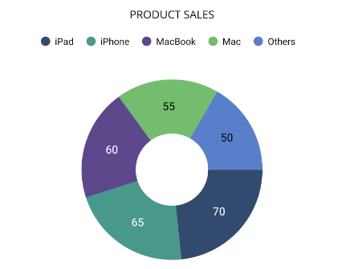

# Getting Started with .NET MAUI Circular Chart

This section explains how to populate the Circular Chart with data, including adding a title, data labels, a legend, and tooltips. Additionally, it covers the essential aspects to get started with the Circular Chart.

## Prerequisites

Before proceeding, ensure that the following are set up:
1. [.NET 8 SDK](https://dotnet.microsoft.com/en-us/download/dotnet/8.0) or later is installed.
2. A .NET MAUI development environment is configured using either:
    - Visual Studio 2022 (version 17.8 or later), or
    - Visual Studio Code, with the .NET MAUI workload installed and configured. For more information on setting up Visual Studio Code with .NET MAUI, see the official [documentation.](https://learn.microsoft.com/en-us/dotnet/maui/get-started/installation?view=net-maui-8.0&tabs=visual-studio-code)

## Step 1: Create a New .NET MAUI Project




1. Go to **File > New > Project** and choose the **.NET MAUI App** template.
2. Name the project and choose a location. Click **Next**.
3. Select the .NET framework version and click **Create**.




1. Open the command palette by pressing `Ctrl+Shift+P` and type **.NET: New Project** and press **Enter**.
2. Choose the **.NET MAUI App** template.
3. Select the project location, type the project name, and press **Enter**.
4. Choose **Create project**.




## Step 2: Install the Syncfusion® .NET MAUI Toolkit Package



1. In **Solution Explorer**, right-click the project and choose **Manage NuGet Packages**.
2. Search for [Syncfusion.Maui.Toolkit](https://www.nuget.org/packages/Syncfusion.Maui.Toolkit/) and install the latest version.
3. Ensure the necessary dependencies are installed correctly, and the project is restored.




1. Press <kbd>Ctrl</kbd> + <kbd>`</kbd> (backtick) to open the integrated terminal in Visual Studio Code.
2. Ensure you're in the project root directory where your .csproj file is located.
3. Run the command `dotnet add package Syncfusion.Maui.Toolkit` to install the Syncfusion® .NET MAUI Toolkit NuGet package.
4. To ensure all dependencies are installed, run `dotnet restore`.




## Step 3: Register the handler

In the **MauiProgram.cs** file, register the handler for Syncfusion® Toolkit.





using Syncfusion.Maui.Toolkit.Hosting;

public static class MauiProgram
{
    public static MauiApp CreateMauiApp()
    {
        var builder = MauiApp.CreateBuilder();
        
        builder
            .ConfigureSyncfusionToolkit() // Configure Syncfusion Toolkit for MAUI
            .UseMauiApp<App>()
            .ConfigureFonts(fonts =>
            {
                fonts.AddFont("OpenSans-Regular.ttf", "OpenSansRegular");
                fonts.AddFont("OpenSans-Semibold.ttf", "OpenSansSemibold");
            });

        return builder.Build();
    }
}





## Step 4: Add .NET MAUI Circular Chart

1. Import the `Syncfusion.Maui.Toolkit.Charts` namespace into your code.
2. Initialize an instance of the `SfCircularChart` control.





<ContentPage xmlns="http://schemas.microsoft.com/dotnet/2021/maui"
             xmlns:x="http://schemas.microsoft.com/winfx/2009/xaml"
             xmlns:chart="clr-namespace:Syncfusion.Maui.Toolkit.Charts;assembly=Syncfusion.Maui.Toolkit"
             x:Class="GettingStarted.MainPage">

        <chart:SfCircularChart/>

</ContentPage>





using Syncfusion.Maui.Toolkit.Charts;

. . .

public partial class MainPage : ContentPage
{
    public MainPage()
    {
        InitializeComponent();
        // Create a new instance of the SfCircularChart
        SfCircularChart chart = new SfCircularChart();
        // Set the chart as the content of the page
        this.Content = chart;
    }
}





### Initialize view model

Define a simple data model to represent a data point in the chart:

  



public class SalesModel
{
    public string Product { get; set; }
    public double SalesRate { get; set; }
}

 

 

Next, create a `SalesViewModel` class and initialize a list of `SalesModel` objects:

  



public class SalesViewModel
{
    public List<SalesModel> Data { get; set; }

    public SalesViewModel()
    {
        Data = new List<SalesModel>()
        {
            new SalesModel(){Product = "iPad", SalesRate = 25},
            new SalesModel(){Product = "iPhone", SalesRate = 35},
            new SalesModel(){Product = "MacBook", SalesRate = 15},
            new SalesModel(){Product = "Mac", SalesRate = 5},
            new SalesModel(){Product = "Others", SalesRate = 10},
        };
    }
}

 

 

Set the `SalesViewModel` instance as the `BindingContext` of your view to bind the `SalesViewModel` properties to the chart:
 
N> If you prefer to set the `BindingContext` in XAML, make sure to add the appropriate namespace for the `SalesViewModel` class in your XAML page.

 

 

<ContentPage xmlns="http://schemas.microsoft.com/dotnet/2021/maui"
             xmlns:x="http://schemas.microsoft.com/winfx/2009/xaml"
             xmlns:chart="clr-namespace:Syncfusion.Maui.Toolkit.Charts;assembly=Syncfusion.Maui.Toolkit"
             xmlns:model="clr-namespace:GettingStarted"
             x:Class="GettingStarted.MainPage">

    <ContentPage.BindingContext>
        <model:SalesViewModel/>
    </ContentPage.BindingContext>
</ContentPage>



 

using Syncfusion.Maui.Toolkit.Charts;

. . .

public partial class MainPage : ContentPage
{
    public MainPage()
    {
        InitializeComponent();
        SfCircularChart chart = new SfCircularChart();
        // Set the BindingContext to a new instance of SalesViewModel.
        this.BindingContext = new SalesViewModel();
        this.Content = chart;
    }
}



 

### Populate chart with data

Adding [PieSeries](https://help.syncfusion.com/cr/maui-toolkit/Syncfusion.Maui.Toolkit.Charts.PieSeries.html) to the charts [Series](https://help.syncfusion.com/cr/maui-toolkit/Syncfusion.Maui.Toolkit.Charts.SfCircularChart.html#Syncfusion_Maui_Toolkit_Charts_SfCircularChart_Series) collection and binding `Data` to the series [ItemsSource](https://help.syncfusion.com/cr/maui-toolkit/Syncfusion.Maui.Toolkit.Charts.ChartSeries.html#Syncfusion_Maui_Toolkit_Charts_ChartSeries_ItemsSource) property from its BindingContext to create our own Product Sales Pie chart.

N> The circular chart has [Series](https://help.syncfusion.com/cr/maui-toolkit/Syncfusion.Maui.Toolkit.Charts.SfCircularChart.html#Syncfusion_Maui_Toolkit_Charts_SfCircularChart_Series) as its default content.

N> To plot the series, the [XBindingPath](https://help.syncfusion.com/cr/maui-toolkit/Syncfusion.Maui.Toolkit.Charts.ChartSeries.html#Syncfusion_Maui_Toolkit_Charts_ChartSeries_XBindingPath) and [YBindingPath](https://help.syncfusion.com/cr/maui-toolkit/Syncfusion.Maui.Toolkit.Charts.CircularSeries.html#Syncfusion_Maui_Toolkit_Charts_CircularSeries_YBindingPath) properties must be configured so that the chart may get values from the respective properties in the data model.

   



<chart:SfCircularChart>
    . . .
    <chart:PieSeries ItemsSource="{Binding Data}" 
                     XBindingPath="Product" 
                     YBindingPath="SalesRate"/>
</chart:SfCircularChart>





SfCircularChart chart = new SfCircularChart();
SalesViewModel viewModel = new SalesViewModel();
chart.BindingContext = viewModel;

// Initialize a new PieSeries, which will represent the data in the circular chart.
PieSeries series = new PieSeries();
series.ItemsSource = viewModel.Data;
series.XBindingPath = "Product";
series.YBindingPath = "SalesRate";

// Add the configured PieSeries to the circular chart's series collection.
chart.Series.Add(series);
this.Content = chart;


 

### Add a title

The title of the chart acts as the title to provide quick information to the user about the data being plotted in the chart. You can set title using the [Title](https://help.syncfusion.com/cr/maui-toolkit/Syncfusion.Maui.Toolkit.Charts.ChartBase.html#Syncfusion_Maui_Toolkit_Charts_ChartBase_Title) property of circular chart as follows.

 



<chart:SfCircularChart>
    <chart:SfCircularChart.Title>
        <Label Text="PRODUCT SALES"/>
    </chart:SfCircularChart.Title>
    . . .
</chart:SfCircularChart>





SfCircularChart chart = new SfCircularChart();

// Set the chart title
chart.Title = new Label()
{
    Text = "PRODUCT SALES",
};
. . .
this.Content = chart;


  

### Enable the data labels

The [ShowDataLabels](https://help.syncfusion.com/cr/maui-toolkit/Syncfusion.Maui.Toolkit.Charts.ChartSeries.html#Syncfusion_Maui_Toolkit_Charts_ChartSeries_ShowDataLabels) property of series can be used to enable data labels to improve the readability of the circular chart. The label visibility is set to `False` by default.

 



<chart:SfCircularChart>
    . . .
    <chart:PieSeries ShowDataLabels="True"/>
</chart:SfCircularChart>





SfCircularChart chart = new SfCircularChart();
. . .
PieSeries series = new PieSeries();
series.ShowDataLabels = true;  // Enable data labels for the series
chart.Series.Add(series);
this.Content = chart;


 

### Enable a legend

The legend provides information about the data point displayed in the circular chart. The [Legend](https://help.syncfusion.com/cr/maui-toolkit/Syncfusion.Maui.Toolkit.Charts.ChartBase.html#Syncfusion_Maui_Toolkit_Charts_ChartBase_Legend) property of the chart was used to enable it.

 



<chart:SfCircularChart>
    . . .
    <chart:SfCircularChart.Legend>
    	<chart:ChartLegend/>
    </chart:SfCircularChart.Legend>
</chart:SfCircularChart>





SfCircularChart chart = new SfCircularChart();
. . .
// Initialize and assign a new ChartLegend to the chart's Legend property
chart.Legend = new ChartLegend();
this.Content = chart;


 

### Enable Tooltip

Tooltips are used to show information about the segment, when mouse over on it. Enable tooltip by setting series [EnableTooltip](https://help.syncfusion.com/cr/maui-toolkit/Syncfusion.Maui.Toolkit.Charts.ChartSeries.html#Syncfusion_Maui_Toolkit_Charts_ChartSeries_EnableTooltip) property as true.

 



<chart:SfCircularChart>
    . . .
    <chart:PieSeries EnableTooltip="True"/>
</chart:SfCircularChart>





SfCircularChart chart = new SfCircularChart();
. . .
PieSeries series = new PieSeries();
series.EnableTooltip = true; // Enable tooltips for the series
chart.Series.Add(series);
this.Content = chart;




The following code example gives you the complete code of above configurations.

 



<ContentPage xmlns="http://schemas.microsoft.com/dotnet/2021/maui"
             xmlns:x="http://schemas.microsoft.com/winfx/2009/xaml"
             xmlns:chart="clr-namespace:Syncfusion.Maui.Toolkit.Charts;assembly=Syncfusion.Maui.Toolkit"
             xmlns:model="clr-namespace:GettingStarted"
             x:Class="GettingStarted.MainPage">

    <chart:SfCircularChart>
        <chart:SfCircularChart.Title>
            <Label Text="PRODUCT SALES"/>
        </chart:SfCircularChart.Title>

        <chart:SfCircularChart.BindingContext>
            <model:SalesViewModel/>
        </chart:SfCircularChart.BindingContext>

        <chart:SfCircularChart.Legend>
            <chart:ChartLegend/>
        </chart:SfCircularChart.Legend>

        <chart:PieSeries ItemsSource="{Binding Data}"
                        ShowDataLabels="True"
                        XBindingPath="Product"
                        EnableTooltip="True"
                        YBindingPath="SalesRate"/>
    </chart:SfCircularChart>

</ContentPage>
 




using Syncfusion.Maui.Toolkit.Charts;
. . .
public partial class MainPage : ContentPage
{   
    public MainWindow()
    {
        // Create an instance of SfCircularChart
        SfCircularChart chart = new SfCircularChart();

        // Set the chart title
        chart.Title = new Label()
        {
            Text = "PRODUCT SALES"
        };

        // Initialize and set the chart legend
        chart.Legend = new ChartLegend();

        // Create a new instance of the SalesViewModel
        SalesViewModel viewModel = new SalesViewModel();
        // Set the BindingContext of the chart to the view model
        chart.BindingContext = viewModel;

        // Create a new PieSeries for the chart
        PieSeries series = new PieSeries();
        series.ItemsSource = viewModel.Data;
        series.XBindingPath = "Product";
        series.YBindingPath = "SalesRate";
        series.EnableTooltip = true;
        series.ShowDataLabels = true;

        // Add the configured series to the chart
        chart.Series.Add(series);
        this.Content = chart;
    }
}





You can find the complete getting started sample from this [link](https://github.com/SyncfusionExamples/maui-toolkit-samples/tree/master/CircularChart/GettingStarted).
