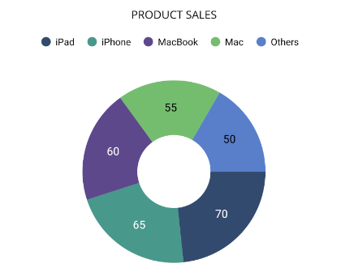

# Getting Started with .NET MAUI Circular Chart

This section explains how to populate the Circular Chart with data, including adding a title, data labels, a legend, and tooltips. Additionally, it covers the essential aspects to get started with the [Circular Chart](https://help.syncfusion.com/cr/maui-toolkit/Syncfusion.Maui.Toolkit.Charts.SfCircularChart.html).




## Prerequisites

Before proceeding, ensure the following are set up:

1. Install [.NET 9 SDK](https://dotnet.microsoft.com/en-us/download/dotnet/9.0) or later.
2. Set up a .NET MAUI environment with Visual Studio 2022 v17.12 or later.

## Step 1: Create a new .NET MAUI project

1. Go to **File > New > Project** and choose the **.NET MAUI App** template.
2. Name the project and choose a location. Then click **Next**.
3. Select the .NET framework version and click **Create**.

## Step 2: Install the Syncfusion&reg; .NET MAUI Toolkit NuGet package

1. In **Solution Explorer,** right-click the project and choose **Manage NuGet Packages.**
2. Search for [Syncfusion.Maui.Toolkit](https://www.nuget.org/packages/Syncfusion.Maui.Toolkit/) and install the latest version.
3. Ensure the necessary dependencies are installed correctly, and the project is restored.




## Prerequisites

Before proceeding, ensure the following are set up:

1. Install [.NET 9 SDK](Download .NET 9.0 (Linux, macOS, and Windows) | .NET) or later.
2. Set up a .NET MAUI environment with Visual Studio Code.
3. Ensure that the .NET MAUI workloads are installed and configured as described [here](https://learn.microsoft.com/en-us/dotnet/maui/get-started/installation?view=net-maui-9.0&tabs=visual-studio-code).

## Step 1: Create a new .NET MAUI project

1. Open the command palette by pressing `Ctrl+Shift+P` and type **.NET:New Project** and enter.
2. Choose the **.NET MAUI App** template.
3. Select the project location, type the project name and press **Enter**.
4. Then choose **Create project.**

## Step 2: Install the Syncfusion&reg; .NET MAUI Toolkit NuGet package

1. Press <kbd>Ctrl</kbd> + <kbd>`</kbd> (backtick) to open the integrated terminal in Visual Studio Code.
2. Ensure you're in the project root directory where your .csproj file is located.
3. Run the command `dotnet add package Syncfusion.Maui.Toolkit` to install the Syncfusion® .NET MAUI Toolkit NuGet package.
4. To ensure all dependencies are installed, run `dotnet restore`.




## Prerequisites

Before proceeding, ensure the following are set up:

1. Install [.NET 9 SDK](Download .NET 9.0 (Linux, macOS, and Windows) | .NET) or later.
2. Set up a .NET MAUI environment with JetBrains Rider 2024.3 or later.
3. Make sure the MAUI workloads are installed and configured as described [here.](https://www.jetbrains.com/help/rider/MAUI.html#before-you-start)

## Step 1: Create a new .NET MAUI project

1. Go to **File > New Solution,** Select .NET (C#) and choose the .NET MAUI App template.
2. Enter the Project Name, Solution Name, and Location.
3. Select the .NET framework version and click Create.

## Step 2: Install the Syncfusion® MAUI Toolkit NuGet package

1. In **Solution Explorer,** right-click the project and choose **Manage NuGet Packages.**
2. Search for [Syncfusion.Maui.Toolkit](https://www.nuget.org/packages/Syncfusion.Maui.Toolkit/) and install the latest version.
3. Ensure the necessary dependencies are installed correctly, and the project is restored. If not, Open the Terminal in Rider and manually run: `dotnet restore`




## Step 3: Register the handler

Make sure to add the namespace.
 


using Syncfusion.Maui.Toolkit.Hosting;

 
Register the Syncfusion core handler in your CreateMauiApp method of `MauiProgram.cs` file to use Syncfusion controls.
 

builder.ConfigureSyncfusionToolkit();



## Step 4: Initialize view model

Define a simple data model to represent a data point in the chart:

  



public class SalesModel
{
    public string Product { get; set; }
    public double SalesRate { get; set; }
}

 

 

Next, create a `SalesViewModel` class and initialize a list of `SalesModel` objects:

  



public class SalesViewModel
{
    public List<SalesModel> Data { get; set; }

    public SalesViewModel()
    {
        Data = new List<SalesModel>()
        {
            new SalesModel(){Product = "iPad", SalesRate = 25},
            new SalesModel(){Product = "iPhone", SalesRate = 35},
            new SalesModel(){Product = "MacBook", SalesRate = 15},
            new SalesModel(){Product = "Mac", SalesRate = 5},
            new SalesModel(){Product = "Others", SalesRate = 10},
        };
    }
}

 

 

## Step 5: Import Circular ProgressBar namespace

Add the following namespace in your XAML or C#.



xmlns:chart="clr-namespace:Syncfusion.Maui.Toolkit.Charts;assembly=Syncfusion.Maui.Toolkit"




using Syncfusion.Maui.Toolkit.Charts;




## Step 6: Add the Circular Chart component

Adding [PieSeries](https://help.syncfusion.com/cr/maui-toolkit/Syncfusion.Maui.Toolkit.Charts.PieSeries.html) to the charts [Series](https://help.syncfusion.com/cr/maui-toolkit/Syncfusion.Maui.Toolkit.Charts.SfCircularChart.html#Syncfusion_Maui_Toolkit_Charts_SfCircularChart_Series) collection and binding `Data` to the series [ItemsSource](https://help.syncfusion.com/cr/maui-toolkit/Syncfusion.Maui.Toolkit.Charts.ChartSeries.html#Syncfusion_Maui_Toolkit_Charts_ChartSeries_ItemsSource) property from its BindingContext to create our own Product Sales Pie chart.

N> The circular chart has [Series](https://help.syncfusion.com/cr/maui-toolkit/Syncfusion.Maui.Toolkit.Charts.SfCircularChart.html#Syncfusion_Maui_Toolkit_Charts_SfCircularChart_Series) as its default content.

N> To plot the series, the [XBindingPath](https://help.syncfusion.com/cr/maui-toolkit/Syncfusion.Maui.Toolkit.Charts.ChartSeries.html#Syncfusion_Maui_Toolkit_Charts_ChartSeries_XBindingPath) and [YBindingPath](https://help.syncfusion.com/cr/maui-toolkit/Syncfusion.Maui.Toolkit.Charts.CircularSeries.html#Syncfusion_Maui_Toolkit_Charts_CircularSeries_YBindingPath) properties must be configured so that the chart may get values from the respective properties in the data model.

 



<chart:SfCircularChart>
    <chart:SfCircularChart.Title>
        <Label Text="PRODUCT SALES"/>
    </chart:SfCircularChart.Title>
    <chart:SfCircularChart.BindingContext>
        <model:SalesViewModel/>
    </chart:SfCircularChart.BindingContext>
    <chart:SfCircularChart.Legend>
        <chart:ChartLegend/>
    </chart:SfCircularChart.Legend>
    <chart:PieSeries ItemsSource="{Binding Data}"
                    ShowDataLabels="True"
                    XBindingPath="Product"
                    EnableTooltip="True"
                    YBindingPath="SalesRate"/>
    </chart:SfCircularChart>
 




SfCircularChart chart = new SfCircularChart();

chart.Title = new Label()
{
    Text = "PRODUCT SALES"
};

chart.Legend = new ChartLegend();
SalesViewModel viewModel = new SalesViewModel();
chart.BindingContext = viewModel;
PieSeries series = new PieSeries();
series.ItemsSource = viewModel.Data;
series.XBindingPath = "Product";
series.YBindingPath = "SalesRate";
series.EnableTooltip = true;
series.ShowDataLabels = true;
chart.Series.Add(series);
this.Content = chart;





You can find the complete Circular Charts getting started sample from this [link](https://github.com/SyncfusionExamples/maui-toolkit-samples/tree/master/CircularChart/GettingStarted).
