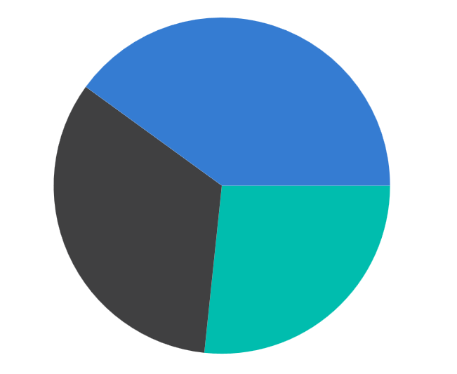

# Grouping Data Points in .NET MAUI SfCircularChart

The small segments in the circular chart can be grouped into an `Others` category using the [GroupTo](https://help.syncfusion.com/cr/maui-toolkit/Syncfusion.Maui.Toolkit.Charts.PieSeries.html#Syncfusion_Maui_Toolkit_Charts_PieSeries_GroupTo) and [GroupMode](https://help.syncfusion.com/cr/maui-toolkit/Syncfusion.Maui.Toolkit.Charts.PieSeries.html#Syncfusion_Maui_Toolkit_Charts_PieSeries_GroupMode) properties of the [PieSeries](https://help.syncfusion.com/cr/maui-toolkit/Syncfusion.Maui.Toolkit.Charts.PieSeries.html). The [GroupMode](https://help.syncfusion.com/cr/maui-toolkit/Syncfusion.Maui.Toolkit.Charts.PieSeries.html#Syncfusion_Maui_Toolkit_Charts_PieSeries_GroupMode) property is used to specify the grouping type based on slice angle, actual data point value, or percentage. The [GroupTo](https://help.syncfusion.com/cr/maui-toolkit/Syncfusion.Maui.Toolkit.Charts.PieSeries.html#Syncfusion_Maui_Toolkit_Charts_PieSeries_GroupTo) property is used to set the limit to group data points into a single slice. The grouped segment is labeled as `Others` in the chart legend.

N> The [GroupTo](https://help.syncfusion.com/cr/maui-toolkit/Syncfusion.Maui.Toolkit.Charts.PieSeries.html#Syncfusion_Maui_Toolkit_Charts_PieSeries_GroupTo) feature is only supported for pie and doughnut chart types.





<chart:SfCircularChart>
    <!-- Other chart configurations -->
    <chart:PieSeries ItemsSource="{Binding Data}" 
                     GroupMode="Value"
                     GroupTo="15"
                     XBindingPath="Product" 
                     YBindingPath="SalesRate"/>
</chart:SfCircularChart>





SfCircularChart chart = new SfCircularChart();
// Other chart configurations
PieSeries series = new PieSeries()
{
    ItemsSource = new ViewModel().Data,
    XBindingPath = "Product", 
    YBindingPath = "SalesRate",
    GroupMode = PieGroupMode.Value, // Set the mode for grouping smaller slices into a single slice
    GroupTo = 15 // Define a threshold value for the group mode
};

chart.Series.Add(series);
this.Content = chart;




