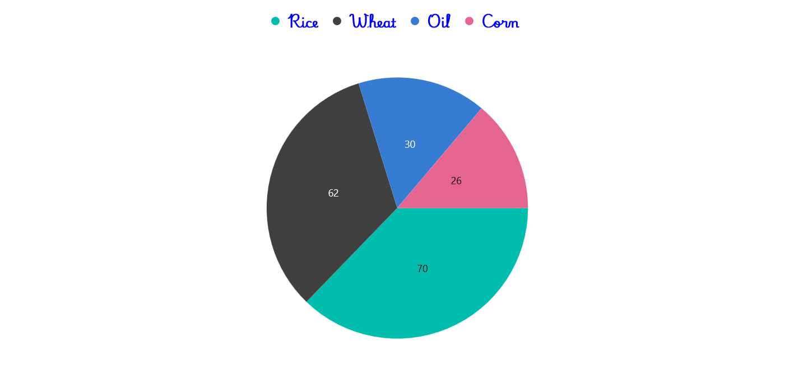
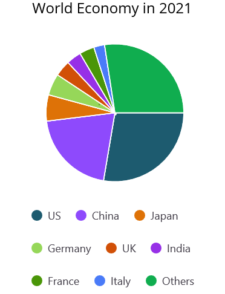

# Legend in .NET MAUI Chart (SfCircularChart)
The [Legend](https://help.syncfusion.com/cr/maui-toolkit/Syncfusion.Maui.Toolkit.Charts.ChartBase.html#Syncfusion_Maui_Toolkit_Charts_ChartBase_Legend) provides a list of data points, helping to identify the corresponding data points in the chart. Here's a detailed guide on how to define and customize the legend in the circular chart.

## Defining the Legend
To define the legend in the chart, initialize the [ChartLegend](https://help.syncfusion.com/cr/maui-toolkit/Syncfusion.Maui.Toolkit.Charts.ChartLegend.html) class and assign it to the [Legend](https://help.syncfusion.com/cr/maui-toolkit/Syncfusion.Maui.Toolkit.Charts.ChartBase.html#Syncfusion_Maui_Toolkit_Charts_ChartBase_Legend) property.





<chart:SfCircularChart>
    <chart:SfCircularChart.Legend>
        <chart:ChartLegend/>
    </chart:SfCircularChart.Legend>
</chart:SfCircularChart>





SfCircularChart chart = new SfCircularChart();
// Create and assign a new ChartLegend to the chart's Legend property
chart.Legend = new ChartLegend();
// Other configurations
this.Content = chart;




## Legend Visibility
The visibility of the chart legend can be controlled using the [IsVisible](https://help.syncfusion.com/cr/maui-toolkit/Syncfusion.Maui.Toolkit.Charts.ChartLegend.html#Syncfusion_Maui_Toolkit_Charts_ChartLegend_IsVisible) property. By default, the IsVisible property is set to `true`.




    
<chart:SfCircularChart>
    <chart:SfCircularChart.Legend>
        <chart:ChartLegend IsVisible="True"/>
    </chart:SfCircularChart.Legend>
</chart:SfCircularChart>





SfCircularChart chart = new SfCircularChart();

chart.Legend = new ChartLegend()
{ 
    IsVisible = true // Set the visibility of the legend to true
};
// Other configurations
this.Content = chart;





## Legend Item Visibility

The visibility of individual legend items for specific series can be controlled using the [IsVisibleOnLegend](https://help.syncfusion.com/cr/maui-toolkit/Syncfusion.Maui.Toolkit.Charts.ChartSeries.html#Syncfusion_Maui_Toolkit_Charts_ChartSeries_IsVisibleOnLegend) property of the series. The default value for IsVisibleOnLegend is `true`.




    
<chart:SfCircularChart>
    <chart:SfCircularChart.Legend>
        <chart:ChartLegend/>
    </chart:SfCircularChart.Legend>

    <chart:PieSeries ItemsSource="{Binding Data}"
                     XBindingPath="XValue"
                     IsVisibleOnLegend="True"
                     YBindingPath="YValue"/>
</chart:SfCircularChart>





SfCircularChart chart = new SfCircularChart();
chart.Legend = new ChartLegend();
PieSeries series = new PieSeries()
{
    ItemsSource = viewModel.Data,
    XBindingPath = "XValue",
    IsVisibleOnLegend = true,
    YBindingPath = "YValue",
};

chart.Series.Add(series);
this.Content = chart;





## Customizing Labels

The appearance of the legend label can be customized using the [`LabelStyle`](https://help.syncfusion.com/cr/maui-toolkit/Syncfusion.Maui.Toolkit.Charts.ChartLegend.html#Syncfusion_Maui_Toolkit_Charts_ChartLegend_LabelStyle) property. 

* [`TextColor`](https://help.syncfusion.com/cr/maui-toolkit/Syncfusion.Maui.Toolkit.Charts.ChartLegendLabelStyle.html#Syncfusion_Maui_Toolkit_Charts_ChartLegendLabelStyle_TextColor) – Gets or sets the color of the label.
* [`FontFamily`](https://help.syncfusion.com/cr/maui-toolkit/Syncfusion.Maui.Toolkit.Charts.ChartLegendLabelStyle.html#Syncfusion_Maui_Toolkit_Charts_ChartLegendLabelStyle_FontFamily) - Gets or sets the font family for the legend label. 
* [`FontAttributes`](https://help.syncfusion.com/cr/maui-toolkit/Syncfusion.Maui.Toolkit.Charts.ChartLegendLabelStyle.html#Syncfusion_Maui_Toolkit_Charts_ChartLegendLabelStyle_FontAttributes) - Gets or sets the font style for the legend label. 
* [`FontSize`](https://help.syncfusion.com/cr/maui-toolkit/Syncfusion.Maui.Toolkit.Charts.ChartLegendLabelStyle.html#Syncfusion_Maui_Toolkit_Charts_ChartLegendLabelStyle_FontSize) - Gets or sets the font size for the legend label.
* [`Margin`](https://help.syncfusion.com/cr/maui-toolkit/Syncfusion.Maui.Toolkit.Charts.ChartLegendLabelStyle.html#Syncfusion_Maui_Toolkit_Charts_ChartLegendLabelStyle_Margin) - Gets or sets the margin size of labels.

 



<chart:SfCircularChart>
    <chart:SfCircularChart.Legend>
        <chart:ChartLegend>
            <chart:ChartLegend.LabelStyle>
                <chart:ChartLegendLabelStyle TextColor="Blue" Margin="5" FontSize="18" FontAttributes="Bold" FontFamily="PlaywriteAR-Regular"/>
            </chart:ChartLegend.LabelStyle>
        </chart:ChartLegend>
    </chart:SfCircularChart.Legend>
</chart:SfCircularChart>





SfCircularChart chart = new SfCircularChart();
ChartLegend legend = new ChartLegend();

// Create and configure the ChartLegendLabelStyle
ChartLegendLabelStyle labelStyle = new ChartLegendLabelStyle()
{
    TextColor = Colors.Blue,
    Margin = new Thickness(5),
    FontSize = 18,
    FontAttributes = FontAttributes.Bold,
    FontFamily = "PlaywriteAR-Regular"
};
// Assign the configured labelStyle to the legend
legend.LabelStyle = labelStyle;

chart.Legend = legend;
this.Content = chart;




## Legend Icon
To specify the legend icon based on the associated series type, use the [LegendIcon](https://help.syncfusion.com/cr/maui-toolkit/Syncfusion.Maui.Toolkit.Charts.ChartSeries.html#Syncfusion_Maui_Toolkit_Charts_ChartSeries_LegendIcon) property and change its type using the [ChartLegendIconType](https://help.syncfusion.com/cr/maui-toolkit/Syncfusion.Maui.Toolkit.Charts.ChartLegendIconType.html) enum values. The default value of the LegendIcon property is `Circle`.





<chart:SfCircularChart>
    <chart:SfCircularChart.Legend>
       <chart:ChartLegend/>
    </chart:SfCircularChart.Legend>

    <chart:PieSeries ItemsSource="{Binding Data}"
                     XBindingPath="XValue"
                     YBindingPath="YValue"
                     LegendIcon="Diamond"/>
</chart:SfCircularChart>





SfCircularChart chart = new SfCircularChart();
chart.Legend = new ChartLegend();

PieSeries pieSeries = new PieSeries()
{
    ItemsSource = viewModel.Data,
    XBindingPath = "XValue",
    YBindingPath = "YValue",
    LegendIcon = ChartLegendIconType.Diamond,  // Set the icon type for the legend 
};

chart.Series.Add(pieSeries);
this.Content = chart;





## Placement
The legend can be positioned to the left, right, top, or bottom of the chart area using the [Placement](https://help.syncfusion.com/cr/maui-toolkit/Syncfusion.Maui.Toolkit.Charts.ChartLegend.html#Syncfusion_Maui_Toolkit_Charts_ChartLegend_Placement) property in the ChartLegend class. The default placement is `Top`.





<chart:SfCircularChart>
    <chart:SfCircularChart.Legend>
        <chart:ChartLegend Placement="Bottom">
        </chart:ChartLegend>
    </chart:SfCircularChart.Legend>
</chart:SfCircularChart>





SfCircularChart chart = new SfCircularChart();

chart.Legend = new ChartLegend()
{ 
    Placement = LegendPlacement.Bottom  // Set the placement of the legend 
};

this.Content = chart;




## Toggle the Series Visibility
The visibility of circular series data points can be controlled by tapping the legend item using the [ToggleSeriesVisibility](https://help.syncfusion.com/cr/maui-toolkit/Syncfusion.Maui.Toolkit.Charts.ChartLegend.html#Syncfusion_Maui_Toolkit_Charts_ChartLegend_ToggleSeriesVisibility) property. The default value of ToggleSeriesVisibility is `false`.





<chart:SfCircularChart>
    <chart:SfCircularChart.Legend>
        <chart:ChartLegend           
            ToggleSeriesVisibility="True">
        </chart:ChartLegend>
    </chart:SfCircularChart.Legend>
</chart:SfCircularChart>





SfCircularChart chart = new SfCircularChart();
chart.Legend = new ChartLegend()
{ 
    ToggleSeriesVisibility = true  // Enable the functionality to show/hide series by tapping on legends
};
this.Content = chart;





## Legend Maximum Size Request
To set the maximum size request for the legend view, override the [GetMaximumSizeCoefficient](https://help.syncfusion.com/cr/maui-toolkit/Syncfusion.Maui.Toolkit.Charts.ChartLegend.html#Syncfusion_Maui_Toolkit_Charts_ChartLegend_GetMaximumSizeCoefficient) protected method in the [ChartLegend](https://help.syncfusion.com/cr/maui-toolkit/Syncfusion.Maui.Toolkit.Charts.ChartLegend.html) class. The value should be between 0 and 1, representing the maximum size request, not the desired size for the legend items layout.




    
<chart:SfCircularChart>
    <!-- Other chart configurations -->
    <chart:SfCircularChart.Legend>
        <chart:LegendExt/>
    </chart:SfCircularChart.Legend>
</chart:SfCircularChart>





// Define a custom legend class that extends ChartLegend
public class LegendExt : ChartLegend
{
    // Override the GetMaximumSizeCoefficient method to customize the legend size
    protected override double GetMaximumSizeCoefficient()
    {
        return 0.7;
    }
}

SfCircularChart chart = new SfCircularChart();
chart.Legend = new LegendExt(); // Set the chart's legend to use the custom LegendExt class
this.Content = chart;




## Items Layout

The [ItemsLayout](https://help.syncfusion.com/cr/maui-toolkit/Syncfusion.Maui.Toolkit.Charts.ChartLegend.html#Syncfusion_Maui_Toolkit_Charts_ChartLegend_ItemsLayout) property is used to customize the arrangement and position of each legend item. The default value is `null`. This property accepts any layout type.

For more details about layout alignment, refer to this [article](https://support.syncfusion.com/kb/article/16201/how-to-align-the-chart-legend-items-in-net-maui-circular-chart).





<chart:SfCircularChart>
    <chart:SfCircularChart.Legend>
        <chart:ChartLegend>
            <chart:ChartLegend.ItemsLayout>
                <FlexLayout Wrap="Wrap"
                            WidthRequest="400">
                </FlexLayout>
            </chart:ChartLegend.ItemsLayout>
        </chart:ChartLegend>
    </chart:SfCircularChart.Legend>
</chart:SfCircularChart>





SfCircularChart chart = new SfCircularChart();
// Other chart configurations
ChartLegend legend = new ChartLegend();
legend.ItemsLayout = new FlexLayout()
{
    Wrap = FlexWrap.Wrap,
    WidthRequest = 400
};

chart.Legend = legend;
this.Content = chart;
        




## Item Template
The [ChartLegend](https://help.syncfusion.com/cr/maui-toolkit/Syncfusion.Maui.Toolkit.Charts.ChartLegend.html) supports customizing the appearance of legend items using the [ItemTemplate](https://help.syncfusion.com/cr/maui-toolkit/Syncfusion.Maui.Toolkit.Charts.ChartLegend.html#Syncfusion_Maui_Toolkit_Charts_ChartLegend_ItemTemplate) property. The default value of ItemTemplate is `null`.

N> The BindingContext of the template is the corresponding underlying legend item provided in the ChartLegendItem class.





<chart:SfCircularChart>
    <chart:SfCircularChart.Resources>
        <DataTemplate x:Key="legendTemplate">
            <StackLayout Orientation="Horizontal">
                <Rectangle HeightRequest="12" 
                           WidthRequest="12" Margin="3"
                           Background="{Binding IconBrush}"/>
                <Label Text="{Binding Text}" 
                       Margin="3"/>
            </StackLayout>
        </DataTemplate>
    </chart:SfCircularChart.Resources>  
    
    <chart:SfCircularChart.Legend>
        <chart:ChartLegend ItemTemplate="{StaticResource legendTemplate}">
        </chart:ChartLegend>
    </chart:SfCircularChart.Legend>
    <!-- Other chart configurations -->
</chart:SfCircularChart>





SfCircularChart chart = new SfCircularChart();
ChartLegend legend = new ChartLegend();
// Assign a custom item template to the legend using a `DataTemplate` resource from the chart's resources.
legend.ItemTemplate = chart.Resources["legendTemplate"] as DataTemplate;
// Other chart configurations
chart.Legend = legend;
this.Content = chart;
        




## Event 

**LegendItemCreated**

The [`LegendItemCreated`](https://help.syncfusion.com/cr/maui-toolkit/Syncfusion.Maui.Toolkit.Charts.ChartLegend.html#Syncfusion_Maui_Toolkit_Charts_ChartLegend_LegendItemCreated) event is triggered when the chart legend item is created. The argument contains the [`LegendItem`](https://help.syncfusion.com/cr/maui-toolkit/Syncfusion.Maui.Toolkit.LegendItemEventArgs.html#Syncfusion_Maui_Toolkit_LegendItemEventArgs_LegendItem) object. The following properties are present in [`LegendItem`](https://help.syncfusion.com/cr/maui-toolkit/Syncfusion.Maui.Toolkit.LegendItemEventArgs.html#Syncfusion_Maui_Toolkit_LegendItemEventArgs_LegendItem).

* [`Text`](https://help.syncfusion.com/cr/maui-toolkit/Syncfusion.Maui.Toolkit.ILegendItem.html#Syncfusion_Maui_Toolkit_ILegendItem_Text) – used to get or set the text of the label.
* [`TextColor`](https://help.syncfusion.com/cr/maui-toolkit/Syncfusion.Maui.Toolkit.ILegendItem.html#Syncfusion_Maui_Toolkit_ILegendItem_TextColor) – used to get or set the color of the label.
* [`FontFamily`](https://help.syncfusion.com/cr/maui-toolkit/Syncfusion.Maui.Toolkit.ILegendItem.html#Syncfusion_Maui_Toolkit_ILegendItem_FontFamily) - used to get or set the font family for the legend label. 
* [`FontAttributes`](https://help.syncfusion.com/cr/maui-toolkit/Syncfusion.Maui.Toolkit.ILegendItem.html#Syncfusion_Maui_Toolkit_ILegendItem_FontAttributes) - used to get or set the font style for the legend label. 
* [`FontSize`](https://help.syncfusion.com/cr/maui-toolkit/Syncfusion.Maui.Toolkit.ILegendItem.html#Syncfusion_Maui_Toolkit_ILegendItem_FontSize) - used to get or set the font size for the legend label.
* [`TextMargin`](https://help.syncfusion.com/cr/maui-toolkit/Syncfusion.Maui.Toolkit.ILegendItem.html#Syncfusion_Maui_Toolkit_ILegendItem_TextMargin) - used to get or set the margin size of labels.
* [`IconBrush`](https://help.syncfusion.com/cr/maui-toolkit/Syncfusion.Maui.Toolkit.ILegendItem.html#Syncfusion_Maui_Toolkit_ILegendItem_IconBrush) - used to change the color of the legend icon.
* [`IconType`](https://help.syncfusion.com/cr/maui-toolkit/Syncfusion.Maui.Toolkit.ILegendItem.html#Syncfusion_Maui_Toolkit_ILegendItem_IconType) - used to get or set the icon type for the legend icon.
* [`IconHeight`](https://help.syncfusion.com/cr/maui-toolkit/Syncfusion.Maui.Toolkit.ILegendItem.html#Syncfusion_Maui_Toolkit_ILegendItem_IconHeight) - used to get or set the icon height of the legend icon.
* [`IconWidth`](https://help.syncfusion.com/cr/maui-toolkit/Syncfusion.Maui.Toolkit.ILegendItem.html#Syncfusion_Maui_Toolkit_ILegendItem_IconWidth) - used to get or set the icon width of the legend icon.
* [`IsToggled`](https://help.syncfusion.com/cr/maui-toolkit/Syncfusion.Maui.Toolkit.ILegendItem.html#Syncfusion_Maui_Toolkit_ILegendItem_IsToggled) - used to get or set the toggle visibility of the legend.
* [`DisableBrush`](https://help.syncfusion.com/cr/maui-toolkit/Syncfusion.Maui.Toolkit.ILegendItem.html#Syncfusion_Maui_Toolkit_ILegendItem_DisableBrush) - used to get or set the color of the legend when toggled.
* [`Index`](https://help.syncfusion.com/cr/maui-toolkit/Syncfusion.Maui.Toolkit.ILegendItem.html#Syncfusion_Maui_Toolkit_ILegendItem_Index) - used to get index position of the legend.
* [`Item`](https://help.syncfusion.com/cr/maui-toolkit/Syncfusion.Maui.Toolkit.ILegendItem.html#Syncfusion_Maui_Toolkit_ILegendItem_Item) - used to get the corresponding data points for the legend item.

## Limitations
* Do not add items explicitly.
* When using BindableLayouts, do not bind ItemsSource explicitly.
* For better UX, arrange items vertically for left and right dock positions, and horizontally for top and bottom dock positions.
* If the layout's measured size is larger than the MaximumHeightRequest, scrolling will be enabled.
* If MaximumHeightRequest is set to 1 and the chart's available size is smaller than the layout's measured size, the series may not have enough space to draw properly.