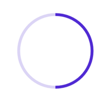

# Define Range in .NET MAUI Circular ProgressBar

The Range represents the entire span of the circular progress bar and can be defined using the [`Minimum`](https://help.syncfusion.com/cr/maui-toolkit/Syncfusion.Maui.Toolkit.ProgressBar.ProgressBarBase.html#Syncfusion_Maui_Toolkit_ProgressBar_ProgressBarBase_Minimum) and [`Maximum`](https://help.syncfusion.com/cr/maui-toolkit/Syncfusion.Maui.Toolkit.ProgressBar.ProgressBarBase.html#Syncfusion_Maui_Toolkit_ProgressBar_ProgressBarBase_Maximum) properties. The default value of the range is 0 to 100.

The following code sample demonstrates how to customize the range as factor value to the circular progress bar.

  



<progressBar:SfCircularProgressBar Minimum="0" 
                                   Progress="0.5" 
                                   Maximum="1"/>





SfCircularProgressBar circularProgressBar = new SfCircularProgressBar();
circularProgressBar.Minimum = 0;
circularProgressBar.Maximum = 1;
circularProgressBar.Progress = 0.5;
this.Content = circularProgressBar;



 

