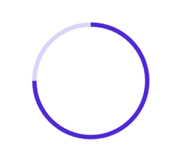

# Getting started with .NET MAUI Circular ProgressBar

This section explains the steps required to add the circular progress bar control with the progress and its customizable elements such as indeterminate, segment, progress fill, and track fill. This section covers only the basic features needed to know and gets started with the Syncfusion&reg; circular progress bar. Follow the steps below to add a .NET MAUI Circular progress bar to your project.




## Prerequisites

Before proceeding, ensure the following are set up:
1. Install .NET SDK
  - [.NET 9 SDK](https://dotnet.microsoft.com/en-us/download/dotnet/9.0) or later must be installed.
2. Set up a .NET MAUI Environment with Visual Studio. Supported Visual Studio Versions:
  - Visual Studio 2022: Version 17.13 or later (e.g., 17.14.7) for .NET 9 development.
  - Visual Studio 2026: Required for .NET 10 development.

## Step 1: Create a new .NET MAUI project

1. Go to **File > New > Project** and choose the **.NET MAUI App** template.
2. Name the project and choose a location. Then click **Next**.
3. Select the .NET framework version and click **Create**.

## Step 2: Install the Syncfusion&reg; MAUI Toolkit package

1. In **Solution Explorer,** right-click the project and choose **Manage NuGet Packages.**
2. Search for [Syncfusion.Maui.Toolkit](https://www.nuget.org/packages/Syncfusion.Maui.Toolkit/) and install the latest version.
3. Ensure the necessary dependencies are installed correctly, and the project is restored.




## Prerequisites

Before proceeding, ensure the following are set up:
1. Install [.NET 9 SDK](https://dotnet.microsoft.com/en-us/download/dotnet/9.0) or later is installed.
2. Set up a .NET MAUI environment with Visual Studio Code.
3. Ensure that the .NET MAUI extension is installed and configured as described [here.](https://learn.microsoft.com/en-us/dotnet/maui/get-started/installation?view=net-maui-8.0&tabs=visual-studio-code)

## Step 1: Create a new .NET MAUI project

1. Open the command palette by pressing `Ctrl+Shift+P` and type **.NET:New Project** and enter.
2. Choose the **.NET MAUI App** template.
3. Select the project location, type the project name and press **Enter**.
4. Then choose **Create project.**

## Step 2: Install the Syncfusion&reg; MAUI Toolkit package

1. Press <kbd>Ctrl</kbd> + <kbd>`</kbd> (backtick) to open the integrated terminal in Visual Studio Code.
2. Ensure you're in the project root directory where your .csproj file is located.
3. Run the command `dotnet add package Syncfusion.Maui.Toolkit` to install the Syncfusion® .NET MAUI Toolkit NuGet package.
4. To ensure all dependencies are installed, run `dotnet restore`.





## Prerequisites

Before proceeding, ensure the following are set up:

1. Ensure you have the latest version of JetBrains Rider.
2. Install [.NET 9 SDK](https://dotnet.microsoft.com/en-us/download/dotnet/9.0) or later is installed.
3. Make sure the MAUI workloads are installed and configured as described [here.](https://www.jetbrains.com/help/rider/MAUI.html#before-you-start)

## Step 1: Create a new .NET MAUI project

1. Go to **File > New Solution,** Select .NET (C#) and choose the .NET MAUI App template.
2. Enter the Project Name, Solution Name, and Location.
3. Select the .NET framework version and click Create.

## Step 2: Install the Syncfusion® MAUI Toolkit NuGet package

1. In **Solution Explorer,** right-click the project and choose **Manage NuGet Packages.**
2. Search for [Syncfusion.Maui.Toolkit](https://www.nuget.org/packages/Syncfusion.Maui.Toolkit/) and install the latest version.
3. Ensure the necessary dependencies are installed correctly, and the project is restored. If not, Open the Terminal in Rider and manually run: `dotnet restore`




## Step 3: Register the handler

Make sure to add the namespace.
 


using Syncfusion.Maui.Toolkit.Hosting;

 
Register the Syncfusion core handler in your CreateMauiApp method of `MauiProgram.cs` file to use Syncfusion controls.
 

builder.ConfigureSyncfusionToolkit();



## Step 4: Import Circular ProgressBar namespace

Add the following namespace in your XAML or C#.



xmlns:progressBar="clr-namespace:Syncfusion.Maui.Toolkit.ProgressBar;assembly=Syncfusion.Maui.Toolkit"




using Syncfusion.Maui.Toolkit.ProgressBar;




## Step 5: Add the Circular ProgressBar component

Create an instance for the circular progress bar control, and add it as content.





<progressBar:SfCircularProgressBar Progress="75"/>





SfCircularProgressBar circularProgressBar = new SfCircularProgressBar { Progress = 75 };
this.Content = circularProgressBar;





N> By default, the value of progress should be specified between 0 and 100. To determine the progress value between 0 and 1, set the Minimum property to 0 and the Maximum property to 1.

Run the project, and check if you get following output to make sure that the project has been configured properly to add the circular progress bar.

You can download the Circular ProgressBar Getting Started sample from [here](https://github.com/SyncfusionExamples/getting-started-with-the-dotnet-maui-circular-progress-bar).