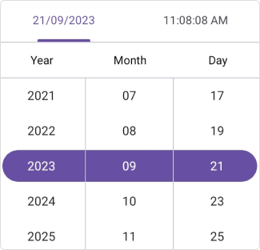
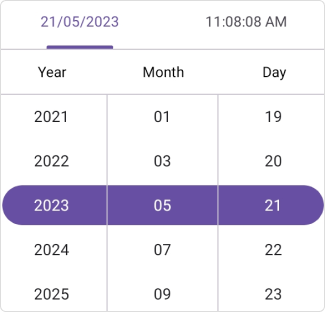
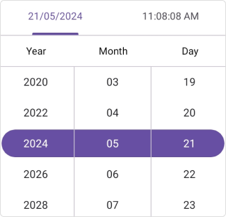
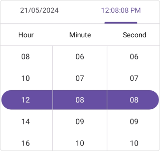
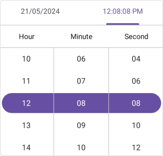
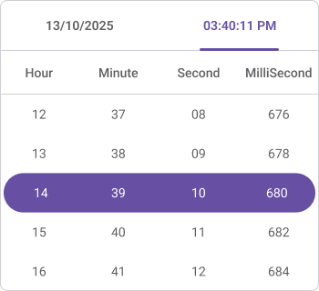

# Intervals in .NET MAUI Date Time Picker control
The `SfDateTimePicker` provides six intervals in [.NET MAUI Date Time Picker](https://www.syncfusion.com/maui-controls/maui-datetimepicker).

 * [`DayInterval`](https://help.syncfusion.com/cr/maui-toolkit/Syncfusion.Maui.Toolkit.Picker.SfDateTimePicker.html#Syncfusion_Maui_Toolkit_Picker_SfDateTimePicker_DayInterval)
 * [`MonthInterval`](https://help.syncfusion.com/cr/maui-toolkit/Syncfusion.Maui.Toolkit.Picker.SfDateTimePicker.html#Syncfusion_Maui_Toolkit_Picker_SfDateTimePicker_MonthInterval)
 * [`YearInterval`](https://help.syncfusion.com/cr/maui-toolkit/Syncfusion.Maui.Toolkit.Picker.SfDateTimePicker.html#Syncfusion_Maui_Toolkit_Picker_SfDateTimePicker_YearInterval)
 * [`HourInterval`](https://help.syncfusion.com/cr/maui-toolkit/Syncfusion.Maui.Toolkit.Picker.SfDateTimePicker.html#Syncfusion_Maui_Toolkit_Picker_SfDateTimePicker_HourInterval)
 * [`MinuteInterval`](https://help.syncfusion.com/cr/maui-toolkit/Syncfusion.Maui.Toolkit.Picker.SfDateTimePicker.html#Syncfusion_Maui_Toolkit_Picker_SfDateTimePicker_MinuteInterval)
 * [`SecondInterval`](https://help.syncfusion.com/cr/maui-toolkit/Syncfusion.Maui.Toolkit.Picker.SfDateTimePicker.html#Syncfusion_Maui_Toolkit_Picker_SfDateTimePicker_SecondInterval)
 * [`MilliSecondInterval`](https://help.syncfusion.com/cr/maui-toolkit/Syncfusion.Maui.Toolkit.Picker.SfDateTimePicker.html#Syncfusion_Maui_Toolkit_Picker_SfDateTimePicker_MilliSecondInterval)

## Day interval
Date Time picker provides an option to give an interval between days using the [DayInterval](https://help.syncfusion.com/cr/maui-toolkit/Syncfusion.Maui.Toolkit.Picker.SfDateTimePicker.html#Syncfusion_Maui_Toolkit_Picker_SfDateTimePicker_DayInterval) property of [SfDateTimePicker](https://help.syncfusion.com/cr/maui-toolkit/Syncfusion.Maui.Toolkit.Picker.SfDateTimePicker.html).




<picker:SfDateTimePicker x:Name="dateTimePicker"
                         DayInterval="2"/>




SfDateTimePicker dateTimePicker = new SfDateTimePicker();
dateTimePicker.DayInterval = 2;
this.Content = dateTimePicker;




   

## Month interval
Date Time picker provides an option to give an interval between months using the [MonthInterval](https://help.syncfusion.com/cr/maui-toolkit/Syncfusion.Maui.Toolkit.Picker.SfDateTimePicker.html#Syncfusion_Maui_Toolkit_Picker_SfDateTimePicker_MonthInterval) property of [SfDateTimePicker](https://help.syncfusion.com/cr/maui-toolkit/Syncfusion.Maui.Toolkit.Picker.SfDateTimePicker.html).




<picker:SfDateTimePicker x:Name="dateTimePicker"
                         MonthInterval="2"/>




SfDateTimePicker dateTimePicker = new SfDateTimePicker();
dateTimePicker.MonthInterval = 2;
this.Content = dateTimePicker;




   

## Year interval
Date Time picker provides an option to give an interval between years using the [YearInterval](https://help.syncfusion.com/cr/maui-toolkit/Syncfusion.Maui.Toolkit.Picker.SfDateTimePicker.html#Syncfusion_Maui_Toolkit_Picker_SfDateTimePicker_YearInterval) property of [SfDateTimePicker](https://help.syncfusion.com/cr/maui-toolkit/Syncfusion.Maui.Toolkit.Picker.SfDateTimePicker.html).




<picker:SfDateTimePicker x:Name="dateTimePicker"
                         YearInterval="2"/>




SfDateTimePicker dateTimePicker = new SfDateTimePicker();
dateTimePicker.YearInterval = 2;
this.Content = dateTimePicker;




   

## Hour interval
Date Time picker provides an option to give an interval between hours using the [HourInterval](https://help.syncfusion.com/cr/maui-toolkit/Syncfusion.Maui.Toolkit.Picker.SfDateTimePicker.html#Syncfusion_Maui_Toolkit_Picker_SfDateTimePicker_HourInterval) property of [SfDateTimePicker](https://help.syncfusion.com/cr/maui-toolkit/Syncfusion.Maui.Toolkit.Picker.SfDateTimePicker.html).




<picker:SfDateTimePicker x:Name="dateTimePicker"
                         HourInterval="2"/>


  

SfDateTimePicker dateTimePicker = new SfDateTimePicker();
dateTimePicker.HourInterval = 2;
this.Content = dateTimePicker;




   

## Minute interval
Date Time picker provides an option to give an interval between minutes using the [MinuteInterval](https://help.syncfusion.com/cr/maui-toolkit/Syncfusion.Maui.Toolkit.Picker.SfDateTimePicker.html#Syncfusion_Maui_Toolkit_Picker_SfDateTimePicker_MinuteInterval) property of [SfDateTimePicker](https://help.syncfusion.com/cr/maui-toolkit/Syncfusion.Maui.Toolkit.Picker.SfDateTimePicker.html).




<picker:SfDateTimePicker x:Name="dateTimePicker"
                         MinuteInterval="2"/>


  

SfDateTimePicker dateTimePicker = new SfDateTimePicker();
dateTimePicker.MinuteInterval = 2;
this.Content = dateTimePicker;




   

## Second interval
Date Time picker provides an option to give an interval between seconds using the [SecondInterval](https://help.syncfusion.com/cr/maui-toolkit/Syncfusion.Maui.Toolkit.Picker.SfDateTimePicker.html#Syncfusion_Maui_Toolkit_Picker_SfDateTimePicker_SecondInterval) property of [SfDateTimePicker](https://help.syncfusion.com/cr/maui-toolkit/Syncfusion.Maui.Toolkit.Picker.SfDateTimePicker.html).




<picker:SfDateTimePicker x:Name="dateTimePicker"
                         SecondInterval="2"/>


  

SfDateTimePicker dateTimePicker = new SfDateTimePicker()
dateTimePicker.SecondInterval = 2;
this.Content = dateTimePicker;




   

## MilliSecond interval
Date Time picker provides an option to give an interval between milliseconds using the [MilliSecondInterval](https://help.syncfusion.com/cr/maui-toolkit/Syncfusion.Maui.Toolkit.Picker.SfDateTimePicker.html#Syncfusion_Maui_Toolkit_Picker_SfDateTimePicker_MilliSecondInterval) property of [SfDateTimePicker](https://help.syncfusion.com/cr/maui-toolkit/Syncfusion.Maui.Toolkit.Picker.SfDateTimePicker.html).




<picker:SfDateTimePicker x:Name="dateTimePicker"
                         MilliSecondInterval="2"/>


  

SfDateTimePicker dateTimePicker = new SfDateTimePicker()
dateTimePicker.MilliSecondInterval = 2;
this.Content = dateTimePicker;




   