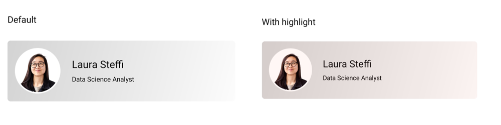
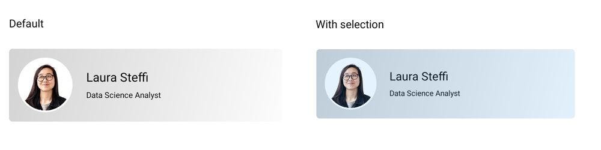
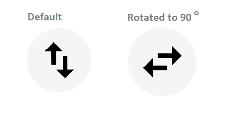

# Customization in .NET MAUI Effects View (SfEffectsView)

The [SfEffectsView](https://help.syncfusion.com/cr/maui-toolkit/Syncfusion.Maui.Toolkit.EffectsView.SfEffects.html) control provides support to customize animation duration, color, and more. This section explains how to customize the Effects View control.

## RippleAnimationDuration

The [RippleAnimationDuration](https://help.syncfusion.com/cr/maui-toolkit/Syncfusion.Maui.Toolkit.EffectsView.SfEffectsView.html#Syncfusion_Maui_Toolkit_EffectsView_SfEffectsView_RippleAnimationDuration) property of [SfEffectsView](https://help.syncfusion.com/cr/maui-toolkit/Syncfusion.Maui.Toolkit.EffectsView.SfEffects.html) is used to customize the duration of ripple animation.

 



<ContentPage 
    xmlns:effectsView="clr-namespace:Syncfusion.Maui.Toolkit.EffectsView;assembly=Syncfusion.Maui.Toolkit">
    <ContentPage.Content> 
	<effectsView:SfEffectsView RippleAnimationDuration="800"/> 
	</ContentPage.Content> 
</ContentPage>





using Syncfusion.Maui.Toolkit.EffectsView;

var effectsView = new SfEffectsView()
{
    RippleAnimationDuration = 800
};

this.Content = effectsView;





## ScaleAnimationDuration

The [ScaleAnimationDuration](https://help.syncfusion.com/cr/maui-toolkit/Syncfusion.Maui.Toolkit.EffectsView.SfEffectsView.html#Syncfusion_Maui_Toolkit_EffectsView_SfEffectsView_ScaleAnimationDuration) property of [SfEffectsView](https://help.syncfusion.com/cr/maui-toolkit/Syncfusion.Maui.Toolkit.EffectsView.SfEffects.html) is used to customize the duration of scale animation.

 



<ContentPage 
    xmlns:effectsView="clr-namespace:Syncfusion.Maui.Toolkit.EffectsView;assembly=Syncfusion.Maui.Toolkit">
    <ContentPage.Content> 
	<effectsView:SfEffectsView 
        ScaleAnimationDuration="800"
        LongPressEffects="Scale"
        ScaleFactor="0.85"/>
	</ContentPage.Content> 
</ContentPage>





using Syncfusion.Maui.Toolkit.EffectsView;

var effectsView = new SfEffectsView()
{
    ScaleAnimationDuration = 800,
    LongPressEffects = SfEffects.Scale,
    ScaleFactor = 0.85
};

this.Content = effectsView;





## RotationAnimationDuration

The [RotationAnimationDuration](https://help.syncfusion.com/cr/maui-toolkit/Syncfusion.Maui.Toolkit.EffectsView.SfEffectsView.html#Syncfusion_Maui_Toolkit_EffectsView_SfEffectsView_RotationAnimationDuration) property of [SfEffectsView](https://help.syncfusion.com/cr/maui-toolkit/Syncfusion.Maui.Toolkit.EffectsView.SfEffects.html) is used to customize the duration of rotation animation.

 



<ContentPage 
    xmlns:effectsView="clr-namespace:Syncfusion.Maui.Toolkit.EffectsView;assembly=Syncfusion.Maui.Toolkit">
    <ContentPage.Content> 
	<effectsView:SfEffectsView 
        RotationAnimationDuration="800"
        Angle="180"
        TouchDownEffects="Rotation"/>
	</ContentPage.Content> 
</ContentPage>





using Syncfusion.Maui.Toolkit.EffectsView;

var effectsView = new SfEffectsView()
{
    RotationAnimationDuration = 800,
    Angle = 180,
    TouchDownEffects = SfEffects.Rotation
};

this.Content = effectsView;





## InitialRippleFactor

The [InitialRippleFactor](https://help.syncfusion.com/cr/maui-toolkit/Syncfusion.Maui.Toolkit.EffectsView.SfEffectsView.html#Syncfusion_Maui_Toolkit_EffectsView_SfEffectsView_InitialRippleFactor) property of [SfEffectsView](https://help.syncfusion.com/cr/maui-toolkit/Syncfusion.Maui.Toolkit.EffectsView.SfEffectsView.html) is used to customize the radius of the ripple when ripple animation starts.

 



<ContentPage 
    xmlns:effectsView="clr-namespace:Syncfusion.Maui.Toolkit.EffectsView;assembly=Syncfusion.Maui.Toolkit">
    <ContentPage.Content> 
	<effectsView:SfEffectsView InitialRippleFactor="0.1"/>
	</ContentPage.Content> 
</ContentPage>





using Syncfusion.Maui.Toolkit.EffectsView;

var effectsView = new SfEffectsView
{
    InitialRippleFactor = 0.1
};

this.Content = effectsView;





## ScaleFactor

The [ScaleFactor](https://help.syncfusion.com/cr/maui-toolkit/Syncfusion.Maui.Toolkit.EffectsView.SfEffectsView.html#Syncfusion_Maui_Toolkit_EffectsView_SfEffectsView_ScaleFactor) property of [SfEffectsView](https://help.syncfusion.com/cr/maui-toolkit/Syncfusion.Maui.Toolkit.EffectsView.SfEffectsView.html) is used to customize the scale of the view.

 



<ContentPage
    xmlns:effectsView="clr-namespace:Syncfusion.Maui.Toolkit.EffectsView;assembly=Syncfusion.Maui.Toolkit">
    <ContentPage.Content> 
	<effectsView:SfEffectsView
        ScaleFactor="0.85"
        LongPressEffects="Scale"
        TouchDownEffects="None"
        TouchUpEffects="None"/>
	</ContentPage.Content> 
</ContentPage>





using Syncfusion.Maui.Toolkit.EffectsView;

var effectsView = new SfEffectsView
{
    ScaleFactor = 0.85,
    LongPressEffects = SfEffects.Scale,
    TouchDownEffects = SfEffects.None,
    TouchUpEffects = SfEffects.None
};

this.Content = effectsView;





## HighlightBackground

The [HighlightBackground](https://help.syncfusion.com/cr/maui-toolkit/Syncfusion.Maui.Toolkit.EffectsView.SfEffectsView.html#Syncfusion_Maui_Toolkit_EffectsView_SfEffectsView_HighlightBackground) property of [SfEffectsView](https://help.syncfusion.com/cr/maui-toolkit/Syncfusion.Maui.Toolkit.EffectsView.SfEffectsView.html) is used to customize the color of the highlight effect.

 



<ContentPage 
    xmlns:effectsView="clr-namespace:Syncfusion.Maui.Toolkit.EffectsView;assembly=Syncfusion.Maui.Toolkit">
    <ContentPage.Content> 
	<effectsView:SfEffectsView
        HighlightBackground="#2196F3"
        TouchDownEffects="Highlight"/>
	</ContentPage.Content> 
</ContentPage>





using Syncfusion.Maui.Toolkit.EffectsView;

var effectsView = new SfEffectsView
{
    effectsView.HighlightBackground = new SolidColorBrush(Colors.Aqua),
    TouchDownEffects = SfEffects.Highlight
};

this.Content = effectsView;





## RippleBackground

The [RippleBackground](https://help.syncfusion.com/cr/maui-toolkit/Syncfusion.Maui.Toolkit.EffectsView.SfEffectsView.html#Syncfusion_Maui_Toolkit_EffectsView_SfEffectsView_RippleBackground) property of [SfEffectsView](https://help.syncfusion.com/cr/maui-toolkit/Syncfusion.Maui.Toolkit.EffectsView.SfEffectsView.html) is used to customize the color of the ripple.

 



<ContentPage 
   xmlns:effectsView="clr-namespace:Syncfusion.Maui.Toolkit.EffectsView;assembly=Syncfusion.Maui.Toolkit">
    <ContentPage.Content> 
	<effectsView:SfEffectsView RippleBackground="#2196F3"/>
	</ContentPage.Content> 
</ContentPage>





using Syncfusion.Maui.Toolkit.EffectsView;

var effectsView = new SfEffectsView
{
    RippleBackground = new SolidColorBrush(Colors.Aqua)
};

this.Content = effectsView;
            




## SelectionBackground

The [SelectionBackground](https://help.syncfusion.com/cr/maui-toolkit/Syncfusion.Maui.Toolkit.EffectsView.SfEffectsView.html#Syncfusion_Maui_Toolkit_EffectsView_SfEffectsView_SelectionBackground) property of [SfEffectsView](https://help.syncfusion.com/cr/maui-toolkit/Syncfusion.Maui.Toolkit.EffectsView.SfEffectsView.html) is used to customize the color of selection effect.

 



<ContentPage 
    xmlns:effectsView="clr-namespace:Syncfusion.Maui.Toolkit.EffectsView;assembly=Syncfusion.Maui.Toolkit">
    <ContentPage.Content> 
	<effectsView:SfEffectsView
        LongPressEffects="Selection"
        SelectionBackground="#2196F3"/>
	</ContentPage.Content> 
</ContentPage>





using Syncfusion.Maui.Toolkit.EffectsView;

var effectsView = new SfEffectsView
{
    LongPressEffects = SfEffects.Selection,
    SelectionBackground = new SolidColorBrush(Colors.Aqua)
};

this.Content = effectsView;





## Angle

The [Angle](https://help.syncfusion.com/cr/maui-toolkit/Syncfusion.Maui.Toolkit.EffectsView.SfEffectsView.html#Syncfusion_Maui_Toolkit_EffectsView_SfEffectsView_Angle) property of [SfEffectsView](https://help.syncfusion.com/cr/maui-toolkit/Syncfusion.Maui.Toolkit.EffectsView.SfEffectsView.html?tabs=tabid-1) is used to customize the rotation angle.

 



<ContentPage 
    xmlns:effectsView="clr-namespace:Syncfusion.Maui.Toolkit.EffectsView;assembly=Syncfusion.Maui.Toolkit">
    <ContentPage.Content> 
	<effectsView:SfEffectsView
        Angle="180"
        TouchDownEffects="Ripple,Rotation"/>
	</ContentPage.Content> 
</ContentPage>





using Syncfusion.Maui.Toolkit.EffectsView;

var effectsView = new SfEffectsView
{
    Angle = 180,
    TouchDownEffects = SfEffects.Ripple | SfEffects.Rotation
};

this.Content = effectsView;
            




