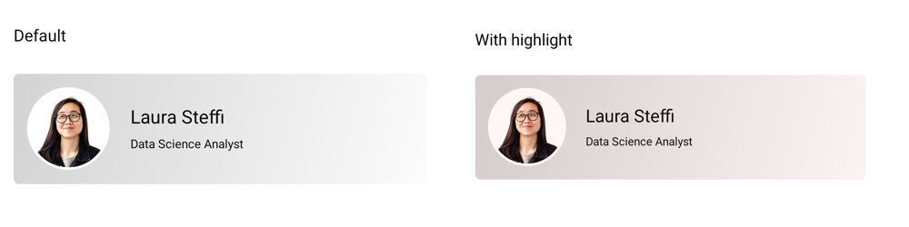

# Highlight Effect in .NET MAUI Effects View (SfEffectsView)

[SfEffects.Highlight](https://help.syncfusion.com/cr/maui-toolkit/Syncfusion.Maui.Toolkit.EffectsView.SfEffects.html#Syncfusion_Maui_Toolkit_EffectsView_SfEffects_Highlight) provides a smooth transition on the background color of the [SfEffectsView](https://help.syncfusion.com/cr/maui-toolkit/Syncfusion.Maui.Toolkit.EffectsView.SfEffectsView.html)

 



<ContentPage 
    xmlns:effectsView="clr-namespace:Syncfusion.Maui.Toolkit.EffectsView;assembly=Syncfusion.Maui.Toolkit">
    <ContentPage.Content> 
	<effectsView:SfEffectsView  
        TouchDownEffects="Highlight" 
        HighlightBackground="#FF0000"/> 
	</ContentPage.Content>  
</ContentPage>





using Syncfusion.Maui.Toolkit.EffectsView;

var effectsView = new SfEffectsView
{
    TouchDownEffects = SfEffects.Highlight,
    HighlightBackground = new SolidColorBrush(Colors.Aqua)
};
this.Content = effectsView;  





