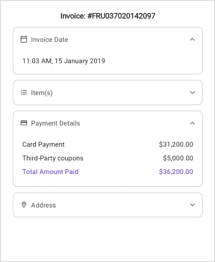

# Getting Started with .NET MAUI Expander (SfExpander)

This section guides you through setting up and configuring a `Expander` in your .NET MAUI application. Follow the steps below to add a basic Expander to your project.




## Prerequisites
Before proceeding, ensure the following are in place:

 1. Install [.NET 9 SDK](https://dotnet.microsoft.com/en-us/download/dotnet/9.0) or later.
 2. Set up a .NET MAUI environment with Visual Studio 2026 (v18.0.0 or later).

## Step 1: Create a .NET MAUI project

 1. Go to **File > New > Project** and choose the **.NET MAUI App** template.
 2. Name the project and choose a location. Then, click **Next**.
 3. Select the .NET framework version and click Create.
 
## Step 2: Install the Syncfusion MAUI ToolKit NuGet Package

 1. In **Solution Explorer**, right-click the project and choose **Manage NuGet Packages**.
 2. Search for [Syncfusion.Maui.ToolKit](https://help.syncfusion.com/cr/maui-toolkit/Syncfusion.Maui.Toolkit.html) and install the latest version.
 3. Ensure the necessary dependencies are installed correctly, and the project is restored.

## Step 3: Register the handler

In the **MauiProgram.cs file**, register the handler for Syncfusion® Toolkit.




using Syncfusion.Maui.Toolkit.Hosting;

public class MauiProgram 
{
    public static MauiApp CreateMauiApp()
    {
        var builder = MauiApp.CreateBuilder();
        builder
        .UseMauiApp<App>()
        .ConfigureFonts(fonts =>
        {
            fonts.AddFont("OpenSans-Regular.ttf", "OpenSansRegular");
        });

        builder.ConfigureSyncfusionToolkit();
        return builder.Build();
    }
}

 

 
## Step 4: Add a Basic Expander control
 
 1. To initialize the control, import the `Syncfusion.Maui.Toolkit.Expander` namespace into your code.

 2. Initialize `SfExpander` class.
 


<ContentPage   
    xmlns:syncfusion=xmlns:syncfusion="clr-namespace:Syncfusion.Maui.Toolkit.Expander;assembly=Syncfusion.Maui.Toolkit">
    <syncfusion:SfExpander />
</ContentPage>



using Syncfusion.Maui.Toolkit.Expander;
. . .
public partial class MainPage : ContentPage
{
    public MainPage()
    {
        InitializeComponent();
        SfExpander expander = new SfExpander();
    }
}






## Prerequisites
Before proceeding, ensure the following are set up:

1. Install [.NET 8 SDK](https://dotnet.microsoft.com/en-us/download/dotnet/8.0) or later is installed.
2. Set up a .NET MAUI environment with Visual Studio Code.
3. Ensure that the .NET MAUI extension is installed and configured as described [here.](https://learn.microsoft.com/en-us/dotnet/maui/get-started/installation?view=net-maui-8.0&tabs=visual-studio-code)

## Step 1: Create a new .NET MAUI Project

1. Open the command palette by pressing `Ctrl+Shift+P` and type **.NET:New Project** and enter.
2. Choose the **.NET MAUI App** template.
3. Select the project location, type the project name and press **Enter.**
4. Then choose **Create project.**

## Step 2: Install the Syncfusion® MAUI Core NuGet Package

1. Press <kbd>Ctrl</kbd> + <kbd>`</kbd> (backtick) to open the integrated terminal in Visual Studio Code.
2. Ensure you're in the project root directory where your .csproj file is located.
3. Run the command `dotnet add package Syncfusion.Maui.Toolkit` to install the Syncfusion® .NET MAUI Toolkit NuGet package.
4. To ensure all dependencies are installed, run `dotnet restore`.

## Step 3: Register the handler

In the **MauiProgram.cs file**, register the handler for Syncfusion® Toolkit.




using Syncfusion.Maui.Toolkit.Hosting;

public class MauiProgram 
{
    public static MauiApp CreateMauiApp()
    {
        var builder = MauiApp.CreateBuilder();
        builder
        .UseMauiApp<App>()
        .ConfigureFonts(fonts =>
        {
            fonts.AddFont("OpenSans-Regular.ttf", "OpenSansRegular");
        });

        builder.ConfigureSyncfusionToolkit();
        return builder.Build();
    }
}

 


## Step 4: Add a Basic Expander control
 
 1. To initialize the control, import the `Syncfusion.Maui.Toolkit.Expander` namespace into your code.

 2. Initialize `SfExpander` class.
 


<ContentPage   
    xmlns:syncfusion=xmlns:syncfusion="clr-namespace:Syncfusion.Maui.Toolkit.Expander;assembly=Syncfusion.Maui.Toolkit">
    <syncfusion:SfExpander />
</ContentPage>



using Syncfusion.Maui.Toolkit.Expander;
. . .
public partial class MainPage : ContentPage
{
    public MainPage()
    {
        InitializeComponent();
        SfExpander expander = new SfExpander();
    }
}






## Prerequisites

Before proceeding, ensure the following are set up:

1. Ensure you have the latest version of JetBrains Rider.
2. Install [.NET 8 SDK](https://dotnet.microsoft.com/en-us/download/dotnet/8.0) or later is installed.
3. Make sure the MAUI workloads are installed and configured as described [here.](https://www.jetbrains.com/help/rider/MAUI.html#before-you-start)

## Step 1: Create a new .NET MAUI Project

1. Go to **File > New Solution,** Select .NET (C#) and choose the .NET MAUI App template.
2. Enter the Project Name, Solution Name, and Location.
3. Select the .NET framework version and click Create.

## Step 2: Install the Syncfusion® MAUI Toolkit NuGet Package

1. In **Solution Explorer,** right-click the project and choose **Manage NuGet Packages.**
2. Search for [Syncfusion.Maui.Toolkit](https://www.nuget.org/packages/Syncfusion.Maui.Toolkit/) and install the latest version.
3. Ensure the necessary dependencies are installed correctly, and the project is restored. If not, Open the Terminal in Rider and manually run: `dotnet restore`

## Step 3: Register the handler

In the **MauiProgram.cs file**, register the handler for Syncfusion® Toolkit.




using Syncfusion.Maui.Toolkit.Hosting;

public class MauiProgram 
{
    public static MauiApp CreateMauiApp()
    {
        var builder = MauiApp.CreateBuilder();
        builder
        .UseMauiApp<App>()
        .ConfigureFonts(fonts =>
        {
            fonts.AddFont("OpenSans-Regular.ttf", "OpenSansRegular");
        });

        builder.ConfigureSyncfusionToolkit();
        return builder.Build();
    }
}

 


## Step 4: Add a Basic Expander control
 
 1. To initialize the control, import the `Syncfusion.Maui.Toolkit.Expander` namespace into your code.

 2. Initialize `SfExpander` class.
 


<ContentPage   
    xmlns:syncfusion=xmlns:syncfusion="clr-namespace:Syncfusion.Maui.Toolkit.Expander;assembly=Syncfusion.Maui.Toolkit">
    <syncfusion:SfExpander />
</ContentPage>



using Syncfusion.Maui.Toolkit.Expander;
. . .
public partial class MainPage : ContentPage
{
    public MainPage()
    {
        InitializeComponent();
        SfExpander expander = new SfExpander();
    }
}





## Step 5: Define the Header and Content 

The `SfExpander` is a layout control that includes a `Header` and a `Content` section, where any view can be loaded. The visibility of the content can be controlled using the `IsExpanded` property. Users can expand or collapse the content view by tapping the header.

Here, the grid with label is loaded in the header and content of the expander. 

N> Loading the `Label` as direct children of the `Header` or `Content` of the Expander will lead to an exception. So, load the Label inside the Grid to overcome the crash.



<?xml version="1.0" encoding="utf-8" ?>
<ContentPage xmlns="http://schemas.microsoft.com/dotnet/2021/maui"
             xmlns:x="http://schemas.microsoft.com/winfx/2009/xaml"
             xmlns:syncfusion="clr-namespace:Syncfusion.Maui.Toolkit.Expander;assembly=Syncfusion.Maui.Toolkit"
             x:Class="GettingStarted.MainPage">
    <ContentPage.Content>
        <ScrollView >
            <StackLayout  HorizontalOptions="{OnPlatform MacCatalyst=Center,WinUI=Center}"  >
                <Label Text="Invoice: #FRU037020142097"  Opacity="1.0" VerticalTextAlignment="Center" Margin="0,0,0,5" FontAttributes="Bold" VerticalOptions="Center" HorizontalOptions="CenterAndExpand"/>
                <Border StrokeShape="RoundRectangle 8,8,8,8" Margin="{OnPlatform Default='8,0,8,8',WinUI='8,0,6,8',MacCatalyst='8,0,6,8'}" Stroke="#CAC4D0"  StrokeThickness="{OnPlatform MacCatalyst=2,Default=1}" WidthRequest="{OnPlatform MacCatalyst=460,WinUI=340}">
                    <syncfusion:SfExpander AnimationDuration="200" IsExpanded="True" >
                        <syncfusion:SfExpander.Header>
                            <Grid >
                                <Grid.RowDefinitions>
                                    <RowDefinition Height="48"/>
                                </Grid.RowDefinitions>
                                <Grid.ColumnDefinitions>
                                    <ColumnDefinition Width="35"/>
                                    <ColumnDefinition Width="*"/>
                                </Grid.ColumnDefinitions>
                                <Label Text="&#xe703;" FontSize="16" Margin="14,2,2,2"
                                                   FontFamily='{OnPlatform Android=AccordionFontIcons.ttf#,WinUI=AccordionFontIcons.ttf#AccordionFontIcons,MacCatalyst=AccordionFontIcons,iOS=AccordionFontIcons}'
                                                   VerticalOptions="Center" VerticalTextAlignment="Center"/>
                                <Label CharacterSpacing="0.25" FontFamily="Roboto-Regular"  Text="Invoice Date" FontSize="14" Grid.Column="1" VerticalOptions="CenterAndExpand"/>
                            </Grid>
                        </syncfusion:SfExpander.Header>
                        <syncfusion:SfExpander.Content>
                            <Grid Padding="18,8,0,18" >
                                <Label CharacterSpacing="0.25" FontFamily="Roboto-Regular"  Text="11:03 AM, 15 January 2019" FontSize="14" VerticalOptions="CenterAndExpand"/>
                            </Grid>
                        </syncfusion:SfExpander.Content>
                    </syncfusion:SfExpander>
                </Border>
                <Border StrokeShape="RoundRectangle 8,8,8,8" Margin="{OnPlatform Default='8,0,8,8',WinUI='8,0,6,8',MacCatalyst='8,0,6,8'}" Stroke="#CAC4D0"  StrokeThickness="{OnPlatform MacCatalyst=2,Default=1}" WidthRequest="{OnPlatform MacCatalyst=460,WinUI=340}">
                    <syncfusion:SfExpander  AnimationDuration="200" IsExpanded="False">
                        <syncfusion:SfExpander.Header>
                            <Grid>
                                <Grid.RowDefinitions>
                                    <RowDefinition Height="48"/>
                                </Grid.RowDefinitions>
                                <Grid.ColumnDefinitions>
                                    <ColumnDefinition Width="35"/>
                                    <ColumnDefinition Width="*"/>
                                </Grid.ColumnDefinitions>
                                <Label Text="&#xe701;" FontSize="16" Margin="14,2,2,2"
                                                   FontFamily='{OnPlatform Android=AccordionFontIcons.ttf#,WinUI=AccordionFontIcons.ttf#AccordionFontIcons,MacCatalyst=AccordionFontIcons,iOS=AccordionFontIcons}'
                                                   VerticalOptions="Center" VerticalTextAlignment="Center"/>
                                <Label CharacterSpacing="0.25" FontFamily="Roboto-Regular"  Text="Item(s)" FontSize="14" Grid.Column="1" VerticalOptions="CenterAndExpand"/>
                            </Grid>
                        </syncfusion:SfExpander.Header>
                        <syncfusion:SfExpander.Content>
                            <Grid Padding="18,8,18,18">
                                <Grid.RowDefinitions>
                                    <RowDefinition Height="20"/>
                                    <RowDefinition Height="20"/>
                                    <RowDefinition Height="20"/>
                                    <RowDefinition Height="20"/>
                                    <RowDefinition Height="20"/>
                                    <RowDefinition Height="20"/>
                                    <RowDefinition Height="20"/>
                                </Grid.RowDefinitions>
                                <Grid.ColumnDefinitions>
                                    <ColumnDefinition Width="*"/>
                                    <ColumnDefinition Width="*"/>
                                </Grid.ColumnDefinitions>
                                <Label FontSize="14" CharacterSpacing="0.25"  Text="2018 Subaru Outback"/>
                                <Label FontSize="14" CharacterSpacing="0.25"  Text="All-Weather Mats" Grid.Row="1"/>
                                <Label FontSize="14" CharacterSpacing="0.25"  Text="Door Edge Guard Kit" Grid.Row="2"/>
                                <Label FontSize="14" CharacterSpacing="0.25"  Text="Rear Bumper Cover" Grid.Row="3"/>
                                <Label FontSize="14" CharacterSpacing="0.25"  Text="Wheel Locks" Grid.Row="4"/>
                                <Label FontSize="14" CharacterSpacing="0.25"  Text="Gas Full Tank" Grid.Row="5"/>
                                <Label FontSize="14" CharacterSpacing="0.25"  Text="Total Amount" TextColor="{StaticResource Primary}" Grid.Row="6"/>
                                <Label FontSize="14" CharacterSpacing="0.25"  HorizontalOptions="End" Text="$35,705.00" Grid.Row="0" Grid.Column="1"/>
                                <Label FontSize="14" CharacterSpacing="0.25"  HorizontalOptions="End" Text="$101.00" Grid.Row="1" Grid.Column="1"/>
                                <Label FontSize="14" CharacterSpacing="0.25"  HorizontalOptions="End" Text="$162.00" Grid.Row="2" Grid.Column="1"/>
                                <Label FontSize="14" CharacterSpacing="0.25"  HorizontalOptions="End" Text="$107.00" Grid.Row="3" Grid.Column="1"/>
                                <Label FontSize="14" CharacterSpacing="0.25"  HorizontalOptions="End" Text="$81.00" Grid.Row="4" Grid.Column="1"/>
                                <Label FontSize="14" CharacterSpacing="0.25"  HorizontalOptions="End" Text="$64.00" Grid.Row="5" Grid.Column="1"/>
                                <Label FontSize="14" CharacterSpacing="0.25"  HorizontalOptions="End" Text="$36,220.00" TextColor="{StaticResource Primary}" Grid.Row="6" Grid.Column="1"/>
                            </Grid>
                        </syncfusion:SfExpander.Content>
                    </syncfusion:SfExpander>
                </Border>
                <Border StrokeShape="RoundRectangle 8,8,8,8" Margin="{OnPlatform Default='8,0,8,8',WinUI='8,0,6,8',MacCatalyst='8,0,6,8'}" Stroke="#CAC4D0" StrokeThickness="{OnPlatform MacCatalyst=2,Default=1}" WidthRequest="{OnPlatform MacCatalyst=460,WinUI=340}">
                    <syncfusion:SfExpander AnimationDuration="200"  IsExpanded="False">
                        <syncfusion:SfExpander.Header>
                            <Grid>
                                <Grid.RowDefinitions>
                                    <RowDefinition Height="48"/>
                                </Grid.RowDefinitions>
                                <Grid.ColumnDefinitions>
                                    <ColumnDefinition Width="35"/>
                                    <ColumnDefinition Width="*"/>
                                </Grid.ColumnDefinitions>
                                <Label Text="&#xe702;" FontSize="16" Margin="14,2,2,2"
                                                   FontFamily='{OnPlatform Android=AccordionFontIcons.ttf#,WinUI=AccordionFontIcons.ttf#AccordionFontIcons,MacCatalyst=AccordionFontIcons,iOS=AccordionFontIcons}'
                                                   VerticalOptions="Center" VerticalTextAlignment="Center"/>
                                <Label CharacterSpacing="0.25" FontFamily="Roboto-Regular"  Text="Payment Details" FontSize="14" Grid.Column="1" VerticalOptions="CenterAndExpand"/>
                            </Grid>
                        </syncfusion:SfExpander.Header>
                        <syncfusion:SfExpander.Content>
                            <Grid Padding="18,8,18,18"  RowSpacing="6" >
                                <Grid.RowDefinitions>
                                    <RowDefinition Height="20"/>
                                    <RowDefinition Height="20"/>
                                    <RowDefinition Height="20"/>
                                </Grid.RowDefinitions>
                                <Grid.ColumnDefinitions>
                                    <ColumnDefinition Width="*"/>
                                    <ColumnDefinition Width="*"/>
                                </Grid.ColumnDefinitions>
                                <Label FontSize="14" CharacterSpacing="0.25"  Text="Card Payment"/>
                                <Label FontSize="14" CharacterSpacing="0.25"  Text="Third-Party coupons" Grid.Row="1"/>
                                <Label FontSize="14" CharacterSpacing="0.25"  Text="Total Amount Paid" TextColor="{StaticResource Primary}" Grid.Row="2"/>
                                <Label FontSize="14" CharacterSpacing="0.25"  HorizontalOptions="End" Text="$31,200.00" Grid.Column="1"/>
                                <Label FontSize="14" CharacterSpacing="0.25"  HorizontalOptions="End" Text="$5,000.00" Grid.Row="1" Grid.Column="1"/>
                                <Label FontSize="14" CharacterSpacing="0.25"  HorizontalOptions="End" Text="$36,200.00" TextColor="{StaticResource Primary}" Grid.Row="2" Grid.Column="1"/>
                            </Grid>
                        </syncfusion:SfExpander.Content>
                    </syncfusion:SfExpander>
                </Border>
                <Border StrokeShape="RoundRectangle 8,8,8,8" Margin="{OnPlatform Default='8,0,8,8',WinUI='8,0,6,8',MacCatalyst='8,0,6,8'}" Stroke="#CAC4D0" StrokeThickness="{OnPlatform MacCatalyst=2,Default=1}" WidthRequest="{OnPlatform MacCatalyst=460,WinUI=340}">
                    <syncfusion:SfExpander AnimationDuration="200" IsExpanded="True">
                        <syncfusion:SfExpander.Header>
                            <Grid>
                                <Grid.RowDefinitions>
                                    <RowDefinition Height="48"/>
                                </Grid.RowDefinitions>
                                <Grid.ColumnDefinitions>
                                    <ColumnDefinition Width="35"/>
                                    <ColumnDefinition Width="*"/>
                                </Grid.ColumnDefinitions>
                                <Label Text="&#xe704;" FontSize="16" Margin="14,2,2,2"
                                                   FontFamily='{OnPlatform Android=AccordionFontIcons.ttf#,WinUI=AccordionFontIcons.ttf#AccordionFontIcons,MacCatalyst=AccordionFontIcons,iOS=AccordionFontIcons}'
                                                   VerticalOptions="Center" VerticalTextAlignment="Center"/>
                                <Label CharacterSpacing="0.25" FontFamily="Roboto-Regular" FontSize="14" Text="Address" Grid.Column="1" VerticalOptions="CenterAndExpand"/>
                            </Grid>
                        </syncfusion:SfExpander.Header>
                        <syncfusion:SfExpander.Content>
                            <Grid Padding="18,8,18,18" Grid.Row="1" RowSpacing="1">
                                <Grid.RowDefinitions >
                                    <RowDefinition Height="Auto"/>
                                    <RowDefinition Height="Auto"/>
                                    <RowDefinition Height="Auto"/>
                                </Grid.RowDefinitions>
                                <Label CharacterSpacing="0.25"  FontSize="14" Text="Alex" FontAttributes="Bold"/>
                                <Label CharacterSpacing="0.25"  FontSize="14" Text="No.8 Blossom St, Washington, DC 20019" Grid.Row="1"/>
                                <Label CharacterSpacing="0.25"  FontSize="14" Text="(202) 547-3555" Grid.Row="2"/>
                            </Grid>
                        </syncfusion:SfExpander.Content>
                    </syncfusion:SfExpander>
                </Border>
            </StackLayout>
        </ScrollView>
    </ContentPage.Content>
</ContentPage>



## Step 6: Running the Application

Press **F5** to build and run the application. Once compiled, the Expander will be displayed with the data provided.

Here is the result of the previous codes,

## Animation duration

The `SfExpander` allows you to customize the duration of the expanding and collapsing animations by using the `AnimationDuration` property. By default, the animation duration is set to `300 milliseconds`.



    <syncfusion:SfExpander x:Name="expander" 
                           AnimationDuration="250"/>


    expander.AnimationDuration = 250;



## Animation easing

The `SfExpander` allows you to customize the rate of change of parameters over time or the animation style by using the `AnimationEasing` property. By default, the animation easing is set to `Linear`.



    <syncfusion:SfExpander x:Name="expander"
                           AnimationEasing="SinOut"/>       


    expander.AnimationEasing = ExpanderAnimationEasing.SinOut;



## Expand and collapse 

The `SfExpander` allows users to programmatically expand or collapse its content using the `IsExpanded` property. Users can manage the expand and collapse actions by handling the `Expanding` and `Collapsing` events.



    <syncfusion:SfExpander x:Name="expander" 
                           IsExpanded="True"/>        


    expander.IsExpanded = true;



## Events 

There are four built-in events in the SfExpander control namely:

* `Expanding`
* `Expanded`
* `Collapsing`
* `Collapsed`

### Expanding Event

The `Expanding` event will be triggered when the expander control is being expanded.Expansion can be canceled using the `ExpandingAndCollapsingEventArgs`, which includes the following property:

* `Cancel`: Indicates that the expansion or collapse action should be canceled.



<syncfusion:SfExpander Expanding="SfExpander_Expanding"/>



private void SfExpander_Expanding(object sender, ExpandingAndCollapsingEventArgs e)
{
    e.Cancel = true;
}



### Expanded Event

The `Expanded` event is triggered when the expander is fully expanded. You can execute your own code when this event occurs.



<syncfusion:SfExpander Expanded="SfExpander_Expanded"/>



private void SfExpander_Expanded(object sender, ExpandedAndCollapsedEventArgs e)
{
    // Codes that need to be executed once the expander is expanded.
}



### Collapsing Event

The `Collapsing` event will be triggered when the expander control is being collapsed.Collapsing can be canceled using the `ExpandingAndCollapsingEventArgs`, which includes the following property:

* `Cancel`: Indicates that the expansion or collapse action should be canceled.



<syncfusion:SfExpander Collapsing="SfExpander_Collapsing"/>



private void SfExpander_Collapsing(object sender, ExpandingAndCollapsingEventArgs e)
{
    e.Cancel = true;
}



### Collapsed Event 

The `Collapsed` event is triggered when the expander is collapsed. You can execute your own code when this event occurs.



<syncfusion:SfExpander Collapsed="SfExpander_Collapsed"/>



private void SfExpander_Collapsed(object sender, ExpandedAndCollapsedEventArgs e)
{
    // Codes that need to be executed once the expander is collapsed.
}


