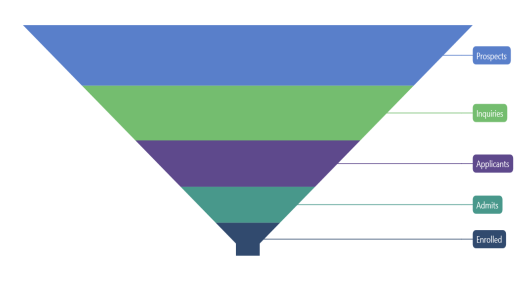

# Data Labels in .NET MAUI Chart

Data labels are used to display values related to a chart segment. Values from data point (x, y) or other custom properties from a data source can be displayed.

## Enable Data Labels 

To define data labels in the chart, set the [ShowDataLabels](https://help.syncfusion.com/cr/maui-toolkit/Syncfusion.Maui.Toolkit.Charts.SfFunnelChart.html#Syncfusion_Maui_Toolkit_Charts_SfFunnelChart_ShowDataLabels) property to true. The default value of the [ShowDataLabels](https://help.syncfusion.com/cr/maui-toolkit/Syncfusion.Maui.Toolkit.Charts.SfFunnelChart.html#Syncfusion_Maui_Toolkit_Charts_SfFunnelChart_ShowDataLabels) property is false.





<chart:SfFunnelChart ShowDataLabels="True">
    <!-- Other chart configurations -->
</chart:SfFunnelChart>





SfFunnelChart chart = new SfFunnelChart();
// Other chart configurations
chart.ShowDataLabels = true;  // Enable data labels for the chart.
this.Content = chart;


 

## Data Label Customization

Data labels can be customized by using the [DataLabelSettings](https://help.syncfusion.com/cr/maui-toolkit/Syncfusion.Maui.Toolkit.Charts.SfFunnelChart.html#Syncfusion_Maui_Toolkit_Charts_SfFunnelChart_DataLabelSettings) property of the chart. For customization, you need to create an instance of [FunnelDataLabelSettings](https://help.syncfusion.com/cr/maui-toolkit/Syncfusion.Maui.Toolkit.Charts.FunnelDataLabelSettings.html) and set it to the [DataLabelSettings](https://help.syncfusion.com/cr/maui-toolkit/Syncfusion.Maui.Toolkit.Charts.SfFunnelChart.html#Syncfusion_Maui_Toolkit_Charts_SfFunnelChart_DataLabelSettings) property. The following properties, which are available in [FunnelDataLabelSettings](https://help.syncfusion.com/cr/maui-toolkit/Syncfusion.Maui.Toolkit.Charts.FunnelDataLabelSettings.html), are used to customize the data labels:

* [LabelPlacement](https://help.syncfusion.com/cr/maui-toolkit/Syncfusion.Maui.Toolkit.Charts.ChartDataLabelSettings.html#Syncfusion_Maui_Toolkit_Charts_ChartDataLabelSettings_LabelPlacement) - Used to position the funnel chart data labels at [Auto](https://help.syncfusion.com/cr/maui-toolkit/Syncfusion.Maui.Toolkit.Charts.DataLabelPlacement.html#Syncfusion_Maui_Toolkit_Charts_DataLabelPlacement_Auto), [Inner](https://help.syncfusion.com/cr/maui-toolkit/Syncfusion.Maui.Toolkit.Charts.DataLabelPlacement.html#Syncfusion_Maui_Toolkit_Charts_DataLabelPlacement_Inner), [Center](https://help.syncfusion.com/cr/maui-toolkit/Syncfusion.Maui.Toolkit.Charts.DataLabelPlacement.html#Syncfusion_Maui_Toolkit_Charts_DataLabelPlacement_Center) and [Outer](https://help.syncfusion.com/cr/maui-toolkit/Syncfusion.Maui.Toolkit.Charts.DataLabelPlacement.html#Syncfusion_Maui_Toolkit_Charts_DataLabelPlacement_Outer).
* [UseSeriesPalette](https://help.syncfusion.com/cr/maui-toolkit/Syncfusion.Maui.Toolkit.Charts.ChartDataLabelSettings.html#Syncfusion_Maui_Toolkit_Charts_ChartDataLabelSettings_UseSeriesPalette) - Used to set the interior of the chart to the data label background.
* [Context](https://help.syncfusion.com/cr/maui-toolkit/Syncfusion.Maui.Toolkit.Charts.FunnelDataLabelSettings.html#Syncfusion_Maui_Toolkit_Charts_FunnelDataLabelSettings_Context) of type `FunnelDataLabelContext`, indicates whether to show x or y value in the label content.
* [LabelStyle](https://help.syncfusion.com/cr/maui-toolkit/Syncfusion.Maui.Toolkit.Charts.ChartDataLabelSettings.html#Syncfusion_Maui_Toolkit_Charts_ChartDataLabelSettings_LabelStyle) - Used to customize the data label's appearance. The following properties are available in [ChartDataLabelStyle](https://help.syncfusion.com/cr/maui-toolkit/Syncfusion.Maui.Toolkit.Charts.ChartDataLabelStyle.html):
    * [Margin](https://help.syncfusion.com/cr/maui-toolkit/Syncfusion.Maui.Toolkit.Charts.ChartLabelStyle.html#Syncfusion_Maui_Toolkit_Charts_ChartLabelStyle_Margin) of type `Thickness`, indicates the label's margin.
    * [Background](https://help.syncfusion.com/cr/maui-toolkit/Syncfusion.Maui.Toolkit.Charts.ChartLabelStyle.html#Syncfusion_Maui_Toolkit_Charts_ChartLabelStyle_Background), of type `Brush`, indicates the label background color.
    * [FontAttributes](https://help.syncfusion.com/cr/maui-toolkit/Syncfusion.Maui.Toolkit.Charts.ChartLabelStyle.html#Syncfusion_Maui_Toolkit_Charts_ChartLabelStyle_FontAttributes), of type `FontAttributes`, indicates the font style of the data label.
    * [FontSize](https://help.syncfusion.com/cr/maui-toolkit/Syncfusion.Maui.Toolkit.Charts.ChartLabelStyle.html#Syncfusion_Maui_Toolkit_Charts_ChartLabelStyle_FontSize), of type `double`, indicates the font size.
    * [Stroke](https://help.syncfusion.com/cr/maui-toolkit/Syncfusion.Maui.Toolkit.Charts.ChartLabelStyle.html#Syncfusion_Maui_Toolkit_Charts_ChartLabelStyle_Stroke), of type `Brush`, indicates the brush used to paint the border of the data label.
    * [StrokeWidth](https://help.syncfusion.com/cr/maui-toolkit/Syncfusion.Maui.Toolkit.Charts.ChartLabelStyle.html#Syncfusion_Maui_Toolkit_Charts_ChartLabelStyle_StrokeWidth), of type `double`, indicates the width of the label's border.
    * [CornerRadius](https://help.syncfusion.com/cr/maui-toolkit/Syncfusion.Maui.Toolkit.Charts.ChartLabelStyle.html#Syncfusion_Maui_Toolkit_Charts_ChartLabelStyle_CornerRadius), of type `CornerRadius`, indicates the rounded corner for label.
    * [TextColor](https://help.syncfusion.com/cr/maui-toolkit/Syncfusion.Maui.Toolkit.Charts.ChartLabelStyle.html#Syncfusion_Maui_Toolkit_Charts_ChartLabelStyle_TextColor), of type `Color`, indicates the color of the displayed text.





<chart:SfFunnelChart ShowDataLabels="True">
    <!-- Other chart configurations -->
    <chart:SfFunnelChart.DataLabelSettings>
        <chart:FunnelDataLabelSettings LabelPlacement="Outer" 
                                       Context="XValue" 
                                       UseSeriesPalette="True">
            <chart:FunnelDataLabelSettings.LabelStyle>
                <chart:ChartDataLabelStyle Margin="2"/>
            </chart:FunnelDataLabelSettings.LabelStyle>
        </chart:FunnelDataLabelSettings>
    </chart:SfFunnelChart.DataLabelSettings>
</chart:SfFunnelChart>





SfFunnelChart chart = new SfFunnelChart();
// Other chart configurations
chart.ShowDataLabels = true;

// Define style for data labels.
ChartDataLabelStyle labelStyle = new ChartDataLabelStyle()
{
    Margin = 2,
};

// Configure data label settings for the chart.
chart.DataLabelSettings = new FunnelDataLabelSettings()
{
    Context = FunnelDataLabelContext.XValue, // Show x value in the label content.
    LabelPlacement = DataLabelPlacement.Outer, // Position the data labels at outer side of the chart.
    UseSeriesPalette = true, // Set the interior of the chart to the data label background.
    LabelStyle = labelStyle, // Apply the style for data labels.
};

this.Content = chart;


 

