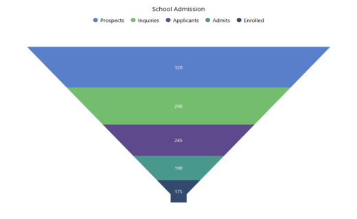

# Getting Started with .NET MAUI Funnel Chart

This section explains how to populate the Funnel Chart with data, including adding a title, data labels, a legend, and tooltips. It also covers the essential aspects needed to get started with the Funnel Chart.

## Prerequisites

Before proceeding, ensure that the following are set up:
1. [.NET 8 SDK](https://dotnet.microsoft.com/en-us/download/dotnet/8.0) or later is installed.
2. A .NET MAUI development environment is configured using either:
    - Visual Studio 2022 (version 17.8 or later), or
    - Visual Studio Code, with the .NET MAUI workload installed and configured. For more information on setting up Visual Studio Code with .NET MAUI, see the official [documentation.](https://learn.microsoft.com/en-us/dotnet/maui/get-started/installation?view=net-maui-8.0&tabs=visual-studio-code)

## Step 1: Create a New .NET MAUI Project

### Visual Studio

1. Go to **File > New > Project** and choose the **.NET MAUI App** template.
2. Name the project and choose a location. Then click **Next**.
3. Select the .NET framework version and click **Create**.

### Visual Studio Code

1. Open the command palette by pressing `Ctrl+Shift+P` and type **.NET:New Project** and enter.
2. Choose the **.NET MAUI App** template.
3. Select the project location, type the project name and press **Enter**.
4. Then choose **Create project.**

## Step 2: Install the Syncfusion .NET MAUI Toolkit Package

### Visual Studio

1. In **Solution Explorer,** `right-click` the project and choose **Manage NuGet Packages.**
2. Search for [Syncfusion.Maui.Toolkit](https://www.nuget.org/packages/Syncfusion.Maui.Toolkit/) and install the latest version.
3. Ensure the necessary dependencies are installed correctly, and the project is restored.

### Visual Studio Code

1. Press <kbd>Ctrl</kbd> + <kbd>`</kbd> (backtick) to open the integrated terminal in Visual Studio Code.
2. Ensure you're in the project root directory where your .csproj file is located.
3. Run the following command to install the Syncfusion .NET MAUI Toolkit NuGet package:
  




    dotnet add package Syncfusion.Maui.Toolkit





4. To ensure all dependencies are installed, run:





    dotnet restore
    




## Step 3: Register the handler

In the **MauiProgram.cs** file, register the handler for Syncfusion Toolkit.





    using Syncfusion.Maui.Toolkit.Hosting;

    public static class MauiProgram
    {
	    public static MauiApp CreateMauiApp()
	    {
	        var builder = MauiApp.CreateBuilder();
		    builder
			    .ConfigureSyncfusionToolkit()
			    .UseMauiApp<App>()
			    .ConfigureFonts(fonts =>
			    {
				    fonts.AddFont("OpenSans-Regular.ttf", "OpenSansRegular");
				    fonts.AddFont("OpenSans-Semibold.ttf", "OpenSansSemibold");
			    });

		    return builder.Build();
	    }
    }





## Step 4: Add .NET MAUI Funnel Chart

1. Import the `Syncfusion.Maui.Toolkit.Charts` namespace into your code.
2. Initialize an instance of the `SfFunnelChart` control.





<ContentPage   
            
    xmlns:chart="clr-namespace:Syncfusion.Maui.Toolkit.Charts;assembly=Syncfusion.Maui.Toolkit">

        <chart:SfFunnelChart/>

</ContentPage>





using Syncfusion.Maui.Toolkit.Charts;

. . .

public partial class MainPage : ContentPage
{
    public MainPage()
    {
        InitializeComponent();
        SfFunnelChart chart = new SfFunnelChart();
        this.Content = chart;
    }
}





### Initialize view model

Define a simple data model to represent a data point in the chart:

  



public class Admission
{
    public string XValue { get; set; }
    public double YValue { get; set; }
}

 

 

Next, create a `ViewModel` class and initialize a list of `Admission` objects:

  



public class ViewModel
{
    public List<Admission> Data { get; set; }

    public ViewModel()
    {
        Data = new List<Admission>()
        {
            new Admission() {XValue = "Enrolled", YValue=175},
            new Admission() {XValue = "Admits", YValue=190},
            new Admission() {XValue = "Applicants", YValue=245},
            new Admission() {XValue = "Inquiries ", YValue=290},
            new Admission() {XValue = "Prospects ", YValue=320},
        };
    }
}

 

 

Set the `ViewModel` instance as the `BindingContext` of your view to bind the `ViewModel` properties to the chart:
 
N> If you prefer to set the `BindingContext` in XAML, make sure to add the appropriate namespace for the `ViewModel` class in your XAML page.

 

 

<ContentPage
    . . .
    xmlns:chart="clr-namespace:Syncfusion.Maui.Toolkit.Charts;assembly=Syncfusion.Maui.Toolkit"
    xmlns:model="clr-namespace:ChartGettingStarted">

    <chart:SfFunnelChart>
        <chart:SfFunnelChart.BindingContext>
            <model:ViewModel/>
        </chart:SfFunnelChart.BindingContext>
    </chart:SfFunnelChart>
</ContentPage>



 

ViewModel viewModel = new ViewModel();
chart.BindingContext = viewModel;



 

### Populate chart with data

Binding `Data` to the funnel chart [ItemsSource](https://help.syncfusion.com/cr/maui-toolkit/Syncfusion.Maui.Toolkit.Charts.SfFunnelChart.html#Syncfusion_Maui_Charts_SfFunnelChart_ItemsSource) property from its BindingContext to create our own funnel chart.

   



<chart:SfFunnelChart ItemsSource="{Binding Data}" 
                     XBindingPath="XValue" 
                     YBindingPath="YValue">
. . .            
</chart:SfFunnelChart>





SfFunnelChart chart = new SfFunnelChart();
ViewModel viewModel = new ViewModel();
chart.BindingContext = viewModel;
chart.ItemsSource = viewModel.Data;
chart.XBindingPath = "XValue";
chart.YBindingPath = "YValue";
this.Content = chart;



 

### Add a title

The title of the chart acts as the title to provide quick information to the user about the data being plotted in the chart. You can set the title using the [Title](https://help.syncfusion.com/cr/maui-toolkit/Syncfusion.Maui.Toolkit.Charts.ChartBase.html#Syncfusion_Maui_Charts_ChartBase_Title) property of the funnel chart as follows.

 



<chart:SfFunnelChart>
    <chart:SfFunnelChart.Title>
        <Label Text="School Admission"/>
    </chart:SfFunnelChart.Title>
    . . .
</chart:SfFunnelChart>





SfFunnelChart chart = new SfFunnelChart();
chart.Title = new Label
{
    Text = "School Admission"
};



  

### Enable the data labels

The [ShowDataLabels](https://help.syncfusion.com/cr/maui-toolkit/Syncfusion.Maui.Toolkit.Charts.SfFunnelChart.html#Syncfusion_Maui_Charts_SfFunnelChart_ShowDataLabels) property of the chart can be used to enable data labels to improve the readability of the funnel chart. The label visibility is set to `False` by default.

 



<chart:SfFunnelChart ShowDataLabels="True">
    . . .
</chart:SfFunnelChart>





SfFunnelChart chart = new SfFunnelChart();
. . .
chart.ShowDataLabels = true;



 

### Enable a legend

The legend provides information about the data point displayed in the funnel chart. The [Legend](https://help.syncfusion.com/cr/maui-toolkit/Syncfusion.Maui.Toolkit.Charts.ChartBase.html#Syncfusion_Maui_Charts_ChartBase_Legend) property of the chart was used to enable it.

 



<chart:SfFunnelChart>
    . . .
    <chart:SfFunnelChart.Legend>
        <chart:ChartLegend/>
    </chart:SfFunnelChart.Legend>
</chart:SfFunnelChart>





SfFunnelChart chart = new SfFunnelChart();
. . .
chart.Legend = new ChartLegend();



 

### Enable Tooltip

Tooltips are used to show information about the segment, when mouse over on it. Enable tooltip by setting the chart [EnableTooltip](https://help.syncfusion.com/cr/maui-toolkit/Syncfusion.Maui.Toolkit.Charts.SfFunnelChart.html#Syncfusion_Maui_Charts_SfFunnelChart_EnableTooltip) property as true.

 



<chart:SfFunnelChart EnableTooltip="True">
    . . .
</chart:SfFunnelChart>





SfFunnelChart chart = new SfFunnelChart();
. . .
chart.EnableTooltip = true;





The following code example gives you the complete code of above configurations.

 



<chart:SfFunnelChart ItemsSource="{Binding Data}" 
                     ShowDataLabels="True" 
                     XBindingPath="XValue" 
                     YBindingPath="YValue"
                     EnableTooltip="True">
    <chart:SfFunnelChart.Title>
        <Label Text="School Admission"/>
    </chart:SfFunnelChart.Title>
    <chart:SfFunnelChart.BindingContext>
        <model:ViewModel/>
    </chart:SfFunnelChart.BindingContext>
    <chart:SfFunnelChart.Legend>
        <chart:ChartLegend/>
    </chart:SfFunnelChart.Legend>
</chart:SfFunnelChart>
 




using Syncfusion.Maui.Charts;
. . .
public partial class MainPage : ContentPage
{   
    public MainWindow()
    {
        SfFunnelChart chart = new SfFunnelChart();
        chart.Title = new Label
        {
            Text = "School Admission"
        };
        chart.Legend = new ChartLegend();
        ViewModel viewModel = new ViewModel();
        chart.BindingContext = viewModel;

        chart.ItemsSource = viewModel.Data;
        chart.XBindingPath = "XValue";
        chart.YBindingPath = "YValue";
        chart.EnableTooltip = true;
        chart.ShowDataLabels = true;
        this.Content = chart;
    }
}





You can find the complete getting started sample from this [link]().