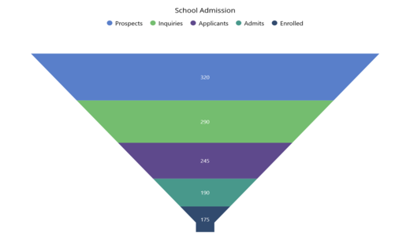

# Getting Started with .NET MAUI Funnel Chart

This section explains how to populate the Funnel Chart with data, including adding a title, data labels, a legend, and tooltips. It also covers the essential aspects needed to get started with the [Funnel Chart](https://help.syncfusion.com/cr/maui-toolkit/Syncfusion.Maui.Toolkit.Charts.SfFunnelChart.html).




## Prerequisites

Before proceeding, ensure the following are set up:

1. Install [.NET 9 SDK](https://dotnet.microsoft.com/en-us/download/dotnet/9.0) or later.
2. Set up a .NET MAUI environment with Visual Studio 2022 v17.12 or later.

## Step 1: Create a new .NET MAUI project

1. Go to **File > New > Project** and choose the **.NET MAUI App** template.
2. Name the project and choose a location. Then click **Next**.
3. Select the .NET framework version and click **Create**.

## Step 2: Install the Syncfusion&reg; .NET MAUI Toolkit NuGet package

1. In **Solution Explorer,** right-click the project and choose **Manage NuGet Packages.**
2. Search for [Syncfusion.Maui.Toolkit](https://www.nuget.org/packages/Syncfusion.Maui.Toolkit/) and install the latest version.
3. Ensure the necessary dependencies are installed correctly, and the project is restored.




## Prerequisites

Before proceeding, ensure the following are set up:

1. Install [.NET 9 SDK](Download .NET 9.0 (Linux, macOS, and Windows) | .NET) or later.
2. Set up a .NET MAUI environment with Visual Studio Code.
3. Ensure that the .NET MAUI workloads are installed and configured as described [here](https://learn.microsoft.com/en-us/dotnet/maui/get-started/installation?view=net-maui-9.0&tabs=visual-studio-code).

## Step 1: Create a new .NET MAUI project

1. Open the command palette by pressing `Ctrl+Shift+P` and type **.NET:New Project** and enter.
2. Choose the **.NET MAUI App** template.
3. Select the project location, type the project name and press **Enter**.
4. Then choose **Create project.**

## Step 2: Install the Syncfusion&reg; .NET MAUI Toolkit NuGet package

1. Press <kbd>Ctrl</kbd> + <kbd>`</kbd> (backtick) to open the integrated terminal in Visual Studio Code.
2. Ensure you're in the project root directory where your .csproj file is located.
3. Run the command `dotnet add package Syncfusion.Maui.Toolkit` to install the Syncfusion® .NET MAUI Toolkit NuGet package.
4. To ensure all dependencies are installed, run `dotnet restore`.




## Prerequisites

Before proceeding, ensure the following are set up:

1. Install [.NET 9 SDK](Download .NET 9.0 (Linux, macOS, and Windows) | .NET) or later.
2. Set up a .NET MAUI environment with JetBrains Rider 2024.3 or later.
3. Make sure the MAUI workloads are installed and configured as described [here.](https://www.jetbrains.com/help/rider/MAUI.html#before-you-start)

## Step 1: Create a new .NET MAUI project

1. Go to **File > New Solution,** Select .NET (C#) and choose the .NET MAUI App template.
2. Enter the Project Name, Solution Name, and Location.
3. Select the .NET framework version and click Create.

## Step 2: Install the Syncfusion® MAUI Toolkit NuGet package

1. In **Solution Explorer,** right-click the project and choose **Manage NuGet Packages.**
2. Search for [Syncfusion.Maui.Toolkit](https://www.nuget.org/packages/Syncfusion.Maui.Toolkit/) and install the latest version.
3. Ensure the necessary dependencies are installed correctly, and the project is restored. If not, Open the Terminal in Rider and manually run: `dotnet restore`




## Step 3: Register the handler

Make sure to add the namespace.
 


using Syncfusion.Maui.Toolkit.Hosting;

 
Register the Syncfusion core handler in your CreateMauiApp method of `MauiProgram.cs` file to use Syncfusion controls.
 

builder.ConfigureSyncfusionToolkit();



## Step 4: Create the Model

Define a simple data model to represent a data point in the chart:

  



public class AdmissionModel
{
    public string XValue { get; set; }
    public double YValue { get; set; }
}

 

 

## Step 5: Initialize the ViewModel

Next, create a `AdmissionViewModel` class and initialize a list of `AdmissionModel` objects:

  



public class AdmissionViewModel
{
    public List<AdmissionModel> Data { get; set; }
    public AdmissionViewModel()
    {
        Data = new List<AdmissionModel>()
        {
            new AdmissionModel() {XValue = "Enrolled", YValue=175},
            new AdmissionModel() {XValue = "Admits", YValue=190},
            new AdmissionModel() {XValue = "Applicants", YValue=245},
            new AdmissionModel() {XValue = "Inquiries ", YValue=290},
            new AdmissionModel() {XValue = "Prospects ", YValue=320},
        };
    }
}

 

 

## Step 6: Import Funnel Charts namespace

Add the following namespace in your XAML or C#.



xmlns:chart="clr-namespace:Syncfusion.Maui.Toolkit.Charts;assembly=Syncfusion.Maui.Toolkit"




using Syncfusion.Maui.Toolkit.Charts;




## Step 7: Add the Funnel Charts component

Binding `Data` to the funnel chart [ItemsSource](https://help.syncfusion.com/cr/maui-toolkit/Syncfusion.Maui.Toolkit.Charts.SfFunnelChart.html#Syncfusion_Maui_Toolkit_Charts_SfFunnelChart_ItemsSource) property from its BindingContext to create our own funnel chart.

 



<chart:SfFunnelChart ItemsSource="{Binding Data}" 
                     ShowDataLabels="True" 
                     EnableTooltip="True" 
                     XBindingPath="XValue" 
                     YBindingPath="YValue">
        <chart:SfFunnelChart.Title>
            <Label Text="School Admission"/>
        </chart:SfFunnelChart.Title>
        <chart:SfFunnelChart.BindingContext>
            <model:AdmissionViewModel/>
        </chart:SfFunnelChart.BindingContext>
        <chart:SfFunnelChart.Legend>
            <chart:ChartLegend/>
        </chart:SfFunnelChart.Legend>
</chart:SfFunnelChart>





SfFunnelChart chart = new SfFunnelChart();
chart.Title = new Label()
{
    Text = "School Admission"
};
chart.Legend = new ChartLegend();
AdmissionViewModel viewModel = new AdmissionViewModel();
chart.BindingContext = viewModel;

chart.ItemsSource = viewModel.Data;
chart.XBindingPath = "XValue";
chart.YBindingPath = "YValue";
chart.EnableTooltip = true;
chart.ShowDataLabels = true;
this.Content = chart;





You can find the complete Funnel Charts getting started sample from this [link](https://github.com/SyncfusionExamples/maui-toolkit-samples/tree/master/FunnelChart/GettingStarted).