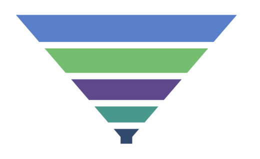

# Segment Spacing in .NET MAUI Funnel Chart

The gap between each segment in the funnel chart can be set using the [GapRatio](https://help.syncfusion.com/cr/maui-toolkit/Syncfusion.Maui.Toolkit.Charts.SfFunnelChart.html#Syncfusion_Maui_Toolkit_Charts_SfFunnelChart_GapRatio) property. The default value of GapRatio is `0`, and its value ranges from `0 to 1`.





<chart:SfFunnelChart GapRatio="0.2">
    <!-- Other chart configurations -->
</chart:SfFunnelChart>





SfFunnelChart chart = new SfFunnelChart();
// Other chart configurations
chart.GapRatio = 0.2; // Set gap ratio between funnel segments.
// Other chart configurations
this.Content = chart;




