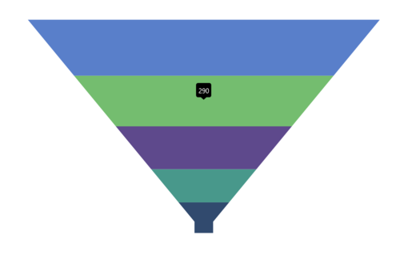
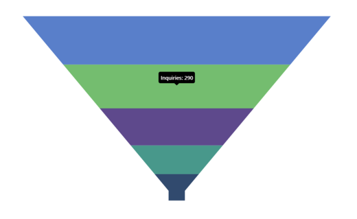

# Tooltip in .NET MAUI Funnel Chart

Tooltips provide additional information when hovering over a funnel segment. By default, the value of the funnel process (Y value) is displayed in the tooltip.

## Enable Tooltip

To add tooltips to the chart, set the [EnableTooltip](https://help.syncfusion.com/cr/maui-toolkit/Syncfusion.Maui.Toolkit.Charts.SfFunnelChart.html#Syncfusion_Maui_Toolkit_Charts_SfFunnelChart_EnableTooltip) property of [SfFunnelChart](https://help.syncfusion.com/cr/maui-toolkit/Syncfusion.Maui.Toolkit.Charts.SfFunnelChart.html) to true.





<chart:SfFunnelChart EnableTooltip="True">
    . . .
</chart:SfFunnelChart>





SfFunnelChart chart = new SfFunnelChart();
. . .      
chart.EnableTooltip = true; // Enable tooltip for the chart.
this.Content = chart;





## Customize Tooltip

The [ChartTooltipBehavior](https://help.syncfusion.com/cr/maui-toolkit/Syncfusion.Maui.Toolkit.Charts.ChartTooltipBehavior.html) is used to customize the tooltip. For customization, create an instance of [ChartTooltipBehavior](https://help.syncfusion.com/cr/maui-toolkit/Syncfusion.Maui.Toolkit.Charts.ChartTooltipBehavior.html) and set it to the [TooltipBehavior](https://help.syncfusion.com/cr/maui-toolkit/Syncfusion.Maui.Toolkit.Charts.ChartBase.html#Syncfusion_Maui_Toolkit_Charts_ChartBase_TooltipBehavior) property of [SfFunnelChart](https://help.syncfusion.com/cr/maui-toolkit/Syncfusion.Maui.Toolkit.Charts.SfFunnelChart.html). 

The following properties are available for tooltip customization:

* [Background](https://help.syncfusion.com/cr/maui-toolkit/Syncfusion.Maui.Toolkit.Charts.ChartTooltipBehavior.html#Syncfusion_Maui_Toolkit_Charts_ChartTooltipBehavior_Background) - Sets the background color of the tooltip.
* [FontAttributes](https://help.syncfusion.com/cr/maui-toolkit/Syncfusion.Maui.Toolkit.Charts.ChartTooltipBehavior.html#Syncfusion_Maui_Toolkit_Charts_ChartTooltipBehavior_FontAttributes) - Defines the font style of the tooltip text.
* [FontFamily](https://help.syncfusion.com/cr/maui-toolkit/Syncfusion.Maui.Toolkit.Charts.ChartTooltipBehavior.html#Syncfusion_Maui_Toolkit_Charts_ChartTooltipBehavior_FontFamily) - Specifies the font family for the tooltip text.
* [FontSize](https://help.syncfusion.com/cr/maui-toolkit/Syncfusion.Maui.Toolkit.Charts.ChartTooltipBehavior.html#Syncfusion_Maui_Toolkit_Charts_ChartTooltipBehavior_FontSize) - Sets the font size of the tooltip text.
* [Duration](https://help.syncfusion.com/cr/maui-toolkit/Syncfusion.Maui.Toolkit.Charts.ChartTooltipBehavior.html#Syncfusion_Maui_Toolkit_Charts_ChartTooltipBehavior_Duration) - Determines how long the tooltip remains visible.
* [Margin](https://help.syncfusion.com/cr/maui-toolkit/Syncfusion.Maui.Toolkit.Charts.ChartTooltipBehavior.html#Syncfusion_Maui_Toolkit_Charts_ChartTooltipBehavior_Margin) - Sets the margin around the tooltip content.
* [TextColor](https://help.syncfusion.com/cr/maui-toolkit/Syncfusion.Maui.Toolkit.Charts.ChartTooltipBehavior.html#Syncfusion_Maui_Toolkit_Charts_ChartTooltipBehavior_TextColor) - Defines the color of the tooltip text.





<chart:SfFunnelChart EnableTooltip="True">
    . . .
    <chart:SfFunnelChart.TooltipBehavior>
        <chart:ChartTooltipBehavior Duration="4"/>
    </chart:SfFunnelChart.TooltipBehavior>
</chart:SfFunnelChart>





SfFunnelChart chart = new SfFunnelChart();
. . .
chart.EnableTooltip = true; // Enable tooltip for the chart.

// Customize the tooltip behavior.
chart.TooltipBehavior = new ChartTooltipBehavior()
{
    Duration = 4, // Set the duration for displaying the tooltip.
};
. . .
this.Content = chart;





## Tooltip Template

The [TooltipTemplate](https://help.syncfusion.com/cr/maui-toolkit/Syncfusion.Maui.Toolkit.Charts.SfFunnelChart.html#Syncfusion_Maui_Toolkit_Charts_SfFunnelChart_TooltipTemplate) property allows you to create a custom UI for tooltips that can display additional information beyond the default content.





<Grid x:Name="grid">
    <Grid.Resources>
        <DataTemplate x:Key="tooltipTemplate">
            <StackLayout Orientation="Horizontal">
                <Label Text="{Binding Item.XValue}"
                       TextColor="White"
                       FontAttributes="Bold"
                       HorizontalOptions="Center"
                       VerticalOptions="Center"/>
                <Label Text="{Binding Item.YValue,StringFormat=': {0}'}"
                       TextColor="White"
                       FontAttributes="Bold"
                       HorizontalOptions="Center"
                       VerticalOptions="Center"/>
            </StackLayout>
        </DataTemplate>
    </Grid.Resources>

    <chart:SfFunnelChart EnableTooltip="True"
                         TooltipTemplate="{StaticResource tooltipTemplate}">
    . . .
    </chart:SfFunnelChart>
</Grid>





SfFunnelChart chart = new SfFunnelChart();
. . .
chart.EnableTooltip = true; // Enable tooltip for the chart.
chart.TooltipTemplate = grid.Resources["tooltipTemplate"] as DataTemplate; // Set the tooltip template.
. . .
this.Content = chart;





