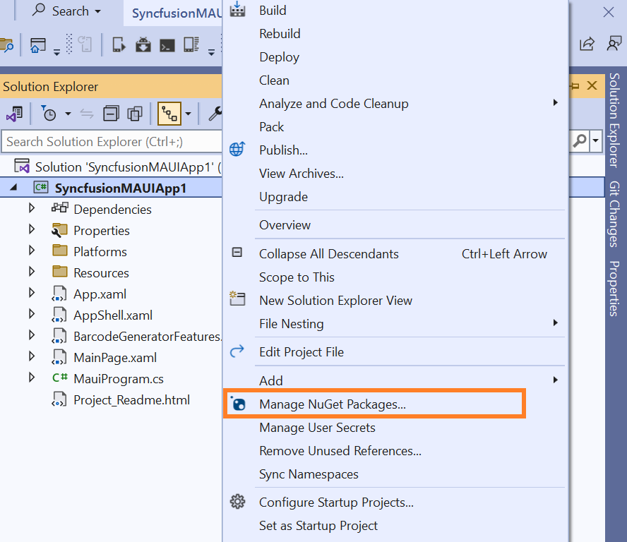
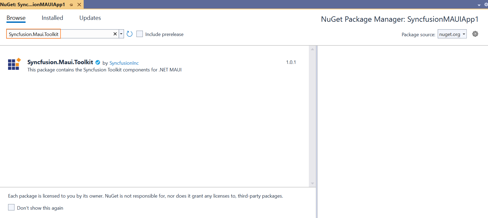
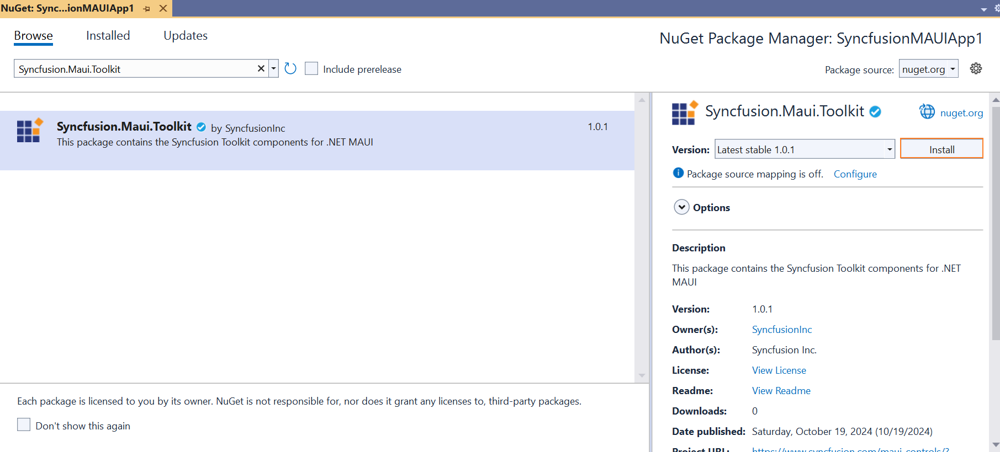
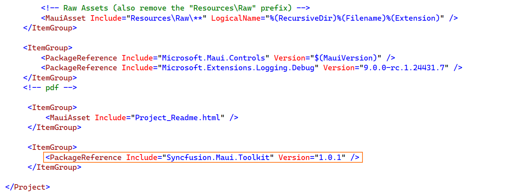
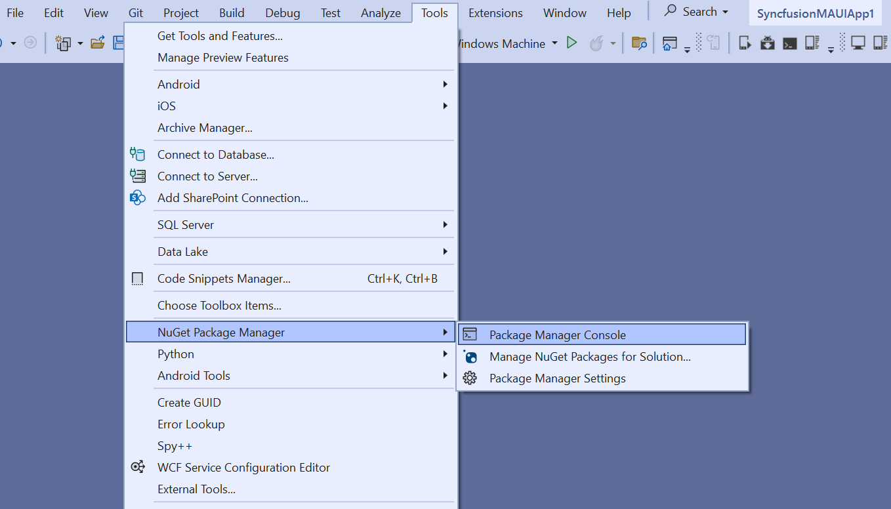
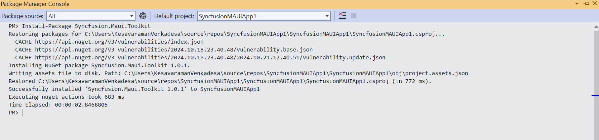
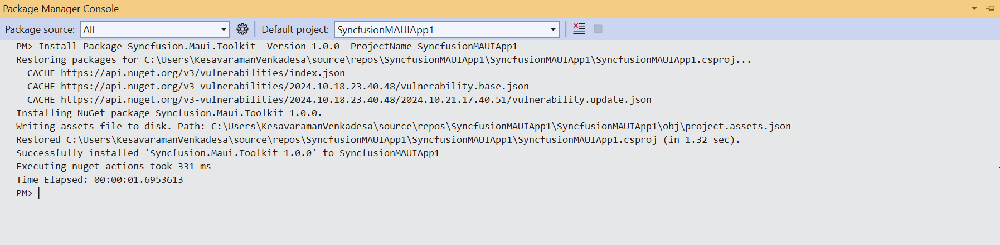

# Install Syncfusion<sup>®</sup> Maui Toolkit NuGet packages

## Overview

NuGet is a package management system used in Visual Studio, simplifying the process of adding, updating, and removing external libraries in your applications. Syncfusion<sup>®</sup> publishes the **Syncfusion.Maui.Toolkit** NuGet package, which can be found on [nuget.org](https://www.nuget.org/packages?q=Syncfusion.Maui.Toolkit).

## Installation using Package Manager UI

The **NuGet Package Manager UI** allows you to search for, install, uninstall, and update Syncfusion<sup>®</sup> Maui Toolkit packages easily. Follow these steps to install the Syncfusion.Maui.Toolkit package in your MAUI application:

1. Right-click on your MAUI application or solution in the Solution Explorer and select **Manage NuGet Packages...**

    

    Alternatively, open the **Tools** menu, hover over **NuGet Package Manager**, and choose **Manage NuGet Packages for Solution...**

2. In the **Manage NuGet Packages** window, navigate to the Browse tab and search for **Syncfusion.Maui.Toolkit**.

    N> Ensure that [nuget.org](https://api.nuget.org/v3/index.json) is selected as the package source. If not, follow the [instructions](https://learn.microsoft.com/en-us/nuget/consume-packages/install-use-packages-visual-studio#package-sources) to configure it.

    

3. Select the **Syncfusion.Maui.Toolkit** package, choose the appropriate version, and click **Install**. Accept the license terms to complete the installation.

    

4. Once the installation is complete, your application will have all the necessary **Syncfusion<sup>®</sup> assemblies** required to begin developing using the **Syncfusion<sup>®</sup> .NET MAUI Toolkit components**.

## Installation using Dotnet (.NET) CLI

The [.NET Command Line Interface (CLI)](https://learn.microsoft.com/en-us/nuget/consume-packages/install-use-packages-dotnet-cli), allows you to add, restore, and manage packages without making changes to your project files manually. Here are the steps to install the **Syncfusion.Maui.Toolkit** package using the .NET CLI:

Follow the below instructions to use the dotnet CLI command to install the Syncfusion<sup>®</sup> Maui NuGet packages.

1. Open a command prompt and navigate to your **MAUI application directory**.

2. Run the following command to install the **Syncfusion.Maui.Toolkit** package:

    ```dotnet add package Syncfusion.Maui.Toolkit```


    N>  By default, the latest version will be installed. To specify a version, use the -v parameter:
	
	```dotnet add package Syncfusion.Maui.Toolkit -v 1.0.0```

3. After installation, inspect the `.csproj` file of your project to confirm the package has been added.

      

4. Run  [dotnet restore](https://learn.microsoft.com/en-us/dotnet/core/tools/dotnet-restore?tabs=netcore2x) to install all dependencies and ensure that your project is ready.

## Installation using Package Manager Console

The **Package Manager Console**  provides an efficient way to install the **Syncfusion.Maui.Toolkit NuGet package**. Follow these steps:

1. In Visual Studio, navigate to **Tools -> NuGet Package Manager -> Package Manager Console**.

    

2. In the console, install the **Syncfusion.Maui.Toolkit** package with the following command:

    ```Install-Package Syncfusion.Maui.Toolkit```

     

    N> To specify the version or target a specific project, use:

    ```Install-Package Syncfusion.Maui.Toolkit -Version 1.0.0 - ProjectName <Project Name>```
   
   

3. Once the installation completes, the console will display confirmation, and your application will now have access to the **Syncfusion<sup>®</sup> .NET MAUI Toolkit components**.

4. Your application is now ready to leverage the high-performance and responsive components of the **Syncfusion<sup>®</sup> .NET MAUI Toolkit**.


