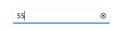
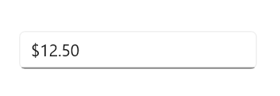
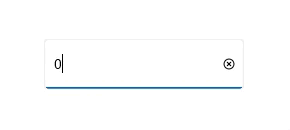

## Prerequisites

Before proceeding, ensure the following are in place:

1. Install [.NET 7 SDK](https://dotnet.microsoft.com/en-us/download/dotnet/7.0) or later.
2. Set up a .NET MAUI environment with Visual Studio 2022 (v17.3 or later) or Visual Studio Code. For Visual Studio Code users, ensure that the .NET MAUI workload is installed and configured as described [here](https://learn.microsoft.com/en-us/dotnet/maui/get-started/installation?view=net-maui-8.0&tabs=visual-studio-code).

## Step 1: Create a New MAUI Project

### Visual Studio

1. Go to **File > New > Project** and choose the **.NET MAUI App** template.
2. Name the project and choose a location. Then, click **Next**.
3. Select the .NET framework version and click **Create**.

### Visual Studio Code

1. Open the Command Palette by pressing **Ctrl+Shift+P** and type **.NET:New Project** and press Enter.
2. Choose the **.NET MAUI App** template.
3. Select the project location, type the project name and press Enter.
4. Then choose **Create project**

## Step 2: Install the Syncfusion MAUI Toolkit Package

### Visual Studio
1. In **Solution Explorer,** right-click the project and choose **Manage NuGet Packages.**
2. Search for [Syncfusion.Maui.Toolkit](https://www.nuget.org/packages/Syncfusion.Maui.Toolkit/) and install the latest version.
3. Ensure the necessary dependencies are installed correctly, and the project is restored.

### Visual Studio Code
1. Press <kbd>Ctrl</kbd> + <kbd>`</kbd> (backtick) to open the integrated terminal in Visual Studio Code.
2. Ensure you're in the project root directory where your .csproj file is located.
3. Run the command `dotnet add package Syncfusion.Maui.Toolkit` to install the Syncfusion .NET MAUI Toolkit NuGet package.
4. To ensure all dependencies are installed, run `dotnet restore`.

## Step 3: Register the handler

In the MauiProgram.cs file, register the handler for Syncfusion Toolkit.



using Syncfusion.Maui.Toolkit.Hosting;

public static class MauiProgram
{
    public static MauiApp CreateMauiApp()
    {
        var builder = MauiApp.CreateBuilder();
        builder
            .ConfigureSyncfusionToolkit()
            .UseMauiApp<App>()
            .ConfigureFonts(fonts =>
            {
                fonts.AddFont("OpenSans-Regular.ttf", "OpenSansRegular");
                fonts.AddFont("OpenSans-Semibold.ttf", "OpenSansSemibold");
            });

        return builder.Build();
    }
}


 

## Step 4: Add a Basic Numeric Entry

Step 1. To initialize the control, import the `Syncfusion.Maui.Toolkit.NumericEntry` namespace into your code. 

Step 2: Add the namespace as shown in the following code sample.




	<xmlns:editors="clr-namespace:Syncfusion.Maui.Toolkit.NumericEntry;assembly=Syncfusion.Maui.Toolkit"/>




	using Syncfusion.Maui.Toolkit.NumericEntry;




Step 3: Add the [SfNumericEntry]() control with a required optimal name using the included namespace.




	<editors:SfNumericEntry x:Name="numericEntry" />
	



    SfNumericEntry sfNumericEntry = new SfNumericEntry();   




## Editing the value

By default, the [NumericEntry]() control allows you to enter numeric input and restricts the alphabetic input. Once the `Enter` key is pressed or control focus is lost, the value of the `NumericEntry` control is validated and updated based on the format applied.




<editors:SfNumericEntry HorizontalOptions="Center" 
                        VerticalOptions="Center" 
                        CustomFormat="0.000" />




SfNumericEntry sfNumericEntry = new SfNumericEntry();
sfNumericEntry.HorizontalOptions = LayoutOptions.Center;
sfNumericEntry.VerticalOptions = LayoutOptions.Center;
sfNumericEntry.CustomFormat = "0.000";




## Change number format

You can change the format in which the value should be displayed using the [CustomFormat]() property. By default, the value of the `CustomFormat` property is **null**.




<editors:SfNumericEntry HorizontalOptions="Center"
                        VerticalOptions="Center"
                        Value="12.5" 
                        CustomFormat="C2" />




SfNumberBox sfNumberBox = new SfNumberBox();
sfNumberBox.HorizontalOptions = LayoutOptions.Center;
sfNumberBox.VerticalOptions = LayoutOptions.Center;
sfNumberBox.Value = 12.5;
sfNumberBox.CustomFormat = "C2";




## Accept null value

By default, the [NumericEntry]() control allows a **null** value. A null value is assigned when the user clicks the clear button or clears the input. You can disable this by setting the value of the [AllowNull]() property as **false**. When the value of the `AllowNull` property is set to **false**, and the input is cleared, the `NumericEntry` control returns it to **0**.




<editors:SfNumericEntry HorizontalOptions="Center"
                        VerticalOptions="Center"
                        Value="12315"
                        AllowNull="False" />




SfNumericEntry sfNumericEntry = new SfNumericEntry();
sfNumericEntry.Value=12315;
sfNumericEntry.HorizontalOptions = LayoutOptions.Center;
sfNumericEntry.VerticalOptions = LayoutOptions.Center;
sfNumericEntry.AllowNull = false;




