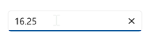

# .NET MAUI NumericEntry Overview

The [.NET MAUI NumericEntry](https://help.syncfusion.com/cr/maui-toolkit/Syncfusion.Maui.Toolkit.NumericEntry.SfNumericEntry.html) control is designed to provide a user-friendly and advanced input experience for numeric values. It supports a wide range of numeric formats, including currency, percentages, decimals, and more. With its key features, it enables enhanced user experience and facilitates input validation.

## Key features

* Input validation is triggered when the focus is lost, or the enter key is pressed.
* Flexible display of values in various custom formats.
* Adapts to different cultural and regional settings for value presentation.
* Placeholder text displayed when the Numeric Entry control contains an empty or null value.

