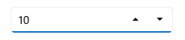
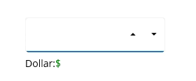
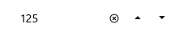
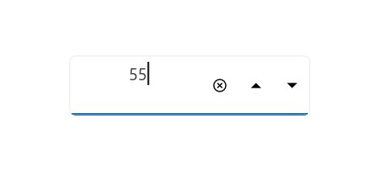
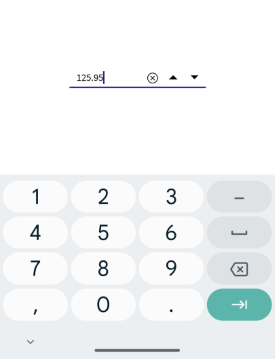
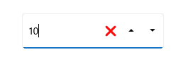

# Basic Features in .NET MAUI Numeric UpDown (SfNumericUpDown)

## Setting Placeholder Text

You can prompt the user with any information using the [Placeholder]() property. Placeholder text will be displayed only when the value of the [AllowNull]() property is **true** and the value of the `NumericUpDown` control is **null**. The default value of the `Placeholder` property is **string.Empty** (No string will be displayed).




<editors:SfNumericUpDown HorizontalOptions="Center" 
                     VerticalOptions="Center" 
                     Placeholder="Enter input here..." />




SfNumericUpDown numericUpDown= new SfNumericUpDown();
numericUpDown.Placeholder = "Enter input here...";
numericUpDown.HorizontalOptions = LayoutOptions.Center;
numericUpDown.VerticalOptions = LayoutOptions.Center;




## Clear button visibility 

The [ShowClearButton]() property is used to show or hide the clear button in the `NumericUpDown`. By default, visibility of the clear button is enabled.

N> The clear button appears only when the text box is focused and the `IsEditable` property value is set to **true**.



<editors:SfNumericUpDown ShowClearButton="True" 
                         IsEditable="True" 
                         Value="10"/>




SfNumericUpDown sfNumericUpDown = new SfNumericUpDown();
sfNumericUpDown.Value=10;
sfNumericUpDown.ShowClearButton = true;
sfNumericUpDown.IsEditable = true; 




If IsEditable is true

If IsEditable is false

## Value Change Mode

The [ValueChangeMode]() property determine when the values are updated.

The supported value change modes are as follows:
    * [OnLostFocus]() - The value will be updated when the editor loses its focus or the focus moved to the next control. By default, the [ValueChangeMode]() is `OnLostFocus`.
    * [OnKeyFocus]() - The value will be updated with each key press.




<VerticalStackLayout Spacing="10" VerticalOptions="Center">
    <editors:SfNumericUpDown x:Name="NumericUpDown"
                            WidthRequest="200"
                            HeightRequest="40" 
                            VerticalOptions="Center"
                            ValueChangeMode="OnKeyFocus"
                            Value="50">
    </editors:SfNumericUpDown>
    <HorizontalStackLayout Spacing="2" HeightRequest="40" WidthRequest="200">
        <Label Text="Dollar:"  />
        <Label x:Name="valueDisplay" 
               TextColor="Green" 
               Text="{Binding Path=Value, Source={x:Reference NumericUpDown}, StringFormat='${0:F2}'}" 
               HeightRequest="40" />
    </HorizontalStackLayout>
</VerticalStackLayout>




public partial class MainPage : ContentPage
{
    public Label valueDisplay;
    public MainPage()
    {
        InitializeComponent();
        var verticalStackLayout = new StackLayout
        {
            Spacing = 10,
            VerticalOptions = LayoutOptions.Center
        };
        var NumericUpDown = new SfNumericUpDown
        {
            WidthRequest = 200,
            HeightRequest = 40,
            VerticalOptions = LayoutOptions.Center,
            ValueChangeMode = ValueChangeMode.OnKeyFocus,
            Value = 50
        };
        var horizontalStackLayout = new StackLayout
        {
            Spacing = 2,
            HeightRequest = 40,
            WidthRequest = 200
        };
        var labelDollar = new Label
        {
            Text = "Dollar:"
        };
        valueDisplay = new Label
        {
            Text="$50",
            TextColor = Colors.Green
        };
        NumericUpDown.ValueChanged += NumericUpDown_ValueChanged;
        horizontalStackLayout.Children.Add(labelDollar);
        horizontalStackLayout.Children.Add(valueDisplay);
        verticalStackLayout.Children.Add(NumericUpDown);
        verticalStackLayout.Children.Add(horizontalStackLayout);
        Content = verticalStackLayout;
    }

    private void NumericUpDown_ValueChanged(object sender, NumericUpDownValueChangedEventArgs e)
    {
        valueDisplay.Text="$"+e.NewValue.ToString();
    }
}




## Stroke

The NumericUpDown border color can be changed by using the [Stroke]() property. The default `Stroke` color is **Black**.




<editors:SfNumericUpDown HorizontalOptions="Center"
                        VerticalOptions="Center"
                        Stroke="Red" />




SfNumericUpDown sfNumericUpDown = new SfNumericUpDown();
sfNumericUpDown.HorizontalOptions = LayoutOptions.Center;
sfNumericUpDown.VerticalOptions = LayoutOptions.Center;
sfNumericUpDown.Stroke = Colors.Red;




You can find the complete getting started sample of .NET MAUI from this [link.]()

## Border visibility

The [ShowBorder]() property of [SfNumericUpDown]() is used to modify the visibility of the border and its default value is **true**. The following code example demonstrates how to change the border visibility,




<editors:SfNumericUpDown WidthRequest="200"
                        HeightRequest="40"
                        ShowBorder="False"/>




SfNumericUpDown sfNumericUpDown= new SfNumericUpDown();
sfNumericUpDown.WidthRequest = 200;
sfNumericUpDown.HeightRequest = 40;
sfNumericUpDown.ShowBorder = false;




The following image illustrates the result of the above code:

## TextAlignment

The [SfNumericUpDown]() provides support to customize the text alignment by using the [HorizontalTextAlignment]() and [VerticalTextAlignment]() properties.

N> Dynamic changes to the `HorizontalTextAlignment` property may not be functioning as expected on Android platform.




<editors:SfNumericUpDown WidthRequest="200"
                        HeightRequest="50"
                        HorizontalTextAlignment="Center" 
                        VerticalTextAlignment="Start"/>




SfNumericUpDown sfNumericUpDown= new SfNumericUpDown();
sfNumericUpDown.WidthRequest = 200;
sfNumericUpDown.HeightRequest = 50;
sfNumericUpDown.HorizontalTextAlignment = TextAlignment.Center;
sfNumericUpDown.VerticalTextAlignment = TextAlignment.Start;




The following image illustrates the result of the above code:

## ReturnType

The `ReturnType` property specifies the return button (e.g., Next, Done, Go) of the keyboard. It helps manage the flow between multiple input fields by defining what happens when the action button is pressed.

You can define the return key type of [SfNumericUpDown]() by using the ReturnType property.

N> Default value of ReturnType is `Default`.




<editors:SfNumericUpDown x:Name="NumericUpDown" 
                        WidthRequest="200"
                        ReturnType="Next"/>




SfNumericUpDown sfNumericUpDown = new SfNumericUpDown();
sfNumericUpDown.ReturnType = ReturnType.Next;




## Clear button customization

The `ClearButtonPath` property allows users to set the path for customizing the appearance of the [SfNumericUpDown]() clear button.




<editors:SfNumericUpDown x:Name="NumericUpDown"
                        ShowClearButton="True" 
                        IsEditable="True" 
                        Value="10">
            <editors:SfNumericUpDown.ClearButtonPath>
                <Path Data="M1.70711 0.292893C1.31658 -0.097631 0.683417 -0.097631 0.292893 0.292893C-0.097631 0.683417 -0.097631 1.31658 0.292893 1.70711L5.58579 7L0.292893 12.2929C-0.097631 12.6834 -0.097631 13.3166 0.292893 13.7071C0.683417 14.0976 1.31658 14.0976 1.70711 13.7071L7 8.41421L12.2929 13.7071C12.6834 14.0976 13.3166 14.0976 13.7071 13.7071C14.0976 13.3166 14.0976 12.6834 13.7071 12.2929L8.41421 7L13.7071 1.70711C14.0976 1.31658 14.0976 0.683417 13.7071 0.292893C13.3166 -0.097631 12.6834 -0.097631 12.2929 0.292893L7 5.58579L1.70711 0.292893Z" 
                Fill="Red" 
                Stroke="Red"/>
            </editors:SfNumericUpDown.ClearButtonPath>
</editors:SfNumericUpDown>




private string _customPath = "M1.70711 0.292893C1.31658 -0.097631 0.683417 -0.097631 0.292893 0.292893C-0.097631 0.683417 -0.097631 1.31658 0.292893 1.70711L5.58579 7L0.292893 12.2929C-0.097631 12.6834 -0.097631 13.3166 0.292893 13.7071C0.683417 14.0976 1.31658 14.0976 1.70711 13.7071L7 8.41421L12.2929 13.7071C12.6834 14.0976 13.3166 14.0976 13.7071 13.7071C14.0976 13.3166 14.0976 12.6834 13.7071 12.2929L8.41421 7L13.7071 1.70711C14.0976 1.31658 14.0976 0.683417 13.7071 0.292893C13.3166 -0.097631 12.6834 -0.097631 12.2929 0.292893L7 5.58579L1.70711 0.292893Z";

var converter = new PathGeometryConverter();
var path = new Path() 
{ 
    Data = (PathGeometry)converter.ConvertFromInvariantString(_customPath),
    Fill = Colors.Red,
    Stroke = Colors.Red
};

SfNumericUpDown numericUpDown = new SfNumericUpDown();
numericUpDown.Value=10;
numericUpDown.ShowClearButton = true;
numericUpDown.IsEditable = true; 
numericUpDown.ClearButtonPath = path;




The following image illustrates the result of the above code:

## Return Command and Return Command Parameter

- `ReturnCommand`, of type ICommand, defines the command to be executed when the return key is pressed.
- `ReturnCommandParameter`, of type object, specifies the parameter for the `ReturnCommand`.




<ContentPage.BindingContext>
    <local:CommandDemoViewModel/>
</ContentPage.BindingContext>

<editors:SfNumericUpDown x:Name="NumericUpDown"
            ReturnCommand="{Binding AlertCommand}"
            ReturnCommandParameter="Return key is pressed">
</editors:SfNumericUpDown>




var viewModel = new CommandDemoViewModel();
SfNumericUpDown NumericUpDown = new SfNumericUpDown();
NumericUpDown.ReturnCommand = viewModel.AlertCommand;
NumericUpDown.ReturnCommandParameter = "Return key is pressed";







//ViewModel.cs

public class CommandDemoViewModel
{
    public ICommand AlertCommand => new Command<string>(OnAlertCommandExecuted);

    private async void OnAlertCommandExecuted(string parameter)
    {
        await Application.Current.MainPage.DisplayAlert("Alert", parameter, "OK");
    }
}


