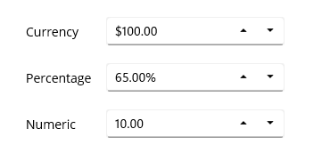
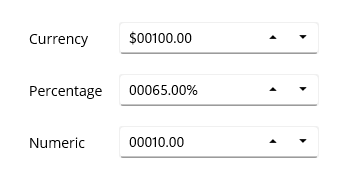
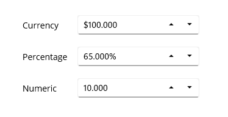
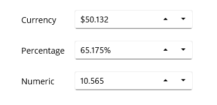
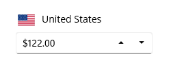
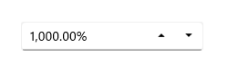
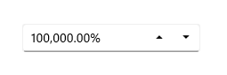
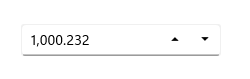

# Value Formatting with .NET MAUI NumericUpDown

This section explains how to change the value format of the [NumericUpDown](https://help.syncfusion.com/cr/maui-toolkit/Syncfusion.Maui.Toolkit.NumericUpDown.SfNumericUpDown.html) control using the `CustomFormat` properties.

## Currency, percentage and decimal format

The value of the `NumericUpDown` control can be formatted using the [CustomFormat](https://help.syncfusion.com/cr/maui-toolkit/Syncfusion.Maui.Toolkit.NumericEntry.SfNumericEntry.html#Syncfusion_Maui_Toolkit_NumericEntry_SfNumericEntry_CustomFormat) property. By default, the value is formatted based on the current culture's decimal format. The default value of the `CustomFormat` properties is **null**.

The following example shows how to set the `CurrencyFormatter`, `DecimalFormatter`, and `PercentFormatter` for the `NumberFormatter` property. 

Using the **N**, **C**, and **P** format values, we can apply numeric, currency, and percent custom formats in the `CustomFormat` property. 

N> You can apply various custom formats available in  [this page](https://docs.microsoft.com/en-us/dotnet/standard/base-types/standard-numeric-format-strings), which are supported for the `double` type.




// Format stock price in currency.
<editors:SfNumericUpDown CustomFormat="C2"/>

// Format product discount in percent.
<editors:SfNumericUpDown CustomFormat="P2"/>

// Format worked hours in decimal.
<editors:SfNumericUpDown CustomFormat="N2"/>




// Format stock price in currency.
stockPrice.CustomFormat = "C2";

// Format product discount in percent.
productDiscount.CustomFormat = "P2";

// Format worked hours in decimal.
hoursWorked.CustomFormat = "N2";




## Format the integer digits

You can change the decimal digits of the value in the `NumericUpDown` control using the [CustomFormat](https://help.syncfusion.com/cr/maui-toolkit/Syncfusion.Maui.Toolkit.NumericEntry.SfNumericEntry.html#Syncfusion_Maui_Toolkit_NumericEntry_SfNumericEntry_CustomFormat) properties. 

For the `CustomFormat` property, use the **0** format specifier to set the minimum number of decimal digits.  

N> **0** (Zero placeholder) replaces the zero with the corresponding digit present in the value; otherwise, zero appends with the leftmost position of the value. 




// Format stock price in currency.
<editors:SfNumericUpDown CustomFormat = "$00000.00"/>

// Format product discount in percentage.
<editors:SfNumericUpDown CustomFormat = "00000.00%"/>

// Format worked hours in decimal.
<editors:SfNumericUpDown CustomFormat = "00000.00"/>




// Format stock price in currency.
stockPrice.CustomFormat = "$00000.00";

// Format product discount in percentage.
productDiscount.CustomFormat = "00000.00%";

// Format worked hours in decimal.
hoursWorked.CustomFormat = "00000.00";




## Format the fractional digits

You can change the fractional digits of the value in the `NumericUpDown` control using the [CustomFormat](https://help.syncfusion.com/cr/maui-toolkit/Syncfusion.Maui.Toolkit.NumericEntry.SfNumericEntry.html#Syncfusion_Maui_Toolkit_NumericEntry_SfNumericEntry_CustomFormat) Properties.

For the `CustomFormat` property, use the **0** format specifier to set the minimum number of fractional digits.  

N> **0** (Zero placeholder) replaces the zero with the corresponding digit in the value.




<editors:SfNumericUpDown CustomFormat = "$000.000"/>
<editors:SfNumericUpDown CustomFormat = "00.000%"/>
<editors:SfNumericUpDown CustomFormat = "00.000"/>




stockPrice.CustomFormat = "$000.000";
productDiscount.CustomFormat = "00.000%";
hoursWorked.CustomFormat = "00.000";




## Apply custom format

You can apply custom formats to the `NumericUpDown` control using the **0** and **#** format specifiers. Using these format specifiers, you can set the minimum and the maximum number of fractional digits in the [CustomFormat](https://help.syncfusion.com/cr/maui-toolkit/Syncfusion.Maui.Toolkit.NumericEntry.SfNumericEntry.html#Syncfusion_Maui_Toolkit_NumericEntry_SfNumericEntry_CustomFormat) property.

   * **0** (Zero placeholder) replaces the zero with the corresponding digit present in the value; otherwise, zero appends with the leftmost position of the value. 

   * **#** (Digit placeholder) replaces the number sign symbol with the corresponding digit present in the value; otherwise, no digit will append to the value.

In the following example, the value of the `CustomFormat` property is **#.00##**, hence it will allow a maximum of `4` fractional digits and a minimum of `2` fractional digits.




<editors:SfNumericUpDown CustomFormat = "$00.00##"/>
<editors:SfNumericUpDown CustomFormat = "00.00##%"/>
<editors:SfNumericUpDown CustomFormat = "00.00##"/>




stockPrice.CustomFormat = "$00.00##";
productDiscount.CustomFormat = "00.00##%";
hoursWorked.CustomFormat = "00.00##";




## Culture support

The culture support allows the control to be configured for a specific language. To configure this, use the `culture` property.




CultureInfo culture = new CultureInfo("en-US");
NumericUpDown.Culture = culture;
         



## Customize percentage display

When the [SfNumericUpDown](https://help.syncfusion.com/cr/maui-toolkit/Syncfusion.Maui.Toolkit.NumericUpDown.SfNumericUpDown.html) is in percentage format, the value can be displayed in two ways as follows:

`Value`: Displays the actual value with percentage symbol.




<editors:SfNumericUpDown x:Name="NumericUpDown" 
                        CustomFormat="p" 
                        Value="1000"  
                        PercentDisplayMode="Value">
</editors:SfNumericUpDown>




SfNumericUpDown sfNumericUpDown= new SfNumericUpDown();
SfNumericUpDown sfNumericUpDown = new SfNumericUpDown();
sfNumericUpDown.Value = 1000;
sfNumericUpDown.CustomFormat = "p";
sfNumericUpDown.PercentDisplayMode = PercentDisplayMode.Value;




`Compute`: Displays the computed value with percentage symbol.




<editors:SfNumericUpDown x:Name="NumericUpDown" 
                        CustomFormat="p" 
                        Value="1000"  
                        PercentDisplayMode="Value">
</editors:SfNumericUpDown>




SfNumericUpDown sfNumericUpDown= new SfNumericUpDown();
sfNumericUpDown.Value = 1000;
sfNumericUpDown.CustomFormat = "p";
sfNumericUpDown.PercentDisplayMode = PercentDisplayMode.Compute;




N> Default value of PercentDisplayMode is `Compute`.

## Manage maximum decimal digits

The maximum number of digits to be displayed after the decimal point can be specified by using the `MaximumNumberDecimalDigits` property.

N> The `MaximumNumberDecimalDigits` property can only be set to a positive value and does not work when a CustomFormat is provided. The default value of MaximumNumberDecimalDigits is 2.




<editors:SfNumericUpDown x:Name="NumericUpDown" 
                        Value="1000.23232"  
                        MaximumNumberDecimalDigits="3">
</editors:SfNumericUpDown>




SfNumericUpDown sfNumericUpDown= new SfNumericUpDown();
sfNumericUpDown.Value = 1000.23232;
sfNumericUpDown.MaximumNumberDecimalDigits = 3;




