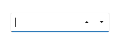

# Getting Started with .NET MAUI Numeric UpDown

This section guides you through setting up and configuring a [Numeric UpDown](https://help.syncfusion.com/cr/maui-toolkit/Syncfusion.Maui.Toolkit.NumericUpDown.SfNumericUpDown.html) in your .NET MAUI application. Follow the steps below to add a basic Numeric UpDown to your project.




## Prerequisites

Before proceeding, ensure the following are in place:

1. Install [.NET 8 SDK](https://dotnet.microsoft.com/en-us/download/dotnet/8.0) or later.
2. Set up a .NET MAUI environment with Visual Studio 2022 (v17.8 or later).

## Step 1: Create a New MAUI Project

1. Go to **File > New > Project** and choose the **.NET MAUI App** template.
2. Name the project and choose a location. Then, click **Next**.
3. Select the .NET framework version and click **Create**.

## Step 2: Install the Syncfusion® MAUI Toolkit Package

1. In **Solution Explorer,** right-click the project and choose **Manage NuGet Packages.**
2. Search for [Syncfusion.Maui.Toolkit](https://www.nuget.org/packages/Syncfusion.Maui.Toolkit/) and install the latest version.
3. Ensure the necessary dependencies are installed correctly, and the project is restored.

## Step 3: Register the handler

In the MauiProgram.cs file, register the handler for Syncfusion® Toolkit.



using Syncfusion.Maui.Toolkit.Hosting;

public static class MauiProgram
{
    public static MauiApp CreateMauiApp()
    {
        var builder = MauiApp.CreateBuilder();
        builder
            .ConfigureSyncfusionToolkit()
            .UseMauiApp<App>()
            .ConfigureFonts(fonts =>
            {
                fonts.AddFont("OpenSans-Regular.ttf", "OpenSansRegular");
                fonts.AddFont("OpenSans-Semibold.ttf", "OpenSansSemibold");
            });

        return builder.Build();
    }
}


 

## Step 4: Add a Basic Numeric UpDown

Step 1. To initialize the control, import the `Syncfusion.Maui.Toolkit.NumericUpDown` namespace into your code, as shown in the following code sample.




	<xmlns:editors="clr-namespace:Syncfusion.Maui.Toolkit.NumericUpDown;assembly=Syncfusion.Maui.Toolkit"/>




	using Syncfusion.Maui.Toolkit.NumericUpDown;




Step 2: Add the [SfNumericUpDown](https://help.syncfusion.com/cr/maui-toolkit/Syncfusion.Maui.Toolkit.NumericUpDown.SfNumericUpDown.html) control with a required optimal name using the included namespace.




	<editors:SfNumericUpDown x:Name="numericUpDown" />
	



    SfNumericUpDown sfNumericUpDown = new SfNumericUpDown();   







## Prerequisites

Before proceeding, ensure the following are set up:

1. Install [.NET 8 SDK](https://dotnet.microsoft.com/en-us/download/dotnet/8.0) or later is installed.
2. Set up a .NET MAUI environment with Visual Studio Code.
3. Ensure that the .NET MAUI extension is installed and configured as described [here.](https://learn.microsoft.com/en-us/dotnet/maui/get-started/installation?view=net-maui-8.0&tabs=visual-studio-code)

## Step 1: Create a New .NET MAUI Project

1. Open the Command Palette by pressing **Ctrl+Shift+P** and type **.NET:New Project** and press Enter.
2. Choose the **.NET MAUI App** template.
3. Select the project location, type the project name and press Enter.
4. Then choose **Create project**

## Step 2: Install the Syncfusion® MAUI Toolkit Package

1. Press <kbd>Ctrl</kbd> + <kbd>`</kbd> (backtick) to open the integrated terminal in Visual Studio Code.
2. Ensure you're in the project root directory where your .csproj file is located.
3. Run the command `dotnet add package Syncfusion.Maui.Toolkit` to install the Syncfusion® .NET MAUI Toolkit NuGet package.
4. To ensure all dependencies are installed, run `dotnet restore`.

## Step 3: Register the handler

In the MauiProgram.cs file, register the handler for Syncfusion® Toolkit.



using Syncfusion.Maui.Toolkit.Hosting;

public static class MauiProgram
{
    public static MauiApp CreateMauiApp()
    {
        var builder = MauiApp.CreateBuilder();
        builder
            .ConfigureSyncfusionToolkit()
            .UseMauiApp<App>()
            .ConfigureFonts(fonts =>
            {
                fonts.AddFont("OpenSans-Regular.ttf", "OpenSansRegular");
                fonts.AddFont("OpenSans-Semibold.ttf", "OpenSansSemibold");
            });

        return builder.Build();
    }
}


 

## Step 4: Add a Basic Numeric UpDown

Step 1. To initialize the control, import the `Syncfusion.Maui.Toolkit.NumericUpDown` namespace into your code, as shown in the following code sample.




	<xmlns:editors="clr-namespace:Syncfusion.Maui.Toolkit.NumericUpDown;assembly=Syncfusion.Maui.Toolkit"/>




	using Syncfusion.Maui.Toolkit.NumericUpDown;




Step 2: Add the [SfNumericUpDown](https://help.syncfusion.com/cr/maui-toolkit/Syncfusion.Maui.Toolkit.NumericUpDown.SfNumericUpDown.html) control with a required optimal name using the included namespace.




	<editors:SfNumericUpDown x:Name="numericUpDown" />
	



    SfNumericUpDown sfNumericUpDown = new SfNumericUpDown();   







## Editing the value
The [NumericUpDown](https://help.syncfusion.com/cr/maui-toolkit/Syncfusion.Maui.Toolkit.NumericUpDown.SfNumericUpDown.html) control enables numeric input and automatically blocks any alphabetic characters.

**OnKeyFocus Mode:** The entered value is validated immediately as the user types.
**OnLostFocus Mode:** The value is validated and updated when the control loses focus or when the Enter key is pressed. The value is then formatted based on the specified settings.

This ensures that only valid numeric input is accepted and displayed according to the defined format.




<editors:SfNumericUpDown HorizontalOptions="Center" 
                         VerticalOptions="Center" 
                         CustomFormat="0.000" />




SfNumericUpDown sfNumericUpDown = new SfNumericUpDown();
sfNumericUpDown.HorizontalOptions = LayoutOptions.Center;
sfNumericUpDown.VerticalOptions = LayoutOptions.Center;
sfNumericUpDown.CustomFormat = "0.000";




## Increment and Decrement

The [NumericUpDown](https://help.syncfusion.com/cr/maui-toolkit/Syncfusion.Maui.Toolkit.NumericUpDown.SfNumericUpDown.html) control allows users to adjust the value by incrementing or decrementing it using the provided `Up` and `Down` buttons.

**Increment:** Clicking the up button increases the current value.

**Decrement:** Clicking the down button decreases the current value.

N> Clicking the up or down button increases or decreases the value based on the [SmallChange](https://help.syncfusion.com/cr/maui-toolkit/Syncfusion.Maui.Toolkit.NumericUpDown.SfNumericUpDown.html#Syncfusion_Maui_Toolkit_NumericUpDown_SfNumericUpDown_SmallChange) property value.




<editors:SfNumericUpDown HorizontalOptions="Center" 
                         VerticalOptions="Center" 
                         CustomFormat="0.000"
                         SmallChange="4" />




SfNumericUpDown sfNumericUpDown = new SfNumericUpDown();
sfNumericUpDown.HorizontalOptions = LayoutOptions.Center;
sfNumericUpDown.VerticalOptions = LayoutOptions.Center;
sfNumericUpDown.CustomFormat = "0.000";
sfNumericUpDown.SmallChange = "4";




## Change number format

You can change the format in which the value should be displayed using the [CustomFormat](https://help.syncfusion.com/cr/maui-toolkit/Syncfusion.Maui.Toolkit.NumericEntry.SfNumericEntry.html#Syncfusion_Maui_Toolkit_NumericEntry_SfNumericEntry_CustomFormat) property. By default, the value of the `CustomFormat` property is **null**.




<editors:SfNumericUpDown HorizontalOptions="Center"
                        VerticalOptions="Center"
                        Value="12.5" 
                        CustomFormat="C2" />




SfNumericUpDown sfNumericUpDown = new SfNumericUpDown();
sfNumericUpDown.HorizontalOptions = LayoutOptions.Center;
sfNumericUpDown.VerticalOptions = LayoutOptions.Center;
sfNumericUpDown.Value = 12.5;
sfNumericUpDown.CustomFormat = "C2";




## Accept null value

By default, the [NumericUpDown](https://help.syncfusion.com/cr/maui-toolkit/Syncfusion.Maui.Toolkit.NumericUpDown.SfNumericUpDown.html) control allows a **null** value. A null value is assigned when the user clicks the clear button or clears the input. You can disable this by setting the value of the [AllowNull](https://help.syncfusion.com/cr/maui-toolkit/Syncfusion.Maui.Toolkit.NumericEntry.SfNumericEntry.html#Syncfusion_Maui_Toolkit_NumericEntry_SfNumericEntry_AllowNull) property as **false**. When the value of the `AllowNull` property is set to **false**, and the input is cleared, the `NumericUpDown` control returns it to **0**.




<editors:SfNumericUpDown HorizontalOptions="Center"
                         VerticalOptions="Center"
                         Value="12315"
                         AllowNull="False" />




SfNumericUpDown sfNumericUpDown = new SfNumericUpDown();
sfNumericUpDown.Value=12315;
sfNumericUpDown.HorizontalOptions = LayoutOptions.Center;
sfNumericUpDown.VerticalOptions = LayoutOptions.Center;
sfNumericUpDown.AllowNull = false;




