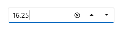

# .NET MAUI NumericUpDown Overview

The [.NET MAUI NumericUpDown](https://help.syncfusion.com/cr/maui-toolkit/Syncfusion.Maui.Toolkit.NumericUpDown.SfNumericUpDown.html) control is designed to provide a user-friendly and advanced input experience for numeric values, featuring increment and decrement buttons for easy value adjustment. It supports a wide range of numeric formats, including currency, percentages, decimals, and more. With its key features, it enhances the user experience and facilitates input validation.

## Control Structure

## Key features

* Input validation is triggered when the focus is lost, or the enter key is pressed.
* Convenient value increment and decrement using the up-down button.
* Flexible display of values in various custom formats.
* Adapts to different cultural and regional settings for value presentation.
* Placeholder text displayed when the Numeric UpDown control contains an empty or null value.
