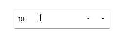
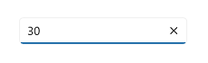

# Value change restriction in .NET MAUI NumericUpDown

This section describes how to restrict the change in the value of the [NumericUpDown](https://help.syncfusion.com/cr/maui-toolkit/Syncfusion.Maui.Toolkit.NumericUpDown.SfNumericUpDown.html) control using [AllowNull](https://help.syncfusion.com/cr/maui-toolkit/Syncfusion.Maui.Toolkit.NumericEntry.SfNumericEntry.html#Syncfusion_Maui_Toolkit_NumericEntry_SfNumericEntry_AllowNull), [Minimum](https://help.syncfusion.com/cr/maui-toolkit/Syncfusion.Maui.Toolkit.NumericEntry.SfNumericEntry.html#Syncfusion_Maui_Toolkit_NumericEntry_SfNumericEntry_Minimum), and [Maximum](https://help.syncfusion.com/cr/maui-toolkit/Syncfusion.Maui.Toolkit.NumericEntry.SfNumericEntry.html#Syncfusion_Maui_Toolkit_NumericEntry_SfNumericEntry_Maximum) properties.

## Restrict null value

By default, an empty or null value is set in the `NumericUpDown` control when the input is cleared, as the default value of the `AllowNull` property is **true**. When the [AllowNull](https://help.syncfusion.com/cr/maui-toolkit/Syncfusion.Maui.Toolkit.NumericEntry.SfNumericEntry.html#Syncfusion_Maui_Toolkit_NumericEntry_SfNumericEntry_AllowNull) property value is **false**, the `NumericUpDown` control returns the value to **0** in the editor after clearing the input.

N> When the value of the `Minimum` property is **15**, and the `AllowNull` property is **true**, the **null** value is returned in the `NumericUpDown` control after clearing the input.

N> When the value of the Minimum property is **15**, and the `AllowNull` property is **false**, the `minimum` value is returned in `NumericUpDown` control after clearing the input.




<editors:SfNumericUpDown HorizontalOptions="Center"
                        VerticalOptions="Center" 
                        Value="10" 
                        AllowNull="False" />




SfNumericUpDown sfNumericUpDown = new SfNumericUpDown();
sfNumericUpDown.HorizontalOptions = LayoutOptions.Center;
sfNumericUpDown.VerticalOptions = LayoutOptions.Center;
sfNumericUpDown.Value = 10;
sfNumericUpDown.AllowNull = false;




## Restrict value within range

You can restrict the users to enter input within a minimum and maximum range in the `NumericUpDown` control using the Minimum and Maximum properties. The default value of the [Minimum](https://help.syncfusion.com/cr/maui-toolkit/Syncfusion.Maui.Toolkit.NumericEntry.SfNumericEntry.html#Syncfusion_Maui_Toolkit_NumericEntry_SfNumericEntry_Minimum) property is the **double.MinValue** and [Maximum](https://help.syncfusion.com/cr/maui-toolkit/Syncfusion.Maui.Toolkit.NumericEntry.SfNumericEntry.html#Syncfusion_Maui_Toolkit_NumericEntry_SfNumericEntry_Maximum) property is **double.MaxValue**.




<editors:SfNumericUpDown HorizontalOptions="Center"
                        VerticalOptions="Center"
                        Value="50"
                        Minimum="10"
                        Maximum="30" />




SfNumericUpDown sfNumericUpDown = new SfNumericUpDown();
sfNumericUpDown.HorizontalOptions = LayoutOptions.Center;
sfNumericUpDown.VerticalOptions = LayoutOptions.Center;
sfNumericUpDown.Minimum = 10;
sfNumericUpDown.Maximum = 30;
sfNumericUpDown.Value = 50;




## Restrict text editing

You can prevent users from editing the numerical value in the editor using the [IsEditable](https://help.syncfusion.com/cr/maui-toolkit/Syncfusion.Maui.Toolkit.NumericEntry.SfNumericEntry.html#Syncfusion_Maui_Toolkit_NumericEntry_SfNumericEntry_IsEditable) property. However, you can still change the value using the up-down buttons, mouse scroll, keyboard arrows, and page keys. By default, the value of the `IsEditable` property is **true**.




<editors:SfNumericUpDown x:Name="sfNumericUpDown" 
                        HorizontalOptions="Center"
                        VerticalOptions="Center"
                        IsEditable="True" />




SfNumericUpDown sfNumericUpDown = new SfNumericUpDown();
sfNumericUpDown.HorizontalOptions = LayoutOptions.Center;
sfNumericUpDown.VerticalOptions = LayoutOptions.Center;
sfNumericUpDown.IsEditable = true;




