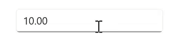
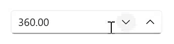
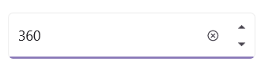
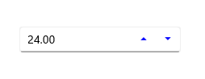
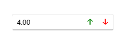
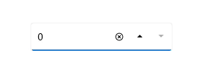

# UpDown Button in .NET MAUI NumericUpDown

This section describes how to change the value in the [NumericUpDown](https://help.syncfusion.com/cr/maui-toolkit/Syncfusion.Maui.Toolkit.NumericUpDown.SfNumericUpDown.html) control using keys, mouse scrolling, and the up-down button

## Increase or decrease value

You can increment or decrement the value in the `NumericUpDown` control using the **UpArrow**, **DownArrow**, **PageUp**, and **PageDown** keys. You can change the increment or decrement value when the Arrow keys are pressed using the [SmallChange](https://help.syncfusion.com/cr/maui-toolkit/Syncfusion.Maui.Toolkit.NumericUpDown.SfNumericUpDown.html#Syncfusion_Maui_Toolkit_NumericUpDown_SfNumericUpDown_SmallChange) property and Page keys using the [LargeChange](https://help.syncfusion.com/cr/maui-toolkit/Syncfusion.Maui.Toolkit.NumericUpDown.SfNumericUpDown.html#Syncfusion_Maui_Toolkit_NumericUpDown_SfNumericUpDown_Large) property. By default, the value of the `SmallChange` property is **1**, and the `LargeChange` property is **10**. 

N> The value in the `NumericUpDown` can also be changed by mouse scrolling. The mouse scrolling increases or decreases the value based on the `SmallChange` property.




<editors:SfNumericUpDown HorizontalOptions="Center"
                        VerticalOptions="Center" 
                        SmallChange="5"
                        Value="10"
                        LargeChange="10" />




SfNumericUpDown sfNumericUpDown= new SfNumericUpDown();
sfNumericUpDown.Value=10;
sfNumericUpDown.SmallChange=5;
sfNumericUpDown.LargeChange=10;
sfNumericUpDown.HorizontalOptions = LayoutOptions.Center;
sfNumericUpDown.VerticalOptions = LayoutOptions.Center;




## UpDown button placement

You can increase or decrease the value of the `NumericUpDown` control using the up-down button. By default, the value of the [UpDownPlacementMode](https://help.syncfusion.com/cr/maui-toolkit/Syncfusion.Maui.Toolkit.NumericUpDown.SfNumericUpDown.html#Syncfusion_Maui_Toolkit_NumericUpDown_SfNumericUpDown_UpDownPlacementMode) property is **Inline** which positions the up-down buttons in a horizontal orientation. You can adjust the position of the up-down buttons by setting the `UpDownPlacementMode` property to **InlineVertical** for vertical orientation.

N> When using the up-down button, the `NumericUpDown` control value changes based on the value of the `SmallChange` property.




<editors:SfNumericUpDown HorizontalOptions="Center"
                        VerticalOptions="Center"
                        Value="360";
                        UpDownPlacementMode="Inline" />
                     



SfNumericUpDown sfNumericUpDown = new SfNumericUpDown();
sfNumericUpDown.HorizontalOptions = LayoutOptions.Center;
sfNumericUpDown.VerticalOptions = LayoutOptions.Center;
sfNumericUpDown.Value=360;
sfNumericUpDown.UpDownPlacementMode = NumericUpDownUpDownPlacementMode.Inline;







<editors:SfNumericUpDown Value="360"
                        VerticalOptions="Center"
                        HorizontalOptions="Center"
                        UpDownPlacementMode="InlineVertical"/>
                     



SfNumericUpDown sfNumericUpDown = new SfNumericUpDown();
sfNumericUpDown.HorizontalOptions = LayoutOptions.Center;
sfNumericUpDown.VerticalOptions = LayoutOptions.Center;
sfNumericUpDown.Value=360;
sfNumericUpDown.UpDownPlacementMode = NumericUpDownUpDownPlacementMode.InlineVertical;




## UpDown button alignment

The UpDown button alignment in the `NumericUpDown` control can be customized using the [UpDownButtonAlignment](https://help.syncfusion.com/cr/maui-toolkit/Syncfusion.Maui.Toolkit.NumericUpDown.SfNumericUpDown.html#Syncfusion_Maui_Toolkit_NumericUpDown_SfNumericUpDown_UpDownButtonAlignment) property. The buttons can be aligned to the following positions:

**Left**: Positions the buttons to the left of the control. 
**Right**: Positions the buttons to the right of the control. 
**Both**: Positions the buttons on both sides of the control. 

The default updown button alignment is **Right**.

## UpDown button customization

## UpDown button color

Customize the `NumericUpDown` control button color by using the [UpDownButtonColor](https://help.syncfusion.com/cr/maui-toolkit/Syncfusion.Maui.Toolkit.NumericUpDown.SfNumericUpDown.html#Syncfusion_Maui_Toolkit_NumericUpDown_SfNumericUpDown_UpDownButtonColor) property.




<editors:SfNumericUpDown HeightRequest="50"
                        WidthRequest="200"
                        HorizontalOptions="Center"
                        VerticalOptions="Center"
                        Value="360"
                        UpDownPlacementMode="Inline"
                        UpDownButtonColor="Blue"/>
                     



SfNumericUpDown sfNumericUpDown = new SfNumericUpDown();
sfNumericUpDown.HeightRequest= 50;
sfNumericUpDown.WidthRequest = 200;
sfNumericUpDown.HorizontalOptions = LayoutOptions.Center
sfNumericUpDown.VerticalOptions = LayoutOptions.Center;
sfNumericUpDown.Value = 360;
sfNumericUpDown.UpDownPlacementMode = NumericUpDownUpDownPlacementMode.Inline;
sfNumericUpDown.UpDownButtonColor = Colors.Blue;




## UpDown button template

The `NumericUpDown` control supports customization of the UpDownButton's appearance through the use of the [UpButtonTemplate](https://help.syncfusion.com/cr/maui-toolkit/Syncfusion.Maui.Toolkit.NumericUpDown.SfNumericUpDown.html#Syncfusion_Maui_Toolkit_NumericUpDown_SfNumericUpDown_UpButtonTemplate) and [DownButtonTemplate](https://help.syncfusion.com/cr/maui-toolkit/Syncfusion.Maui.Toolkit.NumericUpDown.SfNumericUpDown.html#Syncfusion_Maui_Toolkit_NumericUpDown_SfNumericUpDown_DownButtonTemplate) properties.

N> The UpDownButton template only supports Inline Placement mode.




<VerticalStackLayout Spacing="10" VerticalOptions="Center">
    <editors:SfNumericUpDown x:Name="NumericUpDown"
                            WidthRequest="200"
                            HeightRequest="40" 
                            VerticalOptions="Center"
                            UpDownPlacementMode="Inline"
                            Value="50">
        <editors:SfNumericUpDown.UpButtonTemplate>
            <DataTemplate>
                <Grid>
                    <Label Padding="0,6.5,0,0" 
                           Rotation="90"
                           FontFamily="FontIcons"
                           HorizontalOptions="Center"
                           Text="&#xe74a;"
                           TextColor="Green"
                           FontSize="20"/>
                </Grid>
            </DataTemplate>
        </editors:SfNumericUpDown.UpButtonTemplate>
        <editors:SfNumericUpDown.DownButtonTemplate>
            <DataTemplate>
                <Grid>
                    <Label Padding="0,5,0,0" 
                           Rotation="270"
                           FontFamily="FontIcons"
                           HorizontalOptions="Center"
                           Text="&#xe74a;"
                           TextColor="Red"
                           FontSize="20"/>
                </Grid>
            </DataTemplate>
        </editors:SfNumericUpDown.DownButtonTemplate>
    </editors:SfNumericUpDown>
</VerticalStackLayout>
                     



 public partial class MainPage : ContentPage
 {
     public MainPage()
     {
         InitializeComponent();
         var verticalStackLayout = new StackLayout
         {
             Spacing = 10,
             VerticalOptions = LayoutOptions.Center
         };
         var NumericUpDown = new SfNumericUpDown
         {
             WidthRequest = 200,
             HeightRequest = 40,
             VerticalOptions = LayoutOptions.Center,
             UpDownPlacementMode = NumericUpDownUpDownPlacementMode.Inline,
             Value = 50
         };
         var upButtonTemplate = new DataTemplate(() =>
         {
             var grid = new Grid();
             var label = new Label
             {
                 Padding = new Thickness(0, 6.5, 0, 0),
                 Rotation = 90,
                 FontFamily = "FontIcons",
                 HorizontalOptions = LayoutOptions.Center,
                 Text = "\ue74a", // Use Unicode directly for the icon
                 TextColor = Colors.Green,
                 FontSize = 20
             };
             grid.Children.Add(label);
             return grid;
         });
         var downButtonTemplate = new DataTemplate(() =>
         {
             var grid = new Grid();
             var label = new Label
             {
                 Padding = new Thickness(0, 5, 0, 0),
                 Rotation = 270,
                 FontFamily = "FontIcons",
                 HorizontalOptions = LayoutOptions.Center,
                 Text = "\ue74a",
                 TextColor = Colors.Red,
                 FontSize = 20
             };
             grid.Children.Add(label);
             return grid;
         });
         NumericUpDown.UpButtonTemplate = upButtonTemplate;
         NumericUpDown.DownButtonTemplate = downButtonTemplate;
         verticalStackLayout.Children.Add(NumericUpDown);
         Content = verticalStackLayout;
     }
 }




## Auto reverse in SfNumericUpDown

[Auto-reverse](https://help.syncfusion.com/cr/maui-toolkit/Syncfusion.Maui.Toolkit.NumericUpDown.SfNumericUpDown.html#Syncfusion_Maui_Toolkit_NumericUpDown_SfNumericUpDown_AutoReverse) in NumericUpDown allows the control to automatically switch direction when reaching its [Minimum](https://help.syncfusion.com/cr/maui-toolkit/Syncfusion.Maui.Toolkit.NumericEntry.SfNumericEntry.html#Syncfusion_Maui_Toolkit_NumericEntry_SfNumericEntry_Minimum) or [Maximum](https://help.syncfusion.com/cr/maui-toolkit/Syncfusion.Maui.Toolkit.NumericEntry.SfNumericEntry.html#Syncfusion_Maui_Toolkit_NumericEntry_SfNumericEntry_Maximum) value. When incrementing, it starts at the `Minimum` and progresses to the `Maximum`, and conversely.

N> The default value of this property is `false.`



<editors:SfNumericUpDown UpDownPlacementMode="Inline"
                        AutoReverse="True"
                        Minimum="0"
                        Maximum="10"/>
                        
                     



SfNumericUpDown sfNumericUpDown = new SfNumericUpDown();
sfNumericUpDown.UpDownPlacementMode = NumericUpDownUpDownPlacementMode.Inline;
sfNumericUpDown.AutoReverse = true;
sfNumericUpDown.Minimum=0;
sfNumericUpDown.Maximum=10;




