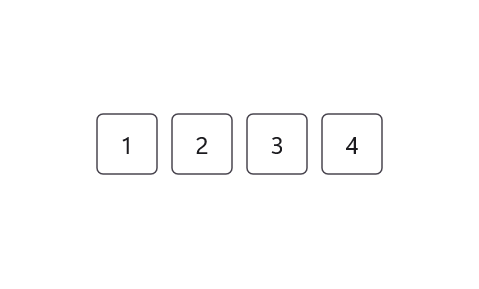
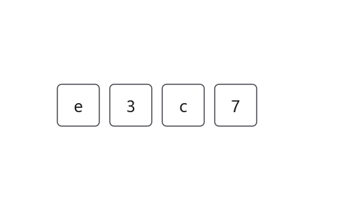
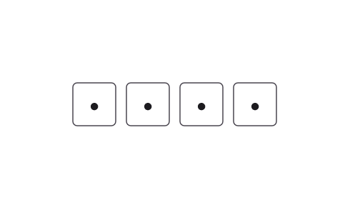

# Input Types in .NET MAUI OTP Input

## Types

This section explains the the various types of OTP (One-Time Password) input component, explaining their default behaviors and appropriate use cases.

### Number type

The `Type` property can be set to `Number`, prompting the input to handle numeric-only codes. This is ideal for scenarios demanding numeric OTPs. By default, the `Type` property is set to `Number`.

	


<otpInput:SfOtpInput Value="1234" Type="Number" />
	



SfOtpInput otpInput = new SfOtpInput()
{
    Value = "1234",
    Type = OtpInputType.Number
};




### Text type

You can set the `Type` property to `Text` for inputs that may include both letters and numbers, suitable for alphanumeric OTPs.

	


<otpInput:SfOtpInput Value="e3c7" Type="Text" />
	



SfOtpInput otpInput = new SfOtpInput()
{
    Value = "e3c7",
    Type = OtpInputType.Text
};




### Password type

You can set the `Type` property to `Password` to use this input type as password in the OTP Input.

	


<otpInput:SfOtpInput Value="e3c7" Type="Password" />
	



SfOtpInput otpInput = new SfOtpInput()
{
    Value = "e3c7",
    Type = OtpInputType.Password
};




