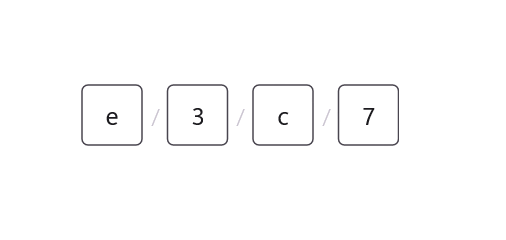
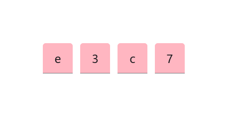
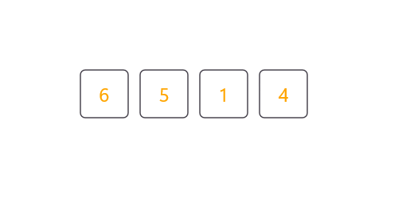
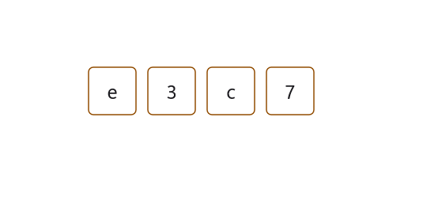

# Customization in .NET MAUI OTP Input (SfOtpInput)

An [OTP Input](https://help.syncfusion.com/cr/maui-toolkit/Syncfusion.Maui.Toolkit.OtpInput.SfOtpInput.html) consists of multiple customizable elements to enhance its appearance and functionality.

## Placeholder

The placeholder specifies the hint text that appears until the user enters a value

Use the [Placeholder](https://help.syncfusion.com/cr/maui-toolkit/Syncfusion.Maui.Toolkit.OtpInput.SfOtpInput.html#Syncfusion_Maui_Toolkit_OtpInput_SfOtpInput_Placeholder) property to set this text. If a single character is assigned, each input field will display the same character.

	


<otpInput:SfOtpInput Placeholder="_" />
	



SfOtpInput otpInput = new SfOtpInput()
{
    Placeholder = "_"
};




For placeholders with multiple characters, available input fields will sequentially display each character.

	


<otpInput:SfOtpInput Placeholder="wxyz" />
	



SfOtpInput otpInput = new SfOtpInput()
{
    Placeholder = "wxyz"
};




### Placeholder color

The color of placeholder text can be changed using the [PlaceholderColor](https://help.syncfusion.com/cr/maui-toolkit/Syncfusion.Maui.Toolkit.OtpInput.SfOtpInput.html#Syncfusion_Maui_Toolkit_OtpInput_SfOtpInput_PlaceholderColor) property.




<otpInput:SfOtpInput Placeholder="x" PlaceholderColor="Red" />




SfOtpInput otpInput = new SfOtpInput()
{
    Placeholder = "x",
    PlaceholderColor = Colors.Red
};




## Separator

The [Separator](https://help.syncfusion.com/cr/maui-toolkit/Syncfusion.Maui.Toolkit.OtpInput.SfOtpInput.html#Syncfusion_Maui_Toolkit_OtpInput_SfOtpInput_Separator) property defines a character or symbol used to separate each input field, visually distinguishing inputs.




<otpInput:SfOtpInput Separator="/" />




SfOtpInput otpInput = new SfOtpInput()
{
    Separator = "/"
};




## Setting input length

You can specify the number of input fields to match the desired OTP code length by using the [Length](https://help.syncfusion.com/cr/maui-toolkit/Syncfusion.Maui.Toolkit.OtpInput.SfOtpInput.html#Syncfusion_Maui_Toolkit_OtpInput_SfOtpInput_Length) property. The default value is `4`.




<otpInput:SfOtpInput Length="6" />




SfOtpInput otpInput = new SfOtpInput()
{
    Length = 6
};




## Input box size

You can specify the width and height of each input box by using the BoxWidth and BoxHeight properties. This customization allows you to tailor the OTP input appearance to match your application's design. The default values are 40 for both width and height.

 
 

<otpInput:SfOtpInput BoxWidth="50" BoxHeight="50" /> 

 
 

SfOtpInput otpInput = new SfOtpInput() 
{ 
    BoxWidth = 50, 
    BoxHeight = 50 
}; 

 


## Input background

The [InputBackground](https://help.syncfusion.com/cr/maui-toolkit/Syncfusion.Maui.Toolkit.OtpInput.SfOtpInput.html#Syncfusion_Maui_Toolkit_OtpInput_SfOtpInput_InputBackground) property customizes the appearance of input fields. This property works when [StylingMode](https://help.syncfusion.com/cr/maui-toolkit/Syncfusion.Maui.Toolkit.OtpInput.SfOtpInput.html#Syncfusion_Maui_Toolkit_OtpInput_SfOtpInput_StylingMode) is set to [Filled](https://help.syncfusion.com/cr/maui-toolkit/Syncfusion.Maui.Toolkit.OtpInput.OtpInputStyle.html#Syncfusion_Maui_Toolkit_OtpInput_OtpInputStyle_Filled).




<otpInput:SfOtpInput InputBackground="LightPink" StylingMode="Filled" />




SfOtpInput otpInput = new SfOtpInput()
{
    InputBackground = Colors.LightPink,
    StylingMode = OtpInputStyle.Filled
};




## Stroke

You can set the [Stroke](https://help.syncfusion.com/cr/maui-toolkit/Syncfusion.Maui.Toolkit.OtpInput.SfOtpInput.html#Syncfusion_Maui_Toolkit_OtpInput_SfOtpInput_Stroke) property to any color to customize the border appearance of the input fields. 




<otpInput:SfOtpInput Stroke="Blue" />




SfOtpInput otpInput = new SfOtpInput()
{
    Stroke = Colors.Blue
};




## Text color

You can set the [TextColor](https://help.syncfusion.com/cr/maui-toolkit/Syncfusion.Maui.Toolkit.OtpInput.SfOtpInput.html#Syncfusion_Maui_Toolkit_OtpInput_SfOtpInput_TextColor) property to any color to customize the text appearance of the input fields. 




<otpInput:SfOtpInput TextColor="Orange" />




SfOtpInput otpInput = new SfOtpInput()
{
    TextColor = Colors.Orange
};




## Mask character

Set the [MaskCharacter](https://help.syncfusion.com/cr/maui-toolkit/Syncfusion.Maui.Toolkit.OtpInput.SfOtpInput.html#Syncfusion_Maui_Toolkit_OtpInput_SfOtpInput_MaskCharacter) property to any character to define how the masked input is displayed, enhancing security by obscuring sensitive information. The `MaskCharacter` property applies only when [Type](https://help.syncfusion.com/cr/maui-toolkit/Syncfusion.Maui.Toolkit.OtpInput.SfOtpInput.html#Syncfusion_Maui_Toolkit_OtpInput_SfOtpInput_Type) is set to [Password](https://help.syncfusion.com/cr/maui-toolkit/Syncfusion.Maui.Toolkit.OtpInput.OtpInputType.html#Syncfusion_Maui_Toolkit_OtpInput_OtpInputType_Password).




<otpInput:SfOtpInput Type="Password" MaskCharacter="#" />




SfOtpInput otpInput = new SfOtpInput()
{
    Type = OtpInputType.Password,
    MaskCharacter = '#'
};




## Input state

The [InputState](https://help.syncfusion.com/cr/maui-toolkit/Syncfusion.Maui.Toolkit.OtpInput.SfOtpInput.html#Syncfusion_Maui_Toolkit_OtpInput_SfOtpInput_InputState) property visually represent the validation status of the input fields.

### Success

The [InputState](https://help.syncfusion.com/cr/maui-toolkit/Syncfusion.Maui.Toolkit.OtpInput.SfOtpInput.html#Syncfusion_Maui_Toolkit_OtpInput_SfOtpInput_InputState) can be set to [Success](https://help.syncfusion.com/cr/maui-toolkit/Syncfusion.Maui.Toolkit.OtpInput.OtpInputState.html#Syncfusion_Maui_Toolkit_OtpInput_OtpInputState_Success) to indicate that the input is correct. When the `InputState` is set to `Success`, the stroke of the OTP Input turns green.




<otpInput:SfOtpInput InputState="Success" />




SfOtpInput otpInput = new SfOtpInput()
{
    InputState = OtpInputState.Success
};




### Warning

The [InputState](https://help.syncfusion.com/cr/maui-toolkit/Syncfusion.Maui.Toolkit.OtpInput.SfOtpInput.html#Syncfusion_Maui_Toolkit_OtpInput_SfOtpInput_InputState) can be set to [Warning](https://help.syncfusion.com/cr/maui-toolkit/Syncfusion.Maui.Toolkit.OtpInput.OtpInputState.html#Syncfusion_Maui_Toolkit_OtpInput_OtpInputState_Warning) to indicate a potential issue with the input, prompting the user to correct it. The stroke of the OTP Input turns orange-brown when `InputState` is set to `Warning`.




<otpInput:SfOtpInput InputState="Warning" />




SfOtpInput otpInput = new SfOtpInput()
{
    InputState = OtpInputState.Warning
};




### Error

The [InputState](https://help.syncfusion.com/cr/maui-toolkit/Syncfusion.Maui.Toolkit.OtpInput.SfOtpInput.html#Syncfusion_Maui_Toolkit_OtpInput_SfOtpInput_InputState) can be set to [Error](https://help.syncfusion.com/cr/maui-toolkit/Syncfusion.Maui.Toolkit.OtpInput.OtpInputState.html#Syncfusion_Maui_Toolkit_OtpInput_OtpInputState_Error) to indicate that the input is invalid or requires correction. The stroke of OTP Input turns red when `InputState` is set to `Error`.




<otpInput:SfOtpInput InputState="Error" />




SfOtpInput otpInput = new SfOtpInput()
{
    InputState = OtpInputState.Error
};




