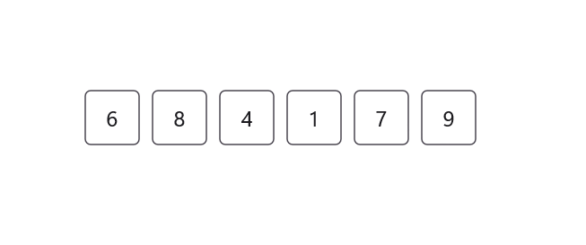
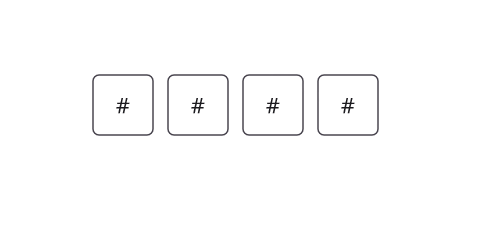
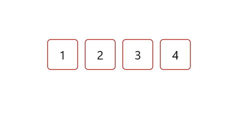

# Customization in .NET MAUI OTP Input (SfOtpInput)

An `OTP Input` consists of multiple elements that can be customized to enhance both its appearance and functionality.

## Placeholder

The placeholder for the OTP Input specifies the text that appears as a hint until the user enters a value.

Set the placeholder text using the `Placeholder` property. When a single character is assigned, each input field will show the same character.

	


<otpInput:SfOtpInput Placeholder="_" />
	



SfOtpInput otpInput = new SfOtpInput()
{
    Placeholder = "_"
};




For placeholders with multiple characters, available input fields will sequentially display each character.

	


<otpInput:SfOtpInput Placeholder="wxyz" />
	



SfOtpInput otpInput = new SfOtpInput()
{
    Placeholder = "wxyz"
};




### PlaceholderColor

The color of placeholder text can be changed using the `PlaceholderColor` property.




<otpInput:SfOtpInput Placeholder="x" PlaceholderColor="Red" />




SfOtpInput otpInput = new SfOtpInput()
{
    Placeholder = "x",
    PlaceholderColor = Colors.Red
};




## Separator

The `Separator` property defines a character or symbol used to separate each input field, visually distinguishing inputs.




<otpInput:SfOtpInput Separator="/" />




SfOtpInput otpInput = new SfOtpInput()
{
    Separator = "/"
};




## Setting input length

You can specify the number of input fields to match the desired OTP code length by using the `Length` property. The default value is `4`.




<otpInput:SfOtpInput Length="6" />




SfOtpInput otpInput = new SfOtpInput()
{
    Length = 6
};




## Input background

You can set the `InputBackground` property to any color to customize the appearance of the input fields. The `InputBackground` property applies only when `StylingMode` is set to `Filled.`




<otpInput:SfOtpInput InputBackground="LightPink" StylingMode="Filled" />




SfOtpInput otpInput = new SfOtpInput()
{
    InputBackground = Colors.LightPink,
    StylingMode = OtpInputStyle.Filled
};




## Stroke

You can set the `Stroke` property to any color to customize the border appearance of the input fields. 




<otpInput:SfOtpInput Stroke="Blue" />




SfOtpInput otpInput = new SfOtpInput()
{
    Stroke = Colors.Blue
};




## Text color

You can set the `TextColor` property to any color to customize the text appearance of the input fields. 




<otpInput:SfOtpInput TextColor="Orange" />




SfOtpInput otpInput = new SfOtpInput()
{
    TextColor = Colors.Orange
};




## Mask character

You can set the `MaskCharacter` property to any character to define how the masked input is displayed, enhancing security by obscuring sensitive information. The `MaskCharacter` property applies only when `Type` is set to `Password.`




<otpInput:SfOtpInput Type="Password" MaskCharacter="#" />




SfOtpInput otpInput = new SfOtpInput()
{
    Type = OtpInputType.Password,
    MaskCharacter = '#'
};




## Input state

The `InputState` property in the OTP Input allows you to visually represent the validation status of the input fields.

### Success

The `InputState` can be set to `Success` to indicate that the input is correct. When the `InputState` is set to `Success,` the stroke of the OTP Input turns green.




<otpInput:SfOtpInput InputState="Success" />




SfOtpInput otpInput = new SfOtpInput()
{
    InputState = OtpInputState.Success
};




### Warning

The `InputState` can be set to `Warning` to indicate a potential issue with the input, prompting the user to correct it. The stroke of the OTP Input turns orange-brown when `InputState` is set to `Warning.`




<otpInput:SfOtpInput InputState="Warning" />




SfOtpInput otpInput = new SfOtpInput()
{
    InputState = OtpInputState.Warning
};




### Error

The `InputState` can be set to `Error` to indicate that the input is invalid or requires correction. The stroke of OTP Input turns red when `InputState` is set to `Error.`




<otpInput:SfOtpInput InputState="Error" />




SfOtpInput otpInput = new SfOtpInput()
{
    InputState = OtpInputState.Error
};




