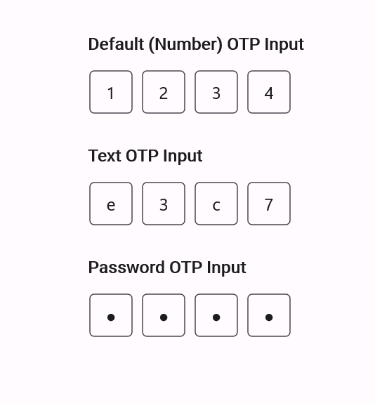

# .NET MAUI OTP Input (SfOtpInput) Overview

An [OTP Input](https://help.syncfusion.com/cr/maui-toolkit/Syncfusion.Maui.Toolkit.OtpInput.SfOtpInput.html) is a user interface component commonly used in applications that require one-time password (OTP) verification for authentication. This simplify and streamline the process of entering OTP codes received via SMS, email, or other communication channels.

## Key Features

* [Length](https://help.syncfusion.com/cr/maui-toolkit/Syncfusion.Maui.Toolkit.OtpInput.SfOtpInput.html#Syncfusion_Maui_Toolkit_OtpInput_SfOtpInput_Length) - Customize the number of input fields to match the desired OTP code length.

* [StylingMode](https://help.syncfusion.com/cr/maui-toolkit/Syncfusion.Maui.Toolkit.OtpInput.SfOtpInput.html#Syncfusion_Maui_Toolkit_OtpInput_SfOtpInput_StylingMode) - Supports different styling modes : Outlined, Filled, and Underlined.

* [Type](https://help.syncfusion.com/cr/maui-toolkit/Syncfusion.Maui.Toolkit.OtpInput.SfOtpInput.html#Syncfusion_Maui_Toolkit_OtpInput_SfOtpInput_Type) - Supports different input types : Number, Text, and Password.

* [Separator](https://help.syncfusion.com/cr/maui-toolkit/Syncfusion.Maui.Toolkit.OtpInput.SfOtpInput.html#Syncfusion_Maui_Toolkit_OtpInput_SfOtpInput_Separator) – Specifies the character or symbol used to separate each input field.