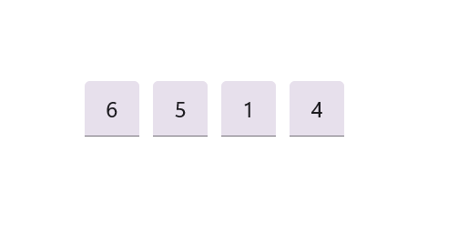
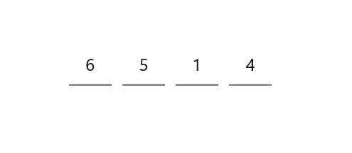

# Styling Modes in OTP Input

Styling modes specify the visual style variants for input fields in the OTP Input component, allowing you to customize appearances according to your application's design needs.

## Outline mode

You can customize the appearance of input fields with a border around them by setting the [StylingMode](https://help.syncfusion.com/cr/maui-toolkit/Syncfusion.Maui.Toolkit.OtpInput.SfOtpInput.html?tabs=tabid-1#Syncfusion_Maui_Toolkit_OtpInput_SfOtpInput_StylingMode) property to [Outlined.](https://help.syncfusion.com/cr/maui-toolkit/Syncfusion.Maui.Toolkit.OtpInput.OtpInputStyle.html#Syncfusion_Maui_Toolkit_OtpInput_OtpInputStyle_Outlined)  This is the default styling mode for the OTP Input component.

	


<otpInput:SfOtpInput StylingMode="Outlined" />
	



SfOtpInput otpInput = new SfOtpInput()
{
    StylingMode = OtpInputStyle.Outlined
};




## Filled mode

You can customize the appearance of input fields by filling them with color by setting the [StylingMode](https://help.syncfusion.com/cr/maui-toolkit/Syncfusion.Maui.Toolkit.OtpInput.SfOtpInput.html?tabs=tabid-1#Syncfusion_Maui_Toolkit_OtpInput_SfOtpInput_StylingMode) property to [Filled.](https://help.syncfusion.com/cr/maui-toolkit/Syncfusion.Maui.Toolkit.OtpInput.OtpInputStyle.html#Syncfusion_Maui_Toolkit_OtpInput_OtpInputStyle_Filled) 

	


<otpInput:SfOtpInput StylingMode="Filled" />
	



SfOtpInput otpInput = new SfOtpInput()
{
    StylingMode = OtpInputStyle.Filled
};




## Underline mode

You can customize the appearance of input fields with an underline by setting the [StylingMode](https://help.syncfusion.com/cr/maui-toolkit/Syncfusion.Maui.Toolkit.OtpInput.SfOtpInput.html?tabs=tabid-1#Syncfusion_Maui_Toolkit_OtpInput_SfOtpInput_StylingMode) property to [Underlined.](https://help.syncfusion.com/cr/maui-toolkit/Syncfusion.Maui.Toolkit.OtpInput.OtpInputStyle.html#Syncfusion_Maui_Toolkit_OtpInput_OtpInputStyle_Underlined)

	


<otpInput:SfOtpInput StylingMode="Underlined" />
	



SfOtpInput otpInput = new SfOtpInput()
{
    StylingMode = OtpInputStyle.Underlined
};




