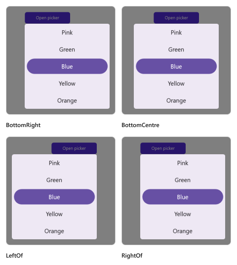

# Picker mode in .NET MAUI Picker (SfPicker)

The picker mode is specified in the picker property enumeration, which is used to display the picker based on the modes. It offers three modes: `Default`, `Dialog`, and `RelativeDialog`. The default picker mode is `Default` in the [SfPicker](https://help.syncfusion.com/cr/maui-toolkit/Syncfusion.Maui.Toolkit.Picker.SfPicker.html).

## Dialog Mode

The dialog mode is used to display the picker in a pop-up by setting the [Mode](https://help.syncfusion.com/cr/maui-toolkit/Syncfusion.Maui.Toolkit.Picker.PickerBase.html#Syncfusion_Maui_Toolkit_Picker_PickerBase_Mode) property to [`Dialog`](https://help.syncfusion.com/cr/maui-toolkit/Syncfusion.Maui.Toolkit.Picker.PickerMode.html#Syncfusion_Maui_Toolkit_Picker_PickerMode_Dialog) in [SfPicker](https://help.syncfusion.com/cr/maui-toolkit/Syncfusion.Maui.Toolkit.Picker.SfPicker.html).





<picker:SfPicker x:Name="Picker"
                 Mode="Dialog"/>





SfPicker picker = new SfPicker()
{
    Mode = PickerMode.Dialog
};

this.Content = picker;





The Picker can be opened programmatically by setting the [IsOpen](https://help.syncfusion.com/cr/maui-toolkit/Syncfusion.Maui.Toolkit.Picker.PickerBase.html#Syncfusion_Maui_Toolkit_Picker_PickerBase_IsOpen) property to `true` of [SfPicker](https://help.syncfusion.com/cr/maui-toolkit/Syncfusion.Maui.Toolkit.Picker.SfPicker.html). By default, the `IsOpen` property is `false`.

Note: This property is automatically changed to `false` when you close the dialog by clicking outside of it.





<Grid>
    <picker:SfPicker x:Name="picker"
                         Mode="Dialog"/>
    <Button Text="Open Picker" 
            x:Name="pickerButton"
            Clicked="Button_Clicked"
            HorizontalOptions="Center"
            VerticalOptions="Center"
            HeightRequest="50" 
            WidthRequest="150">
    </Button>
</Grid>





private void Button_Clicked(object sender, System.EventArgs e)
{
    this.picker.IsOpen = true;
}





   

## Relative Dialog Mode

The relative dialog mode displays the picker in a pop-up by setting the [Mode](https://help.syncfusion.com/cr/maui-toolkit/Syncfusion.Maui.Toolkit.Picker.PickerBase.html#Syncfusion_Maui_Toolkit_Picker_PickerBase_Mode) property to [`RelativeDialog`](https://help.syncfusion.com/cr/maui-toolkit/Syncfusion.Maui.Toolkit.Picker.PickerMode.html#Syncfusion_Maui_Toolkit_Picker_PickerMode_RelativeDialog). It is used to align the picker in a specific position. You can set the position by setting the [RelativePosition](https://help.syncfusion.com/cr/maui-toolkit/Syncfusion.Maui.Toolkit.Picker.PickerBase.html#Syncfusion_Maui_Toolkit_Picker_PickerBase_RelativePosition) property in the [SfPicker](https://help.syncfusion.com/cr/maui-toolkit/Syncfusion.Maui.Toolkit.Picker.SfPicker.html).

### Relative position

The [RelativePosition](https://help.syncfusion.com/cr/maui-toolkit/Syncfusion.Maui.Toolkit.Picker.PickerBase.html#Syncfusion_Maui_Toolkit_Picker_PickerBase_RelativePosition) is specified in the picker property enumeration, which is used to align the picker in a specific position. It provides eight positions such as `AlignTop`, `AlignToLeftOf`, `AlignToRightOf`, `AlignBottom`, `AlignTopLeft`, `AlignTopRight`, `AlignBottomLeft`, and `AlignBottomRight`. The default relative position is `AlignTop` in the [SfPicker](https://help.syncfusion.com/cr/maui-toolkit/Syncfusion.Maui.Toolkit.Picker.SfPicker.html).

The Picker can be opened programmatically by setting the [`IsOpen`](https://help.syncfusion.com/cr/maui-toolkit/Syncfusion.Maui.Toolkit.Picker.PickerBase.html#Syncfusion_Maui_Toolkit_Picker_PickerBase_IsOpen) property to `true` of [SfPicker](https://help.syncfusion.com/cr/maui-toolkit/Syncfusion.Maui.Toolkit.Picker.SfPicker.html). By default, the `IsOpen` property is `false`.

Note: This property is automatically changed to `false` when you close the dialog by clicking outside of it.





<Grid>
    <picker:SfPicker x:Name="picker" 
                         Mode="RelativeDialog"
                         RelativePosition="AlignTopLeft">
    </picker:SfPicker>
    <Button Text="Open Picker"
            x:Name="pickerButton"
            Clicked="Button_Clicked"
            HorizontalOptions="Center"
            VerticalOptions="Center"
            HeightRequest="50" 
            WidthRequest="150">
    </Button>
</Grid>





private void Button_Clicked(object sender, System.EventArgs e)
{
    this.picker.IsOpen = true;
}

 



### Relative view

The [RelativeView](https://help.syncfusion.com/cr/maui-toolkit/Syncfusion.Maui.Toolkit.Picker.PickerBase.html#Syncfusion_Maui_Toolkit_Picker_PickerBase_RelativeView) is specified in the picker's property enumeration and is used to display the picker dialog relative to a view by setting the [Mode](https://help.syncfusion.com/cr/maui-toolkit/Syncfusion.Maui.Toolkit.Picker.PickerBase.html#Syncfusion_Maui_Toolkit_Picker_PickerBase_Mode) property to [`RelativeDialog`](https://help.syncfusion.com/cr/maui-toolkit/Syncfusion.Maui.Toolkit.Picker.PickerMode.html#Syncfusion_Maui_Toolkit_Picker_PickerMode_RelativeDialog). You can set the position by setting the [RelativePosition](https://help.syncfusion.com/cr/maui-toolkit/Syncfusion.Maui.Toolkit.Picker.PickerBase.html#Syncfusion_Maui_Toolkit_Picker_PickerBase_RelativePosition) property in the [SfPicker](https://help.syncfusion.com/cr/maui-toolkit/Syncfusion.Maui.Toolkit.Picker.SfPicker.html).

N> It is only applicable in `RelativeDialog` mode. If `no relative view` is specified, the picker base will be set as the `default` relative view.





<Grid>
    <picker:SfPicker x:Name="picker" 
                         Mode="RelativeDialog"
                         RelativePosition="AlignTopLeft"
                         RelativeView = "{x:Reference pickerButton}">
    </picker:SfPicker>
    <Button Text="Open Picker"
            x:Name="pickerButton"
            Clicked="Button_Clicked"
            HorizontalOptions="Center"
            VerticalOptions="Center"
            HeightRequest="50" 
            WidthRequest="150">
    </Button>
</Grid>





private void Button_Clicked(object sender, System.EventArgs e)
{
    this.picker.IsOpen = true;
    this.picker.RelativeView = pickerButton;
}

 



   

   